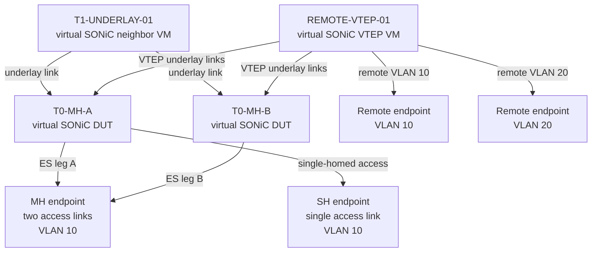

# Virtual EVPN-MH dual-ToR testbed

This draft defines a virtual EVPN multihoming topology using the normal sonic-mgmt Ansible VM-topology framework.

It intentionally uses the existing `topo_*.yml` model rather than the NUT/vNUT topology model. The topology definition is:

```
ansible/vars/topo_evpn-mh-dualtor.yml
```

The testbed entry is supplied through the normal `ansible/testbed.yaml` workflow. Site-specific management addresses, VM image names, credentials, and server allocation are not embedded in this reusable topology file.

## Logical topology



The two T0 devices are the EVPN-MH pair. The MH endpoint has one independent link to each T0 device. The two links share the same Ethernet Segment and ESI.

## Normal Ansible testbed model

The normal testbed entry is conceptually:

```yaml
- conf-name: evpn-mh-dualtor
  group-name: evpn-mh
  topo: evpn-mh-dualtor
  ptf_image_name: docker-ptf
  ptf: ptf_evpn_mh
  ptf_ip: 10.255.0.220/24
  server: server_1
  vm_base: VM0500
  dut:
    - dtor-evpn-mh-a
    - dtor-evpn-mh-b
  inv_name: lab
  auto_recover: 'True'
  comment: Virtual EVPN-MH T0/T1 dual-ToR topology
```

The topology file is consumed by the normal VM-topology playbooks and contains the `topology`, `VMs`, `DUT`, and `configuration` sections used by that workflow.

The two T0 devices are the actual SONiC DUTs in the testbed entry. The T1 and remote VTEP are virtual SONiC neighbor VMs allocated through the `VMs` section of the topology file.

## Endpoint implementation

The minimal bring-up uses PTF ports:

```
T0-MH-A ─── PTF port 0
T0-MH-B ─── PTF port 4
T0-MH-A ─── PTF port 8
REMOTE-VTEP ─── PTF ports 12 and 16
```

This mode is useful for validating:

- virtual links and bridge connectivity
- T0/T1 and VTEP reachability
- BGP session establishment
- EVPN route exchange
- VXLAN reachability
- MAC learning
- SH-to-MH and MH-to-SH traffic movement

For native host-side LACP testing, the MH endpoint can be replaced by a Linux host VM:

```
MH-HOST-VM bond0
├── eth0 ─── T0-MH-A
└── eth1 ─── T0-MH-B
```

The Linux host VM must use an 802.3ad bond when LACP and host-side Ethernet Segment behavior are under test. This is an extension to the minimal PTF bring-up and requires two vNICs, two independent virtual bridges, and host bond configuration.

## Virtual resources

| Role | Reference node | Implementation |
|---|---|---|
| T0 MH DUT A | `dtor-evpn-mh-a` | Virtual SONiC DUT |
| T0 MH DUT B | `dtor-evpn-mh-b` | Virtual SONiC DUT |
| T1 underlay | `T1UNDERLAY01` | Virtual SONiC neighbor VM |
| Remote VTEP | `REMOTEVTEP01` | Virtual SONiC EVPN/VXLAN VM |
| Traffic generator | `ptf_evpn_mh` | `docker-ptf` |
| Optional MH host | `MH-HOST-VM` | Linux VM with an 802.3ad bond |

## Validation scope

This is a topology-definition draft. The following items are intended qualification targets:

- All virtual SONiC VMs start through the normal Ansible VM workflow.
- T0-to-T1 and T0-to-remote-VTEP links become reachable.
- BGP sessions establish on the defined underlay links.
- EVPN and VXLAN configuration can be applied to the T0 pair and remote VTEP.
- The MH endpoint can move between SH and MH attachment modes.
- MAC mobility is visible through the expected EVPN and FDB behavior.

The current draft does not claim live SONiC VM qualification, hardware qualification, ASIC FDB programming, or end-to-end traffic results.

The final EVPN-MH configuration still needs to provide:

- BGP EVPN address-family configuration
- VLAN/VNI mapping
- VXLAN VTEP source configuration
- Ethernet Segment and ESI configuration
- DF-election parameters
- VLAN 10 and VLAN 20 endpoint configuration
- SH-to-MH and MH-to-SH mobility test cases

## Upstreaming scope

This draft keeps the normal community topology contract separate from site data:

- `topo_evpn-mh-dualtor.yml` contains portable VM topology and configuration templates.
- `testbed.yaml` supplies the testbed membership and server allocation.
- The Ansible inventory supplies management addresses and credentials.
- VM images and bridge allocation remain deployment-environment inputs.
- No passwords, private management addresses, or proprietary traffic-generator configuration belong in the topology file.
