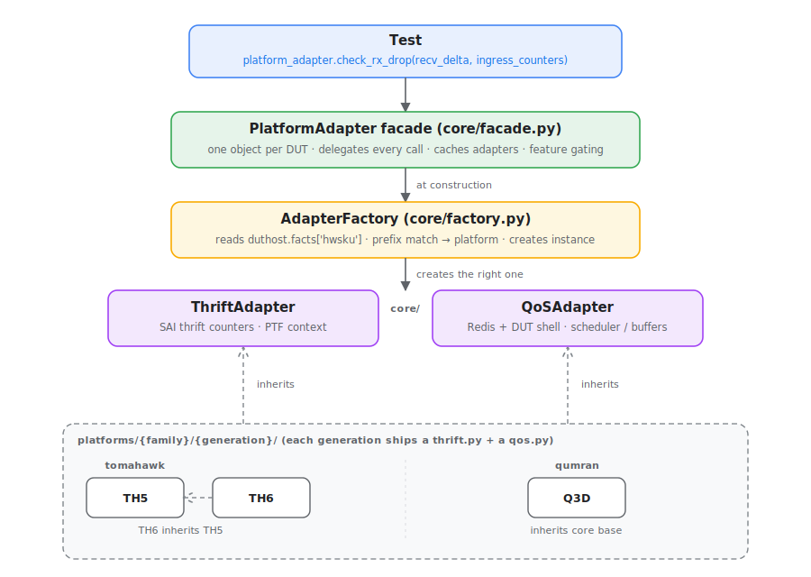
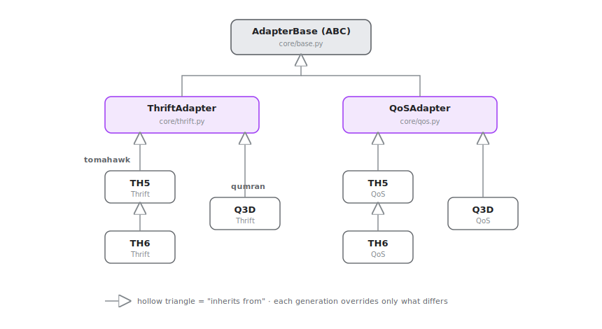
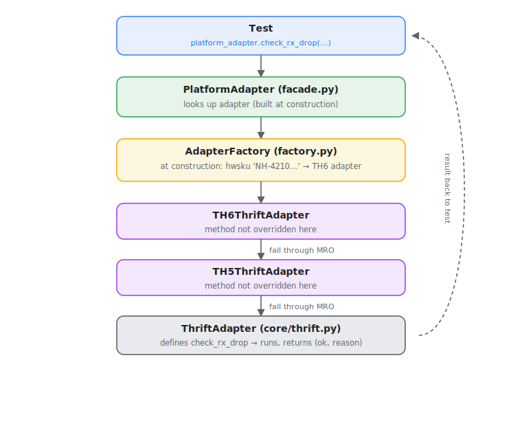
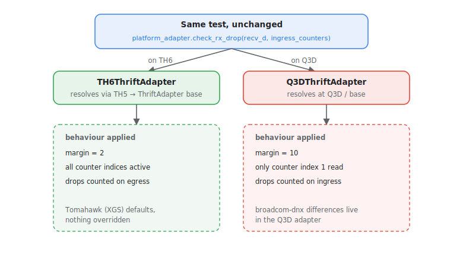

# Test Abstraction Interface (TAI): High Level Design

Rev 0.1

## Table of Contents

- [Revisions](#revisions)
- [Scope](#scope)
- [Definitions / Abbreviations](#definitions--abbreviations)
- [Overview](#overview)
- [Requirements](#requirements)
- [Architecture](#architecture)
  - [Directory structure](#directory-structure)
  - [ThriftAdapter](#thriftadapter-corethriftpy)
  - [QoSAdapter](#qosadapter-coreqospy)
  - [AdapterFactory](#adapterfactory-corefactorypy)
  - [PlatformAdapter](#platformadapter-corefacadepy)
- [Platform Adapters](#platform-adapters)
- [Theory of Operation](#theory-of-operation)
  - [How a call flows through TAI](#how-a-call-flows-through-tai)
  - [What changes on a different platform](#what-changes-on-a-different-platform)
  - [Factory detection](#factory-detection)
- [Adding New Platforms](#adding-new-platforms)
- [Current Coverage](#current-coverage)
- [Design Decisions](#design-decisions)
- [Testing](#testing)
- [Future Work](#future-work)
- [References](#references)

## Revisions

| Rev | Date | Author | Change |
|-----|------|--------|--------|
| 0.1 | 06/05/2026 | Abhishek (Nexthop) | Initial design |

## Scope

This document describes the high-level design of the Test Abstraction Interface (TAI), the platform abstraction layer used by SONiC QoS and PFC tests under `tests/`. It covers:

- the problem TAI solves and how tests use it,
- the core framework and the per-platform adapters,
- how a call is routed to the right platform at runtime,
- how to add a new ASIC generation,
- the tests that have been converted to TAI so far.

It does not change any existing test behaviour. Tests that do not use TAI are unaffected.

## Definitions / Abbreviations

| Term | Meaning |
|------|---------|
| **TAI** | Test Abstraction Interface, the framework described here |
| **MRO** | Method Resolution Order, the order Python walks base classes |
| **XGS / Tomahawk** | Broadcom Tomahawk family (TH5, TH6) |
| **DNX / Qumran** | Broadcom DNX family (Q3D) |
| **dbal / bcmcmd** | DNX database-abstraction layer and the Broadcom shell used to read/write it |

## Overview

TAI (Test Abstraction Interface) is the platform abstraction layer for SONiC tests. Different ASIC generations behave differently. They count drops on different sides, have different counter index layouts, tolerate different amounts of background noise, and handle packet leakout differently. Without a shared abstraction, every test that touches counters or QoS config has to know about all of this.

TAI puts platform-specific knowledge into per-platform adapter classes. Tests call a single interface and the right behavior for that hardware is applied automatically. Adding support for a new ASIC generation means writing one adapter class. Existing tests require no changes.

**Without TAI**, tests carry this kind of logic directly:
```python
if asic_type == 'broadcom-dnx':
    drop_count = recv_counters[1]   # ingress, index 1 only on DNX
    margin = 10
else:
    drop_count = xmit_counters[3]   # egress on Tomahawk
    margin = 2
assert drop_count <= margin, f"Unexpected drops: {drop_count}"
```

**With TAI**, the test just asks the question:
```python
ok, reason = platform_adapter.check_rx_drop(recv_delta, ingress_counters)
assert not ok, reason
```

The margin, which counter to read, and which indices are reliable all live in the adapter for that platform.

## Requirements

- A test should express *what* it is checking, not *which hardware* it is running on.
- Adding a new ASIC generation should not require touching existing tests.
- A platform that has no adapter yet should fail loudly, not silently run against wrong assumptions.
- Platform-specific parameters (for example a DNX credit worth) should be passable without polluting the interface other platforms see.
- A test should be able to ask, before it runs, whether the platform supports what it needs, and skip cleanly otherwise.

## Architecture

A test holds a single `PlatformAdapter` and calls methods on it. Underneath, the facade routes each call to a platform-specific adapter that the factory created by matching the DUT's `hwsku`. Tests never see the platform classes directly.

<p align="center">
  
</p>
<p align="center"><em>Figure 1. TAI layers. A test talks only to the facade; the factory selects the platform adapter underneath based on hwsku.</em></p>

### Directory structure

```
TAI/
  core/
    base.py       - root class all adapters inherit from
    thrift.py     - SAI thrift counter operations (PTF context)
    qos.py        - Redis / DUT shell operations
    factory.py    - platform detection and adapter creation
    facade.py     - the single entry point tests use
  platforms/
    tomahawk/
      th5/        - Tomahawk 5
      th6/        - Tomahawk 6, inherits th5
    qumran/
      q3d/        - Qumran Q3D
  generate.py     - scaffolds new adapters from the command line
  report.py       - emits COVERAGE.md showing per-platform method resolution
  COVERAGE.md     - auto-generated coverage matrix (run report.py to refresh)
```

### ThriftAdapter (`core/thrift.py`)

Handles SAI thrift counter reads inside PTF tests, including reading counters, checking drops and PFC, controlling TX, and sending packets. Each platform subclass overrides only what differs for that generation and inherits everything else from the base.

### QoSAdapter (`core/qos.py`)

Handles DUT-side operations via Redis and the DUT shell, covering scheduler config, buffer profile management, and drop counters. Platform subclasses override the parts that differ, such as queue key format or any extra ASIC commands required before applying config.

Adapter methods accept a `**platform_params` dict for passing parameters that only make sense for specific platforms. For example, Qumran requires a credit worth value when creating a STRICT scheduler but Tomahawk does not. The caller passes `credit_worth=4096` and only the Qumran adapter picks it up. Others ignore what they do not need.

### AdapterFactory (`core/factory.py`)

Each adapter registers itself with the factory using a decorator at the top of its file:

```python
@AdapterFactory.register(ThriftAdapter, 'th6')
class TH6ThriftAdapter(TH5ThriftAdapter):
    ...
```

This runs at import time. When Python imports the `platforms` package, it walks through each family and generation `__init__.py`, imports the adapter modules, and the decorator fires, adding the class to the factory registry. By the time any test creates a `PlatformAdapter`, all adapters are already registered.

When `PlatformAdapter` is initialized, the factory figures out which platform is running by matching the DUT's `hwsku` against a prefix table. Variant SKUs hit their base prefix entry so they do not need individual registrations.

If no prefix matches, the factory raises an `AssertionError` naming the unknown hwsku. There is no fallback to a base adapter. A missing adapter means platform behavior is unknown, so the test fails loudly rather than running against assumptions that do not hold on that hardware.

Mappings live in the factory's `_hwsku_prefix_map` in `core/factory.py`. (`python TAI/report.py` reports method coverage, not the hwsku table.)

### PlatformAdapter (`core/facade.py`)

The only class tests interact with. Create one `PlatformAdapter(duthost)` and call any method on it. ThriftAdapter and QoSAdapter methods are all accessible from the same object. Both adapters are built when the `PlatformAdapter` is constructed (the facade collects each adapter's supported features up front) and cached for the life of the object.

It also exposes feature checks (`require_features`, `is_feature_supported`) that return whether the platform implements what a test needs, so the test can decide to skip before relying on a missing capability. The facade itself never skips.

## Platform Adapters

Each platform adapter lives under `platforms/{family}/{generation}/` and contains a `thrift.py` and a `qos.py`. A generation inherits from its parent and overrides only the methods that actually behave differently. Everything else falls through to the ancestor at runtime.

<p align="center">
  
</p>
<p align="center"><em>Figure 2. Adapter class hierarchy. Two adapter types (Thrift, QoS) descend from <code>AdapterBase</code>; each generation subclasses its parent.</em></p>

### TH5: Tomahawk 5 (`platforms/tomahawk/th5/`)

The base of the Tomahawk line. Inherits from the core adapter and overrides only what differs.

### TH6: Tomahawk 6 (`platforms/tomahawk/th6/`)

Inherits from TH5 and overrides only what differs from it.

### Q3D: Qumran Q3D (`platforms/qumran/q3d/`)

Inherits from the core base directly. Qumran uses the broadcom-dnx architecture which behaves differently from Tomahawk in how it counts drops, tracks counters, and handles noise. All those differences live here.

## Theory of Operation

### How a call flows through TAI

The `PlatformAdapter` builds both adapters when it is constructed: it asks the factory for each type, and the factory reads the DUT's `hwsku`, matches it to a platform, and returns the concrete adapter. By the time a test calls a method, the adapter is already cached. The call then resolves through normal Python inheritance: if the generation does not override the method, the lookup falls through its ancestors until it reaches the class that does.

<p align="center">
  
</p>
<p align="center"><em>Figure 3. The factory picks the adapter at construction; a later method call on a TH6 DUT then resolves through the MRO: not overridden in TH6 or TH5, so it runs at the <code>ThriftAdapter</code> base and returns the result.</em></p>

### What changes on a different platform

The test code stays the same regardless of hardware. What changes is which adapter the factory created. On a Q3D the factory creates a `Q3DThriftAdapter` and the same call uses Q3D-specific margins and counter indices with no change to the test.

<p align="center">
  
</p>
<p align="center"><em>Figure 4. One unchanged test call, two platforms. The adapter the factory built decides which margin, counter side, and indices apply.</em></p>

### Factory detection

When `PlatformAdapter(duthost)` is constructed, the factory reads `duthost.facts['hwsku']` and walks the prefix table. The first prefix that matches wins, so variant SKUs are absorbed by their base entry. Order matters: list more specific prefixes ahead of any that would also match. If no prefix matches, the factory raises an `AssertionError` with the unknown hwsku in the message. Because this happens at construction, an unregistered platform fails immediately, before the test runs a single check, rather than silently running against assumptions that do not hold.

Each resolved adapter is cached for the life of the `PlatformAdapter`. The factory runs once per adapter type (twice today: `ThriftAdapter` and `QoSAdapter`); every later call reuses the cached instance.

## Adding New Platforms

Adding a new ASIC generation is a single command. The generator creates the platform directory, writes the adapter files, and patches the factory so the new ASIC is detected automatically. The new adapter inherits from its parent so everything already working continues to work. You only fill in what actually differs.

```bash
# New generation within an existing family (inherits the parent generation)
python TAI/generate.py th7 --family tomahawk --parent th6 --hwsku <hwsku-prefix>

# First generation of a new family (inherits the core base directly)
python TAI/generate.py <gen> --family <new-family> --parent core --hwsku <hwsku-prefix>
```

After running the command, hardware matching the given hwsku prefix maps to `TH7ThriftAdapter` and `TH7QoSAdapter` automatically. Existing tests pick up the new platform without any changes. Add overrides only where TH7 actually behaves differently from TH6. If nothing differs yet, the generated class body can stay empty; the `@AdapterFactory.register` decorator still runs, so the platform is detected and inherits everything from its parent.

## Current Coverage

| Generation | Family |
|-----------|--------|
| th5 | tomahawk |
| th6 | tomahawk |
| q3d | qumran |

For a method-level view of which class actually implements each call on each platform, run `python TAI/report.py`. It walks the MRO of every registered adapter and writes `TAI/COVERAGE.md`: one table per family per adapter type (ThriftAdapter / QoSAdapter). Each cell names the nearest class that defines the method; bold cells are overrides at the platform itself, everything else is inherited. The layout reads the same whether the family is a linear chain (`TH5 < base, TH6 < TH5`) or a branching tree (`TH7 < base` alongside the TH5/TH6 lineage) since inheritance structure is encoded per cell, not per column.

## Design Decisions

**Per-generation adapters.** Each generation has its own adapter and inherits from the previous one. TH5 and TH6 share most behavior but differ on a few values. That difference is a one-line override in TH6 rather than a conditional spread across tests.

**hwsku prefix is the only detection signal.** `hwsku` is always present on `duthost.facts`, and prefix matching handles variant SKUs without needing per-variant entries.

**No fallback to a base adapter, fail instead.** If the hwsku does not match any registered prefix, the factory raises an `AssertionError` naming the unknown hwsku. A missing adapter means the platform's behavior is not yet encoded, and running the base adapter there would produce results that look valid but are not. Failing makes it obvious that an adapter must be added before the test can run on that hardware.

**Check functions report what happened.** All check methods return `(condition, reason)` where `condition` is whether the event occurred and `reason` describes the counter state in either case. Whether the condition is a pass or fail is up to the test, and because the reason is populated on both branches the assertion message is useful whether the test asserts `ok` or `not ok`. This means one function instead of two.

## Testing

TAI is exercised by converting real tests to it and running them on supported hardware. Two tests ship with this design.

### Strict priority rate limiting (`tests/qos/test_sched_strict_priority_tai.py`)

A pytest-side test that drives PTF traffic through a STRICT-priority scheduler and checks CIR/PIR rate limiting. It sends high-speed traffic with no rate limit and expects no drops, then configures CIR/PIR with a STRICT scheduler through the facade and expects drops once traffic exceeds the limit. All the platform-specific work goes through `PlatformAdapter`: discovering the queue key, creating the scheduler (passing `credit_worth` only where DNX needs it), reading drop counters, and reverting config. As a result the test body carries no `if asic_type ==` branches.

### PG min threshold (`PgMinThresholdTestTAI` + `testQosSaiPgMinThresholdTAI`)

A TAI variant of the existing PG min threshold test. The PTF case `PgMinThresholdTestTAI` lives in `tests/saitests/py3/sai_qos_tests.py` and reads PG/port counters and drop counts through the facade; the pytest wrapper `testQosSaiPgMinThresholdTAI` in `tests/qos/test_qos_sai.py` sets it up and skips cleanly when `pg_min_threshold` params are not configured for the platform. The `copy_tai_directory` fixture stages the `TAI/` tree onto the PTF host so the framework is importable there.

### Running the tests

```bash
pytest tests/qos/test_sched_strict_priority_tai.py
pytest tests/qos/test_qos_sai.py -k "PgMinThresholdTAI"
```

### Verifying platform detection without hardware

Scaffolding and factory resolution can be checked on any host:

```bash
# Scaffold a new adapter and confirm it is wired up
python3 TAI/generate.py th7 --family tomahawk --parent th6 --hwsku <hwsku-prefix>

python3 -c "
from TAI.core.factory import AdapterFactory
from TAI.core.thrift import ThriftAdapter
class D:
    facts = {'hwsku': '<hwsku-prefix>', 'asic_type': ''}
print(type(AdapterFactory.create_adapter(ThriftAdapter, D())).__name__)
"
```

## Future Work

**More adapter types.** ThriftAdapter and QoSAdapter cover PFC and QoS buffer tests. Reboot, link management, and thermal tests still carry platform conditionals and would benefit from the same treatment. Note that the facade collects features from every adapter type at construction, so a new type would need an implementation on every platform at once; making feature collection lazy is a prerequisite for adding types incrementally.

**Platform capability matrix.** Each adapter declares a `supported_features` set. This could be surfaced so CI can decide which tests to run on which hardware rather than relying on tests to skip at runtime.

**Debug mode.** When a test fails it is not always clear which adapter was selected or why. A debug flag that logs the detection path would help narrow down platform detection issues quickly.

**Platform configuration in TAI.** Platform-specific values like buffer thresholds, queue depths, and PFC watermarks currently live in test param files across the repo. Moving them into TAI alongside the adapters would put all platform knowledge in one place.

## References

- `TAI/COVERAGE.md`: auto-generated per-platform method resolution matrix
- `TAI/generate.py`: adapter scaffolding tool
