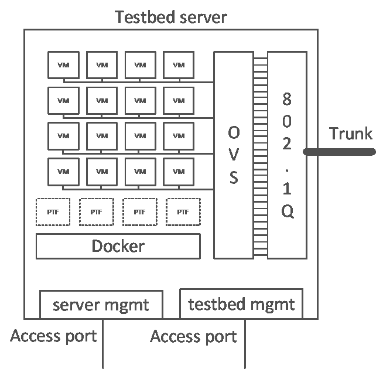
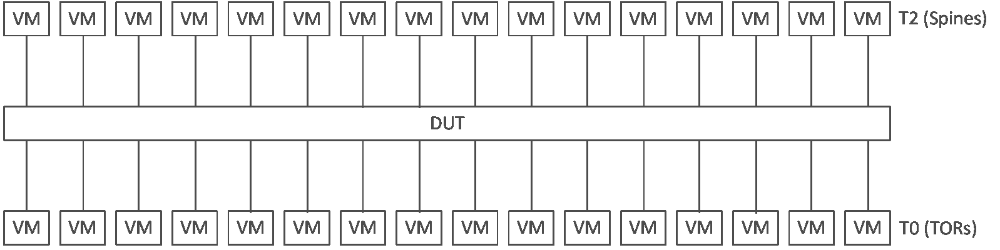
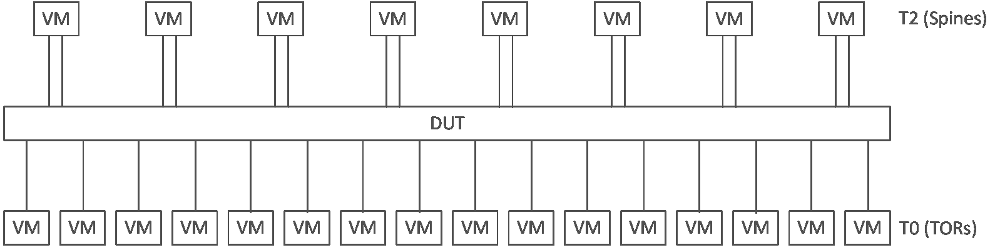
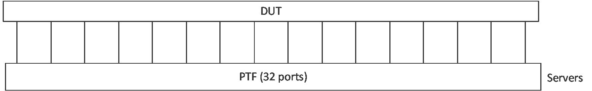
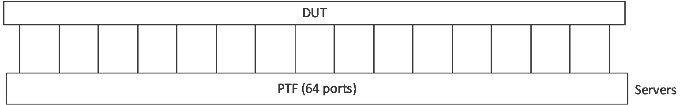
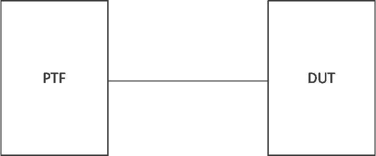
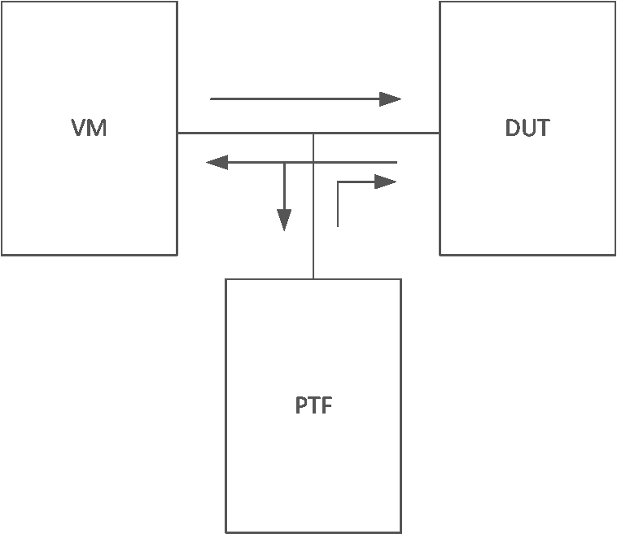

# Requirements for the Linux Host
1. Ubuntu 16.04 x64
2. Installed docker-engine and python (ansible requires python 2.7)
3. Three network cards:
  1. first is used for the server management
  2. second is used to connect management interfaces of VMs and docker containers to a network.
  3. third is used to connect VMs and ptf containers to DUTs frontal panel ports

# Hardware SKU
1. Server SKU (this is what we are using, not mandatory):   
 * Dell 70030; 2 CPUs each has 18 cores; 192G memory; hard disk:2X500G
 
2. Fanout switch: 
 * Arista 7260 or similar 
 
3. NIC
 * Mellanox MT27700 Family CX4

# Content of /etc/network/interfaces:
```
root@STR-AZURE-SERV-01:~# cat /etc/network/interfaces
# The primary network interface - testbed server management
auto em1
iface em1 inet static
        address 10.250.0.245
        netmask 255.255.255.0
        network 10.250.0.0
        broadcast 10.250.0.255
        gateway 10.250.0.1
        dns-nameservers 10.250.0.1 10.250.0.2
        # dns-* options are implemented by the resolvconf package, if installed
        dns-search SOMECOMPANY

# VM and dockers management interfaces
auto br1
iface br1 inet manual
    bridge_ports em2
    bridge_stp off
    bridge_maxwait 0
    bridge_fd 0

# DUTs frontpanel ports
auto p4p1
iface p4p1 inet manual
  mtu 9216
up ip link set p4p1 up
```

# SONiC testbed physical topology


1. Every DUT port is connected to one of leaf fanout switches
2. Every leaf fanout switch has unique vlan tag for every DUT port
3. Root fanout switch connects leaf fanout switches and testbed servers
4. Connections from root fanout switches are 802.1Q trunks
5. Any testbed server can access any DUT port by sending a packet with the port vlan tag (root fanout switch should have this vlan number enabled on the server trunk)

# Fanout switch configuration
*Fanout switch*: A physical switch which enables VLAN trunking. (SKU: Arista 7260 or similar)
   * Et33 is a vlan trunking port and is connected to the eth0 port of the linux host.
   * Et1-Et32 are vlan access ports and are connect to DUT.
   * Enable LACP/LLDP passthrough
   * Disable spanning tree protocol

# Testbed server connections



1. The testbed server has 3 network ports:
  1. Trunk port to root fanout switch
  2. Server management port to manage the server
  3. Testbed management port to manage VMs and PTFs containers on the server
2. VMs are created right after the server starts
3. VMs connections and PTF containers are created when a new topology is being added

# VMs
The VMs use Arista vEOS. Each VM has 10 network interfaces:

1. 8 front panel ports. These ports are connected to openvswitch bridges, which are connected to vlan interfaces. The vlan interfaces are connected to the fanout switch (through physical port).
2. 1 back panel port. All testbed VMs connected to each other using this port (it isn't shown on the figure above).
3. 1 management port. This port is used to connect to the VMs

# Topologies

1. Configuration of a testbed topology is defined in one file: testbed.csv
2. One script to operate all testbeds: testbed-cli.sh
3. Flexible topologies which allow to use vm_set and ptf container as one entity
4. All VM management ip information in one place: veos inventory file
5. ptf container is generalized and used in every topology
6. Automatic provisioning of fanout switch configuration (should be refactored)
7. Every VM uses 2G of RAM

# Testbed topology configuration

1. One entry in testbed.csv
2. Consist of:
  1. physical topology: How ports of VMs and ptf connected to DUT
  2. configuration templates for VMs
3. Defined in vars/topo_*.yml files
4. Current topologies are:
  1. t1: 32 VMs + ptf container for injected ports
  2. t1-lag: 24 VMs + ptf container for injected ports. 8 VMs has two ports each in LAG
  3. ptf32: classic ptf container with 32 ports connected directly to DUT ports
  4. ptf64: as ptf32, but with 64 ports
  5. t0: 4 VMs + ptf. ptf container has 4 injected ports + 28 directly connected ports

# testbed.csv
```
# conf-name,group-name,topo,ptf_image_name,ptf_mgmt_ip,server,vm_base,dut,comment
ptf1-m,ptf1,ptf32,docker-ptf-sai-mlnx,10.255.0.188/24,server_1,,str-msn2700-01,Tests ptf
vms-t1,vms1-1,t1,docker-ptf-sai-mlnx,10.255.0.178/24,server_1,VM0100,str-msn2700-01,Tests vms
vms-t1-lag,vms1-1,t1-lag,docker-ptf-sai-mlnx,10.255.0.178/24,server_1,VM0100,str-msn2700-01,Tests vms

```

1. uniq-name - to address row in table
2. testbed-name – used in interface names, up to 8 characters
3. topo – name of topology
4. ptf_imagename – defines ptf image
5. ptf_mgmt_ip – ip address for mgmt interface of ptf container
6. server – server where the testbed resides
7. vm_base – first VM for the testbed. If empty, no VMs are used
8. DUT – target dut name
9. Comment – any text here

# testbed-cli.sh

1. Maintenance purposes only
 - ./testbed-cli.sh start-vms {server_name} ~./password   # after a server restarted
 - ./testbed-cli.sh stop-vms {server_name} ~./password    # before a server restarted
2. General usage
 - ./testbed-cli.sh add-topo {topo_name} ~./password      # create topo with name {topo_name} from testbed.csv
 - ./testbed-cli.sh remove-topo {topo_name} ~./password   # destroy topo with name {topo_name} from testbed.csv
 - ./testbed-cli.sh renumber-topo {topo_name} ~./password # renumber topo with name {topo_name} from testbed.csv

# Current topologies

## t1



 - Requires 32 VMs
 - All DUT ports are connected to VMs
 - PTF container has injected ports only

## t1-lag



 - Requires 24 VMs
 - All DUT ports are connected to VMs
 - PTF container has injected ports only

## ptf32



 - Requires 0 VMs
 - All DUT ports are directly connected to PTF container
 - PTF container has no injected ports

## ptf64



 - Requires 0 VMs
 - All DUT ports are directly connected to PTF container
 - PTF container has no injected ports

## t0


 - Requires 4 VMs
 - 4 DUT ports are connected to VMs
 - PTF container has 4 injected ports and 28 directly connected ports

# Direct interface vs injected interface

## Direct


DUT front panel port is directly connected to one of ptf container ports. Usually eth0 port of ptf container connects Ethernet0 port of DUT, eth1 port of ptf container connects Ethernet4 port of DUT and so on. This is usually used in ptf topologies to connect DUT ports to ptf container ports.

## Injected


DUT front panel port is directly connected to one of VMs interfaces. But also we have a tap into this connection. Packets coming from the physical vlan interface are sent to both the VMs and the PTF docker. Packets from the VM and PTF docker are sent to the vlan interface. It allows us to inject packets from the PTF host to DUT and maintain a BGP session between VM and DUT at the same time.

# testbed-cli.sh – Add/Remove topo
```
# uniq-name,testbed-name,topo,ptf_image_name,ptf_ip,server,vm_base,dut,owner
vms1-1-t1,vms1-1,t1,docker-ptf-sai-mlnx,10.0.10.5/23,server_1,VM0100,str-msn2700-11,t1 tests
vms1-1-t1-lag,vms1-1,t1-lag,docker-ptf-sai-mlnx,10.0.10.5/23,server_1,VM0100,str-msn2700-11,t1-lag tests

```
Goal is to use one VM with different topologies

1. To add a new testbed “vms1-1-t1”:
  - ./testbed-cli add-topo vms1-1-t1 ~/.password

2. To switch from testbed “vms1-1-t1” to testbed “vms1-1-lag”
  - ./testbed-cli remove-topo vms1-1-t1 ~/.password
  - ./testbed-cli add-topo vms1-1-t1-lag ~/.password

Feature: The VMs configuration will be updated while switching from one topo to another
Feature: Might be used for renumbering too
Caveat: Have to remember what was the initial topology. Should be fixed in future

# testbed-cli.sh – Renumber topo
```
# uniq-name,testbed-name,topo,ptf_image_name,ptf_ip,server,vm_base,dut,owner
vms2-2-b,vms2-2,t1,docker-ptf-sai-brcm,10.0.10.7/23,server_1,VM0100,str-d6000-05,brcm test
vms2-2-m,vms2-2,t1,docker-ptf-sai-mlnx,10.0.10.7/23,server_1,VM0100,str-msn2700-5,mlnx test

```
Goal is to use one VM set against different DUTs

1. To add a new testbed “vms2-2-b”:
 - ./testbed-cli add-topo vms2-2-b ~/.password

2. To switch from testbed “vms2-2-b” to testbed “vms2-2-m”
 - ./testbed-cli renumber-topo vms2-2-m ~/.password

Feature: The VMs configuration will NOT be updated while switching from one topo to another (faster).

TODO: check topo field when renumbering between topologies

# testbed.csv Consistency rules
```
# uniq-name,testbed-name,topo,ptf_image_name,ptf_ip,server,vm_base,dut,owner
vms2-2-b,vms2-2,t1,docker-ptf-sai-brcm,10.0.10.7/23,server_1,VM0100,str-d6000-05,brcm test
vms2-2-m,vms2-2,t1,docker-ptf-sai-mlnx,10.0.10.7/23,server_1,VM0100,str-msn2700-5,mlnx test

```
Must be strictly checked in code reviews
 - uniq-name must be unique
 - All testbed records with the same testbed-name must have the same:
   - ptf_ip
   - server
   - vm_base
 - testbed-name must be up to 8 characters long
 - topo name must be valid (topo registered in veos and topo file presented in vars/topo_*.yml
 - ptf_imagename must be valid
 - server name must be valid and presented in veos inventory file
 - vm_base must not overlap with testbeds from different groups (different test-name)

TODO: check this constraints in testbed-cli.sh

# How to find IP addresses of VMs and PTF
 - IP address of testbed ptf container could be found in testbed.csv
 - To find some VM IP address:
   - find vm_offset parameter for the VM in your topology file
   - find vm_base parameter in testbed.csv
   - Calculate physical VM name as vm_base + vm_offset
   - Find physical VM entry in veos file

TODO: Create ansible playbook for this

# Example of deploying a topology
## Start VMs
1. clone sonic-mgmt repo to local directory
2. Add/Update ip address of your testbed server in veos file. For example add ip address to STR-ACS-SERV-01
3. Edit testbed server credentials in group_vars/vm_host/creds.yml
4. Check that ansible could reach this device by command 'ansible -m ping -i veos vm_host_1'
5. Put files: Aboot-veos-serial-8.0.0.iso and vEOS-lab-4.15.9M.vmdk to ~/veos-vm/images on your testbed server
6. Edit host_vars/STR-ACS-SERV-01.yml. You need to change external_iface, mgmt_gw and mgmt_prefixlen. These settings define network parameters for VM/ptf management interfaces
7. Add ip addresses for your VMs in veos inventory file. These ip addresses should be at the same network as parameters in p.6
8. Update VM credentials in group_vars/eos/creds.yml. Use root:123456 as credentials
9. Start initial deploy VMs ./testbed-cli.sh start-vms server_1 ~/.password
10. Check that all VMs are up and running: ansible -m ping -i veos server_1

## Deploy topology
1. Add information about your docker registry here: vars/docker_registry.yml
2. Update testbed.csv with your data. At least update ptf mgmt interface settings
3. To deploy topology run: ./testbed-cli.sh add-topo ptf1-m ~/.password
4. To remove topology run: ./testbed-cli.sh remove-topo ptf1-m ~/.password

# Testbed internals

## Topology definition

 - List of currently defined topologies in veos inventory file
```
[servers:vars]
topologies=[‘t1', ‘t1-lag', 't0', 'ptf32', 'ptf64']
```
 - Topologies stored inside of vars/topo_*.yml, where * is a topology name
 - Configuration templates for the topologies saved in roles/eos/templates/*.yml

## Topology file

 - Topology file is a regular ansible yaml file with variables:
   - topology – defines physical topology
   - configuration – defines variables for VMs configuration templates
   - configuration_properties – defines group variables for VMs configuration templates

 - topology dictionary is required
 - configuration and configuration_properties are optional and used only for topologies with VMs

## Topology file. topology dictionary

 - Two dictionaries:
   - host_interface – defines a list of port offsets which would be inserted into the ptf container
   - VMs – defines a list and a physical configuration of VMs used in topology

```
topology:
  host_interfaces:
    - 0
    - 1
  VMs:
    ARISTA01T1:
      vlans:
        - 2
        - 3
      vm_offset: 0
    ARISTA02T1:
      vlans:
        - 4
      vm_offset: 1

```
 - ARISTA01T1 – hostname for a VM
 - vlans - list of vlan offsets used in VM
 - vm_offset – offset of VM with base configured as vm_base in testbed.csv

 - In this example:
   - Let’s consider: vm_base == VM0100, vlan_base == ‘100’
   - First VM:
     - hostname ARISTA01T1
     - Uses VM with physical name VM0100
     - Ethernet1 is connected to vlan 102
     - Ethernet2 is connected to vlan 103
     - Ethernet9 is connected to Ethernet9 of ARISTA02T1
   - Second VM:
     - hostname ARISTA02T1
     - Uses VM with physical name VM0101 (vm_offset: 1 + vm_base: VM0100)
     - Ethernet1 is connected to vlan 104
     - Ethernet9 is connected to Ethernet9 of ARISTA01T1
   - ptf container:
     - 5 ethernet interfaces:
     - eth0 is directly connected to DUT. vlan 100
     - eth1 is directly connected to DUT. vlan 101
     - eth2 is injected interface for Ethernet1 of VM ARISTA01T1
     - eth3 is injected interface for Ethernet2 of VM ARISTA01T1
     - eth4 is injected interface for Ethernet1 of VM ARISTA02T1

## Topology file. configuration_properties
```
configuration_properties:
  common:
    nhipv4: 10.10.246.100
    nhipv6: FC0A::C9
  spine:
    swrole: spine
    podset_number: 200
    tor_number: 16
    tor_subnet_number: 2
    leaf_asn_start: 62001
    tor_asn_start: 65501
    failure_rate: 0
  tor:
    swrole: tor
    tor_subnet_number: 5

```
 - Configuration properties contains any number of dictionary entries
 - You could have as many as you want
 - Lately you can refer to these entries in your configuration dictionary. See entry “properties”
 - You could use them as {{ props.property_name }} inside of jinja2 template. Example: 

## Topology file. configuration
```
configuration:
  ARISTA01T2:
    properties:
    - common
    - spine
    bgp:
      asn: 65200
      peers:
        65100:
        - 10.0.0.0
        - FC00::1
    interfaces:
      Loopback0:
        ipv4: 100.1.0.1/32
        ipv6: 2064:100::1/128
      Ethernet1:
        ipv4: 10.0.0.1/31
        ipv6: fc00::2/126
      Ethernet9:
        ipv4: 10.10.246.1/24
        ipv6: fc0a::2/64

```
 - Configurations contains any number of dictionary entries
 - You could have as many as you want
 - You have to have entry properties when you want to bring some common property into the configuration
 - You could use configuration as {{configuration[hostname].property }} inside of jinja2 template.

   Example:
```


```
