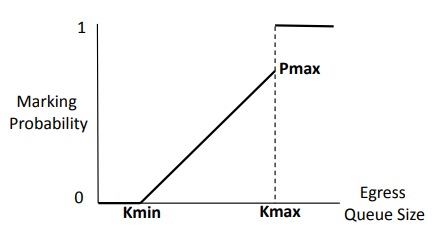

# ECN test plan
- [ECN test plan](#ecn-test-plan)
  - [Overview](#overview)
    - [Scope](#scope)
    - [Testbed](#testbed)
  - [Setup configuration](#setup-configuration)
    - [DUT Configuration](#dut-configuration)
    - [Keysight configuration](#keysight-configuration)
  - [Test Cases](#test-cases)
    - [Test Case #1 - ECN marking at egress](#test-case-1---ecn-marking-at-egress)
      - [Test Objective](#test-objective)
      - [Test Configuration](#test-configuration)
      - [Test Steps](#test-steps)
    - [Test Case #2 - ECN marking accuracy](#test-case-2---ecn-marking-accuracy)
      - [Test Objective](#test-objective-1)
      - [Test Configuration](#test-configuration-1)
      - [Test Steps](#test-steps-1)

| Rev |     Date       |       Author         | Change Description               |
|:---:|:---------------|:---------------------|:-----------------------------------|
| 0.1 |        Sep-02-2020     | Wei Bai, Microsoft<br>                           Suvendu Mozumdar, Keysight     | Initial version of test plan                 |
|


## Overview

Explicit Congestion Notification (ECN) allows end-to-end notification of network congestion without dropping packets. ECN is an optional feature that may be used between two ECN-enabled endpoints when the underlying network infrastructure also supports it.

Conventionally, TCP/IP networks signal congestion by dropping packets. When ECN is successfully negotiated, an ECN-aware router may set a mark in the IP header instead of dropping a packet, in order to signal impending congestion. The receiver of the packet echoes the congestion indication to the sender, which reduces its transmission rate as if it detected a dropped packet.

Commodity switches typically use Random Early Detection (RED) algorithm to perform ECN marking. RED algorithm has at least three parameters: the minimum threshold Kmin, the maximum threshold Kmax, and the maximum marking (or dropping) probability Pmax. When the instantaneous queue length is smaller than the minimum marking threshold, the marking probability is 0%. When the instantaneous queue length is larger than the maximum marking threshold, the marking probability is 100%. Otherwise, the marking probability varies as ((queue_length - Kmin) / (Kmax - Kmin)) * Pmax. The figure below describes the theoretical ECN marking probability as a function of queue length.


  


Commodity switches can run RED at ingress (enqueue packet to the switch buffer) or egress (dequeue packet from the switch buffer). Compared to ingress RED/ECN, egress RED/ECN can achieve lower feedback delay.

### Scope

The test cases depicted in this document aim to do functional testing of ECN behavior of SONiC DUT (Device Under Test) as per RED (Random Early Detection) algorithm.

### Testbed

```
+-------------+      +--------------+      +-------------+       
| Keysight TX |------|   SONiC DUT  |------| Keysight RX | 
+-------------+      +--------------+      +-------------+ 

Keysight ports are connected via SONiC switch as shown in the illustration above.
```
## Setup configuration

### DUT Configuration
•	PFC watchdog is disabled so that the SONiC DUT does not discard packets when it receives continuous PFC PAUSE frames.

•	Enable ECN at the priority to test, e.g., 3.

•	Configure minimum threshold to Kmin Bytes.

•	Configure maximum threshold to Kmax Bytes.

•	Configure marking probability as Pmax %.

### Keysight configuration
•	All Keysight ports should have the same bandwidth capacity.

•	Test specific configurations are mentioned in respective test cases.

## Test Cases

### Test Case #1 - ECN marking at egress

#### Test Objective

This test aims to verify the DUT’s dequeue based ECN marking behavior (Egress marking).

#### Test Configuration

- On SONiC DUT configure the following:
  1. Enable ECN on a lossless priority Pi (0 <= i <= 7).
  2. Configure minimum and maximum ECN marking threshold of the lossless priority Pi to N KB (e.g., 100 KB).
  3. DUT should have enough buffer to hold 2N KB packets.

- Configure following traffic items on the Keysight device:
  1. Test data traffic: A traffic item from the Keysight Tx port to
        the Keysight Rx port. This traffic item should have DSCP value mapped to lossless priority Pi configured in the DUT. Number of packets should be fixed to 2N (e.g., 200), size of each packet should be 1KB each.
  2. PFC PAUSE storm: Persistent PFC pause frames from the Keysight
        Rx port to the Keysight Tx port. The priorities of PFC pause
        frames should be same as that of 'Test data traffic'. And the
        inter-frame transmission interval should be lesser than
        per-frame pause duration.

#### Test Steps

1. Start PFC PAUSE storm to fully block the lossless priority at the
    DUT.
2. Start packet capture at Keysight Rx port.
3. From the Keysight Tx port, send 2N data packets to the receiver. The packets should be mapped to priority Pi on the DUT.
4. After all the test data packets are sent, stop PFC PAUSE storm.
5. Stop capture after all packets are received.
6. Verify the following:
   * Keysight Rx port must receive 2N test data packets.
   * The first test data packet received by Keysight Rx port should be ECN marked.
   * The last test data packet received by Keysight Rx port should not be ECN marked.
7. Repeat the test with all the lossless priorities.


### Test Case #2 - ECN marking accuracy

#### Test Objective

This test aims to verify the DUT’s ECN marking accuracy, e.g., if the actual ECN marking probability is close to the theoretical value.

#### Test Configuration

- On SONiC DUT configure the following:
  1. Enable ECN on a lossless priority Pi (0 <= i <= 7).
  2. Configure the minimum ECN marking threshold, the maximum ECN marking threshold, and the maximum marking probability of the Priority Pi to Kmin KB, Kmax KB, and Pmax % respectively. For this test, Kmin, Kmax, and Pmax are set to 500 KB, 2000 KB, and 5% respectively.
  3. DUT should have enough buffer to hold (Kmax+10) packets each of 1KB size.

- Configure following traffic items on the Keysight device:
  1. Test data traffic: A traffic item from the Keysight Tx port to
        the Keysight Rx port. This traffic item should have DSCP value mapped to lossless priority Pi configured in the DUT. It should also have fixed number of packets, Kmax+10 (e.g., 2010), each having 1KB frame size.
  2. PFC PAUSE storm: Persistent PFC pause frames from the Keysight
        Rx port to the Keysight Tx port. The priorities of PFC pause
        frames should be the same as that of 'Test data traffic'. And the
        inter-frame transmission interval should be lesser than the 
        per-frame pause duration.

#### Test Steps

1. Start PFC PAUSE storm to fully block the lossless priority at the
    DUT.
2. Start packet capture on the Keysight Rx port.
3. Start the Test data traffic, it will send total Kmax+10 packets as per the configuration.
4. After all the test data packets are sent, stop PFC PAUSE storm from Keysight Rx port.
5. Stop capture after all packets are received.
6. Verify the following:
   * All Kmax+10 packets must be received at the Rx port.
   * As per egress ECN marking algorithm, the queue length associated with the data packet i (i = 1, 2, … Kmax + 10) is (Kmax + 10 – i) KB.
   * If instantaneous queue length is q, then, for the first 10 packets, q>=Kmax. Hence, their theoretical ECN marking probability should be 100%.
   * For the next (Kmax-Kmin) packets, Kmin <= q < Kmax, so their theoretical ECN marking probability should be no larger than Pmax%. As q varies from Kmax to Kmin, the ECN marking probability varies linearly from Pmax to 0.
   * For the last Kmin packets, q<Kmin. So, none of them should be ECN marked.
7. Repeat steps 1 to 5 at least 200 times.
8. After 200 iterations, compare between theoretical probability of ECN marking with the actual ECN marking yielded as test results against queue length.