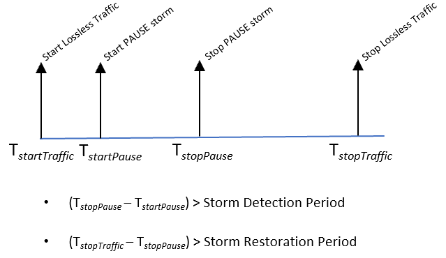

# PFC Watchdog test plan

- [PFC Watchdog test plan](#pfc-watchdog-test-plan)
  - [1.1 Overview](#11-overview)
    - [PFC Storm Detection](#pfc-storm-detection)
    - [PFC Storm Mitigation](#pfc-storm-mitigation)
    - [PFC Storm Restoration](#pfc-storm-restoration)
    - [PFC Polling Interval](#pfc-polling-interval)
    - [1.1.1 Scope](#111-scope)
    - [1.1.2 Testbed](#112-testbed)
      - [1.1.2.1 Topology 1](#1121-topology-1)
  - [1.2 Setup configuration](#12-setup-configuration)
    - [1.2.1 DUT Configuration](#121-dut-configuration)
    - [1.2.2 Keysight configuration](#122-keysight-configuration)
  - [1.3 Test Cases](#13-test-cases)
    - [1.3.1 Test Case #1 - PFCWD two senders two receivers](#131-test-case-1---pfcwd-two-senders-two-receivers)
      - [1.3.1.1 Test Objective](#1311-test-objective)
      - [1.3.1.2 Test Topology](#1312-test-topology)
      - [1.3.1.3 Test Configuration](#1313-test-configuration)
      - [1.3.1.4 Test Steps](#1314-test-steps)
    - [1.3.2 Test Case #2 - PFCWD all to all multi-host lossless traffic](#132-test-case-2---pfcwd-all-to-all-multi-host-lossless-traffic)
      - [1.3.2.1 Test Objective](#1321-test-objective)
      - [1.3.2.2 Test Topology](#1322-test-topology)
      - [1.3.2.3 Test Configuration](#1323-test-configuration)
      - [1.3.2.4 Test Steps](#1324-test-steps)
    - [1.3.3 Test Case #3 - PFC Watchdog timer behavior](#133-test-case-3---pfc-watchdog-timer-behavior)
      - [1.3.3.1 Test Objective](#1331-test-objective)
      - [1.3.3.2 Test Topology](#1332-test-topology)
      - [1.3.3.3 Test Configuration](#1333-test-configuration)
      - [1.3.3.4 Test Steps](#1334-test-steps)

Revision of the document

| Rev |     Date       |       Author         | Change Description               |
|:---:|:---------------|:---------------------|:-----------------------------------|
| 0.1 |        Sep-09-2020     | Wei Bai, Microsoft<br>                           Suvendu Mozumdar, Keysight     | Initial version of test plan                 |  
|


## 1.1 Overview

PFC watchdog is designed to detect and mitigate PFC storm received for each port. PFC pause frames are used in lossless Ethernet to pause the link partner from sending packets. Such back-pressure mechanism could propagate to the whole network and cause the network stop forwarding traffic. PFC watchdog is to detect abnormal back-pressure caused by receiving excessive PFC pause frames, and mitigate such situation by disabling PFC caused pause temporarily.

On SONiC, PFC watchdog is enabled at lossless priorities (e.g., 3 and 4) by default. PFC watchdog has three function blocks, i.e. detection, mitigation and restoration. More details can be found [here](https://github.com/Azure/SONiC/wiki/PFC-Watchdog).

### PFC Storm Detection
The PFC storm detection is for a switch to detect a lossless queue is receiving PFC storm from its link partner and the queue is in a paused state over T0 amount of time. Even when the queue is empty, as soon as the duration for a queue in paused state exceeds T0 amount of time, the watchdog should detect such storm. T0 is a port level parameter. The detection needs to enable/disable at per port level. Such detection mechanism is only available for lossless queue. By default, the detection mechanism is disabled. T0 should be on the scale of hundred milliseconds.

### PFC Storm Mitigation
Once PFC storm is detected on a queue, the watchdog can then have two actions, drop or forward at per queue level. When drop action is selected, following actions need to be implemented:

* All existing packets in the output queue are discarded.
* All subsequent packets destined to the output queue are discarded.
* All subsequent packets received by the corresponding priority group of this queue are discarded including the pause frames received. As a result, the switch should not generate any pause frame to its neighbor due to congestion of this output queue.
  
When forward action is selected, following actions need to be implemented:

* The queue no longer honors the PFC frames received. All packets destined to the queue are forwarded along with those packets that were in the queue.

### PFC Storm Restoration

The watchdog should continue count the PFC frames received on the queue. If there is no PFC frame received over T1 period. Then, re-enable the PFC on the queue and stop dropping packets if the previous mitigation was drop. T1 is port level parameter. T1 should be on the scale of hundred milliseconds.

### PFC Polling Interval 

PFC watchdog polls the states of each lossless queue every T2 period. T2 is called polling interval. To reduce CPU overhead, T2 is typically of hundreds of milliseconds.


### 1.1.1 Scope

The test cases depicted in this document aim to do functional testing of PFC watchdog behavior of SONiC DUT (Device Under Test).

### 1.1.2 Testbed
#### 1.1.2.1 Topology 1
```
+-----------------+           +--------------+           +-----------------+       
| Keysight Port 1 |------ et1 |   SONiC DUT  | et2 ------| Keysight Port 2 | 
+-----------------+           +--------------+           +-----------------+ 
                                   et3
                                    |
                                    |
                                    |
                            +-----------------+
                            | Keysight Port 3 |
                            +-----------------+
```
*Fig. 1: Topology 1*

## 1.2 Setup configuration

### 1.2.1 DUT Configuration
•PFC watchdog and PFC must be enabled in the DUT by default.


### 1.2.2 Keysight configuration
•All Keysight ports should have the same bandwidth capacity.

•	Test specific configurations are mentioned in respective test cases.

## 1.3 Test Cases

### 1.3.1 Test Case #1 - PFCWD two senders two receivers

#### 1.3.1.1 Test Objective

This test aims to verify how PFC watchdog can handle PFC storms in a topology with two senders and two receivers.

#### 1.3.1.2 Test Topology

Refer to Topology 1.1.2.1 for the test topology.

#### 1.3.1.3 Test Configuration

- On SONiC DUT configure the following:
  1. Enable watchdog with default storm detection time and restoration time. Please note that different switches have different detection times and restoration times, e.g :  200ms and 400ms.  
  2. Configure a single lossless priority value Pi (0 <= i <= 7).
  3. To minimize configuration complexity, it is recommended that the SONiC DUT be configured as Top of Rack (ToR) / Tier 0 (T0) switch with three VLAN interfaces.

- Configure following traffic items on the Keysight device:
  1. Traffic 1<->2 : Bi-directional traffic between Keysight port 1 and port 2, with DSCP value mapped to lossless priority Pi configured in the DUT. Traffic Tx rate should be configured as 50% of line rate.
  2. Traffic 2<->3 : Bi-directional traffic between Keysight port 2 and port 3, with DSCP value mapped to lossless priority Pi configured in the DUT. Traffic Tx rate should be configured as 50% of line rate.
  3. PFC pause storm: Persistent PFC pause frames from Keysight port 3 to et3 of DUT. Priority of the PFC pause frames should be same as the lossless priority configured at DUT (Device Under Test) and the inter-frame transmission interval should be lesser than per-frame pause duration.

#### 1.3.1.4 Test Steps

Refer to the time diagram below to understand the work flow of the test case:



*Fig. 2: #Test 1 Workflow*

1. At time **_T<sub>startTraffic</sub>_** , start all the bi-directional lossless traffic items.
2. At time **_T<sub>startPause</sub>_** , start PFC pause storm.
3. At time **_T<sub>stopPause</sub>_** , stop PFC pause storm. (**_T<sub>stopPause</sub> - T<sub>startPause</sub>_**) should be larger than PFC storm detection time + PFC watchdog polling interval to trigger PFC watchdog.
4. At time **_T<sub>stopTraffic</sub>_** , stop lossless traffic items. Note that (**_T<sub>stopTraffic</sub> - T<sub>stopPause</sub>_**) should be larger than PFC storm restoration time to re-enable PFC.
5. Verify the following:
   * PFC watchdog is triggered on the corresponding lossless priorities at DUT interface et3
   * 'Traffic 1<->2' : Must not experience any packet loss in both directions. Its throughput should be close to 50% of the line rate.
   * 'Traffic 2<->3' : there should be some packet loss in both directions. 
   * There should not be any traffic loss after PFC storm restoration time has elapsed.

6. Repeat the test for other lossless priorities.


### 1.3.2 Test Case #2 - PFCWD all to all multi-host lossless traffic

#### 1.3.2.1 Test Objective

This test aims to verify how PFC watchdog can handle PFC storm under all-to-all traffic in a multi-host topology.

#### 1.3.2.2 Test Topology

Refer to Topology 1 for the test topology.

#### 1.3.2.3 Test Configuration

- On SONiC DUT configure the following:
  1. Enable watchdog with default storm detection time and restoration time. Please note that different switches have different detection times and restoration times, e.g :  200ms and 400ms. 
  2. Configure a single lossless priority value Pi (0 <= i <= 7).
  3. To minimize configuration complexity, it is recommended that the SONiC DUT be configured as Top of Rack (ToR) / Tier 0 (T0) switch with three VLAN interfaces.

- Configure following traffic items on the Keysight device:
  1. Traffic 1<->2 : Bi-directional traffic between Keysight port 1 and port 2, with DSCP value mapped to lossless priority Pi configured in the DUT. Traffic Tx rate should be configured as 50% of line rate.
  2. Traffic 2<->3 : Bi-directional traffic between Keysight port 2 and port 3, with DSCP value mapped to lossless priority Pi configured in the DUT. Traffic Tx rate should be configured as 50% of line rate.
  3. Traffic 1<->3 : Bi-directional traffic between Keysight port 1 and port 3, with DSCP value mapped to lossless priority Pi configured in the DUT. Traffic Tx rate should be configured as 50% of line rate.
  4. PFC pause storm: Persistent PFC pause frames from Keysight port 3 to et3 of DUT. Priority of the PFC pause frames should be same as same as the lossless priority configured at DUT ( Device Under Test) and the inter-frame transmission interval should be lesser than per-frame pause duration.

#### 1.3.2.4 Test Steps

Refer to the time diagram below to understand the work flow of the test case:


*Fig. 3: #Test 2 Workflow*

1. At time **_T<sub>startTraffic</sub>_** , start all the bi-directional lossless traffic items.
2. At time **_T<sub>startPause</sub>_** , start PFC pause storm.
3. At time **_T<sub>stopPause</sub>_** , stop PFC pause storm. (**_T<sub>stopPause</sub> - T<sub>startPause</sub>_**) should be larger than PFC storm detection time + PFC watchdog polling interval to trigger PFC watchdog.
4. At time **_T<sub>stopTraffic</sub>_** , stop lossless traffic items. Note that (**_T<sub>stopTraffic</sub> - T<sub>stopPause</sub>_**) should be larger than PFC storm restoration time to re-enable PFC.
5. Verify the following:
   * PFC watchdog is triggered on the corresponding lossless priorities at DUT interface et3. 
   * 'Traffic 1<->2' must not experience any packet loss in both directions. Its throughput should be close to 50% of the line rate.
   * 'Traffic 2<->3' and 'Traffic 1<->3' : there should be some packet loss in both directions.
   * There should not be any traffic loss after PFC storm restoration time has elapsed.
6. Repeat the test for other lossless priorities.


### 1.3.3 Test Case #3 - PFC Watchdog timer behavior

 Testbed

```
+-------------+      +--------------+      +-------------+       
| Keysight TX |------|   SONiC DUT  |------| Keysight RX | 
+-------------+      +--------------+      +-------------+ 

Keysight ports are connected via SONiC switch as shown in the illustration above.
```
**_Fig. 2: Topology 2_**

#### 1.3.3.1 Test Objective

This test aims to verify the PFC watchdog behavior considering the different timers explicitely.

#### 1.3.3.2 Test Topology

Refer to Topology 2 for the test topology

#### 1.3.3.3 Test Configuration

- On SONiC DUT configure the following:
1. Enable watchdog with default storm detection time and restoration time. Please note that different switches have different detection times and restoration times, e.g :  200ms and 400ms.
2. Configure lossless priority Pi (0 <= i <= 7).

- Configure following traffic items on the Keysight device:
  1. Data traffic 1: Data packets from KEYSIGHT Tx port to KEYSIGHT Rx port. To cause congestion at port 2, the traffic demand should be 100% line rate. To map traffic to lossless priorities at the switch, we should mark packets with the correct DSCP value (e.g., DSCP 3 for priority 3). 
  2. Data traffic 2: Data packets from KEYSIGHT Tx port to KEYSIGHT Rx port. To cause congestion at port 2, the traffic demand should be 100% line rate. To map traffic to lossless priorities at the switch, we should mark packets with the correct DSCP value (e.g., DSCP 3 for priority 3). It should be configured with a start delay of (**_T<sub>storm</sub>_** + **_T<sub>poll</sub>_** + **_T<sub>restore</sub>_**) and duration 1 sec.
  3. PFC pause storm: Persistent PFC pause frames from the KEYSIGHT Rx port to et2 of DUT having same priority (e.g., priority 3) as data traffic. The PFC frames should be able to pause the above lossless traffic. And the inter-frame transmission interval should be smaller than per-frame pause duration.

#### 1.3.3.4 Test Steps


Fig. 4: Test Work Flow 2

Let’s use **_T<sub>detect</sub>_** , **_T<sub>restore</sub>_** , and **_T<sub>poll</sub>_** to denote the detection time, restoration time, and polling interval of PFC watchdog in sec. 

1. At time 0, start PFC PAUSE storm for **_T<sub>storm</sub>_** duration.
2. At time **_T<sub>restore</sub>_**/2, start data traffic 1. The duration of data traffic 1 is also **_T<sub>storm</sub>_**.
3. At time **_T<sub>storm</sub>_** , stop PFC pause storm.
4. At time **_T<sub>restore</sub>_**/2 + **_T<sub>storm</sub>_** , stop data traffic 1.
5. At time **_T<sub>storm</sub>_** + **_T<sub>poll</sub>_** + **_T<sub>restore</sub>_** , start data traffic 2.
6. At time **_T<sub>storm</sub>_** + **_T<sub>poll</sub>_** + **_T<sub>restore</sub>_** + 1, stop data traffic 2.
7. Verify the following:
   *    If **_T<sub>storm</sub>_** > (**_T<sub>detect</sub>_** + **_T<sub>poll</sub>_**)
        *    PFC watchdog is triggered on the corresponding lossless priorities at interface et2.
        *    All the packets of data traffic 1 are dropped.
        *    All the packets of data traffic 2 are received. The throughput of traffic 2 is close to 100% of line rate.
   *    If **_T<sub>storm</sub>_** < **_T<sub>detect</sub>_**
        *    PFC watchdog is NOT triggered on the corresponding lossless priorities at interface et2.
        *    All the packets of data traffic 1 are received.
        *    All the packets of data traffic 2 are received. The throughput of traffic 2 is close to 100% of line rate.

8. Repeat the test with different lossless priorities.
9.  Repeat the test with all lossless priorities simultaneously.