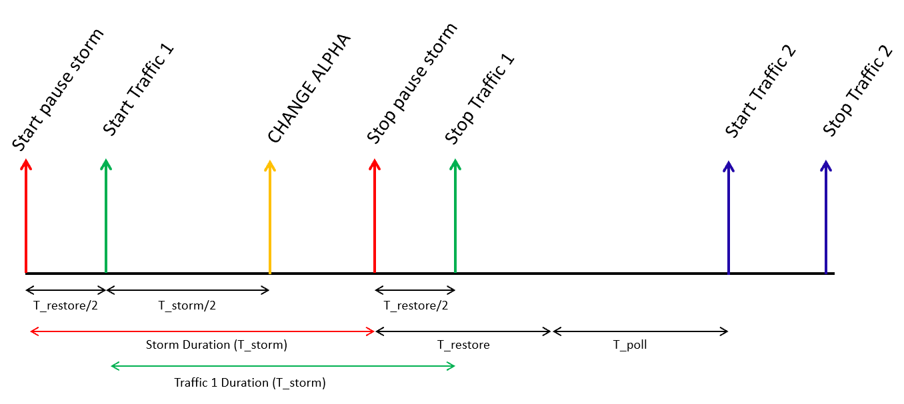

This document describes how to test that MMU change does not have impact on PFC watchdog behavior. 

## Background
PFC watchdog is designed to detect and mitigate PFC storm received for each port. PFC pause frames is used in lossless Ethernet to pause the link partner from sending packets. Such back-pressure mechanism could propagate to the whole network and cause the network stop forwarding traffic. PFC watchdog is to detect *abnormal* back-pressure caused by receiving excessive PFC pause frames, and mitigate such situation by disable PFC caused pause temporarily. 

On SONiC, PFC watchdog is enabled at lossless priorities (e.g., 3 and 4) by default. PFC watchdog has three function blocks, i.e. detection, mitigation and restoration. You can find more details [here](https://github.com/Azure/SONiC/wiki/PFC-Watchdog).  

### PFC storm detection
The PFC storm detection is for a switch to detect a lossless queue is receiving PFC storm from its link partner and the queue is in a paused state over *T0* amount of time. Even when the queue is empty, as soon as the duration for a queue in paused state exceeds T0 amount of time, the watchdog should detect such storm. T0 is called *PFC storm detection time*. 

### PFC storm mitigation
Once PFC storm is detected on a queue, the watchdog can then have two actions, drop and forward at per queue level. When drop action is selected, following actions need to be implemented.

* All existing packets in the output queue are discarded
* All subsequent packets destine to the output queue are discarded
* All subsequent packets received by the corresponding priority group of this queue are discarded including the pause frames received. As a result, the switch should not generate any pause frame to its neighbor due to congestion of this output queue.

When forward action is selected, following actions need to be implemented.

* The queue no longer honor the PFC frames received. All packets destined to the queue are forwarded as well as those packets that were in the queue.

The default action is drop.

### PFC storm restoration
The watchdog should continue count the PFC frames received on the queue. If there is no PFC frame received over *T1* period. Then, re-enable the PFC on the queue and stop dropping packets if the previous mitigation was drop. T1 is called *PFC storm restoration time*. 

### PFC watchdog implementation
PFC watchdog polls the states of each lossless queue every *T2* period. T2 is called polling interval. To reduce CPU overhead, T2 is typically of hundreds of milliseconds. 

## PFC watchdog commands on SONiC
To get PFC watchdog configuraton:

<code>$ pfcwd show config</code>

To get PFC watchdog statistics:

<code>$ pfcwd show stats</code>

To start PFC watchdog using default parameters and action

<code>$ sudo pfcwd start_default</code>

To start PFC watchdog using specific time values and drop action on all the ports

<code>$ sudo pfcwd start --action drop ports all detection-time [detection time in ms] --restoration-time [restoration time in ms]</code>

To stop PFC watchdog

<code>$ sudo pfcwd stop</code>

To configure alpha value following commands are used:
        
  * Get the profiles configured in the DUT:
  
  <code>$mmuconfig -l</code>
        
  * Configure alpha value:
  
  <code>$sudo mmuconfig -p [profile_name] -a [alpha_value]</code>


Note that there is no way to clear PFC watchdog statistics unless we reload config database or minigraph. 

The testbed consists of two IXIA ports and a SONiC device under test (DUT) as follows. All the IXIA ports should have the same bandwidth capacity. To reduce the configuration complexity, we recommond configuring the switch as a Top of Rack (ToR) / Tier 0 (T0) switch and binding three switch interfaces to the Vlan. PFC watchdog must be enabled at the DUT.

```
+-------------+      +--------------+      +-------------+       
| Keysight TX |------|   SONiC DUT  |------| Keysight RX | 
+-------------+      +--------------+      +-------------+ 

Keysight ports are connected via SONiC switch as shown in the illustration above.
```
#### Test Configuration

- On SONiC DUT configure the following:
  1. Enable watchdog with default storm detection time (400ms) and restoration time (2sec).
  2. Configure lossless priority Pi (0 <= i <= 7).
   
- Configure following traffic items on the Keysight device:
  1. Data traffic 1: Data packets from KEYSIGHT Tx port to KEYSIGHT Rx port. To cause congestion at port 2, the traffic demand should be 100% line rate. To map traffic to lossless priorities at the switch, we should mark packets with the correct DSCP value (e.g., DSCP 3 for priority 3). 
  2. Data traffic 2: Data packets from KEYSIGHT Tx port to KEYSIGHT Rx port. To cause congestion at port 2, the traffic demand should be 100% line rate. To map traffic to lossless priorities at the switch, we should mark packets with the correct DSCP value (e.g., DSCP 3 for priority 3). It should be configured with a start delay of (**_T<sub>storm</sub>_** + **_T<sub>poll</sub>_** + **_T<sub>restore</sub>_**) and duration 1 sec.
  3. PFC pause storm: Persistent PFC pause frames from the KEYSIGHT Rx port to et2 of DUT having same priority (e.g., priority 3) as data traffic. The PFC frames should be able to pause the above lossless traffic. And the inter-frame transmission interval should be smaller than per-frame pause duration.

#### Test Steps
Let’s use **_T<sub>detect</sub>_** , **_T<sub>restore</sub>_** , and **_T<sub>poll</sub>_** to denote the detection time, restoration time, and polling interval of PFC watchdog in sec. Refer to the time diagram below to understand the test steps.

  


1. At time 0, start PFC PAUSE storm for **_T<sub>storm</sub>_** duration.
2. At time **_T<sub>restore</sub>_**/2, start data traffic 1. The duration of data traffic 1 is also **_T<sub>storm</sub>_**.
3. At time **_T<sub>restore</sub>_**/2 + **_T<sub>storm</sub>_**/2, change alpha.
4. At time **_T<sub>storm</sub>_** , stop PFC pause storm.
5. At time **_T<sub>restore</sub>_**/2 + **_T<sub>storm</sub>_** , stop data traffic 1.
6. At time **_T<sub>storm</sub>_** + **_T<sub>poll</sub>_** + **_T<sub>restore</sub>_** , start data traffic 2.
7. At time **_T<sub>storm</sub>_** + **_T<sub>poll</sub>_** + **_T<sub>restore</sub>_** + 1, stop data traffic 2.
8. Verify the following:
   *    If **_T<sub>storm</sub>_** > (**_T<sub>detect</sub>_** + **_T<sub>poll</sub>_**)
        *    PFC watchdog is triggered on the corresponding lossless priorities at interface et2.
        *    All the packets of data traffic 1 are dropped.
        *    All the packets of data traffic 2 are received. The throughput of traffic 2 is close to 100% of line rate.
   *    If **_T<sub>storm</sub>_** < **_T<sub>detect</sub>_**
        *    PFC watchdog is NOT triggered on the corresponding lossless priorities at interface et2.
        *    All the packets of data traffic 1 are received.
        *    All the packets of data traffic 2 are received. The throughput of traffic 2 is close to 100% of line rate.

9. Repeat the test with different lossless priorities.
10. Repeat the test with all lossless priorities simultaneously.
