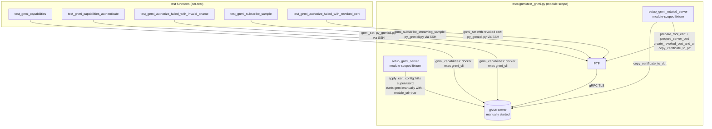

# Introduction

`tests/gnmi/test_gnmi.py` currently exercises five gNMI test scenarios — basic capabilities,
role-based authorization, invalid common-name rejection, streaming subscribe, and CRL revocation —
through a legacy fixture stack: the module-scoped `setup_gnmi_server` fixture (which manually
kills supervisord programs and restarts the gNMI binary with custom flags), three companion
module-scoped fixtures (`setup_gnmi_rotated_server`, `check_dut_timestamp`,
`setup_gnmi_ntp_client_server`), and subprocess-based helpers (`gnmi_capabilities`, `gnmi_set`,
`gnmi_subscribe_streaming_sample`) that shell out to `gnmi_cli` or `py_gnmicli.py` on the PTF
container.

This plan replaces all five test functions with the modern `gnmi_tls` fixture (function-scoped,
CONFIG-DB-driven, supervisorctl-based) and the in-process `PygnmiClient` class. The migration is
phased across five independently testable EPICs; the legacy fixture and helper code MUST NOT be
removed from the repository until every caller outside `test_gnmi.py` has also been migrated.

The key words "MUST", "MUST NOT", "REQUIRED", "SHALL", "SHALL NOT", "SHOULD", "SHOULD NOT",
"RECOMMENDED", "MAY", and "OPTIONAL" in this document are to be interpreted as described in
RFC 2119.

**Cross-reference conventions**: This document uses standardized prefixes for traceability —
`FR-` (functional requirements), `NFR-` (non-functional requirements), `FM-` (failure modes),
`AC-` (acceptance criteria), and `RD-` (resolved decisions).

---

## 1. Goals and Non-Goals

- **Goal 1**: Replace `setup_gnmi_server` / `setup_gnmi_rotated_server` / `check_dut_timestamp`
  module-scoped fixture usage in `tests/gnmi/test_gnmi.py` with the function-scoped `gnmi_tls`
  fixture from `tests/common/fixtures/grpc_fixtures.py`.
- **Goal 2**: Replace all `gnmi_capabilities()`, `gnmi_set()`, and
  `gnmi_subscribe_streaming_sample()` subprocess-based helper calls in `test_gnmi.py` with
  equivalent `PygnmiClient` method calls (`capabilities()`, `set()`, `subscribe()`).
- **Goal 3**: Preserve full coverage of all five current test scenarios: basic capabilities,
  role-based authorization (noaccess / readonly / readwrite / empty), invalid-CN rejection,
  streaming subscribe sample, and CRL revocation.
- **Goal 4**: Each EPIC produces a standalone, passing test state; no EPIC requires a subsequent
  EPIC to be complete before it can be run.
- **Goal 5**: The `setup_gnmi_server` fixture (and its helper functions) MUST remain in the
  repository, untouched, until the grep count of its callers outside `test_gnmi.py` reaches zero.
- **Goal 6**: Extend `gnmi_tls` with CRL certificate infrastructure so the revocation test no
  longer depends on `setup_gnmi_rotated_server`.

### In Scope

- All test functions in `tests/gnmi/test_gnmi.py` (294 lines, 5 test functions).
- The `gnmi_create_vnet()` local helper function in `test_gnmi.py` (lines 134–152).
- The `setup_crl_server_on_ptf` local fixture in `test_gnmi.py` (lines 176–215) — superseded by
  gnmi_tls CRL extension in EPIC-003; fixture body moved into `grpc_fixtures.py`.
- The `setup_invalid_client_cert_cname` local fixture in `test_gnmi.py` (lines 119–131) — kept
  as-is, no changes.
- `tests/common/fixtures/grpc_fixtures.py` — additions only (CRL support in gnmi_tls, EPIC-003).
- `tests/common/cert_utils.py` — addition of `generate_revoked_cert_with_crl()` (EPIC-003).

### Out of Scope (deferred)

- Migrating `tests/gnmi/test_gnmi_appldb.py`, `test_gnmi_configdb.py`, `test_gnmi_countersdb.py`,
  `test_gnmi_smartswitch.py`, `test_gnmi_stress.py` — these are the largest callers of
  `setup_gnmi_server`; migration is a separate initiative.
- Migrating `tests/dash/conftest.py`, `tests/dash/test_eni_based_forwarding.py`,
  `tests/gnmi_e2e/conftest.py`, `tests/ha/**`, `tests/platform_tests/test_liquid_cooling_leakage_detection.py`,
  `tests/vxlan/test_vxlan_vnet_bgp_subintf.py`, `tests/conftest.py` — all reference
  `setup_gnmi_server`; out of scope.
- Removing `setup_gnmi_server`, `setup_gnmi_rotated_server`, or `check_dut_timestamp` from
  `tests/gnmi/conftest.py` before all callers migrate (EPIC-005 tracks the guard condition).
- Removing `setup_gnmi_ntp_client_server` — `test_gnmi.py` retains it at module scope because
  `gnmi_tls` does not synchronize DUT time (RD-008).
- Removing `gnmi_set`, `gnmi_get`, `gnmi_subscribe_*` from `tests/gnmi/helper.py` — blocked on
  all callers migrating.
- Changes to the gNMI server binary, SONiC CONFIG_DB schema, or production code.

---

## 2. Terminology

| Term | Definition |
|------|------------|
| `setup_gnmi_server` | Module-scoped pytest fixture in `tests/gnmi/conftest.py` (lines 63–89) that manually kills supervisord programs, starts the gNMI binary with custom flags (`--enable_crl=true --config_table_name GNMI_CLIENT_CERT --client_auth cert`), and registers client CNs. |
| `gnmi_tls` | Function-scoped pytest fixture in `tests/common/fixtures/grpc_fixtures.py` (line 200) that manages gNMI TLS via CONFIG_DB + `supervisorctl restart gnmi-native`. Yields a `GnmiFixture` dataclass. |
| `GnmiFixture` | Dataclass defined at `tests/common/fixtures/grpc_fixtures.py` line 161. Fields: `host`, `port`, `tls`, `cert_paths` (CertPaths), `grpc` (PtfGrpc), `gnoi` (PtfGnoi), `pygnmi_client` (PygnmiClient), `transport`, `_duthost`. |
| `CertPaths` | Dataclass at `tests/common/fixtures/grpc_fixtures.py` line 155. Fields: `ca_cert`, `client_cert`, `client_key` (local filesystem paths in sonic-mgmt container). |
| `PygnmiClient` | In-process gNMI client class in `tests/common/pygnmi_client.py` line 98. Methods: `capabilities()`, `get()`, `set()`, `subscribe()`. Talks gRPC directly from the sonic-mgmt container; no PTF subprocess needed. |
| `gnmi_capabilities()` | Legacy function in `tests/common/helpers/gnmi_utils.py` line 524. Runs `gnmi_cli` inside the `gnmi` Docker container via `duthost.shell()`. Returns `(ret, stderr_string)`. |
| `gnmi_set()` | Legacy function in `tests/gnmi/helper.py` line 202. Runs `py_gnmicli.py` on PTF via SSH. |
| `gnmi_subscribe_streaming_sample()` | Legacy function in `tests/gnmi/helper.py` line 382. Runs `py_gnmicli.py` on PTF via SSH for STREAM+SAMPLE subscribe. |
| `mTLS` | Mutual TLS: both server and client present certificates; the gNMI server uses the client certificate's CN to look up authorization roles in `GNMI_CLIENT_CERT` CONFIG_DB table. |
| `CRL` | Certificate Revocation List. When `enable_crl=true` is set, the gNMI server downloads the CRL from a URL embedded in the client certificate's CRL Distribution Point extension and rejects revoked certs. |
| `GNMI_CLIENT_CERT` | CONFIG_DB table mapping client certificate Common Names (e.g., `test.client.gnmi.sonic`) to gNMI authorization roles (e.g., `gnmi_readwrite`). |
| `TlsCertificateGenerator` | Python class in `tests/common/cert_utils.py` line 20 using the `cryptography` library. Generates CA, server, and client certs; configured via `create_gnmi_cert_generator()` factory (line 360). |
| `gnmiclient.revoked.cer` | Client certificate whose serial number is listed in the CRL, used by `test_gnmi_authorize_failed_with_revoked_cert`. |
| `module-scoped fixture` | pytest fixture that runs once per test module (file). `setup_gnmi_server` is module-scoped. |
| `function-scoped fixture` | pytest fixture that runs once per individual test function. `gnmi_tls` is function-scoped. |
| `pygnmi` | Third-party Python library used by `PygnmiClient` to speak gRPC/gNMI protocol in-process. |

---

## 3. Solution Architecture

### Current Architecture (Legacy)



**Problems with the current architecture**:
- `setup_gnmi_server` enumerates and stops every RUNNING supervisord program before manually
  starting gNMI. If the test crashes mid-run, the DUT remains in a degraded state.
- `gnmi_capabilities`, `gnmi_set`, `gnmi_subscribe_streaming_sample` all require PTF SSH or docker
  exec subprocess chains; failures are harder to diagnose and assertions rely on text parsing.
- Module-scoped setup means all five tests share a single server instance; a failure in one test's
  CONFIG_DB mutation can corrupt subsequent tests.
- The CRL test depends on `setup_gnmi_rotated_server` generating a NEW CA cert that replaces the
  one from `setup_gnmi_server`, requiring careful ordering.

### Target Architecture (Post-Migration)

```mermaid
flowchart TD
    subgraph test_gnmi.py["tests/gnmi/test_gnmi.py (per-function)"]
        G1[gnmi_tls fixture\nfunction-scoped] -->|Creates checkpoint\nGenerates certs via TlsCertificateGenerator\nConfigures CONFIG_DB\nsupervisorctl restart gnmi-native| DUT
        G2["gnmi_tls{crl:True} fixture\nfunction-scoped\n(EPIC-003 extension)"] -->|Same + generate_revoked_cert_with_crl\nstarts CRL HTTP server on PTF\nsets enable_crl in CONFIG_DB| DUT
    end

    subgraph test_fns["test functions (per-test)"]
        T1[test_gnmi_capabilities] -->|PygnmiClient.capabilities()| DUT
        T2[test_gnmi_capabilities_authenticate] -->|PygnmiClient.capabilities()\nCONFIG_DB role changes| DUT
        T3[test_gnmi_authorize_failed_with_invalid_cname] -->|PygnmiClient.set()\nCONFIG_DB CN changes| DUT
        T4[test_gnmi_subscribe_sample] -->|PygnmiClient.subscribe()\nSTREAM+SAMPLE| DUT
        T5[test_gnmi_authorize_failed_with_revoked_cert] -->|PygnmiClient(revoked_cert)\nCRL check| DUT
    end

    DUT[(gNMI server\nvia supervisorctl)]
```

### Key Differences

| Dimension | Legacy | Target |
|-----------|--------|--------|
| Server lifecycle | `apply_cert_config`: enumerates and stops every RUNNING supervisord program, then starts gNMI manually | CONFIG_DB + `supervisorctl restart gnmi-native` |
| Server setup scope | Module (once for all 5 tests) | Function (isolated per test) |
| Client call mechanism | `gnmi_cli` in container or `py_gnmicli.py` on PTF via SSH | `PygnmiClient` in-process in sonic-mgmt container |
| CRL cert source | `setup_gnmi_rotated_server` generates a new CA + revoked cert (rotated CA) | `gnmi_tls` with `crl=True` generates revoked cert from SAME CA as the server |
| Rollback mechanism | `rollback()` + `recover_cert_config()` | CONFIG_DB checkpoint restore |
| Client cert CN | `test.client.gnmi.sonic` (from `create_gnmi_certs`) | `test.client.gnmi.sonic` (from `create_gnmi_cert_generator`) — identical |

### Test-by-Test Migration Map

| Test (line) | Legacy call | Replacement call | Special notes |
|-------------|------------|-----------------|---------------|
| `test_gnmi_capabilities` (line 22) | `gnmi_capabilities(duthost, localhost)` → `(ret, msg)` | `gnmi_tls.pygnmi_client.capabilities()` → `dict` | Assertion format changes (dict vs string) |
| `test_gnmi_capabilities_authenticate` (line 44) | `gnmi_capabilities(duthost, localhost)` per role | `gnmi_tls.pygnmi_client.capabilities()` per role | noaccess: assert `PygnmiClientCallError` or `PygnmiClientConnectionError` and a denial status; others: assert success |
| `test_gnmi_authorize_failed_with_invalid_cname` (line 154) | `gnmi_set()` via py_gnmicli | `gnmi_tls.pygnmi_client.set()` | gnmi_create_vnet refactored to accept `pygnmi_client` |
| `test_gnmi_subscribe_sample` (line 218) | `gnmi_subscribe_streaming_sample()` → stdout string | `gnmi_tls.pygnmi_client.subscribe()` → list of responses | Timestamp validation adapts to response dict format |
| `test_gnmi_authorize_failed_with_revoked_cert` (line 266) | `gnmi_set(cert="gnmiclient.revoked")` | `PygnmiClient(client_cert=gnmi_tls.revoked_cert_paths.client_cert, ...)` | Requires EPIC-003 gnmi_tls CRL extension |

---

## 4. Requirements

**Summary**: The migration must preserve behavioral parity for all five test scenarios, must be
delivered in independently testable phases, must not disrupt other test files that still use the
legacy setup, and must not remove legacy infrastructure until all repository callers are zero.

**Items**:

- **REQ-001**: The migrated `test_gnmi_capabilities` MUST verify that `PygnmiClient.capabilities()`
  returns a response dict containing `gnmi_version` key, at least one entry in
  `supported_encodings` equal to `"json_ietf"`, and at least one entry in `supported_models` whose
  `name` contains `"sonic-db"`.
- **REQ-002**: The migrated `test_gnmi_capabilities_authenticate` MUST verify that: (a) when the
  `test.client.gnmi.sonic` CN is assigned role `gnmi_noaccess` in `GNMI_CLIENT_CERT`, calling
  `PygnmiClient.capabilities()` raises `PygnmiClientCallError` for gRPC `PERMISSION_DENIED` or
  `PygnmiClientConnectionError` for gRPC `UNAUTHENTICATED`; (b) when assigned roles
  `gnmi_readonly`, `gnmi_readwrite`, or empty string, the call succeeds and returns a valid
  capabilities dict with `"json_ietf"` encoding and a `"sonic-db"` model.
- **REQ-003**: The migrated `test_gnmi_authorize_failed_with_invalid_cname` MUST verify that when
  the server's `GNMI_CLIENT_CERT` table does not contain the client cert's CN
  (`test.client.gnmi.sonic`), calling `gnmi_tls.pygnmi_client.set()` raises
  `PygnmiClientConnectionError` whose string representation contains `"Unauthenticated"`, and that
  `dump_gnmi_log(duthost)` output contains `"Failed to retrieve cert common name mapping"`.
- **REQ-004**: The migrated `test_gnmi_authorize_failed_with_revoked_cert` MUST verify that when a
  `PygnmiClient` is constructed with `gnmi_tls.revoked_cert_paths.client_cert` and
  `gnmi_tls.revoked_cert_paths.client_key`, any gNMI call raises `PygnmiClientConnectionError`,
  and `dump_gnmi_log(duthost)` output contains `"desc = Peer certificate revoked"`.
- **REQ-005**: The migrated `test_gnmi_subscribe_sample` MUST verify that subscribing to
  `/PSU_INFO` on `STATE_DB` and `COUNTERS` on `COUNTERS_DB` with
  `SubscribeMode.STREAM`, `StreamMode.SAMPLE`, `sample_interval=5`, `count=5` returns at least 5
  notification responses with consecutive response timestamps at least 4.5 seconds apart.
- **REQ-006**: After each EPIC is applied, all non-migrated tests in `test_gnmi.py` MUST continue
  to pass using explicit per-function legacy fixture parameters (not module-level `usefixtures`).
- **REQ-007**: `setup_gnmi_server`, `setup_gnmi_rotated_server`, `check_dut_timestamp` MUST NOT be
  removed from `tests/gnmi/conftest.py` while any file outside `test_gnmi.py` lists them in
  `usefixtures` or as function parameters. EPIC-005 ITEM-014 defines the guard command.
- **REQ-008**: EPIC-003 MUST add `generate_revoked_cert_with_crl()` to `TlsCertificateGenerator`
  using the `cryptography` library already imported in `tests/common/cert_utils.py`; it MUST NOT
  introduce new subprocess calls to `openssl`.
- **CON-001**: No changes to production code (gNMI binary, CONFIG_DB schema, playbooks).
- **CON-002**: No changes to `tests/gnmi/helper.py`, `tests/gnmi/conftest.py`, or
  `tests/common/helpers/gnmi_utils.py` in EPICs 001–004 (EPIC-005 conditionally removes from
  `conftest.py`).
- **CON-003**: The `gnmi_tls` CRL extension (EPIC-003) MUST be backward-compatible: calling
  `gnmi_tls` without a `crl` param MUST behave identically to its pre-EPIC-003 behavior.
- **NFR-001**: Each EPIC MUST touch at most 3 files. No EPIC MAY span more than the equivalent of
  1 week of effort.
- **NFR-002**: Each migrated test function's assertion logic MUST be equivalent to or stricter than
  the assertion it replaces; no behavioral relaxation is permitted.

---

## 5. Risk Classification

**Risk**: 🟡 MEDIUM

**Summary**: The migration is safe for the five targeted tests (no production code changes), but
EPIC-003 introduces new Python-native CRL certificate generation and gNMI server CRL config via
CONFIG_DB, both of which are new code paths that could fail on edge-case platform configurations.
The primary risks are CRL HTTP server timing on PTF and CONFIG_DB `enable_crl` support in the
gnmi-native startup script.

**Items**:

- **RISK-001**: The `enable_crl` field in `GNMI|gnmi` CONFIG_DB table may not be read by the
  current `gnmi-native` startup script. If the SONiC gnmi-native entrypoint does not propagate
  `enable_crl` from CONFIG_DB to the `--enable_crl` flag, EPIC-003 will be blocked on a separately
  scoped gnmi-native startup change. **Mitigation**: Verify this behavior before EPIC-003 code
  changes. This PRD MUST NOT patch production startup logic or skip the CRL scenario.
- **RISK-002**: CRL HTTP server readiness on PTF is timing-dependent. The existing
  `setup_crl_server_on_ptf` fixture (test_gnmi.py line 176) already handles this with `wait_until`
  up to 60 seconds; the same logic will be reused in the gnmi_tls CRL extension. **Mitigation**:
  Reuse the same `wait_until(60, 1, 0, server_ready_log_exist, ptfhost)` pattern already
  established.
- **RISK-003**: The `PygnmiClient` error message for `gnmi_noaccess` role may not contain the
  literal role name `"gnmi_noaccess"` as a substring. The current test asserts `role in msg`
  (test_gnmi.py line 57) where `msg` is the `gnmi_cli` stderr text. The gRPC PERMISSION_DENIED
  status message format may differ. **Mitigation**: EPIC-002 ITEM-004 accepts
  `PygnmiClientCallError` for `PERMISSION_DENIED` or `PygnmiClientConnectionError` for
  `UNAUTHENTICATED`, then asserts `"permission denied"` or `"unauthenticated"` in the lowercase
  error string. The role-name substring check is dropped because it tested CLI formatting rather
  than protocol denial.
- **RISK-004**: `test_gnmi_authorize_failed_with_revoked_cert` currently retries 3 times because
  CRL download from PTF can fail on unstable networks. The retry loop (test_gnmi.py line 271)
  SHOULD be preserved in the migrated test. **Mitigation**: EPIC-003 ITEM-011 explicitly
  preserves the retry loop with `PygnmiClient` calls.
- **ASSUMPTION-001**: The gNMI server's client cert CN lookup uses the same `GNMI_CLIENT_CERT`
  CONFIG_DB table whether `setup_gnmi_server` or `gnmi_tls` set it up. Both fixtures write to the
  same table with the same CN (`test.client.gnmi.sonic`); this assumption is confirmed by reading
  `apply_cert_config()` (helper.py line 26) and `_configure_gnoi_tls_server()` (grpc_fixtures.py
  line 532).
- **ASSUMPTION-002**: `PygnmiClient.capabilities()` returns a dict with keys `gnmi_version`,
  `supported_encodings` (list of strings), and `supported_models` (list of dicts with `name` key).
  Confirmed by reading `tests/gnmi/test_pygnmi_client.py` and `tests/common/pygnmi_client.py`.

---

## 6. Dependencies

**Summary**: The migration depends on three existing infrastructure components (gnmi_tls,
PygnmiClient, TlsCertificateGenerator) and one new code addition (CRL cert generation method).
No new third-party libraries are required.

**Items**:

- **DEP-001**: `tests/common/fixtures/grpc_fixtures.py` — `gnmi_tls` fixture (line 200) and
  `GnmiFixture` dataclass (line 161). Required for EPICs 001–004. Already available; no blocking
  dependency.
- **DEP-002**: `tests/common/pygnmi_client.py` — `PygnmiClient` class (line 98). Methods
  `capabilities()` (line 257), `set()` (line 318), `subscribe()` (line 418). Required for EPICs
  001–004. Already available; no blocking dependency.
- **DEP-003**: `tests/common/cert_utils.py` — `TlsCertificateGenerator` class (line 20) with
  `cryptography` library. EPIC-003 adds `generate_revoked_cert_with_crl()` method to this class.
  The `cryptography` library is already imported and used in this file.
- **DEP-004**: `tests/gnmi/crl/crl_server.py` — HTTP server script that serves CRL files to the
  gNMI server. Already exists on PTF after `setup_gnmi_rotated_server` runs. EPIC-003 copies this
  from its source location to PTF as part of the `gnmi_tls` CRL extension.
- **DEP-005**: CONFIG_DB `GNMI|gnmi` table support for `enable_crl` field. EPIC-003 ITEM-009 MUST
  verify that the gnmi-native startup script reads this field. If it does not, EPIC-003 is blocked
  on a separately scoped startup change (RISK-001).
- **DEP-006**: `tests/common/pygnmi_client.py` `PygnmiClientConnectionError` and
  `PygnmiClientCallError`. `_map_error()` maps `UNAUTHENTICATED` to the former and
  `PERMISSION_DENIED` to the latter. EPIC-002 MUST import and accept both for the noaccess case.

---

## 7. Quality & Testing

**Summary**: Each EPIC is verified by running only the affected test functions. The full file
can be collected (--collect-only) to confirm no import errors. No additional test frameworks are
introduced.

**Items**:

- **TEST-001** (EPIC-001): `test_gnmi_capabilities` passes with `gnmi_tls.pygnmi_client.capabilities()`
  returning a valid dict. Verify with: `pytest tests/gnmi/test_gnmi.py::test_gnmi_capabilities
  --inventory ../ansible/veos_vtb --testbed vms-kvm-t0 --testbed_file vtestbed.yaml -v`.
- **TEST-002** (EPIC-001): The four non-migrated tests still pass using their explicit legacy
  fixture parameters. Verify with: `pytest tests/gnmi/test_gnmi.py -v --skip_sanity
  --disable_loganalyzer`.
- **TEST-003** (EPIC-002): `test_gnmi_capabilities_authenticate` correctly rejects `gnmi_noaccess`
  with the typed exception matching the returned gRPC denial status and accepts
  readonly/readwrite/empty roles. Verify with:
  `pytest tests/gnmi/test_gnmi.py::test_gnmi_capabilities_authenticate -v`.
- **TEST-004** (EPIC-002): `test_gnmi_authorize_failed_with_invalid_cname` raises
  `PygnmiClientConnectionError` with `"Unauthenticated"` and gnmi_log contains `"Failed to retrieve
  cert common name mapping"`. Verify with:
  `pytest tests/gnmi/test_gnmi.py::test_gnmi_authorize_failed_with_invalid_cname -v`.
- **TEST-005** (EPIC-003): `gnmi_tls` invoked with `{"crl": True}` (via indirect parametrize) sets
  up a revoked cert, starts CRL server on PTF, and exposes `gnmi_tls.revoked_cert_paths`. Verify
  by asserting `gnmi_tls.revoked_cert_paths is not None` within the test.
- **TEST-006** (EPIC-003): `test_gnmi_authorize_failed_with_revoked_cert` raises
  `PygnmiClientConnectionError` and gnmi_log contains `"desc = Peer certificate revoked"`. Verify
  with: `pytest tests/gnmi/test_gnmi.py::test_gnmi_authorize_failed_with_revoked_cert -v`.
- **TEST-007** (EPIC-004): `test_gnmi_subscribe_sample` receives ≥5 notifications with timestamps
  ≥4.5 seconds apart for both PSU_INFO and COUNTERS_DB paths. Verify with:
  `pytest tests/gnmi/test_gnmi.py::test_gnmi_subscribe_sample -v`.
- **TEST-008** (EPIC-004): `tests/gnmi/test_gnmi.py` has zero import errors and all 5 tests are
  collected. Verify with: `pytest tests/gnmi/test_gnmi.py --collect-only`.
- **TEST-009** (EPIC-005): `grep -rn "setup_gnmi_server" tests/ --include="*.py" | grep -v
  "tests/gnmi/conftest.py"` returns zero lines after all callers outside conftest.py are migrated.

### Acceptance Criteria

| ID | Criterion | Verification | Traces To |
|----|-----------|--------------|-----------|
| AC-001 | `test_gnmi_capabilities` passes: `capabilities()` dict contains `gnmi_version`, `json_ietf` in `supported_encodings`, a model with `sonic-db` in `name` | `pytest tests/gnmi/test_gnmi.py::test_gnmi_capabilities -v` | REQ-001 |
| AC-002 | `test_gnmi_capabilities_authenticate` raises `PygnmiClientCallError` with `PERMISSION_DENIED` or `PygnmiClientConnectionError` with `UNAUTHENTICATED` for `gnmi_noaccess`, and returns valid capabilities for `gnmi_readonly`, `gnmi_readwrite`, and empty roles | `pytest tests/gnmi/test_gnmi.py::test_gnmi_capabilities_authenticate -v` | REQ-002 |
| AC-003 | `test_gnmi_authorize_failed_with_invalid_cname`: `PygnmiClientConnectionError` raised with `"Unauthenticated"` in message; gnmi_log contains `"Failed to retrieve cert common name mapping"` | `pytest tests/gnmi/test_gnmi.py::test_gnmi_authorize_failed_with_invalid_cname -v` | REQ-003 |
| AC-004 | `test_gnmi_authorize_failed_with_revoked_cert`: `PygnmiClientConnectionError` raised; gnmi_log contains `"desc = Peer certificate revoked"` | `pytest tests/gnmi/test_gnmi.py::test_gnmi_authorize_failed_with_revoked_cert -v` | REQ-004 |
| AC-005 | `test_gnmi_subscribe_sample`: both STATE_DB and COUNTERS_DB subscriptions return ≥5 notifications with consecutive timestamp diffs ≥4.5 seconds | `pytest tests/gnmi/test_gnmi.py::test_gnmi_subscribe_sample -v` | REQ-005 |
| AC-006 | After EPIC-001, all non-migrated tests pass with explicit legacy fixture params | `pytest tests/gnmi/test_gnmi.py -v --skip_sanity --disable_loganalyzer` | REQ-006 |
| AC-007 | `setup_gnmi_server` still present in `tests/gnmi/conftest.py` after all EPICs 001–004 | `grep -n "def setup_gnmi_server" tests/gnmi/conftest.py` returns a result | REQ-007 |
| AC-008 | `generate_revoked_cert_with_crl` in cert_utils.py uses only `cryptography` library, no openssl subprocess | `grep -n "subprocess\|shell\|openssl" tests/common/cert_utils.py` returns no hits in the new method | REQ-008 |
| AC-009 | `gnmi_tls` without `crl` param behaves identically to pre-EPIC-003 | All non-CRL tests using `gnmi_tls` continue to pass after EPIC-003 | CON-003 |

---

## 8. Security Considerations

- **Data handling**: TLS certificates are generated in a temporary directory (`cert_dir`) local to
  the sonic-mgmt container and are short-lived (function-scoped); they are cleaned up on fixture
  teardown. Private keys never leave the sonic-mgmt container; the gNMI server receives only the
  public certificate and CA cert. Cert files on DUT are overwritten during CONFIG_DB rollback.
- **Input validation**: `PygnmiClient` constructor accepts cert file paths; paths MUST point to
  the gnmi_tls cert directory (function-scoped temp dir). No user-controlled input is passed to
  subprocess or shell in the new stack.
- **Access control**: The `GNMI_CLIENT_CERT` CONFIG_DB table controls which cert CNs are
  authorized and with what roles. `_configure_gnoi_tls_server()` registers `test.client.gnmi.sonic`
  with `gnmi_readwrite,gnmi_config_db_readwrite,gnmi_appl_db_readwrite,gnmi_dpu_appl_db_readwrite,
  gnoi_readwrite`. The authorization test (`REQ-002`) explicitly verifies that `gnmi_noaccess` role
  rejects requests. The invalid-CN test (`REQ-003`) verifies that missing CN mapping also rejects.
  The CRL test (`REQ-004`) verifies that revoked certificates are rejected when CRL is enabled.
- **Secrets**: Certificate private keys are stored as filesystem files with default permissions in
  the sonic-mgmt container. Revoked cert private key is stored at
  `{cert_dir}/gnmiclient.revoked.key`. No secrets are committed to the repository; all are
  generated at test time.
- **CRL security**: The CRL HTTP server runs on PTF during the CRL test only (function-scoped
  teardown stops it). The CRL DP URL is embedded in the revoked cert and points to PTF's management
  IP on port 8080 (existing `crl_server.py` default). This is acceptable for test environments.

---

## 9. Deployment & Rollback

**Per-EPIC deployment**: Each EPIC produces a diff that can be reviewed and merged independently.
After each EPIC, the full `tests/gnmi/test_gnmi.py` test suite SHOULD be run on a VS testbed to
confirm no regression.

**Rollback**: Each EPIC's changes are confined to `test_gnmi.py` (EPICs 001–004) and
`grpc_fixtures.py` / `cert_utils.py` (EPIC-003). Rolling back an EPIC reverts only those files.
Legacy fixtures and helpers are never removed during EPICs 001–004, so rollback leaves the system
in a functional state.

**No production impact**: Only test infrastructure files are modified. No SONiC image, CONFIG_DB
schema, or Ansible playbook is changed.

**EPIC-003 rollback note**: EPIC-003 MUST NOT merge until the target image is proven to translate
`GNMI|gnmi enable_crl` into the gNMI server's `--enable_crl=true` argument. If it does not,
EPIC-003 is blocked on a separately scoped server-startup change; the CRL test MUST NOT be skipped
or weakened. The retry loop only provides tolerance for CRL download timing failures.

---

## 10. Resolved Decisions

| ID | Decision | Rationale |
|----|----------|-----------|
| RD-001 | Use function-scoped `gnmi_tls` (not module-scoped) for all migrated tests | Provides test isolation: each test starts with a known server state; CONFIG_DB rollback removes cert/auth changes automatically. Module-scoped setup shares state across tests, which caused ordering-sensitive failures in the legacy stack. |
| RD-002 | Move `setup_gnmi_server` / `setup_gnmi_rotated_server` / `check_dut_timestamp` from module-level `pytestmark usefixtures` to explicit per-function fixture parameters (EPIC-001 ITEM-001) rather than removing them | Required so that non-migrated tests continue to receive these fixtures while migrated tests use `gnmi_tls`. A module-level `usefixtures` cannot selectively skip specific test functions. |
| RD-003 | Keep `setup_gnmi_server` and legacy helpers in the repository until all callers reach zero | The legacy stack is still used by 12+ files outside `test_gnmi.py`. Removing it would break those tests immediately. The guard command in EPIC-005 ITEM-014 enforces the zero-caller precondition. |
| RD-004 | Generate the revoked cert from `gnmi_tls`'s OWN CA (via `TlsCertificateGenerator.generate_revoked_cert_with_crl()`) rather than reusing `setup_gnmi_rotated_server`'s CA | The gNMI server configured by `gnmi_tls` trusts `gnmi_tls`'s CA cert only. A revoked cert signed by a different CA (as `setup_gnmi_rotated_server` does) would be rejected with an untrusted CA error, not a CRL revocation error, producing an incorrect assertion. |
| RD-005 | Extend `gnmi_tls` via the existing `request.param` dict mechanism (e.g., `{"crl": True}`) rather than creating a separate `gnmi_tls_crl` fixture | A separate fixture would duplicate all TLS setup logic. The `gnmi_tls` param dict pattern is already used for `transport` and `validity_days`; `crl` follows the same convention and keeps the fixture API consistent (see grpc_fixtures.py line 200). |
| RD-006 | Replace `assert role in msg` (current test_gnmi.py line 60) with a typed-exception assertion accepting `PygnmiClientCallError` for `PERMISSION_DENIED` or `PygnmiClientConnectionError` for `UNAUTHENTICATED` | The current assertion checks CLI output formatting. `PygnmiClient._map_error()` deliberately maps authorization and authentication statuses to different exception classes, so the replacement MUST preserve that distinction while asserting protocol denial. |
| RD-007 | Add `generate_revoked_cert_with_crl()` to `TlsCertificateGenerator` using the `cryptography` library | Consistent with the existing Python-native cert generation pattern in cert_utils.py. Avoids introducing new subprocess calls to `openssl` which was the primary motivation for creating `TlsCertificateGenerator` in the first place (per cert_utils.py docstring). |
| RD-008 | Keep `setup_gnmi_ntp_client_server` in the module-level `pytestmark` in `test_gnmi.py` throughout all EPICs | NTP sync is needed to ensure cert validity (certs are backdated by 1 day but still require the DUT clock to be within the cert validity window). `gnmi_tls` does not perform NTP setup; removing this would risk intermittent cert validation failures on DUTs with clock drift. |

---

## 11. Alternatives Considered

| Alternative | Pros | Cons | Decision |
|-------------|------|------|----------|
| Create a module-scoped `gnmi_tls` variant to match `setup_gnmi_server` scope | Would require fewer per-test fixture parameter changes | CONFIG_DB + supervisorctl cannot safely manage module-level server state; test failures would leave server in corrupted config state; `gnmi_tls` is explicitly documented as function-scoped | Rejected — function scope is architecturally correct; the additional per-function fixture params (ITEM-001) are a one-time cost |
| Create a separate `gnmi_tls_crl` fixture for the CRL test | Clean separation between CRL and non-CRL setup | Duplicates all TLS setup logic from `gnmi_tls` (cert generation, CONFIG_DB config, supervisorctl restart, rollback); violates DRY | Rejected in favor of extending `gnmi_tls` with `{"crl": True}` param (RD-005) |
| Keep `setup_gnmi_rotated_server`'s CA for the CRL test and create a `PygnmiClient` using those cert paths | No changes to `grpc_fixtures.py` or `cert_utils.py` | The gNMI server configured by `gnmi_tls` trusts only `gnmi_tls`'s CA; a cert from `setup_gnmi_rotated_server`'s CA would produce "certificate signed by unknown authority" not "Peer certificate revoked" — wrong failure mode | Rejected (see RD-004) |
| Big-bang migration: migrate all 5 tests in a single PR | Fewer PRs to review | Single large diff is harder to review; if any test fails, entire migration must be rolled back; test interactions are harder to diagnose | Rejected — phased approach is required by the task specification |
| Use `subprocess.run` with `openssl` for revoked cert generation | Reuses existing shell-based approach | Introduces subprocess dependency that cert_utils.py was created to eliminate; inconsistent with `TlsCertificateGenerator` design philosophy | Rejected (see RD-007, REQ-008) |

---

## 12. Files

- **FILE-001**: `tests/gnmi/test_gnmi.py` (294 lines) — PRIMARY target. All 5 EPICs modify this
  file. Changes: remove module-level `usefixtures` for `setup_gnmi_server/rotated/check_dut_timestamp`
  (EPIC-001); migrate each test function to use `gnmi_tls` + `PygnmiClient` (EPICs 001–004);
  remove unused imports (EPIC-004); refactor `gnmi_create_vnet` local helper (EPIC-002).
- **FILE-002**: `tests/common/fixtures/grpc_fixtures.py` (661 lines) — EPIC-003 only. Changes:
  add `revoked_cert_paths: Optional[CertPaths]` field to `GnmiFixture` dataclass (line 161 area);
  extend `gnmi_tls` param handling to recognize `{"crl": True}` (line 200 area); extend
  `_create_gnoi_certs()` with `include_crl: bool = False` parameter (line 477); extend
  `_configure_gnoi_tls_server()` to register `test.client.revoked.gnmi.sonic` CN and set
  `enable_crl` when CRL mode is active (line 514 area); add CRL server lifecycle management
  (copy `crl_server.py` to PTF, start/stop server).
- **FILE-003**: `tests/common/cert_utils.py` (396 lines) — EPIC-003 only. Change: add
  `generate_revoked_cert_with_crl(self, crl_distribution_url: str, output_dir: str, revoked_cn: str = "test.client.revoked.gnmi.sonic")` instance method to `TlsCertificateGenerator` class (line 20).
  Uses `cryptography.x509.CertificateRevocationListBuilder` (already available in `cryptography`
  library). Writes `gnmiclient.revoked.cer`, `gnmiclient.revoked.key`, `sonic.crl.pem` to
  `output_dir`.
- **FILE-004**: `tests/gnmi/conftest.py` (127 lines) — EPIC-005 only (conditional). Remove
  `setup_gnmi_server` (lines 63–89), `setup_gnmi_rotated_server` (lines 92–110),
  and `check_dut_timestamp` (lines 113–127) ONLY when all external callers have been migrated.
  `setup_gnmi_ntp_client_server` MUST remain because `test_gnmi.py` retains it at module scope
  (RD-008). Protected by ITEM-014 guard command.
- **FILE-005**: `tests/gnmi/helper.py` (566 lines) — EPIC-005 only (conditional). Remove
  `gnmi_set` (line 202), `gnmi_get`, `gnmi_subscribe_streaming_sample` (line 382),
  `gnmi_subscribe_polling`, `gnmi_subscribe_streaming_onchange` ONLY when all callers in the
  repository are zero. Protected by ITEM-016 guard command. No changes in EPICs 001–004.

**Read-only reference files** (no changes):
- `tests/gnmi/helper.py` — reference for `apply_cert_config()`, `recover_cert_config()`,
  `dump_gnmi_log()` (still used in EPICs 002–003 via `from .helper import dump_gnmi_log`).
- `tests/common/helpers/gnmi_utils.py` — reference for `create_revoked_cert_and_crl()`,
  `gnmi_capabilities()`, `add_gnmi_client_common_name()`, `del_gnmi_client_common_name()`.
- `tests/common/pygnmi_client.py` — `PygnmiClient` and `PygnmiClientConnectionError`.
- `tests/gnmi/test_pygnmi_client.py` — reference implementation for `gnmi_tls` usage patterns.

---

## 13. Simplicity Rationale

- **Scope justification**: EPIC-001 exists as a prerequisite structural change (moving
  module-level fixtures to per-function params) that enables all subsequent EPICs to operate
  independently without fixture conflicts. It cannot be folded into EPIC-002 because the conflict
  between `gnmi_tls` (function-scoped, CONFIG_DB-based) and `setup_gnmi_server` (module-scoped,
  process-kill-based) would cause `test_gnmi_capabilities_authenticate` to fail if both run on the
  same server instance. EPIC-005 exists as a separate audit epic because it is gated on external
  callers completing their migrations, which is out of scope for this PRD.

- **Abstractions check**: EPIC-003 introduces `generate_revoked_cert_with_crl()` as a new method
  on `TlsCertificateGenerator`. This cannot be simplified to an inline approach because: (a) it
  requires Python-native `cryptography.x509.CertificateRevocationListBuilder` which is a
  multi-step operation, (b) it must be callable from `_create_gnoi_certs()` within `grpc_fixtures.py`
  without introducing `openssl` subprocess calls (REQ-008). No new interfaces or base classes are
  introduced; the method is added to the existing class.

- **Configuration check**: EPIC-003 introduces one new `gnmi_tls` parameter: `{"crl": True}`.
  This is required because CRL setup (revoked cert, CRL server, CONFIG_DB `enable_crl`) has
  non-trivial teardown side effects that must be cleaned up per-test; embedding it unconditionally
  in `gnmi_tls` would slow all non-CRL tests with unnecessary CRL server startup. The param
  pattern is consistent with existing `gnmi_tls` parametrize usage (`transport`, `validity_days`).

- **Could this be simpler?**: The simplest possible approach would be to keep `setup_gnmi_server`
  for all tests but replace only the client-side calls (`gnmi_capabilities` → `PygnmiClient`,
  `gnmi_set` → `PygnmiClient`, etc.) without touching fixtures. This was rejected because: the
  `setup_gnmi_server` fixture stops each RUNNING supervisord program, which leaves the DUT in a degraded
  state on test failures; the revoked cert CA mismatch (RD-004) means the CRL test cannot be
  migrated client-side alone; and the module-scope means a CONFIG_DB mutation in one test corrupts
  the state for subsequent tests. The additional complexity of EPIC-003's `gnmi_tls` CRL extension
  is the minimum required to achieve a correct, isolated CRL test using the modern stack.

---

## 14. Implementation Plan

### EPIC-001: Decouple module-level server setup; migrate test_gnmi_capabilities to gnmi_tls

**Goal**: Break the monolithic `pytestmark = usefixtures(setup_gnmi_server, ...)` into per-test
explicit fixture requests, enabling incremental migration of individual test functions without
disrupting non-migrated tests. Migrate `test_gnmi_capabilities` as the first test to use
`gnmi_tls` and `PygnmiClient.capabilities()`.

**Independently testable**: After EPIC-001, `test_gnmi_capabilities` passes via `gnmi_tls`; the
remaining four tests pass via explicit per-function legacy fixture parameters.

| Task | Description | Status | Relevant Files |
|------|-------------|--------|----------------|
| ITEM-001 | In `tests/gnmi/test_gnmi.py` lines 15–18, remove `"setup_gnmi_server"`, `"setup_gnmi_rotated_server"`, and `"check_dut_timestamp"` from the `pytest.mark.usefixtures(...)` call in `pytestmark`. Keep `"setup_gnmi_ntp_client_server"`. Then add `setup_gnmi_server, setup_gnmi_rotated_server, check_dut_timestamp` as explicit fixture parameters to each of the four not-yet-migrated test functions: `test_gnmi_capabilities_authenticate(duthosts, rand_one_dut_hostname, localhost, setup_gnmi_server, setup_gnmi_rotated_server, check_dut_timestamp)`, `test_gnmi_authorize_failed_with_invalid_cname(duthosts, rand_one_dut_hostname, ptfhost, setup_invalid_client_cert_cname, setup_gnmi_server, setup_gnmi_rotated_server, check_dut_timestamp)`, `test_gnmi_subscribe_sample(duthosts, rand_one_dut_hostname, ptfhost, setup_gnmi_server, setup_gnmi_rotated_server, check_dut_timestamp)`, `test_gnmi_authorize_failed_with_revoked_cert(duthosts, rand_one_dut_hostname, ptfhost, setup_crl_server_on_ptf, setup_gnmi_server, setup_gnmi_rotated_server, check_dut_timestamp)`. Verify: `pytest tests/gnmi/test_gnmi.py --collect-only` succeeds without import errors. | DONE | tests/gnmi/test_gnmi.py |
| ITEM-002 | In `tests/gnmi/test_gnmi.py`, add and retain `from tests.common.fixtures.grpc_fixtures import gnmi_tls  # noqa: F401`; this explicit import registers the fixture with pytest even though test signatures use its name. Add `from tests.common.pygnmi_client import PygnmiClient, PygnmiClientCallError, PygnmiClientConnectionError`. | DONE | tests/gnmi/test_gnmi.py |
| ITEM-003 | Rewrite `test_gnmi_capabilities` (line 22) with new signature: `def test_gnmi_capabilities(duthosts, rand_one_dut_hostname, gnmi_tls)`. Remove `localhost` parameter. Body: `duthost = duthosts[rand_one_dut_hostname]`; `result = gnmi_tls.pygnmi_client.capabilities()`; assert `"gnmi_version" in result`, assert `any(enc == "json_ietf" for enc in result.get("supported_encodings", []))`, assert `any("sonic-db" in m.get("name", "") for m in result.get("supported_models", []))`. Include the same allure step and failure message format as the original. | DONE | tests/gnmi/test_gnmi.py |

---

### EPIC-002: Migrate test_gnmi_capabilities_authenticate and test_gnmi_authorize_failed_with_invalid_cname

**Goal**: Replace `gnmi_capabilities()` and `gnmi_set()` subprocess calls in the two
authorization/CN tests with `gnmi_tls.pygnmi_client.capabilities()` and `PygnmiClient.set()`.
Remove the explicit legacy fixture parameters from both test function signatures.

**Independently testable**: After EPIC-002, the first three test functions pass via `gnmi_tls`;
`test_gnmi_subscribe_sample` and `test_gnmi_authorize_failed_with_revoked_cert` pass via explicit
legacy fixture parameters.

**Precondition**: EPIC-001 complete (ITEM-001–003 done).

| Task | Description | Status | Relevant Files |
|------|-------------|--------|----------------|
| ITEM-004 | Rewrite `test_gnmi_capabilities_authenticate` (line 44) with signature `def test_gnmi_capabilities_authenticate(duthosts, rand_one_dut_hostname, gnmi_tls)`. Remove `localhost, setup_gnmi_server, setup_gnmi_rotated_server, check_dut_timestamp` parameters. For each role (`gnmi_noaccess`, `gnmi_readonly`, `gnmi_readwrite`, `""`): call `add_gnmi_client_common_name(duthost, "test.client.gnmi.sonic", role)`, then call `gnmi_tls.pygnmi_client.capabilities()`. For `gnmi_noaccess`, use `pytest.raises((PygnmiClientCallError, PygnmiClientConnectionError)) as exc_info` and assert `"permission denied"` or `"unauthenticated"` in `str(exc_info.value).lower()`. This tuple is REQUIRED because `_map_error()` maps gRPC `PERMISSION_DENIED` to `PygnmiClientCallError` and `UNAUTHENTICATED` to `PygnmiClientConnectionError`. For all other roles, assert the result dict has `"gnmi_version"`, `"json_ietf"` in `supported_encodings`, and a model name containing `"sonic-db"`. Restore the default role in a `finally` block with `add_gnmi_client_common_name(duthost, "test.client.gnmi.sonic")` so failed assertions cannot leak authorization state. | DONE | tests/gnmi/test_gnmi.py |
| ITEM-005 | Refactor `gnmi_create_vnet(duthost, ptfhost, cert=None)` (line 134) to new signature `gnmi_create_vnet(duthost, pygnmi_client: PygnmiClient)`. Replace `gnmi_set(duthost, ptfhost, [], update_list, [], cert)` with `pygnmi_client.set(update=[(path, value)])` where `path = "/sonic-db:APPL_DB/localhost/DASH_VNET_TABLE"` and `value` is the vnet JSON dict. Wrap the call in a try/except: catch `PygnmiClientConnectionError as e` and set `msg = str(e)`. Keep `gnmi_log = dump_gnmi_log(duthost)` (still imported from `tests.gnmi.helper`). Return `msg, gnmi_log`. Note: the `ptfhost.copy(src=file_name, dest='/root')` step is no longer needed since `PygnmiClient.set()` accepts the JSON dict directly without copying a file to PTF; remove those lines. | DONE | tests/gnmi/test_gnmi.py |
| ITEM-006 | Rewrite `test_gnmi_authorize_failed_with_invalid_cname` (line 154) with signature `def test_gnmi_authorize_failed_with_invalid_cname(duthosts, rand_one_dut_hostname, setup_invalid_client_cert_cname, gnmi_tls)`. Remove `ptfhost, setup_gnmi_server, setup_gnmi_rotated_server, check_dut_timestamp` parameters. Body: `duthost = duthosts[rand_one_dut_hostname]`; `msg, gnmi_log = gnmi_create_vnet(duthost, gnmi_tls.pygnmi_client)`. Keep the existing assertions unchanged: `assert "Unauthenticated" in msg` and `assert "Failed to retrieve cert common name mapping" in gnmi_log`. | DONE | tests/gnmi/test_gnmi.py |

---

### EPIC-003: Extend gnmi_tls with CRL infrastructure; migrate test_gnmi_authorize_failed_with_revoked_cert

**Goal**: Add `generate_revoked_cert_with_crl()` to `TlsCertificateGenerator`, extend `gnmi_tls`
fixture to support `{"crl": True}` parameter (adds CRL cert generation signed by the same CA,
starts CRL HTTP server on PTF, sets `enable_crl` in CONFIG_DB), add `revoked_cert_paths` to
`GnmiFixture`, and rewrite the CRL test to use these new capabilities with `PygnmiClient`.

**Independently testable**: After EPIC-003, the CRL test passes via `gnmi_tls` with `crl=True`.
All non-CRL tests continue to pass using `gnmi_tls` without the `crl` param.

**Precondition**: EPIC-002 complete. Must verify RISK-001 (CONFIG_DB `enable_crl` support) before
starting ITEM-009.

| Task | Description | Status | Relevant Files |
|------|-------------|--------|----------------|
| ITEM-007 | Add instance method `generate_revoked_cert_with_crl(self, crl_distribution_url: str, output_dir: str, revoked_cn: str = "test.client.revoked.gnmi.sonic") -> None` to `TlsCertificateGenerator` in `tests/common/cert_utils.py`. This method MUST: (a) call `self.generate_all()` if not already called; (b) generate a new RSA 2048 key pair for the revoked client; (c) build an x509 certificate with `SubjectAlternativeName`, `AuthorityKeyIdentifier` from `self._ca_cert`, and a `CRLDistributionPoints` extension containing `crl_distribution_url`; (d) sign it with `self._ca_key`; (e) build a `CertificateRevocationListBuilder` that revokes this cert's serial, signed by `self._ca_key` and `self._ca_cert`; (f) write `{output_dir}/gnmiclient.revoked.cer`, `{output_dir}/gnmiclient.revoked.key`, `{output_dir}/sonic.crl.pem`. Use only classes from `cryptography.x509`, `cryptography.x509.oid`, `cryptography.hazmat.primitives.hashes`, `cryptography.hazmat.primitives.serialization`, `cryptography.hazmat.primitives.asymmetric.rsa` — all already imported in cert_utils.py. | DONE | tests/common/cert_utils.py |
| ITEM-008 | Add `include_crl: bool = False` and `crl_distribution_url: str = ""` parameters to `_create_gnoi_certs(duthost, ptfhost, cert_dir, ...)` in `tests/common/fixtures/grpc_fixtures.py`. When `include_crl=True`: after `generator.write_all(cert_dir)`, call `generator.generate_revoked_cert_with_crl(crl_distribution_url=crl_distribution_url, output_dir=cert_dir)`. Also copy `{cert_dir}/sonic.crl.pem` to PTF at `/root/sonic.crl.pem`. Revoked cert files stay only in `cert_dir` on the sonic-mgmt container; they are NOT copied to DUT or PTF (the server does not need them; only the client test uses them). | DONE | tests/common/fixtures/grpc_fixtures.py |
| ITEM-009 | Before code changes, capture evidence that the target image's gnmi-native startup path translates `GNMI|gnmi enable_crl` into `--enable_crl=true`; if it does not, mark EPIC-003 blocked and do not skip the CRL test or patch server startup in this PRD (CON-001). Then extend `gnmi_tls` fixture param handling (line 200 area) in `tests/common/fixtures/grpc_fixtures.py` to parse `crl = param.get("crl", False)` when param is a dict. When `crl=True`: (a) read `is_mgmt_ipv6_only` from `duthost.dut_basic_facts()`; use `http://[{ptfhost.mgmt_ipv6}]:8080/sonic.crl.pem` for an IPv6-only DUT and `http://{ptfhost.mgmt_ip}:8080/sonic.crl.pem` otherwise, then pass the URL to `_create_gnoi_certs(include_crl=True, crl_distribution_url=...)`; (b) copy `tests/gnmi/crl/crl_server.py` to PTF at `/root/crl_server.py`; (c) start the server with `--bind {ptfhost.mgmt_ipv6}` for IPv6-only DUTs or without `--bind` otherwise, matching `setup_crl_server_on_ptf` lines 180–209, and require `wait_until(60, 1, 0, server_ready_log_exist, ptfhost)` to return true; (d) in `_configure_gnoi_tls_server()`, set `GNMI|gnmi enable_crl` to `true` and register `GNMI_CLIENT_CERT|test.client.revoked.gnmi.sonic` with `role@=gnmi_readwrite`; (e) in teardown, stop the CRL server with `ptfhost.shell("pkill -9 -f '/root/env-python3/bin/python /root/crl_server.py'", module_ignore_errors=True)`. | DONE | tests/common/fixtures/grpc_fixtures.py |
| ITEM-010 | Add `revoked_cert_paths: Optional["CertPaths"] = None` field to `GnmiFixture` dataclass (line 161 area) in `tests/common/fixtures/grpc_fixtures.py`. Populate it in the `gnmi_tls` fixture when `crl=True` with `CertPaths(ca_cert=f"{cert_dir}/gnmiCA.cer", client_cert=f"{cert_dir}/gnmiclient.revoked.cer", client_key=f"{cert_dir}/gnmiclient.revoked.key")`. Set to `None` when `crl=False` to maintain backward compatibility (CON-003). | DONE | tests/common/fixtures/grpc_fixtures.py |
| ITEM-011 | Rewrite `test_gnmi_authorize_failed_with_revoked_cert` (line 266) with decorator `@pytest.mark.parametrize("gnmi_tls", [{"transport": "tls", "crl": True}], indirect=True)` and signature `def test_gnmi_authorize_failed_with_revoked_cert(duthosts, rand_one_dut_hostname, gnmi_tls)`. Remove `ptfhost, setup_crl_server_on_ptf, setup_gnmi_server, setup_gnmi_rotated_server, check_dut_timestamp` parameters. Preserve the retry loop for up to 3 CRL-download attempts. Inside each iteration's `try`, construct `PygnmiClient(..., connect=False)` with `gnmi_tls.revoked_cert_paths` and call `set()`; catch `PygnmiClientConnectionError` from the lazy TLS handshake, save `msg`, call `dump_gnmi_log(duthost)`, and break when the log contains `"desc = Peer certificate revoked"`. Close the client in `finally` when construction succeeded. Assert `"Unauthenticated" in msg` and `"desc = Peer certificate revoked" in gnmi_log`. Keeping construction inside the guarded block is REQUIRED because the default `connect=True` constructor probes the TLS handshake before `set()`. The local `setup_crl_server_on_ptf` fixture is superseded but MUST remain until this EPIC is proven stable; remove it only in a follow-on cleanup. | DONE | tests/gnmi/test_gnmi.py |

**EPIC-003 validation evidence**: On `vms-kvm-t0`, `/usr/bin/gnmi-native.sh` reads
`.enable_crl` and appends `--enable_crl`. The revoked-certificate Set was rejected as
`Unauthenticated`; because pygnmi wraps this as `gNMIException`, `PygnmiClient` maps it to
`PygnmiClientCallError`, so the migrated test accepts that type in addition to
`PygnmiClientConnectionError`. The CRL test passed in 71.91 seconds and the standard
non-CRL Capabilities test passed in 46.39 seconds, both with successful rollback and config checks.

---

### EPIC-004: Migrate test_gnmi_subscribe_sample; remove unused imports and legacy parameters

**Goal**: Migrate the streaming subscribe test to `gnmi_tls.pygnmi_client.subscribe()`, then
remove all unused imports and any remaining legacy fixture parameters from `test_gnmi.py`.

**Independently testable**: After EPIC-004, all 5 tests pass via `gnmi_tls`. No test in
`test_gnmi.py` uses `setup_gnmi_server`, `setup_gnmi_rotated_server`, or `check_dut_timestamp`.
Legacy fixtures and helpers remain in their source files for other callers.

**Precondition**: EPIC-003 complete.

| Task | Description | Status | Relevant Files |
|------|-------------|--------|----------------|
| ITEM-012 | Rewrite `test_gnmi_subscribe_sample` (line 218) with signature `def test_gnmi_subscribe_sample(duthosts, rand_one_dut_hostname, gnmi_tls)`. Remove `ptfhost, setup_gnmi_server, setup_gnmi_rotated_server, check_dut_timestamp` parameters. Keep the `duthost.is_supervisor_node()` skip. Define `interval_s = 5`, `count = 5`, and `collect_seconds = 40`; the explicit 40-second window MUST exceed the 25 seconds required for five 5-second samples and replaces `PygnmiClient.subscribe()`'s insufficient 10-second default. Replace `validates_subscribe_sample(output: str)` with `validates_subscribe_responses(responses: list)` that asserts `len(responses) >= count`, extracts each `response["update"]["timestamp"]`, and asserts consecutive timestamps differ by at least `(interval_s - 0.5) * 1e9` nanoseconds. For STATE_DB call `list(gnmi_tls.pygnmi_client.subscribe(paths="/PSU_INFO", target="STATE_DB", mode=SubscribeMode.STREAM, stream_mode=StreamMode.SAMPLE, sample_interval=interval_s, collect_seconds=collect_seconds, count=count))`. For COUNTERS_DB call the same API with `paths="COUNTERS"` and `target="COUNTERS_DB"`; target-routed paths MUST omit the legacy `/COUNTERS_DB/localhost/` prefix, matching the tested patterns in `tests/gnmi/test_pygnmi_client.py` lines 157–188. The keyword MUST be `paths` (plural), matching `PygnmiClient.subscribe()` line 418. Validate both response lists. Import `SubscribeMode, StreamMode` from `tests.common.pygnmi_client`. | DONE | tests/gnmi/test_gnmi.py |
| ITEM-013 | Remove all now-unused imports and parameters from `tests/gnmi/test_gnmi.py`. Remove `gnmi_capabilities` but keep `add_gnmi_client_common_name` and `del_gnmi_client_common_name`; remove `gnmi_set` and `gnmi_subscribe_streaming_sample` but keep `dump_gnmi_log`; remove `localhost` wherever unused. MUST retain `from tests.common.fixtures.grpc_fixtures import gnmi_tls  # noqa: F401`, because the import registers a fixture that is not exported by a conftest module; direct fixture parameters do not make the import dispensable. Verify with `pytest tests/gnmi/test_gnmi.py --collect-only` and `flake8 tests/gnmi/test_gnmi.py --select=F401`. | DONE | tests/gnmi/test_gnmi.py |

**EPIC-004 validation evidence**: The focused subscribe test received five STATE_DB samples and
five COUNTERS_DB samples and passed in 87.21 seconds. The complete `test_gnmi.py` file passed all
five tests in 258.14 seconds with successful CONFIG_DB rollback and config checks. pygnmi emits
benign `StatusCode.CANCELLED: Channel closed!` thread warnings when bounded STREAM subscriptions
close after collecting the requested count.

---

### EPIC-005: Audit caller count; remove legacy fixtures when callers reach zero

**Goal**: Establish and enforce the guard condition for removing `setup_gnmi_server` and legacy
helper functions from `tests/gnmi/conftest.py` and `tests/gnmi/helper.py`. This EPIC is not
immediately actionable because other test files still use the legacy stack; it documents the
baseline caller list and removal procedure.

**Blocked on**: All files listed in ITEM-014's baseline caller list completing their own
migrations to `gnmi_tls` (out of scope for this PRD).

| Task | Description | Status | Relevant Files |
|------|-------------|--------|----------------|
| ITEM-014 | Before any removal, execute the following guard command and confirm it returns zero lines: `grep -rn "setup_gnmi_server\|setup_gnmi_rotated_server\|check_dut_timestamp" tests/ --include="*.py" \| grep -v "tests/gnmi/conftest.py"`. CURRENT BASELINE (as of this PRD): callers of `setup_gnmi_server` outside conftest.py include `tests/gnmi/test_gnmi_appldb.py`, `tests/gnmi/test_gnmi_configdb.py`, `tests/gnmi/test_gnmi_countersdb.py`, `tests/gnmi/test_gnmi_smartswitch.py`, `tests/gnmi/test_gnmi_stress.py`, `tests/dash/conftest.py`, `tests/dash/test_eni_based_forwarding.py`, `tests/gnmi_e2e/conftest.py`, `tests/ha/` (multiple files), `tests/platform_tests/test_liquid_cooling_leakage_detection.py`, `tests/vxlan/test_vxlan_vnet_bgp_subintf.py`, `tests/conftest.py`. This ITEM is NOT STARTED and MUST NOT proceed until the grep returns zero. | Not Started | tests/gnmi/conftest.py |
| ITEM-015 | When ITEM-014 guard returns zero lines: remove only `setup_gnmi_server` (lines 63–89), `setup_gnmi_rotated_server` (lines 92–110), and `check_dut_timestamp` (lines 113–127) from `tests/gnmi/conftest.py`; remove imports used exclusively by those fixtures. MUST retain `setup_gnmi_ntp_client_server` because `test_gnmi.py` still requests it through module-level `pytestmark` (RD-008). Verify with `pytest tests/gnmi/ --collect-only` to confirm no fixture resolution errors across the entire gNMI test directory. | Not Started | tests/gnmi/conftest.py |
| ITEM-016 | Execute guard command: `grep -rn "gnmi_set\|gnmi_get\b\|gnmi_subscribe_streaming_sample\|gnmi_subscribe_polling\|gnmi_subscribe_streaming_onchange" tests/ --include="*.py" \| grep -v "tests/gnmi/helper.py"`. CURRENT BASELINE callers: `tests/gnmi/test_gnmi_appldb.py`, `tests/gnmi/test_gnmi_configdb.py`, `tests/gnmi/test_gnmi_countersdb.py`, `tests/gnmi/test_gnmi_smartswitch.py`, `tests/gnmi/test_gnmi_stress.py`. When the guard returns zero lines, remove the listed functions from `tests/gnmi/helper.py`. | Not Started | tests/gnmi/helper.py |

---

## 15. Change Log

- 2026-07-17 — v1.0: Initial PRD created and critically refined. Covers 5 EPICs, 16 items, full
  test-by-test migration map grounded in source-file line numbers, CRL infrastructure extension
  design, typed authorization errors, bounded subscribe collection, and legacy-removal guards.
