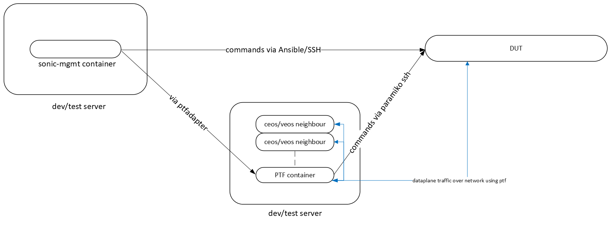

# ASIC DB / SAI validation for test cases

## Purpose

The purpose of this document is to state the requirement for SAI validation, describe the design of a simple, intuitive, easy-to-use set of libraries which allow tests to verify SAI object types have been setup correctly.

## High Level Design Document

| Rev      | Date        | Author                   | Change Description            |
|----------|-------------|--------------------------|-------------------------------|
| Draft    | 14-08-2024  | Sai Kiran Gummaraj       | Initial version               |

## Introduction

SONiC management tests are Pytest modules running in the SONiC management container on the developer/CI/test environment and PTF tests running from the PTF container on the testbed server. As part of the setup and tear down activities the tests make configuration changes to SONiC, run the tests and verify if the tests ran successfully by making additional configuration checks and finally tear down the configuration changes. The tests use command line utilities on the DUT like `config`, `sonic-db-cli` or `redis-cli` to set and get configuration values. In some cases tests export / dump the contents of the database to examine its results and verify if tests ran successfully. These configuration changes are propogated to the ASIC through ASIC_DB. The aim of this design document is to identify a mechanism for tests to validate the configuration changes against ASIC_DB entries or SAI object types.

*NOTE*: SONiC configuration is stored inside a Redis instance running inside the `database` container on the SONiC device. There are several database instances used for storing different kind of configuration elements such as configuration, states, counters, ASIC state etc. Each of these databases run as a Redis instance and are accessed via a Redis database ID. The IDs for the different available database are configured here [https://github.com/sonic-net/sonic-buildimage/blob/master/dockers/docker-database/database_config.json.j2](https://github.com/sonic-net/sonic-buildimage/blob/master/dockers/docker-database/database_config.json.j2).

## Design Choices

These are some of the major factors to consider while evaluating design choices for SAI validation:

1. The tests need to connect to the database on the DUT to access the configuration data.
2. After accessing the configuration data the tests may have to poll the data set for changes (set / modified / deleted keys etc.)
3. All the data from the database or keyspace may have to be exported.

### Current Design / Approach

Currently the tests connect to the database by using Ansible (SSH) to run commands directly on the DUT or run tests from the PTF host via ptf_runner which again uses Ansible (SSH) to run `sonic-db-cli` or `redis-cli`.



| **Advantages**

- Easy to implement.
- Uses existing ansible infrastructure and [SonicDbCli](../../tests/common/helpers/sonic_db.py) to run commands and fetch output.

**Drawbacks**

- Each access to database runs a SSH shell command.
- Output from CLI must be parsed.
- Not intuitive to implement features that require waiting on key/value changes.
- Slower performance when used for polling keyspace changes

### Enhance current library

Enhance the currently available library [SonicDbCli](../../tests/common/helpers/sonic_db.py) to query / set DB values. Add features to poll for values etc. by writing scripts around `sonic-db-cli`.

### Use Redis-py library (Copy to DUT)

Use [redis-py](https://redis.io/docs/latest/develop/connect/clients/python/redis-py/) to develop client library to access the database. Write a wrapper around the library to access different key-values and copy that to the DUT. The tests invoke the library wrapper.

**Advantages**

- Lightweight library can access all features of Redis DB easy to implement polling natively in Python using threading.

**Drawbacks**

- The library needs to be copied to the DUT and executed on the DUT.
- Performance may be similar to CLI as each test runs the library wrapper
- Standard output parsing may be required.
- Could lead to cumbersome error handling in the tests/caller by observing `rc` codes, `stdout` and `stderr`.

### Use Redis-Py library (Connect remotely)

Build the library using Redis-py and enable accessing the Redis server on the DUT over the network. There are two possible approaches to this -

1. **Reconfigure Redis**: Change the `/etc/redis/redis.conf` and `/etc/supervisord/conf.d/supervisord.conf` to listen on `0.0.0.0:6379` instead of `127.0.0.1:6379` on the testbed. Then run `sudo supervisorctl reread`, `sudo supervisorctl update` and `sudo supervisorctl restart all`.
2. **Setup Port-forwarding on DUT**: Install and run `socat` on DUT to port-forward all traffic from `<mgmt_ip>:<port-of-your-choice>` to `localhost:6379` to Redis on the database container.

The first approach to **Reconfigure Redis** does not work as expected. It causes CPU usage to spike and commands like `show` or `config` begin to hang and journal logs are flooded with swsscommon errors indicating it is unable to connect to Redis. The second approach of installing `socat` is easy to setup and does not require the tests to change SONiC environment.

Considering tests need to poll / observe for key value changes in ASIC_DB this can be implemented using -

- **Using threading and polling** as implemented in [SWSS VS Tests](https://github.com/sonic-net/sonic-swss/blob/master/tests/README.md), [conftest](https://github.com/sonic-net/sonic-swss/blob/master/tests/conftest.py), [dvslib/dvs_database](https://github.com/sonic-net/sonic-swss/blob/master/tests/dvslib/dvs_database.py)

- **Using Redis pubsub** This approach takes advantage of Redis pubsub to get notification of keyspace changes instead of using threading or polling to watch for key value changes. This mechanism improves performance and predictability of watching for keyspace changes. The tests don't have to rely on threads or sleep timers to check for value changes. The keyspace notifications are enabled by default for `ASIC_DB`. Keyspace notifications are enabled by default (`AKE`) for ASIC_DB. Based on checks in `202305` and `202205`. Sample code that was tested on a DUT to notify for a specific key change can be used in tests -

```
import redis

rconn = None

def main():
    rconn = redis.Redis(host='127.0.0.1', port=6379, decode_responses=True, db=1)

    # rconn.config_set('notify-keyspace-events', 'KEA')
    pubsub = rconn.pubsub()
    pubsub.psubscribe('__keyspace@1__:ASIC_STATE:SAI_OBJECT_TYPE_SWITCH:*')

    print('listening for notifications...')
    for message in pubsub.listen():
        if message['type'] == 'pmessage':
            print(f"Key: {message['channel']} - Event: {message['data']}")

if __name__ == '__main__':
    main()
```

**Advantages**

- Lightweight library can access all features of Redis DB
- Better performance as each call to database to get/set database does not require running a shell command.
- Better error handling.

**Drawbacks**

- Requires opening port in firewalls (if closed in the test environment)

## Test and SAI object types

The table below lists each test feature along with notes on whether the test makes configuration changes that set/change ASIC_DB object types. The column "ASIC/SAI Validation" is set to 'Yes' if there are configuration changes that impact SAI objects.

|     Test Case Information                            | ASIC/SAI Validation |     Notes                                                                  |
|------------------------------------------------------|---------------------|----------------------------------------------------------------------------|
| tests/acl                                            | Yes                 | tests delete `CONFIG_DB` `ACL_TABLE_TYPE  CUSTOM_TYPE` and set `ACL_RULE STRESS_ACL RULE_{}`; Changes to SAI objects `SAI_OBJECT_TYPE_ACL_TABLE, SAI_OBJECT_TYPE_ACL_TABLE_GROUP, SAI_OBJECT_TYPE_ACL_TABLE_GROUP_MEMBER` |
| tests/arp                                            | Yes                 | tests set and delete `CONFIG_DB` types `VLAN_INTERFACE`. ARP impact neighbor entries. Checked in `ASIC_DB` neighbor tables `SAI_OBJECT_TYPE_NEIGHBOR_ENTRY` |
| tests/autorestart                                    | No                  | Tests if critical processes (like orchagent etc.) are restarted after killing them. |
| tests/bfd                                            | Yes                 | Tests modifies `CONFIG_DB STATIC_ROUTE` and `STATE_DB BFD_SESSION_TABLE` check `SAI_OBJECT_TYPE_BFD_SESSIONS`|
| tests/bgp                                            | Yes                 | Tests modifies `CONFIG_DB BGP_ALLOWED_PREFIXES`, `BGP_NEIGHBOR`, `BGP_MONITORS` and in `STATE_DB` the `NEIGH_STATE_TABLE` |
| tests/cacl                                           | No                  | Control plane ACL functionality set up iptables to control mgmt traffic (check acl-loader) |
| tests/clock                                          | No                  | Tests 'show clock' command, 'config clock timezone', 'config clock date' |
| tests/configlet                                      | No                  | configlet a generic command to apply configuration patches to `CONFIG_DB`. The tests require exporting database content. |
| tests/console                                        | No                  | Test if console features are working in SONiC; Skipped unless console feature is enabled on device |
| tests/container_checker                              | No                  | Uses [monit](https://salsa.debian.org/sk-guest/monit), patched [here](https://github.com/sonic-net/sonic-buildimage/tree/master/src/monit) to run [container_checker](https://github.com/sonic-net/sonic-buildimage/blob/master/files/image_config/monit/container_checker) |
| tests/container_hardening                            | No                  | Test non-privileged containers must NOT have access to /dev/vda* or /dev/sda* |
| tests/copp                                           | Yes                 | **Co**ntrol *P*lane *P*olicing - feature to enable rate limiting to access control plane. The [design document](https://github.com/sonic-net/SONiC/blob/master/doc/copp/CoPP%20Config%20and%20Management.md) refers to updates to SAI_HOSTIF_TRAP_TYPE_IP2ME and reads from SAI_HOSTIF_TRAP_TYPE_SAMPLEPACKET. Should these be checked?|
| tests/crm                                            | Yes                 | Critical Resource Monitoring lets users monitor critical ASIC functionality by polling SAI attributes; The table [CRM Sai Attributes](https://github.com/sonic-net/SONiC/blob/master/doc/crm/Critical-Resource-Monitoring-High-Level-Design.md#26-sai) shows all the SAI attributes which should be used to get required CRM counters. Tests modify `CONFIG_DB CRM|Config`, query `COUNTERS_DB CRM:STATS` and `ASIC_DB` ACL entries|
| tests/dash                                           | Yes                 | Disaggregated APIs for SONiC Hosts ([DASH](https://github.com/sonic-net/DASH/blob/main/documentation/general/dash-high-level-design.md)). Tests export `ASIC_DB` and checks for object types `SAI_OBJECT_TYPE_VNET`, `SAI_OBJECT_TYPE_ENI`. `test_dash_disable_enable_eni` checks for `SAI_ENI_ATTR_ADMIN_STATE` and `*ENI` keys|
| tests/database                                       | No                  | Tests Redis database configurations |
| tests/decap                                          | Yes                 | [DB Schema in decap](https://github.com/sonic-net/SONiC/blob/master/doc/decap/subnet_decap_HLD.md#62-db-schema) In `CONFIG_DB` it stores subnet based decap config in `SUBNET_DECAP` config_name. In `APPL_DB` it stores list of decap tunnels in `TUNNEL_DECAP_TABLE` and stores decap terms in `TUNNEL_DECAP_TERM_TABLE`. Same like `APP_DB` these values are stored in `STATE_DB`. `ASIC_DB` has `SAI_OBJECT_TYPE_TUNNEL_*` holds tunnel information |
| tests/dhcp_relay                                     | No                  | Queries `DHCP_COUNTER_TABLE` and `DHCPV6_COUNTER_TABLE` from `STATE_DB` |
| tests/dhcp_server                                    | No                  | `CONFIG_DB` has keys `DHCP_SERVER_IPV4_CUSTOMIZED_OPTIONS`,`DHCP_SERVER_IPV4_RANGE`, `DHCP_SERVER_IPV4_PORT`, `DHCP_SERVER_IPV4`.|
| tests/disk                                           | No                  | Test simulates disk full and test connectivity |
| tests/dns                                            | No                  | Checks nameserver configuration in the containers |
| tests/drop_packets                                   | Yes                 | `test_drop_counters.py` fetches from `CONFIG_DB FLEX_COUNTER_TABLE`. [Flex Counters](https://github.com/sonic-net/SONiC/blob/master/doc/flex_counter/flex_counter_refactor.md) provides a way to query different types of statistic/attributes which uses SAI API to query counter values. Based on my understanding there are no ASIC_DB counters for this. While in `test_configurable_drop_counters.py` installs drop counters and those has reasons added to SAI_OBJECT_TYPE_DEBUG_COUNTER. |
| tests/dualtor                                        | Yes(?)              | Applicable for specific cases; `crm` (see tests/decap for ipinip, tests/crm above).|
| tests/dualtor_io                                     | No                  | Tests to verify connectivity and different failover scenarios (links, bgp etc.) |
| tests/dualtor_mgmt                                   | No(?)               | Tests mux cable states for various scenarios like server down and checks for if mux toggle is working. For test_ingress_drop & test_egress_drop_nvidia the orchagent installs ingress drop ACL. Can this be verified in ASIC_DB?|
| tests/dut_console                                    | No                  | Tests switch console settings work as expected. |
| tests/ecmp                                           | Yes                 | `test_fgnhg` (Fine Grain Next Hop Group) tests `generate_fgnhg_config` uses the generated fgnhg config and writes it to the database. `CONFIG_DB` has `FG_NHG, FG_NHG_PREFIX, FG_NHG_MEMBER` tables. `STATE_DB` has `FG_ROUTE_TABLE`. The routeorch pushes routes down to the ASIC. It creates ECMP groups in the ASIC where there are multiple nexthops. It also adds / removes next-hop members. The fgnhgorch receives the `FG_NHG` entries and identifies the exact way in which the hash buckets need to be created. It creates ECMP groups with [new SAI components](https://github.com/sonic-net/SONiC/blob/master/doc/ecmp/fine_grained_next_hop_hld.md#25-sai). `APP_DB SWITCH_TABLE` flag `order_ecmp_group` for enabling/disabling ECMP. SAI attribute `SAI_NEXT_HOP_GROUP_TYPE_DYNAMIC_ORDERED_ECMP` is set. Verify entries in the next hop tables in ASIC_DB. For `inner_hashing` tests check how `config pbh` commands impact ASIC DB config.|
| tests/everflow                                       | Yes                 | Everflow sets up a table EVERFLOW (a special ACL table) to match and mirror traffic. Check tests/acl. |
| tests/fdb                                            | Yes                 | Tests send ARP packets with dummy MACs to populate FDB and verify entries. Verify `ASIC_STATE:SAI_OBJECT_TYPE_BRIDGE_PORT` learning mode `SAI_BRIDGE_PORT_ATTR_FDB_LEARNING_MODE, SAI_BRIDGE_PORT_FDB_LEARNING_MODE_HW`. Other SAI object types `SAI_OBJECT_TYPE_FDB_ENTRY SAI_OBJECT_TYPE_FDB_FLUSH SAI_OBJECT_TYPE_MCAST_FDB_ENTRY`.|
| tests/fib                                            | No                  | Test routes advertised by BGP peers are working properly.|
| tests/
