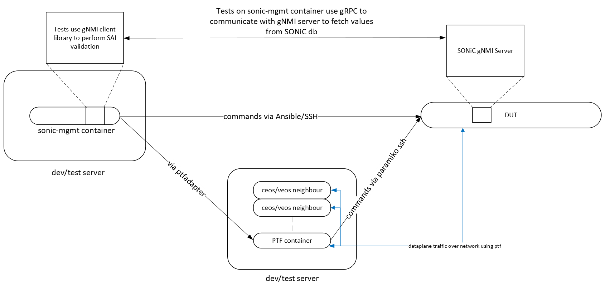

# ASIC DB / SAI validation for test cases

## Purpose

The purpose of this document is to state the requirement for SAI validation for test cases, describe the design of a simple, intuitive, easy-to-use set of libraries which allow tests to verify SAI object types have been setup correctly.

## High Level Design Document

| Rev      | Date        | Author                   | Change Description                  |
|----------|-------------|--------------------------|-------------------------------------|
| Draft    | 14-08-2024  | Sai Kiran Gummaraj       | Initial version based on Redis-py   |
| 0.1      | 15-03-2025  | Sai Kiran Gummaraj       | Updated to use gNMI instead of Redis|

## Introduction

SONiC tests in the [sonic-mgmt](https://github.com/sonic-net/sonic-mgmt) repositry are Pytest modules running in the sonic-mgmt container on the developer/CI/test environment and PTF tests running from the PTF container on the testbed server. As part of the setup and tear down activities the tests make configuration changes to SONiC, run the tests and verify if the tests ran successfully by making additional configuration checks and finally tear down the configuration changes. The tests use command line utilities on the DUT like `config`, `sonic-db-cli` or `redis-cli` to set and get configuration values. In some cases tests export / dump the contents of the database to examine its results and verify if tests ran successfully. These configuration changes are propogated to the ASIC through ASIC_DB. The aim of this design document is to identify a mechanism for tests to validate the configuration changes against ASIC_DB entries or SAI object types.

*NOTE*: SONiC configuration is stored inside a Redis instance running inside the `database` container on the SONiC device. There are several database instances used for storing different kind of configuration elements such as configuration, states, counters, ASIC state etc. Each of these databases run as a Redis instance.

## Design Choices

These are some of the major factors to consider while evaluating design choices for SAI validation:

1. The tests need to connect to the database on the DUT to access the configuration data.
2. After accessing the configuration data the tests may have to poll the data set for changes (set / modified / deleted keys etc.)
3. All the data from the database or keyspace may have to be exported.

### Current Design

Currently the tests connect to the database by using Ansible (SSH) to run commands directly on the DUT or run tests from the PTF host via ptf_runner which again uses Ansible (SSH) to run `sonic-db-cli` or `redis-cli`.


| **Advantages**

- Easy to implement.
- Uses existing ansible infrastructure and [SonicDbCli](../../tests/common/helpers/sonic_db.py) to run commands and fetch output.

**Drawbacks**

- Each access to database runs a SSH shell command.
- Output from CLI must be parsed.
- Not intuitive to implement features that require waiting on key/value changes.
- Slower performance

### Approaches to redesign

The following sections illustrates and evaluates different design strategies for implementing SAI validation. The approaches include:

- Enhance current library
- Use Redis-py library (Copy to DUT)
- Use Redis-py library (Connect remotely)
- Use SONiC gNMI Server

### Enhance current library

Enhance the currently available library [SonicDbCli](../../tests/common/helpers/sonic_db.py) to query / set DB values. Add features to poll for values etc. by writing scripts around `sonic-db-cli`.

### Use Redis-py library (Copy to DUT)

Use [redis-py](https://redis.io/docs/latest/develop/connect/clients/python/redis-py/) to develop client library to access the database. Write a wrapper around the library to access different key-values and copy that to the DUT. The tests invoke the library wrapper.

**Advantages**

- Lightweight library can access all features of Redis DB easy to implement polling natively in Python using threading.

**Drawbacks**

- The library needs to be copied to the DUT and executed on the DUT.
- Performance may be similar to CLI as each test runs the library wrapper
- Standard output parsing may be required.
- Could lead to cumbersome error handling in the tests/caller by observing `rc` codes, `stdout` and `stderr`.

### Use Redis-Py library (Connect remotely)

Build the library using Redis-py and enable accessing the Redis server on the DUT over the network. There are two possible approaches to this -

1. **Reconfigure Redis**: Change the `/etc/redis/redis.conf` and `/etc/supervisord/conf.d/supervisord.conf` to listen on `0.0.0.0:6379` instead of `127.0.0.1:6379` on the testbed. Then run `sudo supervisorctl reread`, `sudo supervisorctl update` and `sudo supervisorctl restart all`.
2. **Setup Port-forwarding on DUT**: Install and run `socat` on DUT to port-forward all traffic from `<mgmt_ip>:<port-of-your-choice>` to `localhost:6379` to Redis on the database container.

The first approach to **Reconfigure Redis** does not work as expected. It causes CPU usage to spike and commands like `show` or `config` begin to hang and journal logs are flooded with swsscommon errors indicating it is unable to connect to Redis. The second approach of installing `socat` is easy to setup and does not require the tests to change SONiC environment.

Considering tests need to poll / observe for key value changes in ASIC_DB this can be implemented using -

- **Using threading and polling** as implemented in [SWSS VS Tests](https://github.com/sonic-net/sonic-swss/blob/master/tests/README.md), [conftest](https://github.com/sonic-net/sonic-swss/blob/master/tests/conftest.py), [dvslib/dvs_database](https://github.com/sonic-net/sonic-swss/blob/master/tests/dvslib/dvs_database.py)

- **Using Redis pubsub** This approach takes advantage of Redis pubsub to get notification of keyspace changes instead of using threading or polling to watch for key value changes. This mechanism improves performance and predictability of watching for keyspace changes. The tests don't have to rely on threads or sleep timers to check for value changes. The keyspace notifications are enabled by default for `ASIC_DB`. Keyspace notifications are enabled by default (`AKE`) in SONiC Redis instance. `AKE` translate to "all the events except 'm' and 'n'". More information on the different settings is available here https://redis.io/docs/latest/develop/use/keyspace-notifications/#configuration. There are two kinds of message types received in pubsub `psubscribe` and `pmessage`.

The `psubscribe` message is received once when the subscription is setup via `psubscribe` call.

```
psubscribe message format
{
 'type': 'psubscribe',
 'pattern': None,
 'channel': '__keyspace@1__:ASIC_STATE:SAI_OBJECT_TYPE_SWITCH:*',
 'data': 1
}
```

The `pmessage` messages are received one for every change on the pattern. -

```
pmessage format
{
 'type': 'pmessage',
 'pattern': '__keyspace@1__:ASIC_STATE:SAI_OBJECT_TYPE_SWITCH:*',
 'channel': '__keyspace@1__:ASIC_STATE:SAI_OBJECT_TYPE_SWITCH:oid:0x21000000000000',
 'data': 'hset'
}
```

```
import redis

rconn = None

def main():
    rconn = redis.Redis(host='127.0.0.1', port=6379, decode_responses=True, db=1)

    # rconn.config_set('notify-keyspace-events', 'KEA')
    pubsub = rconn.pubsub()
    pubsub.psubscribe('__keyspace@1__:ASIC_STATE:SAI_OBJECT_TYPE_SWITCH:*')

    print('listening for notifications...')
    for message in pubsub.listen():
        if message['type'] == 'pmessage':
            print(f"Key: {message['channel']} - Event: {message['data']}")

if __name__ == '__main__':
    main()
```


**Advantages**

- Lightweight library can access all features of Redis DB
- Better performance as each call to database to get/set database does not require running a shell command.
- Better error handling.

**Drawbacks**

- Requires opening port in firewalls (if closed in the test environment)

## Use SONiC gNMI Server

This approach outlines the design of the pytest fixtures (`setup_gnmi_server`, `setup_connection`, and `gnmi_connection`) used by sonic-mgmt test cases to establish a gNMI connection for interacting with the SONiC database. The primary purpose of these fixtures is to provide a managed gNMI client for validating the ASIC database state. This design handles conditional setup based on pytest command-line options for disabling SAI validation and enabling insecure gNMI connections.



### Current features

* Provide pytest fixtures for easy and consistent gNMI connection setup across test sessions.
* Support both secure (TLS) and insecure gNMI connections based on the `--gnmi_insecure` option.
* Manage the creation and cleanup of gNMI certificates for secure connections.
* Provide a session-scoped gNMI connection fixture (`gnmi_connection`) for use in test cases.
* Ensure proper closing of the gNMI channel after the test session.
* Disable SAI validation based on the `--disable_sai_validation` pytest option

### Setup Instructions

The gNMI connection setup is managed through three pytest fixtures:

* **`setup_gnmi_server` (Session-scoped):**
    * Determines whether SAI validation is disabled based on the `--disable_sai_validation` pytest option. If disabled, it yields the `duthost` object and `None` for the certificate path.
    * Checks the `--gnmi_insecure` option. If enabled, it logs this and yields `duthost` and `None`.
    * If neither option is set, it proceeds with secure gNMI setup:
        * Defines a temporary certificate path (`/tmp/gnmi_certificates`).
        * Calls `gnmi_setup.create_certificates` to generate necessary certificates.
        * Calls `gnmi_setup.copy_certificates_to_dut` to transfer the certificates to the Device Under Test (DUT).
        * Calls `gnmi_setup.apply_certs` on the DUT.
        * Yields the `duthost` object and the `cert_path`.
        * After the test session, it calls `gnmi_setup.remove_certs` to clean up the certificates on the DUT.
    * This fixture primarily manages the certificate setup on the DUT based on the test configuration.

* **`setup_connection` (Session-scoped):**
    * Receives the output of `setup_gnmi_server` (`duthost`, `cert_path`).
    * Checks the `--disable_sai_validation` option. If enabled, it yields `None`.
    * Checks the `--gnmi_insecure` option.
    * If `--gnmi_insecure` is set, it calls `create_gnmi_stub` (from `gnmi_client`) with `secure=False` to establish an insecure gNMI connection to the DUT's management IP and the port specified by the `--gnmi_port` option. It yields the `gnmi_connection` object.
    * If `--gnmi_insecure` is not set (implying secure connection), it constructs the paths to the root certificate, client certificate, and client key using the `cert_path` obtained from `setup_gnmi_server`. It then calls `create_gnmi_stub` with `secure=True` and the certificate paths to establish a secure gNMI connection. It yields the `gnmi_connection` object.
    * After the test session, it closes the gRPC channel associated with the `gnmi_connection`.
    * This fixture is responsible for creating the actual gNMI client stub based on the configuration and certificate information.

* **`gnmi_connection` (Session-scoped):**
    * Simply receives the `gnmi_connection` object yielded by `setup_connection`.
    * Yields this `gnmi_connection` object, making it available for injection into test functions.
    * This fixture acts as a direct provider of the established gNMI connection to the tests.

The typical flow in a test case would be:

1.  Declare `gnmi_connection` as an argument in the test function. pytest will automatically inject the session-scoped gNMI client provided by this fixture.
2.  The test case then uses the functions defined in the previously described API (e.g., `start_db_monitor`, `wait_for_n_keys`, `get_key`) with the injected `gnmi_connection` to interact with the SONiC database.

### Error Handling

* The fixtures rely on the error handling within the imported `gnmi_setup` and `gnmi_client` modules.
* The fixtures log information about whether SAI validation is disabled or if insecure gNMI mode is enabled.
* If certificate creation, copying, or application fails within `setup_gnmi_server`, exceptions raised by the `gnmi_setup` functions will propagate, likely causing the test session to fail.
* If the gNMI connection fails to be established in `setup_connection` (e.g., due to incorrect IP or port), the `create_gnmi_stub` function is expected to raise an exception, which will also lead to test failure.
* Test cases should handle the possibility of `gnmi_connection` being `None` (when SAI validation is disabled) to avoid errors.

### Integration into Test cases

Integration with Test Cases

Test cases integrate with these fixtures by simply including `gnmi_connection` as an argument:

```python
def test_something(gnmi_connection):
    if gnmi_connection is None:
        pytest.skip("SAI validation is disabled")

    executor = ThreadPoolExecutor(max_workers=2)
    event_queue = queue.Queue()
    monitor_context = start_db_monitor(executor, gnmi_connection, "SOME_DB_PATH", event_queue)
    # ... rest of the test logic using monitor_context and gnmi_connection ...
    stop_db_monitor(monitor_context)
    executor.shutdown(wait=False)

### Advantages and Drawbacks

Advantages
- There is no need to expose the Redis server port
- gNMI provides methods equivalent to Redis for getting, setting and subscribing to sonic db changes
- Data other than sonic db can be accessed via gNMI

Disadvantages
- Have to rely on gNMI Paths for subscription which may not provide the required granularity like Redis
- SONiC gNMI server does not support required levels of subscription for some cases. For instance `ASIC_DB/localhost/ASIC_STATE/SAI_OBJECT_TYPE_ACL_ENTRY:*` cannot be subscribed. Instead `ASIC_DB/localhost/ASIC_STATE` must be subscribed and have to filter events

### Known Issues

- For certain cases SONiC gNMI server does not send all expected events.

## Test and SAI object types

The table below lists each test feature along with notes on whether the test makes configuration changes that set/change ASIC_DB object types. The column "ASIC/SAI Validation" is set to 'Yes' if there are configuration changes that impact SAI objects.

|     Test Case Information                            | ASIC/SAI Validation |     Notes                                                                  |
|------------------------------------------------------|---------------------|----------------------------------------------------------------------------|
| tests/acl                                            | Yes                 | tests delete `CONFIG_DB` `ACL_TABLE_TYPE  CUSTOM_TYPE` and set `ACL_RULE STRESS_ACL RULE_{}`; Changes to SAI objects `SAI_OBJECT_TYPE_ACL_TABLE, SAI_OBJECT_TYPE_ACL_TABLE_GROUP, SAI_OBJECT_TYPE_ACL_TABLE_GROUP_MEMBER` |
| tests/arp                                            | Yes                 | tests set and delete `CONFIG_DB` types `VLAN_INTERFACE`. ARP impact neighbor entries. Checked in `ASIC_DB` neighbor tables `SAI_OBJECT_TYPE_NEIGHBOR_ENTRY` |
| tests/autorestart                                    | No                  | Tests if critical processes (like orchagent etc.) are restarted after killing them. |
| tests/bfd                                            | Yes                 | Tests modifies `CONFIG_DB STATIC_ROUTE` and `STATE_DB BFD_SESSION_TABLE` check `SAI_OBJECT_TYPE_BFD_SESSIONS`|
| tests/bgp                                            | Yes                 | Tests modifies `CONFIG_DB BGP_ALLOWED_PREFIXES`, `BGP_NEIGHBOR`, `BGP_MONITORS` and in `STATE_DB` the `NEIGH_STATE_TABLE` |
| tests/cacl                                           | No                  | Control plane ACL functionality set up iptables to control mgmt traffic (check acl-loader) |
| tests/clock                                          | No                  | Tests 'show clock' command, 'config clock timezone', 'config clock date' |
| tests/configlet                                      | No                  | configlet a generic command to apply configuration patches to `CONFIG_DB`. The tests require exporting database content. |
| tests/console                                        | No                  | Test if console features are working in SONiC; Skipped unless console feature is enabled on device |
| tests/container_checker                              | No                  | Uses [monit](https://salsa.debian.org/sk-guest/monit), patched [here](https://github.com/sonic-net/sonic-buildimage/tree/master/src/monit) to run [container_checker](https://github.com/sonic-net/sonic-buildimage/blob/master/files/image_config/monit/container_checker) |
| tests/container_hardening                            | No                  | Test non-privileged containers must NOT have access to /dev/vda* or /dev/sda* |
| tests/copp                                           | Yes                 | **Co**ntrol *P*lane *P*olicing - feature to enable rate limiting to access control plane. The [design document](https://github.com/sonic-net/SONiC/blob/master/doc/copp/CoPP%20Config%20and%20Management.md) refers to updates to SAI_HOSTIF_TRAP_TYPE_IP2ME and reads from SAI_HOSTIF_TRAP_TYPE_SAMPLEPACKET. Should these be checked?|
| tests/crm                                            | Yes                 | Critical Resource Monitoring lets users monitor critical ASIC functionality by polling SAI attributes; The table [CRM Sai Attributes](https://github.com/sonic-net/SONiC/blob/master/doc/crm/Critical-Resource-Monitoring-High-Level-Design.md#26-sai) shows all the SAI attributes which should be used to get required CRM counters. Tests modify `CONFIG_DB CRM|Config`, query `COUNTERS_DB CRM:STATS` and `ASIC_DB` ACL entries|
| tests/dash                                           | Yes                 | Disaggregated APIs for SONiC Hosts ([DASH](https://github.com/sonic-net/DASH/blob/main/documentation/general/dash-high-level-design.md)). Tests export `ASIC_DB` and checks for object types `SAI_OBJECT_TYPE_VNET`, `SAI_OBJECT_TYPE_ENI`. `test_dash_disable_enable_eni` checks for `SAI_ENI_ATTR_ADMIN_STATE` and `*ENI` keys|
| tests/database                                       | No                  | Tests Redis database configurations |
| tests/decap                                          | Yes                 | [DB Schema in decap](https://github.com/sonic-net/SONiC/blob/master/doc/decap/subnet_decap_HLD.md#62-db-schema) In `CONFIG_DB` it stores subnet based decap config in `SUBNET_DECAP` config_name. In `APPL_DB` it stores list of decap tunnels in `TUNNEL_DECAP_TABLE` and stores decap terms in `TUNNEL_DECAP_TERM_TABLE`. Same like `APP_DB` these values are stored in `STATE_DB`. `ASIC_DB` has `SAI_OBJECT_TYPE_TUNNEL_*` holds tunnel information |
| tests/dhcp_relay                                     | No                  | Queries `DHCP_COUNTER_TABLE` and `DHCPV6_COUNTER_TABLE` from `STATE_DB` |
| tests/dhcp_server                                    | No                  | `CONFIG_DB` has keys `DHCP_SERVER_IPV4_CUSTOMIZED_OPTIONS`,`DHCP_SERVER_IPV4_RANGE`, `DHCP_SERVER_IPV4_PORT`, `DHCP_SERVER_IPV4`.|
| tests/disk                                           | No                  | Test simulates disk full and test connectivity |
| tests/dns                                            | No                  | Checks nameserver configuration in the containers |
| tests/drop_packets                                   | Yes                 | `test_drop_counters.py` fetches from `CONFIG_DB FLEX_COUNTER_TABLE`. [Flex Counters](https://github.com/sonic-net/SONiC/blob/master/doc/flex_counter/flex_counter_refactor.md) provides a way to query different types of statistic/attributes which uses SAI API to query counter values. Based on my understanding there are no ASIC_DB counters for this. While in `test_configurable_drop_counters.py` installs drop counters and those has reasons added to SAI_OBJECT_TYPE_DEBUG_COUNTER. |
| tests/dualtor                                        | Yes(?)              | Applicable for specific cases; `crm` (see tests/decap for ipinip, tests/crm above).|
| tests/dualtor_io                                     | No                  | Tests to verify connectivity and different failover scenarios (links, bgp etc.) |
| tests/dualtor_mgmt                                   | No(?)               | Tests mux cable states for various scenarios like server down and checks for if mux toggle is working. For test_ingress_drop & test_egress_drop_nvidia the orchagent installs ingress drop ACL. Can this be verified in ASIC_DB?|
| tests/dut_console                                    | No                  | Tests switch console settings work as expected. |
| tests/ecmp                                           | Yes                 | `test_fgnhg` (Fine Grain Next Hop Group) tests `generate_fgnhg_config` uses the generated fgnhg config and writes it to the database. `CONFIG_DB` has `FG_NHG, FG_NHG_PREFIX, FG_NHG_MEMBER` tables. `STATE_DB` has `FG_ROUTE_TABLE`. The routeorch pushes routes down to the ASIC. It creates ECMP groups in the ASIC where there are multiple nexthops. It also adds / removes next-hop members. The fgnhgorch receives the `FG_NHG` entries and identifies the exact way in which the hash buckets need to be created. It creates ECMP groups with [new SAI components](https://github.com/sonic-net/SONiC/blob/master/doc/ecmp/fine_grained_next_hop_hld.md#25-sai). `APP_DB SWITCH_TABLE` flag `order_ecmp_group` for enabling/disabling ECMP. SAI attribute `SAI_NEXT_HOP_GROUP_TYPE_DYNAMIC_ORDERED_ECMP` is set. Verify entries in the next hop tables in ASIC_DB. For `inner_hashing` tests check how `config pbh` commands impact ASIC DB config.|
| tests/everflow                                       | Yes                 | Everflow sets up a table EVERFLOW (a special ACL table) to match and mirror traffic. Check tests/acl. |
| tests/fdb                                            | Yes                 | Tests send ARP packets with dummy MACs to populate FDB and verify entries. Verify `ASIC_STATE:SAI_OBJECT_TYPE_BRIDGE_PORT` learning mode `SAI_BRIDGE_PORT_ATTR_FDB_LEARNING_MODE, SAI_BRIDGE_PORT_FDB_LEARNING_MODE_HW`. Other SAI object types `SAI_OBJECT_TYPE_FDB_ENTRY SAI_OBJECT_TYPE_FDB_FLUSH SAI_OBJECT_TYPE_MCAST_FDB_ENTRY`.|
| tests/fib                                            | No                  | Test routes advertised by BGP peers are working properly.|
| tests/
