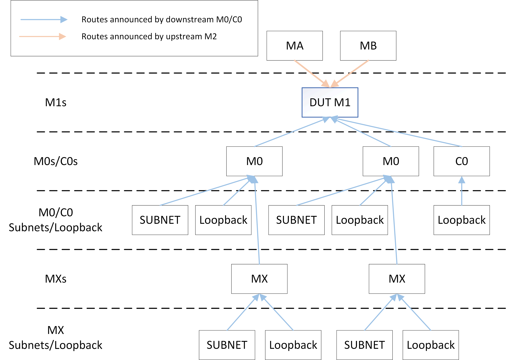
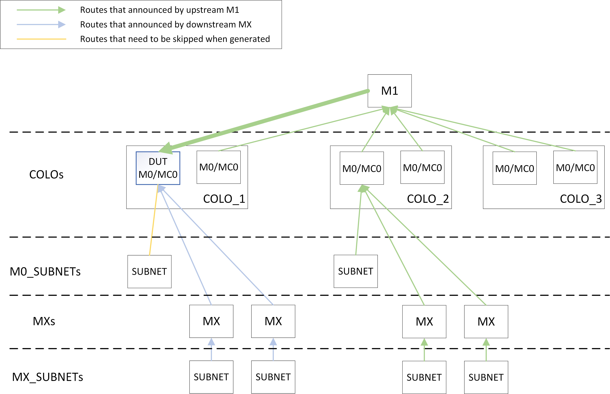
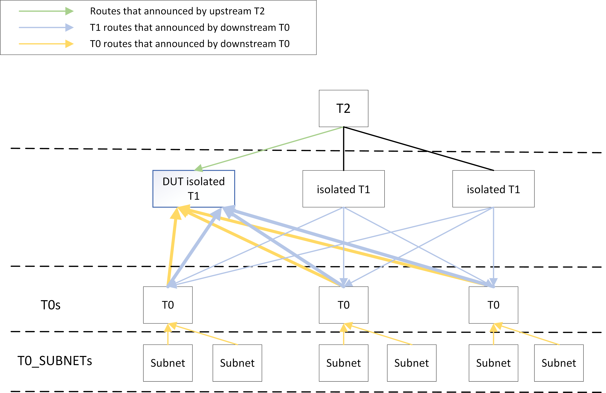

# Announce routes

Announce routes to the exabgp processes running in the PTF container.

## Overview

This method is automatically run in add-topo period or manually run from localhost. (Related api doc: [announce_routes.md](../api_wiki/ansible_methods/announce_routes.md)).
In this method, we generate routes for different topos by configuration defined in `ansible/vars/topo_*.yml` files.

Get the configuration of all neighbor VMs, and use different rules to generate routes according to the router type of the neighbor. Then send post requests to the exabgp processes running in the PTF container to announce routes to DUT.

It should be noted that, in general, the IPv6 prefix length should be less than 64.

|topo type|upstream router type|downstream router type|
|:----:|:----:|:----:|
|t0|leaf|N/A|
|t1|spine|tor|
|t2|core|leaf|
|t0-mclag|leaf|N/A|
|m1|ma, mb|m0, c0|
|m0|m1|mx|
|mc0|m1|mx|
|mx|m0|N/A|

## M1

### Design

The M1 DUT has two types of upstream VMs: MA and MB. The purpose to have 2 types of upstream is to test how M1 BGP policy impacts the route selection. For example, we can let M1 only pick MAs as default route path by updating BGP policy on DUT.

For M1 topology, there are 4 sets of routes to be advertised:

1. Routes advertised by upstream VMs which simulates MA devices.
2. Routes advertised by upstream VMs which simulates MB devices.
3. Routes advertised by downstream VMs which simulates M0 devices.
4. Routes advertised by downstream VMs which simulates C0 devices.

The picture below shows how the routes is announces to DUT. The orange arrows indicate routes announced by upstream MAs and MBs. The blue arrows indicates routes announced by downstream M0s and C0s.

### Details

The total number of routes is controlled by below parameters:
|definition|description|
|:----|:----|
|m0_subnet_number|number of subnets on each M0|
|mx_number|number of Mx devices connected to each M0|
|mx_subnet_number|number of subnets on each MX|

**Routes advertised by each MA:**

- Default route, prefix: 0.0.0.0/0
- Loopback IP of MA, count: `1`

**Routes advertised by each MB:**

- Default route, prefix: 0.0.0.0/0
- Loopback IP of MB, count: `1`

**Routes advertised by each M0:**

- Loopback IP of M0, count: `1`
- Subnet routes of M0, count: `m0_subnet_number`
- Loopback IP of Mx, count: `mx_number`
- Subnet routes of Mx, count: `mx_number * mx_subnet_number`

**Routes advertised by each C0:**

- Loopback IP of C0, count: `1`

## M0/MC0

### Design

For M0/MC0, we have 2 sets of routes that we are going to advertise:
- 1st set routes are advertised by the upstream VMs (M1 devices).
- 2nd set routes are advertised by the downstream VMs (MX devices).

The picture below shows how the routes is announces to DUT. The green arrows indicate routes that announced by upstream M1. The blue arrows indicate routes that announced by downstream MX. The yellow line indicates subnets that directly connected to DUT, which need to be skipped when generating routes.

### Details

Some definitions:
|definition|description|
|:----|:----|
|colo|cluster of M0 devices|
|colo_number|number of COLOs|
|m0_number|number of subnet in a M0|
|m0_subnet_number|number of members in a M0 subnet|
|mx_number|number of MXs connected to a M0|
|mx_subnet_number|number of members in a MX subnet|

The total number of routes are controlled by the colo_number, m0_number, mx_subnet_number, m0_subnet_number and number of MX devices from the topology file.
We would have the following distribution:
- Routes announced by per M1 device, total number: 1 + 1 + (colo_number * m0_number - 1) * (m0_subnet_number + mx_number * mx_subnet_number)
   - 1 default route, prefix: 0.0.0.0/0.
   - 1 loopback route.
   - Subnet routes of M0 devices connected to M1 devices other than directly connected to DUT,
     count: (colo_number * m0_number - 1) * m0_subnet_number.
   - Subnet routes of MX devices connected to M0 devices connected M1 devices,
     count: (colo_number * m0_number - 1) * mx_number * mx_subnet_number.
- Routes announced by per MX routes, total number: 1 + mx_subnet_number
   - 1 loopback route.
   - Subunet routes of MX, count: mx_subnet_number.

## MX

### Design

For MX, we have 1 set of routes that we are going to advertise:
- Routes are advertised by the upstream VMs (M0 devices).

The picture below shows how the routes is announces to DUT. The green arrow indicates direct subnet routes of M0 connected to DUT. The blue arrows indicate downstream routes of M0 connected to DUT. The origin arrows indicate upstream routes of M0 connected to DUT. The gray arrow indicates all routes that M0 announced to DUT. The yellow line indicates subnets that directly connected to DUT, which need to be skipped when generating routes.

### Details

Some definitions:
|definition|description|
|:----|:----|
|colo|cluster of M0 devices|
|colo_number|number of COLOs|
|m0_number|number of subnet in a M0|
|m0_subnet_number|number of members in a M0 subnet|
|mx_number|number of MXs connected to a M0|
|mx_subnet_number|number of subnets in a MX|

The total number of routes are controlled by the colo_number, m0_number, mx_subnet_number, m0_subnet_number and mx_number.
Routes announced by M0 can be broken down to 5 sets:
   - 1 default route, prefix: 0.0.0.0/0.
   - 1 loopback route.
   - Direct subnet routes of M0 connected to DUT,
     count: m0_subnet_number
   - Subnet routes of MX connected to M0 connected to DUT,
     count: (mx_number - 1) * mx_subnet_number.
   - Upstream routes of M0 connected to DUT,
     count: (colo_number * m0_number - 1) * (mx_number * mx_subnet_number + m0_subnet_number).

## isolated-T1

### Design

For isolated T1, we have 3 sets routes that we are going to advertise, below picture shows how routes are advertised:
- 1st set routes are advertise by upstream VMs (T2 devices) -- green lines
- 2st set routes are other T1s' routes adeertised by downstream VMs (T0 devices) -- blue lines
- 3st set routes are T0s' loopback and vlan routes advertised by downstream VMs (T0 devices) -- yellow lines

### Details:
Some definitions:
|definition|description|
|:----|:----|
|tor_subnet_number|number of subnet in a T0|
|leaf_number|number of other T1s|
|tor_number|number of downstream T0s|

- Routes annoucned by per T2 device, total number: 1
  - 1 Loopback route
- Routes advertised by per T0 devices, total number: (1 + tor_subnet_number) * tor_number + leaf_number
  - 1 Loopback route and `tor_subnet_number` subnet routes (Each sets of these routes in DUT has only one different nexthop to each T0)
  - `leaf_number` Loopback routes of other T1s (These routes sets has `tor_number` nexthops in DUT)
