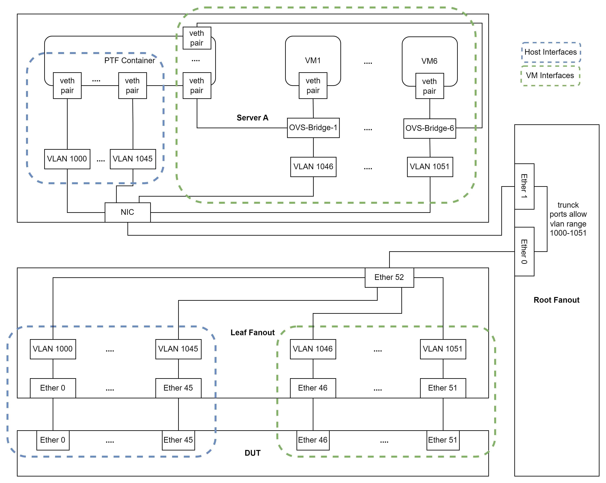
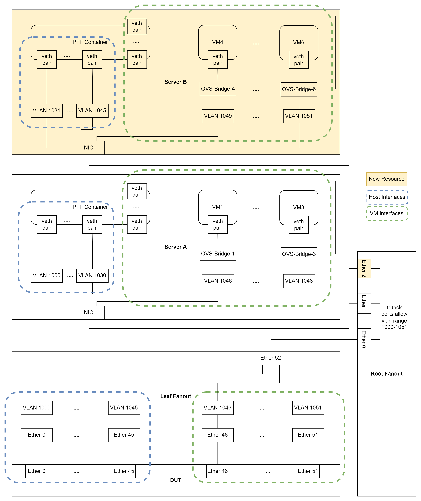
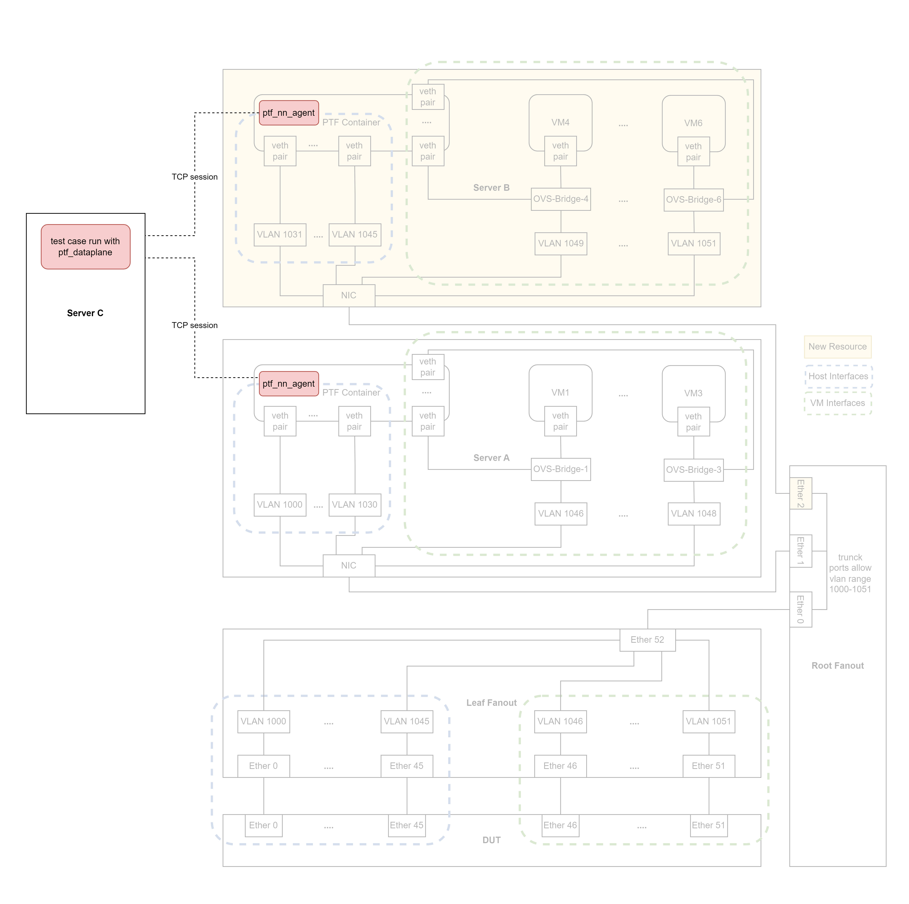

# Background and Motivation

When deploy a testbed with a great number of virtual ceos neighbors, we will create ceos containers on same server, however, the server doesn't have infinite resources such as memory to deploy that.

To help us scale out and support large number of neighbors, we propose this design for deploying testbed with multiple servers.

# Table of Contents
  - [Testbed YAML Schema Design](#Testbed-YAML-Schema-Design)
  - [Testbed Deployment](#Testbed-Deployment)
  - [PTF Connection](#PTF-Connection)

# Testbed YAML Schema Design
To make testbeds can be deployed on multiple servers, we add a new key "servers" with a list of servers for deployment insteaf of the key "server" to distinguish single server testbed and multiple servers testbed.

### Before
```yaml
- conf-name: single-server-testbed​
  group-name: s-s-t​
  topo: m0​
  ptf_image_name: ptf-image-lastest
  ptf: s-s-t​
  ptf_ip: x.x.x.x/x​
  ptf_ipv6: x::x/x​
  ptf_extra_mgmt_ip: ["x.x.x.x/x"]​
  server: server_a​
  vm_base: VM1000​
  dut:​
    - dut0​
  inv_name: xxx
```

Fig 1. Single Server Testbed Overview

### After
When deploy testbed on multiple servers, each server should have one ptf container to provide a environment to run processes like ptf_nn_agent and exbgp. So the ptf container should be declared with server.

And because VM hosts in inventory file are children of server and vm_base is related to server, so we declare vm_base with server.

Finally we got a new key "servers" with a list of servers, and each server has its ptf and vm_base declared.

And we add a new key dut_interfaces to indicate which DUT interfaces the server will connect to.

```yaml
- conf-name: multiple-server-testbed​
  group-name: m-s-t​
  topo: m0​
  ptf_image_name: docker-ptf​
  servers:​
    server_a:​
      ptf: m-s-t-a​
      ptf_ip:  x.x.x.x/x​
      ptf_ipv6: x::x/x​
      ptf_extra_mgmt_ip: [" x.x.x.x/x "]​
      vm_base: VM1000​
      dut_interfaces: 0-30,46-48​  # for multi-duts testbed, this value will in format <dut_index>.<vlan_index|vlan_range>​
    server_b:​
      ptf: m-s-t-b​
      ptf_ip:  x.x.x.x/x​
      ptf_ipv6:  x::x/x​
      ptf_extra_mgmt_ip: [" x.x.x.x/x "]​
      vm_base: VM2000​
      dut_interfaces: 31-45,49-51​
  dut:​
    - dut0​
  inv_name: xxx
```


Fig 2. Multiple Servers Testbed Overview

# Testbed Deployment
This design support add-topo, remove-topo, gen-mg and deploy-mg operations of testbed-cli.sh.

When run those operations, we will create a mapping between dut interfaces and servers according to the testbed defination in testbed.yml, and deploy/clean resource on servers according the mapping.


# PTF Connection
We create one ptf container for each server, and every container will has one ptf_nn_agent running, when we want to ingest/sniff packet from any dut interfaces, we can index it in ptf dataplane by device index and interface index tuple. (Although the dataplane connection works, however, we don't guarantee all test cases will pass, commands like `ptfhost.shell()` are only executed on single ptf container.)


Fig 3. PTF Connection Overview