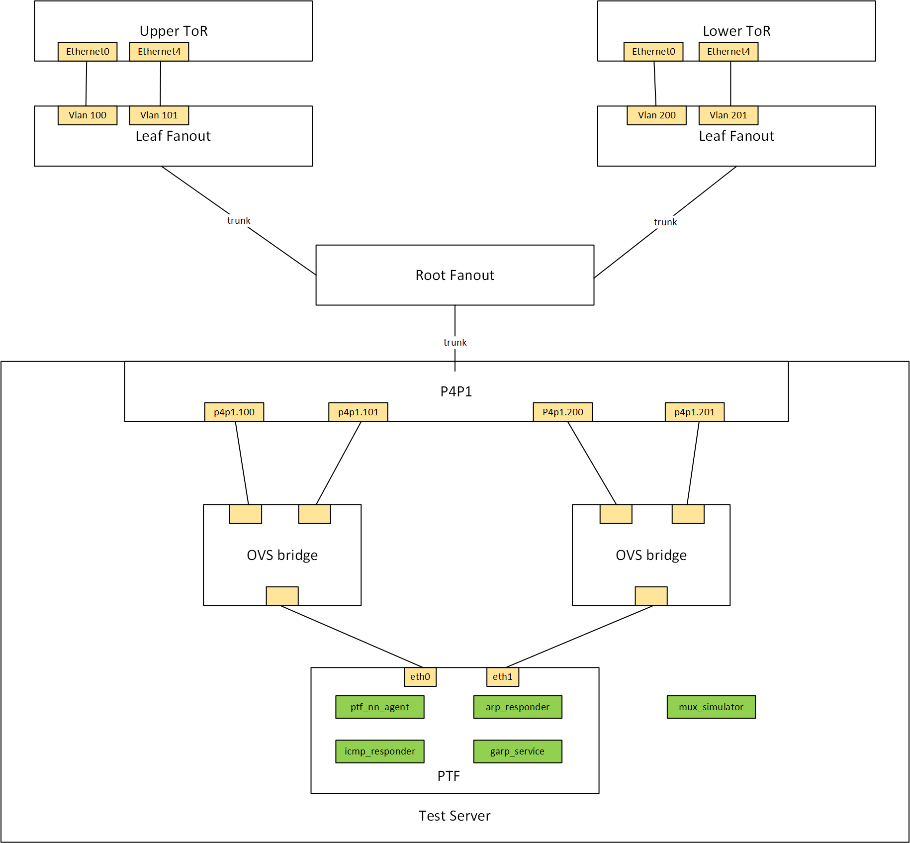
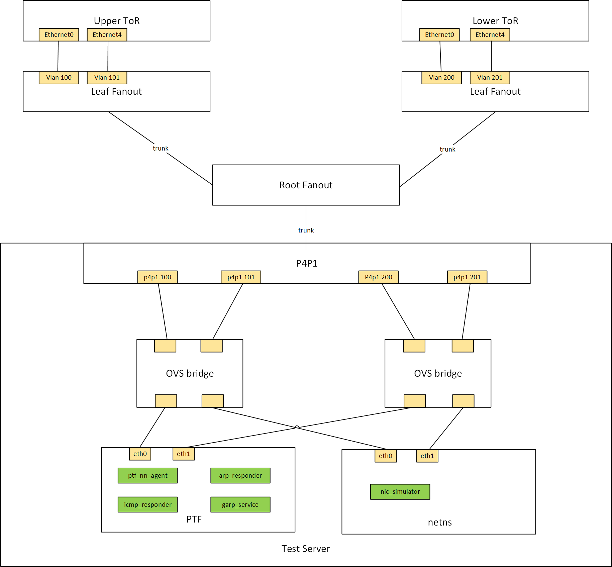
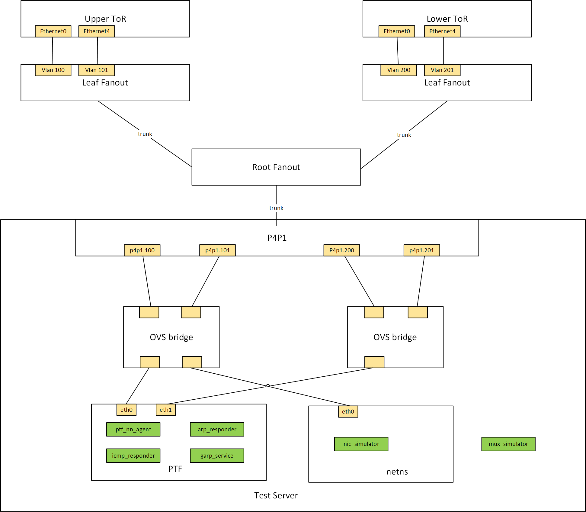

# Dualtor Testbed Setup
# Table of Content
* [Abount this Manul](#about-this-manual)
* [Dualtor Topologies](#dualtor-topologies)
* [Prepare the Testbed Configuration](#prepare-the-testbed-configuration)
* [Setup VMs and Add topology](#setup-vms-and-add-topology)
* [Deploy Minigraph](#deploy-minigraph)
* [Verify Testbed Health](#verify-testbed-health)

## About this Manual
This documentation provides general information about how to setup a dualtor testbed.

## Dualtor Topologies
The `active-standby` dualtor is firstly introduced to resolve the single point of failure of the T0 switches. The `active-standby` dualtor operates on the smart y-cable so one ToR is `active` to forward traffic from/to the server and one ToR is `standby` to act as a backup. SONiC is able to detect different failure scenarios(link down, link drop, etc) and react to make toggle decisions so the backup `standby` ToR will become `active` and substitute to forward traffic.

The `active-active` dualtor is secondly introduced to utilize the both ToRs as there is one backup `standby` ToR that doesn't fully forward traffic in the `active-standby` dualtor. The `active-active` dualtor operates on the NiC that both ToRs could forward traffic from/to the server. For the data plane/control plane behavior details of `active-active` dualtor, please refer to the [active-active dualtor HLD](https://github.com/sonic-net/SONiC/blob/master/doc/dualtor/active_active_hld.md).

Currently, there are three types of dualtor topologies:
* `dualtor`
    * has `active-standby` mux ports only
* `dualtor-aa`
    * has `active-active` mux ports only
* `dualtor-mixed`
    * has both `active-standby` and `active-active` mux ports

### `dualtor` topology


For `dualtor` topology, all ports are `active-standby` mux ports that operates on smart y-cables. The smart y-cables are simulated by OVS bridges with dedicated OVS flows, and the controller units on the smart y-cables are simulated by the `mux_simulator`. The `mux_simulator` service interacts with SONiC and operates on the OVS bridges to simulate forwarding behaviors.

### `dualtor-aa` topology


For `dualtor-aa` topology, all ports works in `active-standby` mode that operates on the NiC. The NiCs are simulated by OVS bridges with a dedicated set of OVS flows, and the gRPC servers running on the NiCs are simulated by the `nic_simulator` service running inside the netns. The `nic_simulator` is listening on the SoC IPs of the ports inside the netns to respond to the gRPC requests from SONiC and operates on the OVS bridge flows to simulate forwarding behaviors.


### `dualtor-mixed` topology


For `dualtor-mixed` topology, half of the ports works in `active-active` mode and the other half works in `active-standby` mode. So both `nic_simulator` and `mux_simulator` are needed in `dualtor-mixed` topology.


## Prepare the Testbed Configuration
To setup a dualtor testbed, you need to have the testbed description ready, and the configurations needed for either `mux_simulator` or `nic_simulator`.
For the testbed description, you should follow the [testbed configuration guide](https://github.com/sonic-net/sonic-mgmt/blob/master/docs/testbed/README.new.testbed.Configuration.md). One more thing to notice is that, for `dualtor-aa` and `dualtor-mixed` testbeds that has `active-active` mux ports, the testbed description should provide the management IP of the netns(`netns_mgmt_ip`).
For `mux_simulator`, the tcp port it listens on should be listed in file [ansible/group_vars/all/mux_simulator_http_port_map.yml](https://github.com/sonic-net/sonic-mgmt/blob/master/ansible/group_vars/all/mux_simulator_http_port_map.yml).
For `nic_simulator`, the tcp port it listens on should be listed in file [ansible/group_vars/all/nic_simulator_http_port_map.yml](https://github.com/sonic-net/sonic-mgmt/blob/master/ansible/group_vars/all/nic_simulator_grpc_port_map.yml)


### example
In the following demo, it gives the tesbted description for three testbeds:
1. `vms-dual-t0-lab-1`: `dualtor` topo
2. `vms-dual-t0-lab-2`: `dualtor-aa` topo
3. `vms-dual-t0-lab-3`: `dualtor-mixed` topo


The testbed descriptions in `testbed.yaml`:
```yaml
- conf-name: vms-dual-t0-lab-1
  group-name: lab_srv1_1
  topo: dualtor
  ptf_image_name: docker-ptf
  ptf: lab_srv1_1
  ptf_ip: <ptf_ip_1>
  ptf_ipv6:
  server: lab_server_1
  vm_base: VM10001
  dut:
    - lab-mydevice-01
    - lab-mydevice-02
- conf-name: vms-dual-t0-lab-2
  group-name: lab_srv1_2
  topo: dualtor-aa
  ptf_image_name: docker-ptf
  ptf: lab_srv1_2
  ptf_ip: <ptf_ip_2>
  ptf_ipv6:
  netns_mgmt_ip: <netns_ip_1>
  server: lab_server_1
  vm_base: VM10020
  dut:
    - lab-mydevice-03
    - lab-mydevice-04
- conf-name: vms-dual-t0-lab-3
  group-name: lab_srv1_3
  topo: dualtor-mixed
  ptf_image_name: docker-ptf
  ptf: lab_srv1_3
  ptf_ip: <ptf_ip_3>
  ptf_ipv6:
  netns_mgmt_ip: <netns_ip_2>
  server: lab_server_1
  vm_base: VM10030
  dut:
    - lab-mydevice-05
    - lab-mydevice-06
```
The `mux_simulator` port mappings in `mux_simulator_http_port_map.yaml`:
```yaml
mux_simulator_http_port:
    # port used for mux_simulator of the dualtor testbed vms-dual-t0-lab-1
    vms-dual-t0-lab-1: 8080
    # port used for mux_simulator of the dualtor-mixed testbed vms-dual-t0-lab-3
    vms-dual-t0-lab-3: 8082
```
The `nic_simulator` port mapping in `nic_simulator_http_port_map.yaml`:
```yaml
nic_simulator_grpc_port:
  # port use for nic_simulator of the dualtor-aa testbed vms-dual-t0-lab-2
  vms-dual-t0-lab-2: 50075
  # port use for nic_simulator of the dualtor-mixed testbed vms-dual-t0-lab-3
  vms-dual-t0-lab-3: 50075
```


## Setup VMs and Add topology
Simply run the `add-topo` subcommand of `testbed-cli.sh` to deploy the testbeds:
```
# ./testbed-cli.sh -m veos -k ceos add-topo vms-dual-t0-lab-1 password.txt
# ./testbed-cli.sh -m veos -k ceos add-topo vms-dual-t0-lab-2 password.txt
# ./testbed-cli.sh -m veos -k ceos add-topo vms-dual-t0-lab-3 password.txt
```

## Deploy Minigraph
Simply run the `deploy-mg` subcommand of `testbed-cli.sh` to configure the ToRs pair:
```
# ./testbed-cli.sh deploy-mg vms-dual-t0-lab-1 lab password.txt
# ./testbed-cli.sh deploy-mg vms-dual-t0-lab-2 lab password.txt
# ./testbed-cli.sh deploy-mg vms-dual-t0-lab-3 lab password.txt
```


## Verify Testbed Health
Please run test `tests/dualtor_io/test_normal_op.py` to verify if the testbed is healthy.
