# GoBGP Route-Injection Speaker for sonic-mgmt
## High Level Design Document

> Design for a GoBGP-based route-injection speaker that replaces ExaBGP.

## Table of Contents
- [Revision](#revision)
- [Overview](#overview)
  - [The problem](#the-problem)
  - [Root cause](#root-cause)
  - [The proposed solution](#the-proposed-solution)
- [Scope](#scope)
- [Relationship with Existing Documentation](#relationship-with-existing-documentation)
- [Definitions/Abbreviations](#definitionsabbreviations)
- [Requirements](#requirements)
- [High-Level Design](#high-level-design)
  - [Design Principles (why this approach)](#design-principles-why-this-approach)
  - [Architecture](#architecture)
  - [The bottleneck this design removes](#the-bottleneck-this-design-removes)
  - [The integration seam we reproduce exactly](#the-integration-seam-we-reproduce-exactly)
  - [Daemon topology and the shim](#daemon-topology-and-the-shim)
  - [Announce and withdraw flows](#announce-and-withdraw-flows)
  - [Observe / receive path redesign](#observe--receive-path-redesign)
  - [Serviceability and debuggability](#serviceability-and-debuggability)
- [Performance — the isolated speaker win](#performance--the-isolated-speaker-win)
- [Memory consumption in the PTF container](#memory-consumption-in-the-ptf-container)
- [Capability coverage](#capability-coverage)
- [Configuration — the `bgp_speaker` selector](#configuration--the-bgp_speaker-selector)
- [Change set (implementation surface)](#change-set-implementation-surface)
- [Testing Requirements / Design](#testing-requirements--design)
- [Limitations and Future Work](#limitations-and-future-work)
- [Appendix — validation record and raw data](#appendix--validation-record-and-raw-data)

---

## Revision

| Rev  | Date       | Author(s)       | Change Description |
| ---- | ---------- | --------------- | ------------------ |
| v0.1 | 2026-07-20 | Deepak Singhal  | Initial draft — GoBGP PTF speaker for route-scale injection. |

---

## Overview

This document describes the high-level design for replacing the sonic-mgmt
**PTF BGP route-injection speaker** — today **ExaBGP** — with **GoBGP**,
introduced as a drop-in behind an HTTP-API compatibility shim and a runtime
`bgp_speaker=exabgp|gobgp` selector. It changes only the sonic-mgmt PTF
container; the DUT, its on-switch BGP stack, and its dataplane are untouched.

### The problem

sonic-mgmt injects test routes into the DUT through a PTF-hosted BGP speaker.
For every BGP neighbor the PTF runs a pair of **ExaBGP** processes — one for
IPv4, one for IPv6.

The injection path is a **serial text pipeline**. `announce_routes.py` generates
every prefix in Python and emits **one text line per prefix**
(`announce route <P> next-hop <N> as-path [ ... ]`); lines are batched 200 per
HTTP POST into ExaBGP's `http_api`, written to the ExaBGP process's stdin, then
**re-parsed and advertised one UPDATE at a time**.

Because ExaBGP is a single-threaded Python daemon, advertisement is a serial
trickle — rig-measured at **~1.45k prefixes/sec** (the absolute rate scales with
CPU, but the serial-trickle *shape* does not). That shape makes the
announce/withdraw path both **slow and flaky**.

This is a **framework-wide** problem: it hurts **every** route-injection topology
and worsens with route count, so it is **already biting T2 topologies today** and
is the hard blocker for the **100k+/neighbor** scale the **dRH** (Disaggregated
Regional Hub) program sets as the bar. Lower-scaled topologies (t0/m0) feel it
least; high-fan-out/high-scale topologies feel it most — but the underlying
slowness/flakiness is general, not dRH-specific.

*Figure 1 — today's injection path (per neighbor: v4+v6 ExaBGP pair, one text line per prefix).*

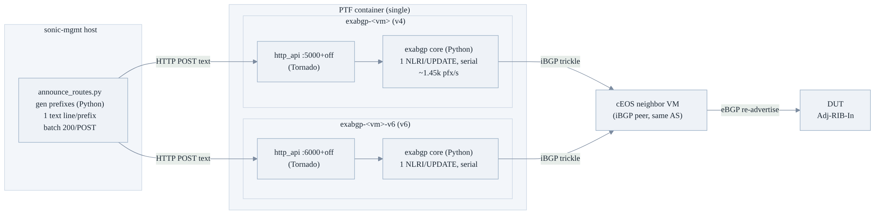

**Symptom, quantified.** At ~32k+/neighbor the announce/withdraw path exhibits:

- HTTP `Connection reset` on large POST bodies and 360s socket timeouts;
- `test_announce_withdraw_route`-class outq/inq drain timeouts (`wait_until(120s)`
  expiring);
- stuck-route baseline-restore asserts (`|after − before| < 5` failing because routes
  were still trickling).

The failure rate rises with prefix count — it is a *scale* failure, not a transient — and
it is **topology-agnostic**. We have already reproduced these failures on T2 topologies at
today's scales, far below the dRH target.

### Root cause

The injection path has three independent cost layers — route *generation*
(Python driver), route *injection/transport* (HTTP), and route *advertisement*
(the speaker). Micro-benchmarks that isolate the three show the ceiling is the
**speaker's advertisement rate**, not the transport or the driver. Separating
these three layers is the analytical spine of the whole effort: a win in one must
not be mistaken for a win in another.

*Figure 2 — the three independent cost layers. Only the speaker layer (the hard
ceiling) is shown in red; this design removes it. Injection/transport is
secondary; generation (shared by both arms) is the next lever after the speaker.*

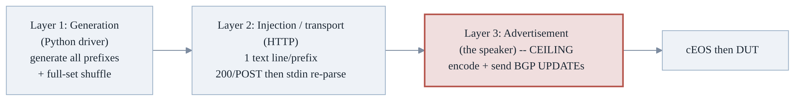

### The proposed solution

Replace the speaker with **GoBGP**, a compiled Go daemon that streams the whole
table into a Go encoder — packing NLRIs that share an attribute set into few
UPDATEs and bursting **an order of magnitude faster** than ExaBGP's serial Python.
A small **shim** presents ExaBGP's exact HTTP contract (same grammar, same
per-neighbor ports) and translates each command into a GoBGP `AddPathStream` gRPC
call against **that neighbor's own gobgpd**, so the Python driver and every existing
test stay untouched. The swap ships behind `bgp_speaker` (default `exabgp`), is fully
A/B-able, and evolves incrementally toward the driver speaking gRPC directly.

**Result:**
- **Speed** — per-session route delivery is **3.7×–9.7× faster**, and the advantage
  *grows with scale*.
- **Memory** — each speaker daemon is **1.6×–2.6× lighter under load** (≈3× less per
  route), and that gap *also grows with scale* — a net footprint reduction, not just
  idle-neutral.
- **No regression** — feature parity across every ExaBGP capability the sonic-mgmt
  tests exercise (Appendix A.1), validated functionally on a T2 topology.

*(These are portable **ratios**; the underlying absolute rates and byte counts scale
with host CPU/memory — see Performance and Memory consumption.)*

---

## Scope

The end goal is to inject and withdraw **100k+ prefixes/neighbor (v4+v6)** across
many uplinks within the existing functional-test framework — keeping functional
verification on the software cEOS + PTF-speaker model (**no** move to snappi/IXIA;
those remain for convergence perf only) — while removing the ExaBGP slowness and
flakiness class for **all** route-injection topologies (t0/t1/dualtor/m0/T2/…).
The win's *magnitude* varies with per-session scale, not the topology.

This HLD owns:
- the speaker swap inside the PTF container;
- the HTTP-API compatibility shim;
- the per-neighbor `gobgpd` process model (with shims pooled to core count);
- the `bgp_speaker` back-end selector;
- the receive/observe path change;
- the regression/scale test plan.

**Out of scope:**
- the DUT dataplane and on-switch BGP stack (unchanged);
- snappi/IXIA perf harnesses (retained separately for convergence perf only);
- the legacy `spytest/` ExaBGP usage and the `test_vxlan_vnet_bgp_subintf.py`
  `nohup exabgp` outlier (off the main injection path; deferred — see
  [Limitations and Future Work](#limitations-and-future-work)).

---

## Relationship with Existing Documentation

This HLD is part of the sonic-mgmt testbed documentation suite. The following
documents work together; this one is the design rationale that the route-injection
mechanism docs point to.

| Document | Path | Relationship |
| -------- | ---- | ------------ |
| **Announce Routes (internal)** | [`docs/testbed/READ.testbed.AnnounceRoutes.Internal.md`](READ.testbed.AnnounceRoutes.Internal.md) | The per-topology route-injection mechanism this design accelerates; gains the gobgp arm. |
| **Routing testbed** | [`docs/testbed/README.testbed.Routing.md`](README.testbed.Routing.md) | Route-injection topology context; references the selectable speaker. |
| **cEOS neighbors** | [`docs/testbed/README.testbed.cEOS.md`](README.testbed.cEOS.md) | The emulated neighbor the PTF speaker peers with (unchanged). |
| **exabgp ansible method** | [`docs/api_wiki/ansible_methods/exabgp.md`](../api_wiki/ansible_methods/exabgp.md) | The speaker-manager this design mirrors for GoBGP (`gobgp.py`). |
| **announce_routes ansible method** | [`docs/api_wiki/ansible_methods/announce_routes.md`](../api_wiki/ansible_methods/announce_routes.md) | The driver call-site; grammar/ports preserved by the shim. |
| **BGP scale test plan** | [`docs/testplan/BGP-Scale-Test.md`](../testplan/BGP-Scale-Test.md) | Companion test plan the scale/no-regression gates extend. |
| **docker-ptf image (external)** | `sonic-buildimage` docker-ptf | Paired dependency PR: pinned `gobgpd`/`gobgp` binaries + shim deps. |

**Recommended reading path:** start with **Announce Routes** for *what* the injection
mechanism does today, then this HLD for *how* GoBGP accelerates it behind the
`bgp_speaker` selector, then the **BGP scale test plan** for *how* the gains and
no-regression parity are gated. The ExaBGP docs remain the reference for the default
path during coexistence — this HLD supersedes none of them; it adds the selectable
`gobgp` arm.

---

## Definitions/Abbreviations

| Term | Definition |
|---|---|
| **PTF** | Packet Test Framework container in sonic-mgmt — the route/traffic generator host that runs the BGP speakers peering with the DUT's neighbors. |
| **DUT** | Device Under Test — the SONiC switch whose route scaling we exercise. |
| **cEOS** | containerized Arista EOS — the emulated **neighbor** router the PTF speaker peers with; re-advertises to the DUT. |
| **dRH** | Disaggregated Regional Hub — the program that sets the 100k+/neighbor scale **bar**. It drives the target, but the underlying speaker slowness/flakiness is general to all topologies (already seen on T2). |
| **speaker** | the BGP daemon in the PTF that *originates* the test routes (today **ExaBGP**; proposed **GoBGP**). |
| **ExaBGP** | current speaker — single-threaded **Python** BGP implementation driven over an HTTP/stdin text API. |
| **GoBGP / gobgpd** | proposed speaker — compiled **Go** BGP daemon (`gobgpd`) with a gRPC API. |
| **shim** | small Python HTTP adapter presenting ExaBGP's **exact** HTTP endpoint + grammar, translating each command into a GoBGP gRPC call. Makes GoBGP a drop-in. |
| **AddPathStream** | the GoBGP gRPC streaming call the shim uses to push the whole route set in one stream. |
| **Adj-RIB-In / Adj-RIB-Out** | routes a peer has *received* / is *advertising* — our correctness oracles. |
| **GIL** | Python Global Interpreter Lock — why collapsing shims into one process serializes CPU work. |
| **funnel** | KVM artifact where all neighbor sessions share one PTF-container CPU, artificially capping end-to-end numbers; absent on physical T2. |

---

## Requirements

RFC-2119 keywords are used deliberately (MUST / SHOULD / MAY).

**Functional**
- **R1.** The framework MUST inject and withdraw ≥100k prefixes/neighbor (v4 and v6) end-to-end to the DUT's Adj-RIB-In.
- **R2.** The GoBGP arm MUST accept the **exact** existing HTTP command grammar (`announce/withdraw route … next-hop … as-path […] community […]`, and the bulk `attributes … nlri …` form) on the **same** per-neighbor ports (`5000+off` / `6000+off`).
- **R3.** A route POSTed to a neighbor's port MUST be advertised **only** over that neighbor's session (per-neighbor targeting parity with ExaBGP).
- **R4.** The receive/observe path MUST expose what the DUT advertised back (Adj-RIB-In) as a structured, queryable replacement for the ExaBGP text dump.
- **R5.** Back-end MUST be runtime-selectable via `bgp_speaker=exabgp|gobgp`, **default `exabgp`** during coexistence (disabled-by-default analogue for test infra).

**Non-functional**
- **R6.** Per-session route delivery SHOULD be ≥5× faster than ExaBGP at ≥25k/session and the ratio SHOULD grow with scale.
- **R7.** The full-fleet deployment (≥288 sessions) MUST fit the PTF container memory budget (pool-to-core-count shims).
- **R8.** Functional-suite outcomes MUST be **identical** to ExaBGP on the same DUT image.

**Scalability targets**

| Dimension | ExaBGP today | GoBGP target |
|---|---|---|
| prefixes/neighbor | ~32k (flaky) | **100k+** |
| speaker advertise rate | baseline (serial trickle) | **order-of-magnitude faster burst** (~12× same-rig) |
| sessions/fleet (T2) | 144–288 | **288** within memory budget |
| per-session delivery @ ≥25k | baseline | **≥5×**, growing |

> **On the absolute rates:** the `pfx/s` figures are illustrative measurements from
> one rig and **scale with CPU** — they are *not* portable acceptance thresholds.
> The durable, machine-independent targets are the **ratios** (R6: ≥5× at ≥25k,
> growing) and the **shape** (ExaBGP linear-serial vs GoBGP fixed-setup-then-burst),
> which we confirmed across 16c / 56c / 104c hosts. Cite ratios, not absolutes.

> **Applicability:** these are the dRH-driven *bar*, but the requirement holds for
> **all** route-injection topologies. Lower-scale topologies (t0/m0) exercise the
> low end of the curve (smaller absolute win, still faster + less flaky);
> high-fan-out/high-scale topologies (T2, dRH) exercise the high end where the win
> and the reliability benefit are largest.

---

## High-Level Design

### Design Principles (why this approach)

Why this approach was chosen over the alternatives (the full rejected-alternatives
record with data is in the
[Appendix](#appendix--validation-record-and-raw-data)):

- **Drop-in parity over rewrite.** The shim reproduces ExaBGP's exact HTTP grammar
  and per-neighbor ports, so `announce_routes.py` and 25+ test call-sites are
  **untouched**. A one-shot gRPC rewrite was rejected for increment 1 precisely so
  the measured win is attributable to the *speaker* alone.
- **Attributable win.** GoBGP is introduced behind a `bgp_speaker=exabgp|gobgp`
  selector, making every result a clean A/B on the same DUT image — the win must be
  *measured*, not asserted.
- **Exact ExaBGP semantics + fault isolation.** One gobgpd per (neighbor, family)
  mirrors ExaBGP's one-process-per-neighbor model exactly and confines a crash's
  blast radius to a single neighbor. A shared daemon is *feasible* (via export
  policy/VRF) but adds policy state, so it is deferred, not chosen.
- **No functional regression.** Identical pass/fail vs ExaBGP is a hard gate before
  the default can flip — the functional suite on a T2 topology is that gate.
- **Deployable at fleet scale within the container budget.** The one structurally
  new component (the shim) is pooled to core count, keeping memory `O(cores)` not
  `O(sessions)`.
- **At-least-as-debuggable.** GoBGP exposes a queryable RIB, so the swap makes
  failures *more* diagnosable, not less.

### Architecture

No change to SONiC's on-switch architecture. The change is confined to the **PTF
container** inside sonic-mgmt: the speaker box is swapped, everything upstream (the
Python driver, the topology, the cEOS neighbors) and downstream (the DUT) is
unchanged.

*Figure 3 — architecture: BEFORE (today) above, AFTER (proposed) below; each flows
left→right. Only the speaker box changes — the driver, cEOS neighbors, and DUT are
unchanged. The **new/added blocks in AFTER (shim + gobgpd) are highlighted green**.*

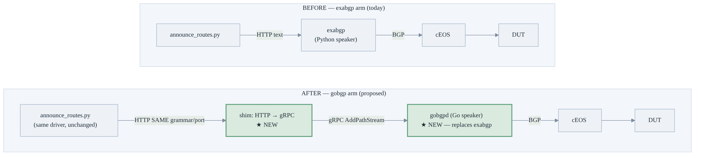

The gobgp arm is selected per run by `bgp_speaker=gobgp`. One `(gobgpd + shim-slot)`
unit replaces one ExaBGP process; isolating the swap this way is what makes every
measured ratio attributable to the speaker and nothing else.

### The bottleneck this design removes

So what does swapping just the speaker box actually remove? Ranked by impact at
100k+, the injection path's costs break down as:

| # | Bottleneck | Why it hurts at scale |
|---|---|---|
| **B1** | ExaBGP is a **single-threaded Python speaker** — 1 NLRI/UPDATE, serial | **the hard ceiling** (~1.45k pfx/s); this is what GoBGP removes |
| B2 | **one `announce` command per prefix** | 100k text lines even though most share (next-hop, as-path) |
| B3 | **HTTP/Tornado stdin double-handling** | serialize → POST → stdout → re-parse; big bodies → resets/timeouts |
| B4 | **all neighbors' speakers in ONE container** | ~128 procs × millions of cmds → CPU/mem pressure |
| B5 | **synchronous verify/convergence waits** | fixed sleeps give false failures when programming lags |

The decisive cost is **B1** (advertisement encode). B2/B3 are real but secondary;
B5 is orthogonal reliability. GoBGP replaces the whole tail (B1–B3) with a binary
gRPC stream into a Go encoder that packs shared attributes once and bursts.

The same swap read hop-by-hop (one neighbor, 100k prefixes):

| hop | BEFORE (exabgp) | AFTER (gobgp) |
|---|---|---|
| driver → speaker | 500 POSTs of 200 text lines, `(nh,as-path)` repeated 100k× | **one** POST, streamed once |
| intake → core | stdout → pipe → stdin, **re-parse every line** | binary `AddPathStream` (no text/pipe/re-parse) |
| advertise (B1) | **1 NLRI/UPDATE, serial Python** (rig ~1.45k pfx/s) | Go encoder groups shared-attr NLRIs, **burst** (rig ~34k pfx/s) |
| scaling | linear in N | ~fixed setup + fast burst (sub-linear) |

### The integration seam we reproduce exactly

The whole injection path converges on **one** HTTP text-command seam. Reproducing it
byte-for-byte is what keeps the driver and every test call-site untouched:

```
POST http://<ptf_ip>:<port>   body: {"commands": "<cmd>[;<cmd>...]"}   (or {"command": "<cmd>"})
```

- **Same grammar, same ports — reproduced verbatim.** The full command grammar
  (`announce/withdraw route …`, plus the bulk `attributes … nlri …` form) and the
  deterministic port math (`v4 = 5000 + vm_offset`, `v6 = 6000 + vm_offset`) are the
  stable contract — specified in **[R2](#requirements)** and inventoried in
  **[Appendix A.1](#a1-capability-inventory-what-tests-actually-exercise)**. Neither
  changes; the shim simply maps each port to that neighbor/family's own gobgpd gRPC
  endpoint.
- **Callers preserved by construction, not by enumeration.** Because the shim reproduces
  this seam byte-for-byte (same grammar, same ports), **every** caller — the
  `announce_routes` driver and the test helpers that post to it — keeps working unchanged,
  **and so does any caller added or refactored later**. The stable contract is the seam, so
  this design tracks the *seam*, not the call-site list. The one deliberate exception is the
  **observe/receive path**, redesigned below.

**Today's ExaBGP process model (what the shim replaces).** ExaBGP runs inside the PTF
container as **one single-neighbor speaker process per (neighbor, family)**, each with an
embedded HTTP API piping POSTed commands into the speaker — the one-process-per-neighbor
shape Figure 4 mirrors. The observe path (`test_bgpmon`) additionally runs a separate
text-dump process — the reason the receive path is redesigned below.

### Daemon topology and the shim

**Design decision (the trade-off and why):** one gobgpd per **(neighbor, family)**,
*not* one shared daemon — chosen for **exact ExaBGP parity + process isolation**,
not because sharing is infeasible (see the rationale below).

*Figure 4 — per-neighbor daemon topology (mirrors ExaBGP's one-process-per-neighbor
model). The shim **pool** (one process per core, portmap-sharded — see the memory
section, drawn here as one logical box) owns the HTTP ports (`5000/6000+off`); each
port maps to that neighbor/family's own gobgpd over **gRPC** (a separate local
port). Both v4 and v6 daemons peer iBGP with the same cEOS VM. The **new components
(shim pool + per-neighbor gobgpds) are highlighted green**; the driver, cEOS
neighbors, and DUT are unchanged.*

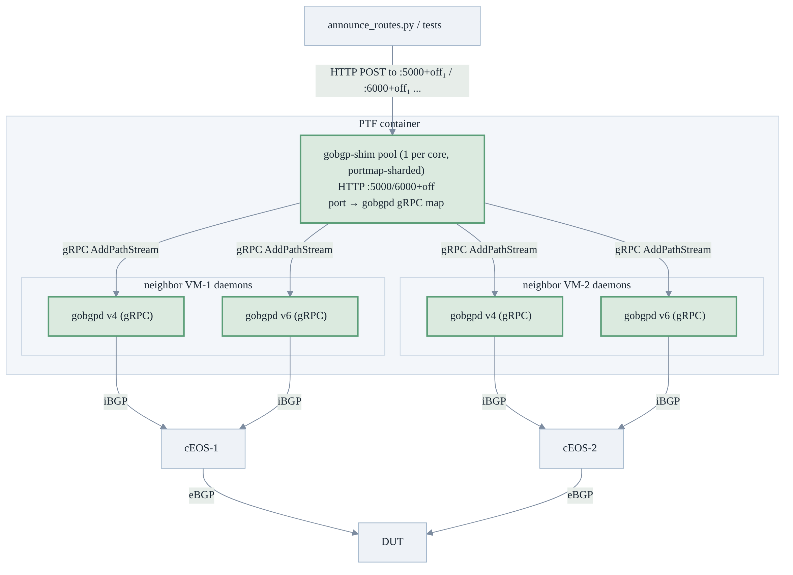

**Why one gobgpd per neighbor, not one shared daemon (a choice, not a limitation).**
ExaBGP runs one process per (neighbor, family), so a route POSTed to a neighbor's
port is advertised **only** over that neighbor's session. GoBGP `AddPath` writes
the daemon's **global RIB**, which is re-advertised to **every** peer of that daemon
subject to export policy. So a single shared gobgpd **can** reproduce "advertise to
peer X only" — but only by adding **per-neighbor export policy** (match the path,
permit-export to peer X only) or **per-neighbor VRF tables**. At 100k+ prefixes × N
neighbors that policy/table state is non-trivial to generate and maintain, and it
effectively re-introduces per-neighbor bookkeeping anyway.

**Resolution (phase 1):** one gobgpd per (neighbor, family) — the simplest **exact**
mirror of ExaBGP's one-process-per-neighbor semantics, with the bonus of **process
isolation** (a crashed daemon takes down only its own neighbor). Validated in the
GATE-1 loopback test. Daemon consolidation via export policy or VRFs remains a
viable **future optimization** if per-daemon memory ever dominates (today the shim,
not gobgpd, is the memory lever).

**The shim contract.** The shim is a small Python HTTP→gRPC adapter. **It is one
logical service but deployed as a pool of processes — one per core, portmap-sharded
— never a single process fronting every port** (a single process would GIL-serialize
the CPU-bound protobuf build and become the new bottleneck: the rejected
single-process **CONS** config, +32%/+59% slower — quantified in
[Memory](#memory-consumption-in-the-ptf-container)). Each shim process:
- listens on its **shard** of the ports (`base(family)+offset`, so `filters.py` port
  math stays authoritative); the union of shards covers all per-neighbor ports, each
  port owned by exactly one shim;
- parses the ExaBGP grammar (route/attributes/withdraw + next-hop/as-path/community/
  local-pref/med/origin) — reusing the exact `build_paths` parser validated in the
  bench harness;
- translates to **batched** `AddPathStream`/`DeletePath` gRPC against that port's
  gobgpd — **never per-route unary calls** (N unary round-trips would reintroduce
  per-route RPC overhead and eat the win at 100k — this batched path is how R6 is
  met, and test U4 guards against regressing to unary calls);
- exposes a **receive endpoint** backed by `GetTable(ADJ_IN)`/`WatchEvent` to replace
  the bgpmon text dump.

Because the pool runs `k = min(cores, sessions)` processes across cores, the HTTP
intake and the protobuf build for different neighbors run **truly in parallel** (not
GIL-bound) — so the shim layer scales with cores, not as a single serial front door.

**Why the shim does not compromise the win.** The speedup comes from moving UPDATE
wire-encoding **out of Python (ExaBGP) into Go (gobgpd)** — not from removing the
HTTP front door. The shim sits *upstream* of encoding and never encodes UPDATEs
itself:

| Stage | ExaBGP today | Shim + gobgpd |
|---|---|---|
| test → speaker | HTTP POST | HTTP POST *(same hop)* |
| parse command text | Python | Python *(same O(N) split)* |
| **encode N BGP UPDATEs** | **Python — the bottleneck** | **Go, inside gobgpd — the win** |
| send to cEOS | exabgp | gobgpd |

The only added cost is one localhost gRPC stream (µs/batch), negligible against the
encoding savings. The bench already measured the **shim shape** (a Python gRPC
client doing `build_paths → AddPathStream → gobgpd`), so the performance numbers
carry the Python parse/construct + gRPC cost — measured, not extrapolated.

### Announce and withdraw flows

*Figure 5 — end-to-end announce with the gobgp arm. GoBGP drives the DUT to
full-received **before `announce_routes` even returns** (the burst tell-tale);
ExaBGP keeps trickling after return.*

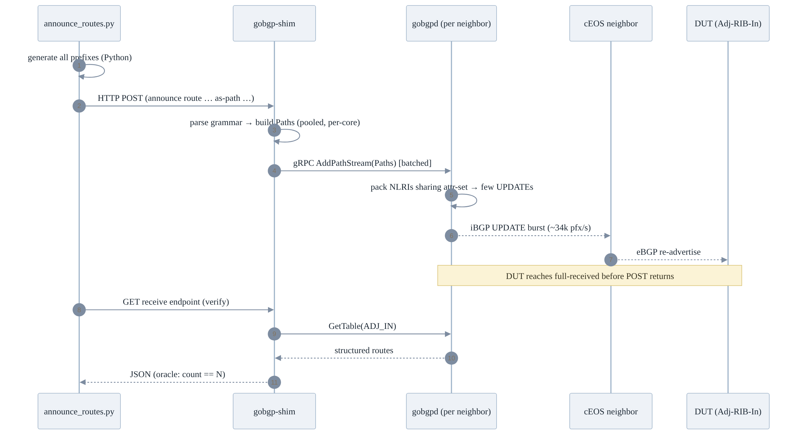

*Figure 6 — withdraw path. Same shim seam; the shim streams `is_withdraw` paths in
one call (GoBGP v3 has no `DeletePathStream`, but `AddPathStream` honors each
`Path.is_withdraw`, so bulk withdrawal is still a single stream — never per-prefix
unary `DeletePath`).*

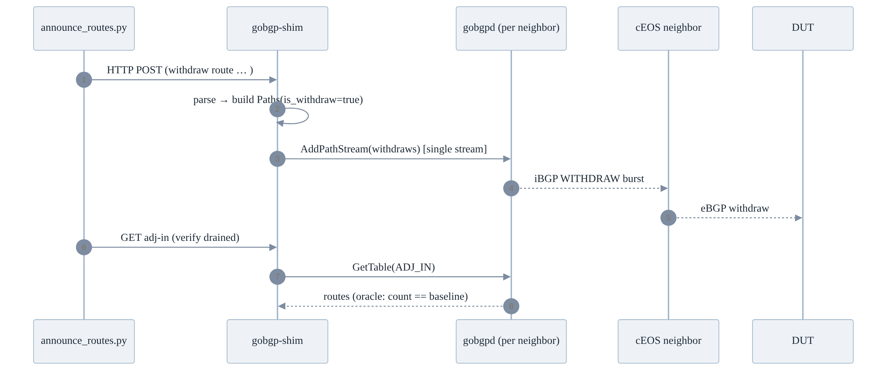

Beyond the happy path, this figure's real subject is **resilience**. Because each
neighbor runs its **own** gobgpd under supervisord, a daemon crash is **contained to
that one neighbor and auto-restarted** — the rest of the fleet is untouched. ExaBGP's
single shared reactor has no such isolation: one fault can stall *every* session. (The
lifecycle blends a simplified BGP FSM with the process states, so the whole story
reads in one picture.)

*Figure 7 — per-neighbor daemon resilience: a crashed gobgpd is auto-restarted in
isolation (blast radius = one neighbor), unlike ExaBGP's shared reactor. Simplified FSM.*

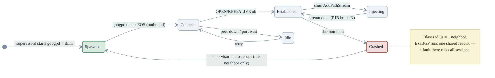

### Observe / receive path redesign

ExaBGP has **no live state query** — the observe path scrapes the exabgp "dump"
JSON-in-text log line-by-line (fragile to format drift).
GoBGP exposes a **queryable RIB**: the shim's receive endpoint is backed by
`GetTable(ADJ_IN)`/`WatchEvent`, giving a structured, robust replacement. This is
the single test-side code change, made `bgp_speaker`-aware for coexistence.

### Serviceability and debuggability

Net **better** than ExaBGP on state observability, with two new failure modes
mitigated by design.

*Figure 8 — on-failure triage: ExaBGP forces log-scraping across N processes; GoBGP
answers "what did the speaker hold / advertise / receive?" as structured JSON.*

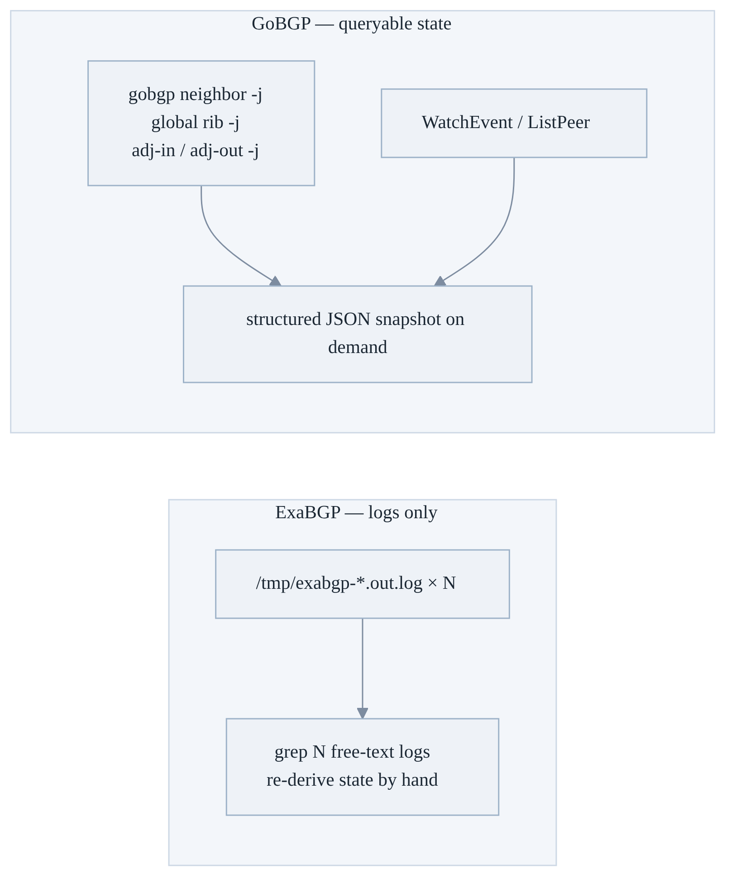

- **Live state:** `gobgp neighbor [-j]`, `gobgp global rib [-j]`, `gobgp neighbor <ip> adj-out/adj-in [-j]`
  — ground truth of session state, what we advertise, and what the DUT advertised to
  us. ExaBGP cannot answer these. Example (what ExaBGP simply cannot produce):

  ```console
  $ gobgp neighbor 10.0.0.56
  Peer          AS  Up/Down State       |#Received  Accepted
  10.0.0.56  65200  00:04:12 Establ      |   100000    100000

  $ gobgp global rib summary -j          # cheap liveness probe
  {"routes": 100000, "paths": 100000}

  $ gobgp neighbor 10.0.0.56 adj-out -a ipv4 -j | jq '.[0]'   # exactly what WE advertise
  {"prefix":"192.0.2.0/24","nexthop":"10.0.0.57","as_path":[65200,64512]}
  ```
- **Structured logs:** gobgpd logrus/JSON with `--log-level=debug` for per-message FSM/UPDATE tracing.
- **Collect-on-failure hook:** a pytest teardown (in the gobgp helper) dumps per-neighbor
  `neighbor -j` / `global rib -j` / `adj-out -j` on any BGP-test failure — a complete
  structured artifact ExaBGP cannot cleanly produce.
- **New failure modes, mitigated:**
  - *shared-daemon blast radius* — **avoided by design** (one gobgpd per neighbor) +
    supervisord auto-restart + per-neighbor shim logs;
  - *shim as an extra hop* — the shim logs every inbound command, the exact gRPC call,
    and the returned status, so triage bisects **shim vs daemon** in one log
    (`--debug` passthrough mirrors ExaBGP's flag).

---

## Performance — the isolated speaker win

**(A) Isolated single-session sweep — real cEOS, KVM (the clean speaker ratio).**
Same driver, same neighbor, only the speaker swapped; time = inject-start → the real
cEOS peer holds every route:

| routes/session | ExaBGP | GoBGP | **ratio** |
|---:|---:|---:|---:|
| 12,800 | 10.56s | 2.82s | 3.73× |
| 25,600 | 19.12s | 3.27s | **5.85×** |
| 51,200 | 36.28s | 4.93s | **7.35×** |
| 102,400 | 71.95s | 7.39s | **9.73×** |

> **How to read these tables:** compare ExaBGP vs GoBGP *within a row* — the
> **ratio** is the result that carries over to any machine. The raw seconds depend on
> the test host, so don't compare them across different rigs.

**The ratio *grows with scale* — that is the whole point.** ExaBGP is **linear in N**
(a serial Python trickle, ~1.45k pfx/s); GoBGP is **sub-linear** (~2–3s fixed setup +
a single burst ~34k pfx/s). So the advantage widens exactly as you push toward the
scale that matters, and it crosses the ≥5× bar at ~25k/session.

*Figure 9 — why the gain grows: ExaBGP's time rises linearly with route count while
GoBGP stays near-flat, so the ratio widens with scale. Single neighbor, real cEOS, KVM.*

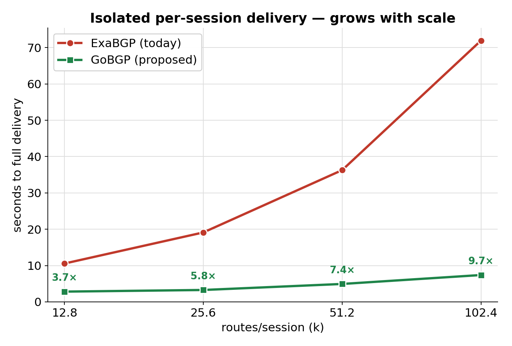

**A second scaling axis — fan-out (7–13×).** This fixes **30k/neighbor** and scales
*neighbors* (Figure 9 scaled prefixes). Measured on the **multi-sink isolation rig**
(N speakers ↔ N dedicated 1:1 sinks, dev VM) — the speaker+inject isolation family,
so ratios track the L1 micro-bench's ~12–14×, *not* the L2 real-cEOS delivery. The
win holds because ExaBGP's sessions all contend on one Python reactor, while each
GoBGP speaker drives its own receiver over native BGP.

| N neighbors (30k each) | ExaBGP | GoBGP | ratio | GoBGP paths/s/spk |
|---:|---:|---:|---:|---:|
| 1  | 10.65s | 0.92s | **11.6×** | 32,749 |
| 4  | 11.31s | 1.00s | **11.3×** | 29,961 |
| 16 | 20.50s | 2.79s | **7.3×**  | 10,762 |
| 32 | 38.85s | 5.59s | **6.9×**  | 5,367 |

*Figure 10 — fan-out delivery (N speakers, 30k/neighbor, dev VM multi-sink
isolation): ExaBGP rises with neighbor count while GoBGP stays near-flat, so the
7–13× lead holds across the whole fan-out range. Per-speaker throughput stays ~7×
higher even at N=32. Complements Figure 9's per-prefix axis.*

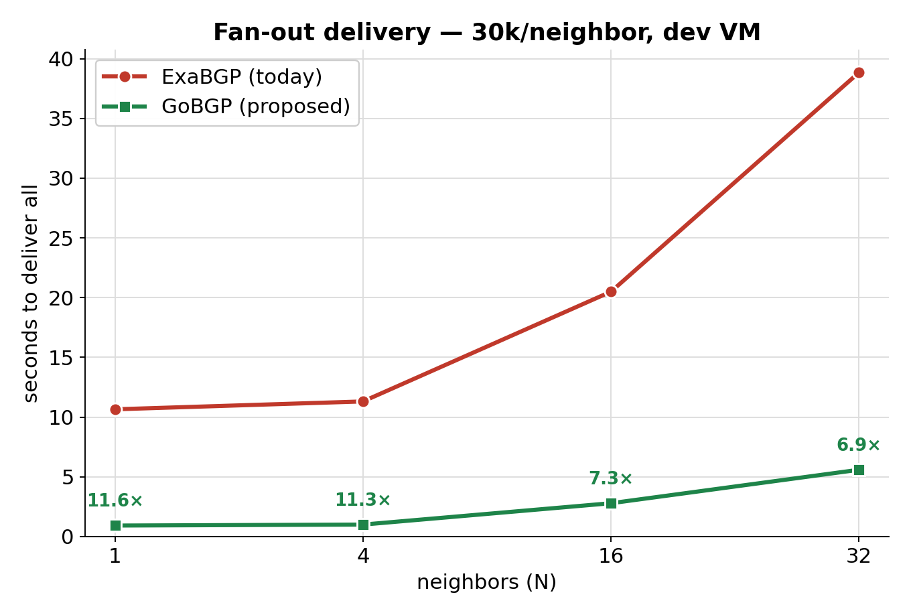

**Physical T2 — the win holds at real-hardware fan-out, and the advertise-rate gap is even larger.**

| Rig | Neighbors | Metric | ExaBGP | GoBGP | Result |
|---|---:|---|---:|---:|---|
| L5 physical T2, per-session | **72** | delivery, real chassis | 6.4→19.4s | 2.4→3.5s | **2.7×→5.5×**; **advertise-alone ~12×** |

At the fan-out scale (72 cEOS on real hardware) the **per-session** win persists and
grows with per-session route count; isolating just the **advertisement** stage
(subtracting the shared driver cost) shows GoBGP ~**12×** (18s→1.5s). The *ratio and shape* are
identical everywhere — 16c VM, 104c box, KVM, and a real T2 chassis — so the win is
not a machine artifact. (The *absolute* pfx/s differs per host, as expected — faster
CPUs move both arms up together; only the ratio is portable.)

> **Which number to quote.** Two clocks measure this section. Clock **(A)** —
> isolated per-session delivery — is the real win (**3.7×→9.7×**, growing with scale).
> Clock **(B)** below — the whole `announce_routes` module's wall-time — reads
> **~parity at ≤34k**, because most of that time is route *generation* shared by both
> arms, not the speaker. Quote GoBGP on **(A)**, never on **(B)**.

**(B) Whole-fleet wall-clock — the needed-but-noisy control.** Timing the entire
`announce_routes` module (all 72 neighbors / 144 sessions at ~34k each):

- **Result:** ExaBGP **108.4s** vs GoBGP **105.0s** — **~parity (~3%)**.
- **Why:** a generate-only run (`action=generate`) is **78.1s ≈ 74%** of the
  wall-clock, identical for both arms (`generate_routes` + full-set shuffle of ~2.4M
  prefixes). The speaker is only the remaining ~26% — small at 34k with 72-way
  parallelism, so the per-session win is real but **invisible in this clock** (gobgp
  arm engaged — post-announce gobgpd RIB = 34,486 v4).
- **Fix:** speed up route generation (Future Work, increment 3) — which helps **both**
  arms, not the speaker swap.

---

## Memory consumption in the PTF container

Zero impact on the DUT. Within the PTF container, the naive "one gobgpd + one shim
per (neighbor,family)" is **memory-heavy**, so the design **pools shims to core
count**. The per-shim overhead is a fixed ~40 MB regardless of ports fronted, so
consolidation saves interpreter overhead — but collapsing to one process serializes
the CPU-bound protobuf `build_paths` across the **GIL**. Pooling to `min(cores,
sessions)` shims (portmap-sharded) keeps memory low **and** recovers perf parity.

**Measured per-process idle RSS** (t2 host): ExaBGP **24.1 MB**, gobgpd **16.0 MB**
(*lighter than ExaBGP **at idle***), shim **~40 MB**. So the swap's *only*
structurally new memory component is the shim — which is exactly what pooling caps.
The idle figures understate the win: under load gobgpd's per-route cost is **~3×
lower** than ExaBGP's and *amortizes downward* with scale (measured below).

**The trade.** Three shim topologies, swept at fleet scale on the same host/load
(per-shim RSS ≈40 MB; `S` sessions, `C` cores):

*Figure 11 — portmap sharding: one shim per core, each owning a disjoint slice of
the per-neighbor ports; each port still maps 1:1 to its own gobgpd (per-neighbor
targeting intact).*

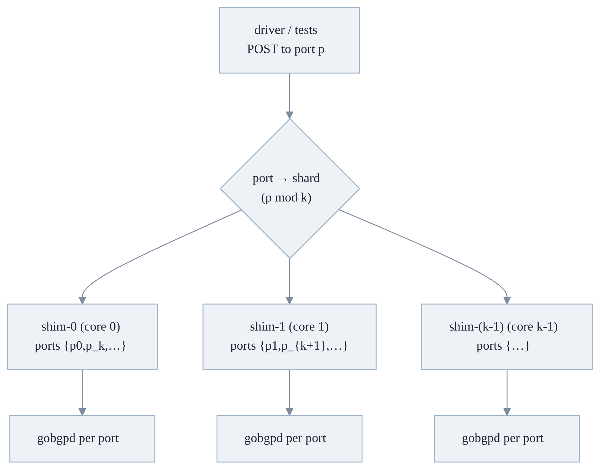

*Figure 12 — shim topology trade-off (gobgpd unchanged; swept at fleet scale on the same host/load).*

| Config | Shim procs | Idle RSS | Announce | Withdraw | Verdict |
|---|---:|---:|---:|---:|---|
| **SEP** (1/session, stock) | 8 | 319 MB | ~21.0s | ~13.5s | memory blow-up at fleet scale |
| **CONS** (1 total) | 1 | 40 MB | ~27.8s **(+32%)** | ~21.5s **(+59%)** | GIL regression — rejected |
| **POOL** (=cores, 4×2) | 4 | 159 MB | ~21.9s **(+4%)** | ~14.7s **(+9%)** | **chosen** — low mem + perf parity |

**T2 projection:** SEP 288 proc / ~11.5 GB → **POOL-16 ~640 MB (~18× less)** with
perf preserved. That ~640 MB is the *shim* budget; each gobgpd replaces one ExaBGP
process 1:1 (same daemon count), so pooling caps the one new component at `O(cores)`,
not `O(sessions)`.

**Shim RSS is flat in route count (measured).** Because the shim is a stateless
HTTP→gRPC path streamer — it holds no RIB; `/adj-in` reads ADJ_IN back from gobgpd
on demand — its resident memory does **not** grow with prefixes. Driving 40k then
80k routes through one shim moved its RSS by the *same* fixed ~15 MB (37 → 52 MB
either way — a one-time batch/gRPC allocator high-water, not per-route state). A
4-shim pool driven at 40k each (160k total) came in at **4 × 52 MB = 208 MB**, each
shim identical to ±0.1 MB. So the pool budget doesn't grow with route scale either —
the last property the POOL choice relies on.

> **✅ Loaded per-daemon RSS — measured, A/B, at scale.** The idle numbers
> understated the win. We ran a controlled A/B (fresh restart per point, fixed seed,
> plateau-sampled `VmRSS` after the RIB is fully programmed and quiesced, idle
> baseline subtracted; 3 reps, medians) sweeping v4 prefixes/neighbor from 12.8k to
> **102.4k** on the bench rig. gobgpd is lighter **loaded**, and the advantage *grows*
> with route count:
>
> | routes/neighbor | ExaBGP loaded | gobgpd loaded | advantage |
> |---:|---:|---:|:--|
> | 12,800 | 58.4 MB | 36.4 MB | gobgpd **1.60×** lighter |
> | 25,600 | 95.9 MB | 51.0 MB | gobgpd **1.88×** lighter |
> | 51,200 | 171.0 MB | 76.8 MB | gobgpd **2.23×** lighter |
> | **102,400** | **321.0 MB** | **122.5 MB** | gobgpd **2.62×** lighter |
> | **per-route slope** | **≈3070 B/route** | **≈1000 B/route** | **3.06× lighter/route** |
>
> ExaBGP holds a flat **~3070 B/route**; gobgpd's typed RIB *amortizes down*
> (1489 → 1070 B/route) as prefixes grow, so the ratio climbs monotonically
> (Figure 13). **Verdict:** the swap is a net per-daemon memory *reduction* under
> load — not merely idle-neutral — and it widens at the scales dRH targets. Combined
> with the shim pooled to `O(cores)`, the total fleet-memory picture is favorable.
> This was independently corroborated on physical T2: the gobgp arm deployed and ran
> at fleet scale (144 sessions × ~34k, after the fd-ceiling fix), fitting R7's
> container budget.

*Figure 13 — loaded per-daemon RSS, ExaBGP vs gobgpd, v4 prefixes/neighbor (bench
rig; fresh restart per point, idle-subtracted plateau RSS, 3-rep medians). gobgpd is
lighter at every scale and the ratio grows 1.60× → 2.62×.*

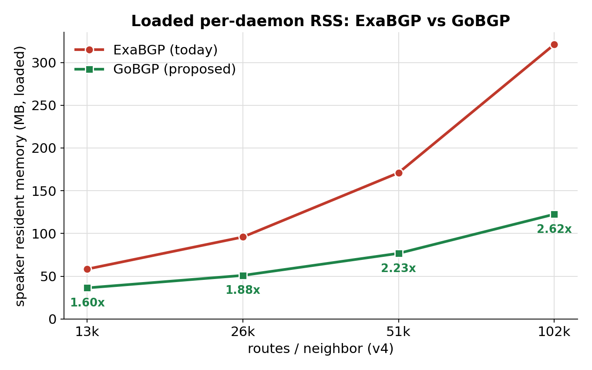

**Confirmed on physical T2:** once GoBGP is the speaker, convergence becomes
shim-dispatch bound (the speaker tail vanished) — exactly what predicts the shim as
the next limiter, independently validating the pooling decision.

---

## Capability coverage

Every ExaBGP capability the `tests/` survey shows in use maps to a native GoBGP
mechanism, so the swap is **feature parity, not a subset** — full
capability→mechanism→verdict matrix in
[Appendix A.1](#a1-capability-inventory-what-tests-actually-exercise). The one
theoretical gap — emitting *intentionally malformed* BGP — is **used by no test**
(the repo's "malformed" cases are DUT-side CLI/config guards, not speaker behavior),
so a phase-0 audit gate enforces it and ExaBGP stays selectable as an escape hatch.

## Configuration — the `bgp_speaker` selector

For test infra the config surface is ansible vars, not CONFIG_DB — there are **no
SONiC CLI or YANG changes** and the feature adds no on-switch config. The only
operator-facing control is a testbed/topology variable consumed by ansible, plus
GoBGP's own `gobgp` CLI used for debugging.

- **New var:** `bgp_speaker: exabgp | gobgp` in testbed/topology vars.
- **Default:** `exabgp` in phase 1 (backward-compatible; existing testbeds behave identically).
- **Effect:** `ansible/roles/vm_set/tasks/announce_routes.yml` branches on the var to
  start either the `exabgpv4`/`exabgpv6` supervisord groups or the `gobgpd`+`gobgp-shim`
  programs; the `wait_for` port checks are unchanged (same ports).
- **Backward compatibility:** absent/unset ⇒ `exabgp`, so **no existing testbed
  changes behavior**. Both back-ends are guarded so a testbed can run either during
  coexistence.
- Per-neighbor gobgpd config is a rendered **toml** (that one neighbor, per-family
  afi-safis, passive/listen) written by `ansible/library/gobgp.py` — internal, not
  operator-facing.

```yaml
# testbed/topology var (illustrative)
bgp_speaker: gobgp        # exabgp (default) | gobgp
```

## Change set (implementation surface)

The concrete change set is small and confined to
sonic-mgmt (plus one paired docker-ptf image PR):

| Surface | Nature | What changes |
|---|---|---|
| Speaker manager | **net-new** | per-neighbor gobgpd config + supervisord programs + portmap, and start/stop/restart/status lifecycle (the GoBGP analogue of the exabgp manager). |
| HTTP-API shim | **net-new** | the compatibility server: command parser + gRPC translator + structured receive endpoint. |
| Generated gRPC stubs | **net-new** | GoBGP gRPC Python bindings, pinned to the image's gobgpd version. |
| Injection role task | modified | branch on the `bgp_speaker` selector (start gobgp/shim vs exabgp programs); same `wait_for` port checks. |
| PTF process reaper | modified | extend the kill list to reap gobgpd + shim. |
| Observe path | modified | read the shim's structured `ADJ_IN` endpoint instead of scraping speaker logs; `bgp_speaker`-aware. |
| Selectors + docs | modified | add the `bgp_speaker` selector to testbed/topology vars; add runbook + this HLD. |
| docker-ptf image | **paired external PR** | add pinned gobgpd + gobgp binaries and shim Python deps; keep exabgp during coexistence. *(Tracked as a dependency.)* |

The route generator itself is **near-zero change** — the shim preserves its command
grammar and port layout — and the test-facing injection helpers are **unchanged**;
the only helper that moves is the receive-path one, which reads the shim's `ADJ_IN`
endpoint.

---

## Testing Requirements / Design

The method is validated in **layers of increasing fidelity**, each adding one
element of real-world realism on top of the layer above — with an identical route
generator across arms, identical sink/oracle, interleaved median-of-N runs, and
**correctness asserted every run** (path-count oracle). Layering this way means any
regression pinpoints exactly which added element introduced it. The top rung
(**L5**) is the real T2 chassis:

| Layer | Rig | Adds vs previous layer | What it isolates / proves |
|---|---|---|---|
| **L1 — Micro-bench A/B** | dev VM 16c + prod 104c; synthetic sink-oracle, no DUT | — (baseline) | raw speaker + inject rate |
| **L2 — Isolated single-session** | KVM; real cEOS peer | a real BGP peer | advertise rate to a real peer |
| **L3 — End-to-end DUT-received** | KVM; real driver → cEOS → DUT Adj-RIB-In | the real driver + the DUT | speaker-attributable win survives the full path |
| **L4 — Shim footprint / perf** | KVM; SEP / CONS / POOL sweep | productization (memory + GIL) | pooling holds perf at `O(cores)` memory |
| **L5 — Physical T2** ✅ | 56c server, 72 cEOS, real T2 chassis | real hardware + full fan-out (no funnel) | true-scale, no-regression on a real chassis |

### Unit Test cases
| # | Test | What it proves |
|---|---|---|
| U1 | shim grammar parser vs ExaBGP command set (route/attributes/withdraw/community/local-pref/med/origin) | grammar parity |
| U2 | shim loopback: POST → gRPC → gobgpd RIB holds exactly N (GATE-1, 11/11 PASS) | translation correctness |
| U3 | shim robustness / negative gate: malformed/oversized/partial commands (GATE-6.2, 20/20 PASS) | fault handling |
| U4 | `AddPathStream` batching (no per-route unary) — assert stream call count | guards R6 (batched-gRPC design) |
| U5 | per-neighbor targeting: route on port A never appears in neighbor B's adj-out | R3 |
| U6 | receive endpoint returns structured `ADJ_IN` matching DUT advertisement | R4 |

Run inside the shim's local harness (reuses the `build_paths` helper directly); no DUT required for U1–U4.

### System Test cases
| # | Scenario | Legacy (ExaBGP) behavior | Expected (GoBGP) behavior |
|---|---|---|---|
| S1 | Full BGP/route functional suite on KVM t0/t1/dualtor/m0 | pass/fail set X | **identical** pass/fail set (parity) |
| S2 | Announce/withdraw ≥100k/neighbor | slow/flaky, timeouts | completes, no stuck-route asserts |
| S3 | Per-session delivery sweep 12.8k→102.4k | 10.6→72.0s | 2.8→7.4s (**3.7×→9.7×**, grows) |
| S4 | Physical T2 per-session 5k→20k | 6.4→19.4s | 2.4→3.5s (**2.7×→5.5×**) |
| S5 | Flakiness A/B on `test_announce_withdraw_route` | intermittent drain/stuck | clean |
| S6 | Churn soak (announce↔withdraw) | baseline | 30/30 clean (GATE-6.1) |
| **S7** | **No-regression: BGP functional suite A/B, DUT image held constant, only speaker swapped** | baseline outcome bucket | **identical bucket → NO REGRESSION** (machine-diffed JUnit) |

**No-regression gate — DONE (physical T2 chassis).**
`test_bgp_fact`, `test_bgp_session_flap`, `test_bgp_update_timer`, `test_bgpmon`,
`test_bgpmon_v6`, `test_bgp_peer_shutdown` run A/B on the same DUT image; **every case
lands the identical outcome on both arms**, so the speaker swap changes nothing.
Verdict: **no regression**.

**Additional gates:**
- **Equivalence harness (backbone):** run ExaBGP and GoBGP back-to-back on identical
  inputs; diff DUT Adj-RIB-In and functional JUnit.
- **Capability parity matrix:** each capability from the inventory (Appendix) is a
  gate, run on both back-ends.
- **CI acceptance:** `bgp_speaker=gobgp` green on the KVM matrix before flipping the
  default.

---

## Limitations and Future Work

**Current limitations**
- **Off-path legacy tests:** a few legacy tests inject BGP outside the standard
  supervisord/HTTP path and are not covered in phase 1.
- **Per-prefix protobuf build:** GoBGP's v3 gRPC API carries one route per message
  (no shared-attribute batch), so the speaker builds one protobuf per prefix — inherent
  to the API, mitigated by pooling to core count.
- **Headline metric is per-session delivery, not fleet wall-clock:** the whole-fleet
  module clock reads ~parity at ≤34k because most of it is speaker-independent route
  generation shared by both arms; the speaker win shows on per-session delivery
  (see [Performance](#performance--the-isolated-speaker-win)).

**Future increments**
- **Direct-gRPC (likely end-state):** drive `gobgpd` over gRPC directly, dropping the
  HTTP-text grammar and the shim hop — removes the IPC hop and overlaps generation with
  encode.
- **Route generation — the next bottleneck:** once the speaker is fast, Python route
  generation becomes the dominant cost in the fleet clock; optimizing it is the largest
  remaining lever and speeds up every arm.
- **Daemon consolidation:** optionally collapse the per-neighbor `gobgpd` instances
  via per-neighbor export policy.
- **Re-measure trigger:** re-evaluate **RustyBGP** only if it ships a stable release
  with a pinned/v3-parity API **and** we push far beyond the ≤64-neighbor / 100k target.

---

## Appendix — validation record and raw data

This appendix is the full validation record the body links out to.

### A.1 Capability inventory (what tests actually exercise)
route announce/withdraw (v4/v6), next-hop, as-path, community, local-pref, MED,
origin; bulk `attributes … nlri …`; per-neighbor targeting; receive/observe
(Adj-RIB-In). No test needs crafted/invalid UPDATEs (malformed-BGP audit gate,
phase 0).

Full capability → GoBGP mechanism → verdict matrix:

| ExaBGP capability used | GoBGP native mechanism | Verdict |
|---|---|---|
| Announce route + next-hop | `AddPath`/`AddPathStream` (typed `Path`) | ✅ native |
| Withdraw route | `DeletePath` / `AddPath{is_withdraw}` | ✅ native |
| Bulk announce (`attributes … nlri …`) | `AddPathStream` (one stream, N paths) | ✅ native — the core win |
| AS-path (prepend/spoof) | `AsPathAttribute` segments | ✅ native |
| Communities / large / extended | `CommunitiesAttribute` / `LargeCommunity` / `ExtendedCommunities` | ✅ native |
| Local-pref, MED, origin, next-hop-self | `LocalPref`/`Med`/`Origin`/`NextHop` attrs | ✅ native |
| IPv4 + IPv6 (incl. link-local NH) | `Family(AFI_IP/IP6)`, MP_REACH | ✅ native (bench-verified) |
| ECMP/multipath (same prefix, N speakers) | multiple neighbors advertise same NLRI | ✅ native |
| Passive / listen mode | neighbor `transport.passive-mode`, dynamic-neighbors | ✅ native |
| Many neighbors, per-peer targeting | **one gobgpd per (neighbor, family)** | ✅ exact semantic parity |
| Observe DUT-advertised routes | `GetTable(ADJ_IN)` / `WatchEvent` (structured) | ✅ native, **better** than text scrape |
| Route flap / high-churn | `AddPath`/`DeletePath` loops (stable under churn) | ✅ native |
| Default-route inject | a `0.0.0.0/0` path | ✅ native |
| **Intentionally malformed/crafted BGP** | GoBGP won't emit invalid UPDATEs | ⚠️ not covered — **not used by any test** (audit gate) |

### A.2 Results at a glance (every row corroborates: the win is the *speaker*, and it *grows*)
| Evidence | Rig / metric | ExaBGP | GoBGP | Result |
|---|---|---|---|---|
| L1 micro-bench, 1×100k | speaker+inject, dev VM 16c | — | — | **~14×** (≈9.5× on 104c) |
| L1b multi-sink fan-out | N=1→32 speakers×30k, 1:1 sinks, dev VM | 10.7→38.9s | 0.9→5.6s | **11.6×→6.9×** — win holds across fan-out (Fig 10) |
| L2 single-session sweep | delivery to real cEOS, KVM | 10.6→72.0s | 2.8→7.4s | **3.7×→9.7×** (grows) |
| L3 end-to-end | real driver → DUT Adj-RIB-In, KVM | — | — | speaker-attributable **4.9–6.2×** |
| L5 physical, per-session | 72 cEOS, real chassis | 6.4→19.4s | 2.4→3.5s | **2.7×→5.5×**; advertise-alone **~12×** |
| L5b physical, whole fleet | full `announce_routes` @34k×144 | 108.4s | 105.0s | **~parity** — generation-bound (see Performance §B) |

### A.3 Alternatives considered (with data)
| Alternative | Assessment (data) |
|---|---|
| **RustyBGP** (Rust GoBGP re-impl) | only **~1.3–1.4×** over GoBGP (per-core edge, not an order of magnitude); experimental `v0.2.0`, nightly-binary; tracks gobgp **v4** API (UNIMPLEMENTED against v3.30 stubs) — **not drop-in**. Re-measure only on stable v3-parity release + >64-neighbor scale. |
| **BIRD / FRR / OpenBGPD** | inject via config/vtysh (heavy per-neighbor templating, no streaming inject API) — trade ExaBGP's problem for a templating problem. |
| **ExaBGP `attributes … nlri …` grouping (S1)** | real ~2–3× at fan-out but **neutral/negative at a single neighbor** — cannot touch the speaker ceiling (B1). Keep as no-deps stopgap. |
| **gRPC/protobuf transport redesign** | micro-bench only **~6%** — the win is the Go encoder, not the wire format. |
| **Driver/transport parallelism alone (S2)** | L5: 7× faster dispatch but only **~14%** end-to-end — the run is speaker-bound. |
| **Single shim (CONS)** | GIL-serialized `build_paths` → **+32% announce / +59% withdraw**. |
| **One gobgpd+shim per session (SEP)** | ~40 MB/shim → ~11.5 GB at 288 sessions. |
| **Shared single gobgpd** | *Deferred, not rejected.* Feasible with per-neighbor export policy/VRF, but adds policy state; phase 1 uses one-per-neighbor for exact parity + isolation. Future optimization if per-daemon memory dominates. |
| **sonic-vpp / NUT as the answer** | vpp reuses the exabgp path (no help); NUT's virtual TG still needs a fast in-container speaker → both reduce to S1/S4. |

### A.4 Environments (ratios must hold across all, or it's a machine artifact)
| Environment | Spec | Role |
|---|---|---|
| Dev VM | 16c / 62 GB | primary micro-bench + fan-out + RustyBGP A/B |
| Prod-class `str3-acs-serv-62` | 104c / 503 GB | cross-environment confirmation (ratios core-independent) |
| KVM t0 | virtual sonic-mgmt, single PTF container ("funnel") | end-to-end through real driver + productization sweep |
| Physical T2 | 56c / 187 GB, 72 cEOS, real chassis | true-scale, no funnel |

