# GoBGP Route-Injection Speaker for sonic-mgmt
## High Level Design Document

> Design for a GoBGP-based route-injection speaker that replaces ExaBGP.

## Table of Contents
- [Revision](#revision)
- [Overview](#overview)
  - [The problem](#the-problem)
  - [Root cause](#root-cause)
  - [The proposed solution](#the-proposed-solution)
- [Scope](#scope)
- [Relationship with Existing Documentation](#relationship-with-existing-documentation)
- [Definitions/Abbreviations](#definitionsabbreviations)
- [Requirements](#requirements)
- [High-Level Design](#high-level-design)
  - [Design Principles](#design-principles)
  - [Architecture](#architecture)
  - [The bottleneck this design removes](#the-bottleneck-this-design-removes)
  - [The integration seam the shim reproduces](#the-integration-seam-the-shim-reproduces)
  - [Daemon topology and the shim](#daemon-topology-and-the-shim)
  - [Announce and withdraw flows](#announce-and-withdraw-flows)
  - [Observe / receive path redesign](#observe--receive-path-redesign)
  - [Serviceability and debuggability](#serviceability-and-debuggability)
- [Performance — the isolated speaker win](#performance--the-isolated-speaker-win)
- [Memory consumption in the PTF container](#memory-consumption-in-the-ptf-container)
- [Capability coverage](#capability-coverage)
- [Configuration — the `bgp_speaker` selector](#configuration--the-bgp_speaker-selector)
- [Change set (implementation surface)](#change-set-implementation-surface)
- [Testing Requirements / Design](#testing-requirements--design)
- [Limitations and Future Work](#limitations-and-future-work)
- [Appendix](#appendix)

---

## Revision

| Rev  | Date       | Author(s)       | Change Description |
| ---- | ---------- | --------------- | ------------------ |
| v0.1 | 2026-07-20 | Deepak Singhal  | Initial draft — GoBGP PTF speaker for route-scale injection. |

---

## Overview

This document describes the high-level design for replacing the sonic-mgmt
**PTF BGP route-injection speaker** — today **ExaBGP** — with **GoBGP**,
introduced as a drop-in behind an HTTP-API compatibility shim and a runtime
`bgp_speaker=exabgp|gobgp` selector. It changes only the sonic-mgmt PTF
container; the DUT, its on-switch BGP stack, and its dataplane are untouched.

### The problem

sonic-mgmt injects test routes into the DUT through a PTF-hosted BGP speaker.
For every BGP neighbor the PTF runs a pair of **ExaBGP** processes — one for
IPv4, one for IPv6.

The injection path is a **serial text pipeline**. `announce_routes.py` generates
every prefix in Python and emits **one text line per prefix**
(`announce route <P> next-hop <N> as-path [ ... ]`); lines are batched 200 per
HTTP POST into ExaBGP's `http_api`, written to the ExaBGP process's stdin, then
**re-parsed and advertised one UPDATE at a time**.

Because ExaBGP is a single-threaded Python daemon, advertisement is a serial
trickle — rig-measured at **~1.45k prefixes/sec** (the absolute rate scales with
CPU, but the serial-trickle *shape* does not). That shape makes the
announce/withdraw path both **slow and flaky**.

This is a **framework-wide** problem: it hurts every route-injection topology and
worsens with route count. It already bites T2 topologies at today's scales, well below
the **100k+/neighbor** bar the **dRH** (Disaggregated Regional Hub) program sets.
High-fan-out, high-scale topologies feel it most and lower-scaled ones (t0/m0) least,
with the same underlying cause throughout.

*Figure 1 — today's injection path (per neighbor: v4+v6 ExaBGP pair, one text line per prefix).*

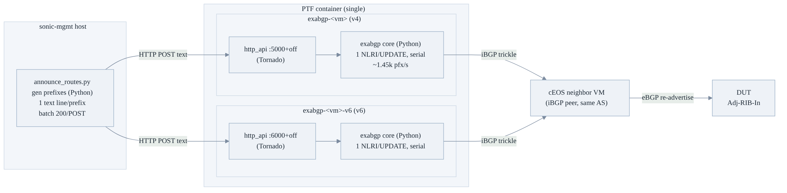

**Symptom, quantified.** At ~32k+/neighbor the announce/withdraw path exhibits:

- HTTP `Connection reset` on large POST bodies and 360s socket timeouts;
- `test_announce_withdraw_route`-class outq/inq drain timeouts (`wait_until(120s)`
  expiring);
- stuck-route baseline-restore asserts (`|after − before| < 5` failing because routes
  were still trickling).

The failure rate rises with prefix count, which makes this a scale failure rather than
a transient one.

### Root cause

The injection path has three independent cost layers — route *generation*
(Python driver), route *injection/transport* (HTTP), and route *advertisement*
(the speaker). Micro-benchmarks that isolate the three show the ceiling is the
**speaker's advertisement rate**, not the transport or the driver. The layers stay
separate throughout this design: a win in one is attributed to that layer alone.

*Figure 2 — the three independent cost layers. Only the speaker layer (the hard
ceiling) is shown in red; this design removes it. Injection/transport is
secondary; generation (shared by both arms) is the next lever after the speaker.*

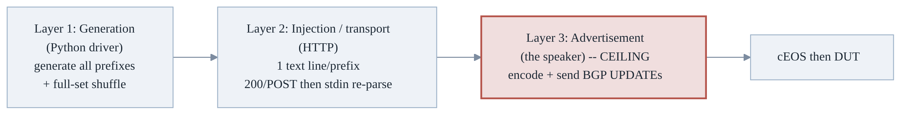

### The proposed solution

Replace the speaker with **GoBGP**, a compiled Go daemon that streams the whole
table into a Go encoder — packing NLRIs that share an attribute set into few
UPDATEs and bursting **an order of magnitude faster** than ExaBGP's serial Python.
A small **shim** presents the HTTP contract the route driver already speaks (same
command grammar, same per-neighbor ports) and translates each command into a GoBGP
`AddPathStream` gRPC
call against **that neighbor's own gobgpd**, so the Python driver and every existing
test stay untouched. The swap ships behind `bgp_speaker` (default `exabgp`), is fully
A/B-able, and evolves incrementally toward the driver speaking gRPC directly.

**Result:**
- **Speed** — per-session route delivery is **3.7×–9.7× faster**, and the advantage
  *grows with scale*.
- **Memory** — each speaker daemon is **1.6×–2.6× lighter under load** (≈3× less per
  route), and that gap *also grows with scale*.
- **Parity** — every ExaBGP capability the sonic-mgmt tests exercise maps to a native
  GoBGP mechanism (Appendix A.1), validated functionally on a T2 topology.

---

## Scope

The end goal is to inject and withdraw **100k+ prefixes/neighbor (v4+v6)** across
many uplinks within the existing functional-test framework, keeping functional
verification on the software cEOS + PTF-speaker model, and removing the ExaBGP
slowness and flakiness class for **all** route-injection topologies
(t0/t1/dualtor/m0/T2/…).

This HLD owns:
- the speaker swap inside the PTF container;
- the HTTP-API compatibility shim;
- the per-neighbor `gobgpd` process model (with a bounded shim pool);
- the `bgp_speaker` back-end selector;
- the receive/observe path change;
- the regression/scale test plan.

**Out of scope:**
- the DUT dataplane and on-switch BGP stack (unchanged);
- snappi/IXIA perf harnesses (retained separately for convergence perf only);
- the fixed-sleep convergence waits in the test path — a separate reliability cost
  the speaker swap leaves in place;
- the legacy `spytest/` ExaBGP usage and the `test_vxlan_vnet_bgp_subintf.py`
  `nohup exabgp` outlier (off the main injection path; deferred — see
  [Limitations and Future Work](#limitations-and-future-work)).

---

## Relationship with Existing Documentation

This HLD is part of the sonic-mgmt testbed documentation suite. The following
documents work together; this one is the design rationale that the route-injection
mechanism docs point to.

| Document | Path | Relationship |
| -------- | ---- | ------------ |
| **Announce Routes (internal)** | [`docs/testbed/READ.testbed.AnnounceRoutes.Internal.md`](READ.testbed.AnnounceRoutes.Internal.md) | The per-topology route-injection mechanism this design accelerates; gains the gobgp arm. |
| **Routing testbed** | [`docs/testbed/README.testbed.Routing.md`](README.testbed.Routing.md) | Route-injection topology context; references the selectable speaker. |
| **cEOS neighbors** | [`docs/testbed/README.testbed.cEOS.md`](README.testbed.cEOS.md) | The emulated neighbor the PTF speaker peers with (unchanged). |
| **exabgp ansible method** | [`docs/api_wiki/ansible_methods/exabgp.md`](../api_wiki/ansible_methods/exabgp.md) | The speaker-manager this design mirrors for GoBGP (`gobgp.py`). |
| **announce_routes ansible method** | [`docs/api_wiki/ansible_methods/announce_routes.md`](../api_wiki/ansible_methods/announce_routes.md) | The driver call-site; grammar/ports preserved by the shim. |
| **BGP scale test plan** | [`docs/testplan/BGP-Scale-Test.md`](../testplan/BGP-Scale-Test.md) | Companion test plan the scale/no-regression gates extend. |
| **docker-ptf image (external)** | `sonic-buildimage` docker-ptf | Paired dependency PR: pinned `gobgpd`/`gobgp` binaries + shim deps. |

---

## Definitions/Abbreviations

| Term | Definition |
|---|---|
| **PTF** | Packet Test Framework container in sonic-mgmt — the route/traffic generator host that runs the BGP speakers peering with the DUT's neighbors. |
| **DUT** | Device Under Test — the SONiC switch whose route scaling we exercise. |
| **cEOS** | containerized Arista EOS — the emulated **neighbor** router the PTF speaker peers with; re-advertises to the DUT. |
| **dRH** | Disaggregated Regional Hub — the program that sets the 100k+/neighbor scale **bar**. |
| **speaker** | the BGP daemon in the PTF that *originates* the test routes (today **ExaBGP**; proposed **GoBGP**). |
| **ExaBGP** | current speaker — single-threaded **Python** BGP implementation driven over an HTTP/stdin text API. |
| **GoBGP / gobgpd** | proposed speaker — compiled **Go** BGP daemon (`gobgpd`) with a gRPC API. |
| **shim** | small Python HTTP adapter presenting ExaBGP's **exact** HTTP endpoint + grammar, translating each command into a GoBGP gRPC call. Makes GoBGP a drop-in. |
| **AddPathStream** | the GoBGP gRPC streaming call the shim uses to push the whole route set in one stream. |
| **Adj-RIB-In / Adj-RIB-Out** | routes a peer has *received* / is *advertising* — our correctness oracles. |
| **GIL** | Python Global Interpreter Lock — within one process, a single thread executes Python bytecode at a time. |
| **funnel** | KVM artifact where several neighbor sessions terminate in one cEOS container and share its CPU, artificially capping end-to-end numbers; absent on physical T2. |

---

## Requirements

RFC-2119 keywords are used deliberately (MUST / SHOULD / MAY).

**Functional**
- **R1.** The framework MUST inject and withdraw ≥100k prefixes/neighbor (v4 and v6) end-to-end to the DUT's Adj-RIB-In.
- **R2.** The GoBGP arm MUST accept the existing HTTP command grammar the route driver emits (`announce/withdraw route … next-hop … as-path […] community […]`, and the bulk `attributes … nlri …` form) on the **same** per-neighbor ports (`5000+off` / `6000+off`).
- **R3.** A route POSTed to a neighbor's port MUST be advertised **only** over that neighbor's session (per-neighbor targeting parity with ExaBGP).
- **R4.** The receive/observe path MUST expose what the DUT advertised back (Adj-RIB-In) as a structured, queryable replacement for the ExaBGP text dump.
- **R5.** Back-end MUST be runtime-selectable via `bgp_speaker=exabgp|gobgp`, **default `exabgp`** during coexistence (disabled-by-default analogue for test infra).

**Non-functional**
- **R6.** Per-session route delivery SHOULD be ≥5× faster than ExaBGP at ≥25k/session and the ratio SHOULD grow with scale.
- **R7.** The shim's process count MUST be bounded by an absolute, host-independent pool size, so its interpreter footprint stays independent of session count and the full-fleet deployment fits the PTF container at any fan-out.
- **R8.** Functional-suite outcomes MUST be **identical** to ExaBGP on the same DUT image.

**Scalability targets**

| Dimension | ExaBGP today | GoBGP target |
|---|---|---|
| prefixes/neighbor | ~32k (flaky) | **100k+** |
| speaker advertise rate | baseline (serial trickle) | **order-of-magnitude faster burst** |
| sessions/fleet (T2) | 144–288 | **288**, within the PTF container's memory budget |
| per-session delivery @ ≥25k | baseline | **≥5×**, growing with scale |

---

## High-Level Design

### Design Principles

- **Drop-in parity over rewrite.** The shim reproduces the HTTP grammar the route
  driver emits and its per-neighbor ports, so the route driver and every existing
  test call-site are **untouched**. A one-shot gRPC rewrite is targeted for a later
  increment.
- **Attributable win.** GoBGP is introduced behind a `bgp_speaker=exabgp|gobgp`
  selector, making every result a clean A/B on the same DUT image.
- **Exact ExaBGP semantics + fault isolation.** One gobgpd per (neighbor, family)
  mirrors ExaBGP's one-process-per-neighbor model and confines a crash's blast radius
  to a single neighbor — see [Daemon topology](#daemon-topology-and-the-shim).
- **Functional parity.** The BGP functional suite MUST produce identical pass/fail on
  both arms with the DUT image held constant, and that gate clears before the default
  flips to gobgp.
- **Deployable at fleet scale.** The one structurally new component — the shim — runs
  as a pool bounded by an absolute size, so its interpreter footprint stays
  independent of session count.
- **Debuggable.** GoBGP exposes a queryable RIB, so failure triage reads live state
  instead of scraping logs.

The alternatives weighed against these principles are recorded in the
[Appendix](#appendix).

### Architecture

No change to SONiC's on-switch architecture. The change is confined to the **PTF
container** inside sonic-mgmt: the speaker box is swapped, everything upstream (the
Python driver, the topology, the cEOS neighbors) and downstream (the DUT) is
unchanged.

*Figure 3 — architecture: BEFORE (today) above, AFTER (proposed) below; each flows
left→right. Only the speaker box changes — the driver, cEOS neighbors, and DUT are
unchanged. The **new/added blocks in AFTER (shim + gobgpd) are highlighted green**.*

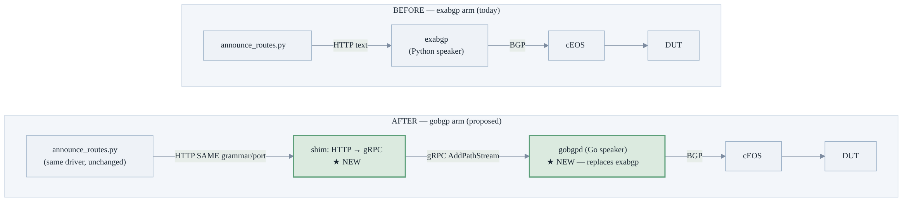

The gobgp arm is selected per run by `bgp_speaker=gobgp`. One `(gobgpd + shim-slot)`
unit replaces one ExaBGP process.

### The bottleneck this design removes

Swapping the speaker box removes three costs from the injection path. Ranked by
impact at 100k+:

| # | Bottleneck | Why it hurts at scale |
|---|---|---|
| **B1** | ExaBGP is a **single-threaded Python speaker** — 1 NLRI/UPDATE, serial | **the hard ceiling** (~1.45k pfx/s) |
| B2 | **one `announce` command per prefix** | 100k text lines even though most share (next-hop, as-path) |
| B3 | **HTTP/Tornado stdin double-handling** | serialize → POST → stdout → re-parse; big bodies → resets/timeouts |

The decisive cost is **B1**, advertisement encode; B2 and B3 are real but secondary.
GoBGP replaces **B1** outright with a Go encoder that packs shared attributes once
and bursts. **B2** and **B3** shrink: the driver still emits one command per prefix,
now consolidated into a single POST that the shim parses once and streams as binary,
which retires the stdout→pipe→stdin relay and ExaBGP's second parse.

The same swap read hop-by-hop (one neighbor, 100k prefixes):

| hop | BEFORE (exabgp) | AFTER (gobgp) |
|---|---|---|
| driver → speaker | 500 POSTs of 200 text lines, `(nh,as-path)` repeated 100k× | **one** POST, streamed once |
| intake → core | stdout → pipe → stdin, **re-parse every line** | parsed once by the shim → binary `AddPathStream` (no pipe, no re-parse) |
| advertise (B1) | **1 NLRI/UPDATE, serial Python** (rig ~1.45k pfx/s) | Go encoder groups shared-attr NLRIs, **burst** (rig ~34k pfx/s) |
| scaling | linear in N | ~fixed setup + fast burst (sub-linear) |

### The integration seam the shim reproduces

The whole injection path converges on **one** HTTP text-command seam. Reproducing it
is what keeps the driver and every test call-site untouched:

```
POST http://<ptf_ip>:<port>   body: {"commands": "<cmd>[;<cmd>...]"}   (or {"command": "<cmd>"})
```

- **Same grammar, same ports.** The command grammar and the deterministic port math
  are the stable contract — specified in **[R2](#requirements)** and inventoried in
  **[Appendix A.1](#a1-capability-inventory)**. The shim
  maps each port to that neighbor/family's own gobgpd gRPC endpoint.
- **Every caller keeps working.** The shim reproduces this seam, so the
  route driver, the test helpers that post to it, and any caller added later all run
  unchanged. The one deliberate exception is the **observe/receive path**, redesigned
  below.

### Daemon topology and the shim

*Figure 4 — per-neighbor daemon topology (mirrors ExaBGP's one-process-per-neighbor
model). The shim **pool** (bounded and portmap-sharded, drawn here as one logical
box) owns the HTTP ports; each port maps to that neighbor/family's own gobgpd over
**gRPC** (a separate local port). Both v4 and v6 daemons peer iBGP with the same cEOS
VM. The **new components (shim pool + per-neighbor gobgpds) are highlighted green**;
the driver, cEOS neighbors, and DUT are unchanged.*

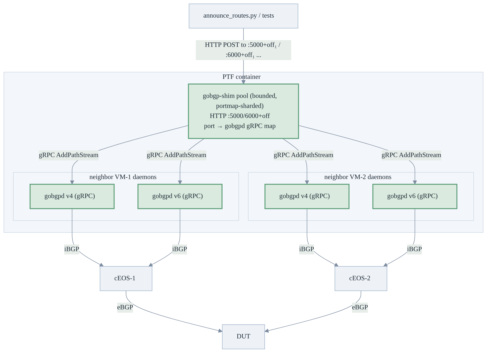

**One gobgpd per (neighbor, family).** ExaBGP advertises a route POSTed to a
neighbor's port over that neighbor's session alone. GoBGP `AddPath` writes the
daemon's **global RIB**, re-advertised to every peer of that daemon subject to export
policy — so one daemon per neighbor reproduces ExaBGP's targeting exactly, and adds
process isolation: a crashed daemon takes only its own neighbor with it. The shim's
loopback test confirms it. A single shared daemon reaches the same targeting through
per-neighbor export policy or VRF tables, which carries policy state proportional to
prefixes × neighbors; it remains a future optimization.

**The shim contract.** The shim is a small Python HTTP→gRPC adapter, deployed as one
logical service across a **bounded pool of processes**, portmap-sharded — separate
processes are what let the CPU-bound protobuf build proceed on separate cores. Each
shim process:
- listens on its **shard** of the ports, so the established port math stays
  authoritative; the union of shards covers all per-neighbor ports, each port owned
  by exactly one shim;
- parses the ExaBGP grammar, reusing the exact parser validated in the bench harness;
- translates to a **batched** `AddPathStream` gRPC call against that port's gobgpd,
  carrying withdrawals in the same stream via each path's `is_withdraw` flag —
  batching is how R6 is met, and test U4 holds it there;
- exposes a **receive endpoint** backed by `ListPath(ADJ_IN)` to replace the bgpmon
  text dump.

**Pool sizing.** The pool size is an absolute, host-independent bound:

```
k = min(ports, pool_max, cpu_allowance)          # pool_max = 8
```

`pool_max` fixes the deployed shape regardless of which server the testbed lands on,
which holds the shim's interpreter footprint independent of session count (**R7**) —
each port still carries its own listener and gRPC channel, so the per-port term grows
with fan-out while the interpreter baseline stays put — and keeps a server shared by
several testbeds predictable; the sweep behind the value 8 is in
[Memory](#memory-consumption-in-the-ptf-container). `cpu_allowance` is the container's
own CPU entitlement — scheduling affinity and cgroup CPU quota — so a small host sizes
the pool down automatically, and `ports` holds the pool to the work available. A
testbed variable overrides the result outright when an operator wants a specific size.

**The shim adds a hop, not a bottleneck.** The speedup comes from moving UPDATE
wire-encoding out of Python into Go, and the shim sits *upstream* of encoding: it
parses the command text and streams paths, leaving every UPDATE to gobgpd. Its one
added cost is a localhost gRPC stream — µs per batch, against seconds of encoding
savings. The bench measured this exact shape (a Python client doing
`build_paths → AddPathStream → gobgpd`), so the performance numbers already carry the
shim's parse and gRPC cost.

### Announce and withdraw flows

*Figure 5 — end-to-end announce with the gobgp arm. GoBGP drives the DUT to
full-received **before `announce_routes` even returns** (the burst tell-tale);
ExaBGP keeps trickling after return.*

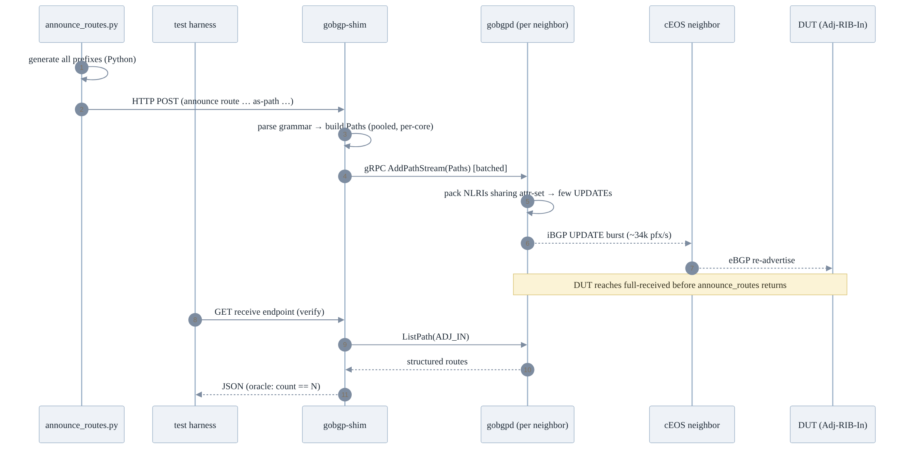

*Figure 6 — withdraw path. Same shim seam: `AddPathStream` honors each
`Path.is_withdraw`, so a bulk withdrawal travels as one stream.*

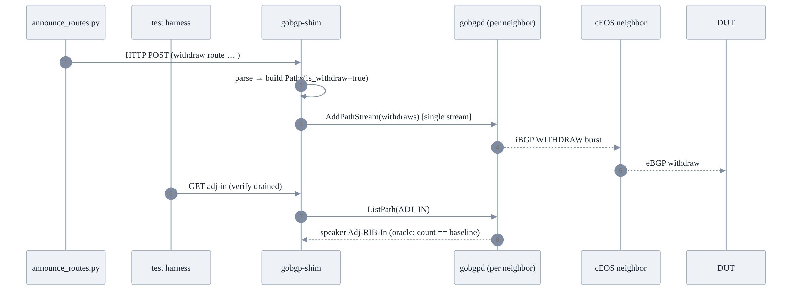

*Figure 7 — per-neighbor daemon resilience: supervisord auto-restarts a crashed
gobgpd while every other session keeps running, holding the blast radius to one
neighbor. Simplified FSM blended with the process lifecycle.*

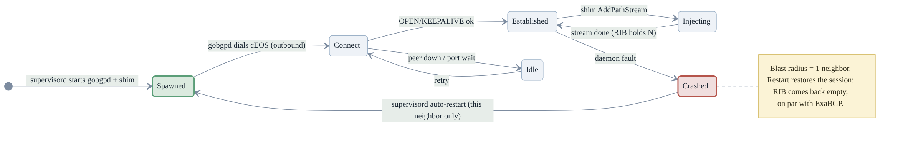

The restart restores the process and its BGP session, on par with ExaBGP: injected
routes live in the speaker's memory in both arms, so the affected neighbor comes back
with an empty table and the test re-posts them. The remaining neighbors are untouched
throughout, and route state stays owned by the test that injected it.

### Observe / receive path redesign

GoBGP exposes a **queryable RIB**, so the shim's receive endpoint is backed by
`ListPath(ADJ_IN)` and returns structured data. That replaces the
line-by-line scrape of ExaBGP's "dump" text log, which drifts whenever the format
changes. This is the single test-side code change, made `bgp_speaker`-aware for
coexistence.

### Serviceability and debuggability

GoBGP improves state observability over ExaBGP, and the one added hop carries its own
trace.

*Figure 8 — on-failure triage: ExaBGP forces log-scraping across N processes; GoBGP
answers "what did the speaker hold / advertise / receive?" as structured JSON.*

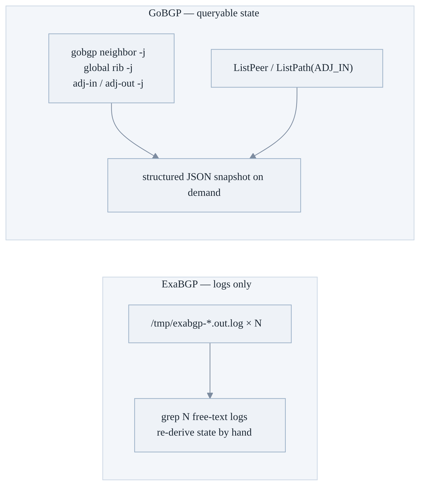

- **Live state:** `gobgp neighbor [-j]`, `gobgp global rib [-j]`, `gobgp neighbor <ip> adj-out/adj-in [-j]`
  — ground truth of session state, what we advertise, and what the DUT advertised to
  us, each available as JSON:

  ```console
  $ gobgp neighbor 10.0.0.56 adj-out -a ipv4 -j | jq '.[0]'
  {"prefix":"192.0.2.0/24","nexthop":"10.0.0.57","as_path":[65200,64512]}
  ```
- **Structured logs:** gobgpd logrus/JSON with `--log-level=debug` for per-message FSM/UPDATE tracing.
- **Collect-on-failure hook:** a pytest teardown (in the gobgp helper) dumps per-neighbor
  `neighbor -j` / `global rib -j` / `adj-out -j` on any BGP-test failure — a complete
  structured artifact for post-mortem.
- **The added shim hop stays diagnosable:** the shim logs every inbound command, the
  exact gRPC call, and the returned status, so triage separates **shim from daemon**
  in one log (`--debug` passthrough mirrors ExaBGP's flag).

---

## Performance — the isolated speaker win

**How this is measured.** Each result is a pair of runs on one machine, back to back.
The PTF container sends the same prefixes, built from the same seed, to the same
neighbors; the only difference between the two runs is which speaker the container
starts. What receives the routes depends on the rig: the micro-bench uses a plain
gobgpd as the receiver, and the higher rigs use a real Arista cEOS neighbor, then a
real DUT behind it, then a real T2 chassis. [Testing](#testing-requirements--design)
lays the rigs out as a ladder; a result that repeats as the rig gets more real is a
property of the speaker.

The clock starts when injection starts and stops once the receiver holds every route
that was sent, so the receiver's route count is the correctness oracle for each run.

These are shared lab machines with other workloads on them, so the two arms are
interleaved — ExaBGP, GoBGP, ExaBGP, GoBGP — and the median of N is reported. Any
drift in host load then lands on both arms equally.

**What is reported.** Read each table across a row: the ratio between the two speakers
is the result. The seconds themselves belong to the machine that produced them — a
faster CPU lifts both arms together — so every table names its rig, and no ratio is
built from two different rigs.

The results run per-session first — across three rigs, on the prefix-count axis, the
fan-out axis, and a real chassis — and close with the whole-module clock.

**Isolated single-session sweep — real cEOS, KVM.**

| routes/session | ExaBGP | GoBGP | **ratio** |
|---:|---:|---:|---:|
| 12,800 | 10.56s | 2.82s | 3.73× |
| 25,600 | 19.12s | 3.27s | **5.85×** |
| 51,200 | 36.28s | 4.93s | **7.35×** |
| 102,400 | 71.95s | 7.39s | **9.73×** |

**The ratio grows with scale.** ExaBGP's time is **linear in N** — a serial Python
trickle. GoBGP is **sub-linear**: a few seconds of fixed setup, then one burst. The
advantage therefore widens exactly as the test pushes toward the scale that matters,
crossing the ≥5× bar at ~25k/session.

*Figure 9 — why the gain grows: ExaBGP's time rises linearly with route count while
GoBGP stays near-flat, so the ratio widens with scale. Single neighbor, real cEOS, KVM.*

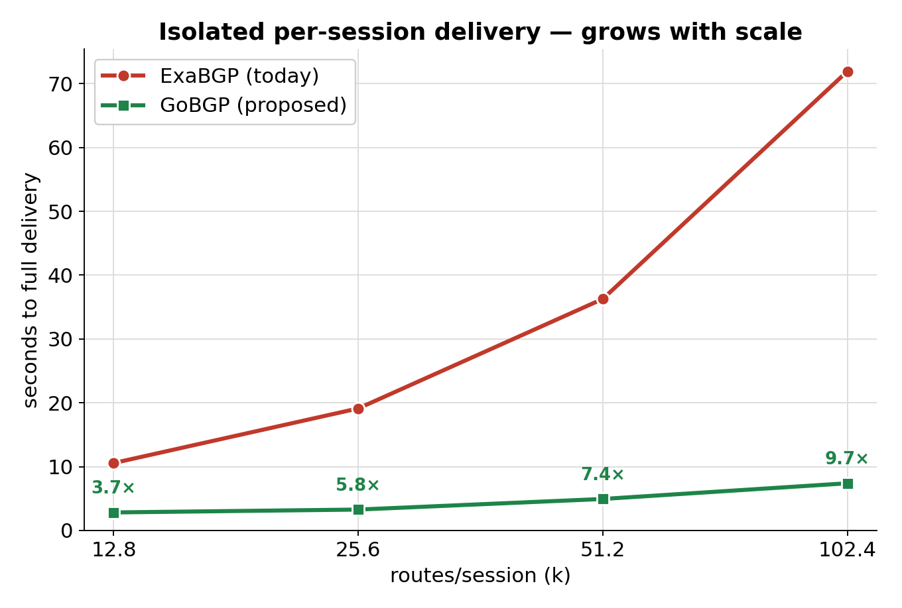

**A second scaling axis — fan-out (~7–12×).** This fixes **30k/neighbor** and scales
*neighbors* (Figure 9 scaled prefixes). Measured on the **multi-sink isolation rig**
(N speakers ↔ N dedicated 1:1 sinks, dev VM) — the speaker+inject isolation family,
so ratios track the speaker-alone micro-bench
([Appendix A.2](#a2-results-the-body-does-not-cover)) rather than the L2 real-cEOS
delivery. The
win holds because each ExaBGP process remains a single-threaded Python encoder and
the processes contend for the same PTF-host CPU as N grows, while each GoBGP speaker
encodes in Go and drives its own receiver over native BGP.

| N neighbors (30k each) | ExaBGP | GoBGP | ratio | GoBGP paths/s/spk |
|---:|---:|---:|---:|---:|
| 1  | 10.65s | 0.92s | **11.6×** | 32,749 |
| 4  | 11.31s | 1.00s | **11.3×** | 29,961 |
| 16 | 20.50s | 2.79s | **7.3×**  | 10,762 |
| 32 | 38.85s | 5.59s | **6.9×**  | 5,367 |

*Figure 10 — fan-out delivery (N speakers, 30k/neighbor, dev VM multi-sink
isolation): ExaBGP rises with neighbor count while GoBGP stays near-flat, so a
6.9–11.6× lead holds across the whole fan-out range. Per-speaker throughput stays ~7×
higher even at N=32. Complements Figure 9's per-prefix axis.*

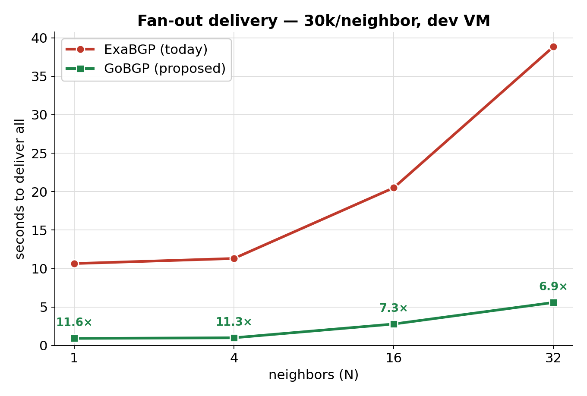

**Physical T2 — 72 cEOS neighbors on a real chassis.**

| Rig | Neighbors | Metric | ExaBGP | GoBGP | Result |
|---|---:|---|---:|---:|---|
| L5 physical T2, per-session | **72** | delivery, real chassis | 6.4→19.4s | 2.4→3.5s | **2.7×→5.5×** |

The per-session win persists at this fan-out and grows with per-session route count.
Isolating the **advertisement** stage alone, by subtracting the shared driver cost,
puts GoBGP at ~**12×** (18s→1.5s) — the same order as the isolation-family rigs above.
The ratio and shape repeat on a 16c VM, a 104c box, KVM, and a real T2 chassis, so the
win is a property of the speaker.

**Whole-fleet wall-clock — where the speaker is a quarter of the work.** Timing the
entire `announce_routes` module (all 72 neighbors / 144 sessions at ~34k each):

- **Result:** ExaBGP **108.4s** vs GoBGP **105.0s** — **~parity (~3%)**.
- **Why:** a generate-only run (`action=generate`) is **78.1s ≈ 74%** of the
  wall-clock, identical for both arms (`generate_routes` + full-set shuffle of ~2.4M
  prefixes). The speaker is only the remaining ~26% — small at 34k with 72-way
  parallelism, so the per-session win stays **invisible in this clock** (gobgp
  arm engaged — post-announce gobgpd RIB = 34,486 v4).
- **Next lever:** route generation, which lifts both arms — see
  [Future Work](#limitations-and-future-work).

---

## Memory consumption in the PTF container

Zero impact on the DUT. Inside the PTF container the accounting is simple: each gobgpd
replaces one ExaBGP process 1:1, so the one structurally new component is the shim.

**Measured per-process idle RSS** (t2 host): ExaBGP **24.1 MB**, gobgpd **16.0 MB**,
shim **~40 MB**. A shim costs that ~40 MB however many ports it fronts, so the number
of shims — and nothing else — sets the shim budget.

**Choosing the number of shims.** Three topologies, swept at fleet scale on one host
in one load window (8 ports = 4 cEOS neighbors × 2 families, ~205k prefixes/family,
16-core PTF, 2 iterations each):

| Config | Shim procs | Idle RSS | Announce | Withdraw | Verdict |
|---|---:|---:|---:|---:|---|
| **SEP** (1/session, stock) | 8 | 319 MB | ~21.0s | ~13.5s | memory grows with sessions |
| **CONS** (1 total) | 1 | 40 MB | ~27.8s **(+32%)** | ~21.5s **(+59%)** | single-process regression |
| **POOL** (4) | 4 | 159 MB | ~21.9s **(+4%)** | ~14.7s **(+9%)** | **chosen** — low memory, perf parity |

CONS held memory and per-neighbor isolation, and gave back performance: with a
listener thread per port and the driver POSTing to every port at once, the eight
concurrent requests still serialized — the signature of GIL-held CPU work in the
per-prefix protobuf build. Separate processes restore the overlap, and four already
recover parity, so the pool wants to be small.

Timing the shim's two stages directly confirms the cause. On a 16-core Xeon 8370C,
building the gRPC `Path` protobuf costs **12.5 µs/route** and parsing the command text
**2.7 µs/route**, so a 50k-route neighbor spends **0.74 s** in Python holding the GIL,
against ~1.16 s in `AddPathStream`, which releases it. Scheduling alone cannot lift
that ceiling: a fleet announce of 100 neighbors × 50k routes carries ~75 core-seconds
of Python, which one process runs in ~75 s and eight run in ~9 s.

Sharding is what lets `k` shims front more than `k` ports: port `p` is served by
shim `p mod k`, so every port has exactly one owner and each port still maps 1:1 to
its own gobgpd, keeping per-neighbor targeting intact (Figure 4).

**Pool size = 8.** Eight sits above the point where parity returned, holds a
fleet-scale announce to seconds of protobuf build, and stays low enough
that several testbeds share a server comfortably. At the T2 fleet shape (288 sessions)
the stock arrangement runs 288 shims for ~11.5 GB; the bounded pool runs 8 for
**~320 MB (~36× less)**, and that number holds at any fan-out.

**The pool budget is flat in route count too.** The shim is a stateless HTTP→gRPC path
streamer — it holds no RIB, and `/adj-in` reads ADJ_IN back from gobgpd on demand.
Driving 40k then 80k routes through one shim moved its RSS by the same ~15 MB (37 →
52 MB either way, a one-time allocator high-water). Four shims at 40k each (160k
total) came to **4 × 52 MB = 208 MB**, each identical to ±0.1 MB. Flat in sessions and
flat in prefixes is what **R7** asserts.

**gobgpd is lighter than ExaBGP under load.** Fresh restart per point, fixed seed,
`VmRSS` sampled once the RIB is programmed and quiesced, idle baseline subtracted,
3 reps, medians — sweeping v4 prefixes/neighbor on the bench rig:

| routes/neighbor | ExaBGP loaded | gobgpd loaded | advantage |
|---:|---:|---:|:--|
| 12,800 | 58.4 MB | 36.4 MB | gobgpd **1.60×** lighter |
| 25,600 | 95.9 MB | 51.0 MB | gobgpd **1.88×** lighter |
| 51,200 | 171.0 MB | 76.8 MB | gobgpd **2.23×** lighter |
| **102,400** | **321.0 MB** | **122.5 MB** | gobgpd **2.62×** lighter |
| **per-route slope** | **≈3070 B/route** | **≈1000 B/route** | **3.06× lighter/route** |

ExaBGP holds a flat ~3070 B/route while gobgpd's typed RIB amortizes down
(1489 → 1070 B/route), so the advantage widens with scale.

*Figure 11 — loaded per-daemon RSS, ExaBGP vs gobgpd, v4 prefixes/neighbor (bench rig).*

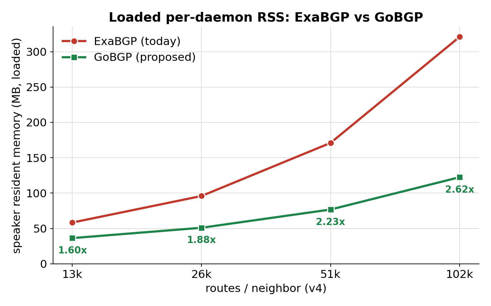

**Physical T2 confirms the deployed shape.** The gobgp arm ran at fleet scale
(144 sessions × ~34k, after the fd-ceiling fix) inside the container budget, and
convergence there became shim-dispatch bound once the speaker tail vanished — the next
limiter, and the one the pool is sized against.

---

## Capability coverage

Every ExaBGP capability the `tests/` survey shows in use maps to a native GoBGP
mechanism, so the swap delivers **parity across the audited capability set** — the
capability→mechanism→verdict matrix is in
[Appendix A.1](#a1-capability-inventory). One capability sits outside that set:
emitting intentionally malformed BGP, which GoBGP declines to do. A phase-0 audit
confirms no test relies on it, and ExaBGP stays selectable as an escape hatch.

## Configuration — the `bgp_speaker` selector

For test infra the config surface is ansible vars, not CONFIG_DB — there are **no
SONiC CLI or YANG changes** and the feature adds no on-switch config. The only
operator-facing control is a testbed/topology variable consumed by ansible, plus
GoBGP's own `gobgp` CLI used for debugging.

- **New var:** `bgp_speaker: exabgp | gobgp` in testbed/topology vars.
- **Default:** `exabgp` in phase 1 (backward-compatible; existing testbeds behave identically).
- **Effect:** the injection role branches on the var to start either the exabgp
  supervisord groups or the `gobgpd` + `gobgp-shim` programs; the `wait_for` port
  checks are unchanged, since the ports are unchanged.
- **Optional override:** `gobgp_shim_pool_size` pins the shim pool to an explicit
  process count, replacing the computed
  [pool sizing rule](#daemon-topology-and-the-shim). Unset is the norm; an operator
  sets it when a server hosts an unusual mix of testbeds.
- **Backward compatibility:** absent/unset ⇒ `exabgp`, so **every existing testbed
  keeps its behavior**. Both back-ends stay guarded so a testbed can run either
  during coexistence.
- Per-neighbor gobgpd config is a rendered **toml** (that one neighbor, per-family
  afi-safis, passive/listen) written by the speaker manager — internal, not
  operator-facing.

```yaml
# testbed/topology var (illustrative)
bgp_speaker: gobgp        # exabgp (default) | gobgp
```

## Change set (implementation surface)

The concrete change set is small and confined to
sonic-mgmt (plus one paired docker-ptf image PR):

| Surface | Nature | What changes |
|---|---|---|
| Speaker manager | **net-new** | per-neighbor gobgpd config + supervisord programs + portmap, and start/stop/restart/status lifecycle (the GoBGP analogue of the exabgp manager). |
| HTTP-API shim | **net-new** | the compatibility server: command parser + gRPC translator + structured receive endpoint. |
| Generated gRPC stubs | **net-new** | GoBGP gRPC Python bindings, pinned to the image's gobgpd version. |
| Injection role task | modified | branch on the `bgp_speaker` selector (start gobgp/shim vs exabgp programs); same `wait_for` port checks. |
| PTF process reaper | modified | extend the kill list to reap gobgpd + shim. |
| Observe path | modified | read the shim's structured `ADJ_IN` endpoint instead of scraping speaker logs; `bgp_speaker`-aware. |
| Selectors + docs | modified | add the `bgp_speaker` selector to testbed/topology vars; add runbook + this HLD. |
| docker-ptf image | **paired external PR** | add pinned gobgpd + gobgp binaries and shim Python deps; keep exabgp during coexistence. *(Tracked as a dependency.)* |

The route generator is **near-zero change** and the test-facing injection helpers are
**unchanged**, both consequences of preserving the seam. The one helper that moves is
the receive-path helper, which reads the shim's `ADJ_IN` endpoint.

---

## Testing Requirements / Design

The method is validated in **layers of increasing fidelity**, each adding one element
of real-world realism on top of the layer below, so any regression pinpoints exactly
which added element introduced it. The A/B protocol common to every layer is stated in
[Performance](#performance--the-isolated-speaker-win). The top rung (**L5**) is the
real T2 chassis:

| Layer | Rig | Adds vs previous layer | What it isolates / proves |
|---|---|---|---|
| **L1 — Micro-bench A/B** | dev VM 16c/62 GB + prod-class 104c/503 GB; local gobgpd receiver, no DUT | — (baseline) | raw speaker + inject rate |
| **L2 — Isolated single-session** | KVM t0, one PTF container; real cEOS peer | a real BGP peer | advertise rate to a real peer |
| **L3 — End-to-end DUT-received** | KVM t0; real driver → cEOS → DUT Adj-RIB-In | the real driver + the DUT | speaker-attributable win survives the full path |
| **L4 — Shim footprint / perf** | KVM t0; SEP / CONS / POOL sweep | productization (memory + concurrency) | the bounded pool holds performance within the container's memory budget |
| **L5 — Physical T2** | 56c/187 GB server, 72 cEOS, real T2 chassis | real hardware + full fan-out (no funnel) | true-scale, no-regression on a real chassis |

### Unit Test cases
| # | Test | What it proves |
|---|---|---|
| U1 | shim grammar parser vs ExaBGP command set (route/attributes/withdraw/community/local-pref/med/origin) | grammar parity |
| U2 | shim loopback: POST → gRPC → gobgpd RIB holds exactly N (11/11 PASS) | translation correctness |
| U3 | shim robustness / negative gate: malformed/oversized/partial commands (20/20 PASS) | fault handling |
| U4 | `AddPathStream` batching (no per-route unary) — assert stream call count | guards R6 (batched-gRPC design) |
| U5 | per-neighbor targeting: route on port A never appears in neighbor B's adj-out | R3 |
| U6 | receive endpoint returns structured `ADJ_IN` matching DUT advertisement | R4 |

Run inside the shim's local harness (reuses the `build_paths` helper directly); no DUT required for U1–U4.

### System Test cases
| # | Scenario | Legacy (ExaBGP) behavior | Expected (GoBGP) behavior |
|---|---|---|---|
| S1 | Full BGP/route functional suite on KVM t0/t1/dualtor/m0 | pass/fail set X | **identical** pass/fail set (parity) |
| S2 | Announce/withdraw ≥100k/neighbor, end-to-end to the DUT's Adj-RIB-In | slow/flaky, timeouts | completes, no stuck-route asserts — **the gate for R1's 100k target** (pending) |
| S3 | Per-session delivery sweep 12.8k→102.4k | baseline | ratio ≥5× at every point ≥25k/session |
| S4 | Physical T2 per-session 5k→20k | baseline | ratio grows with per-session route count, ≥2.5× throughout |
| S5 | Flakiness A/B on `test_announce_withdraw_route` | intermittent drain/stuck | clean |
| S6 | Churn soak (announce↔withdraw) | baseline | 30/30 clean |
| **S7** | **No-regression: BGP functional suite A/B, DUT image held constant, only speaker swapped** | baseline outcome bucket | **identical bucket → NO REGRESSION** (machine-diffed JUnit) |

**No-regression gate — DONE (physical T2 chassis).**
`test_bgp_fact`, `test_bgp_session_flap`, `test_bgp_update_timer`, `test_bgpmon`,
`test_bgpmon_v6`, `test_bgp_peer_shutdown` ran A/B on the same DUT image, and every
case landed the identical outcome on both arms.

**Additional gates:**
- **Equivalence harness (backbone):** run ExaBGP and GoBGP back-to-back on identical
  inputs; diff DUT Adj-RIB-In and functional JUnit.
- **Capability parity matrix:** each capability from the inventory (Appendix) is a
  gate, run on both back-ends.
- **CI acceptance:** `bgp_speaker=gobgp` green on the KVM matrix before flipping the
  default.

---

## Limitations and Future Work

**Current limitations**
- **Off-path legacy tests:** a few legacy tests inject BGP outside the standard
  supervisord/HTTP path and are not covered in phase 1.
- **Per-prefix protobuf build:** GoBGP's gRPC API carries one route per message, so the
  shim builds one protobuf per prefix at 12.5 µs/route — inherent to the API, and
  spread across the shim pool (see
  [Memory](#memory-consumption-in-the-ptf-container)).
- **CPU entitlement is advisory:** the PTF container runs today without an explicit
  CPU limit, so `cpu_allowance` reads as the whole host and `pool_max` is what
  actually bounds the pool. An operator who gives the container a cgroup CPU quota
  gets a proportionally smaller pool automatically.

**Future increments**
- **Direct-gRPC (likely end-state):** drive `gobgpd` over gRPC directly, dropping the
  HTTP-text grammar and the shim hop, and overlapping generation with encode.
- **Route generation — the next bottleneck:** once the speaker is fast, Python route
  generation becomes the dominant cost in the fleet clock; optimizing it is the largest
  remaining lever and speeds up every arm.
- **Daemon consolidation:** optionally collapse the per-neighbor `gobgpd` instances
  via per-neighbor export policy.

---

## Appendix

### A.1 Capability inventory

Every ExaBGP capability the `tests/` survey shows in use, and the GoBGP mechanism that
carries it:

| ExaBGP capability used | GoBGP native mechanism | Verdict |
|---|---|---|
| Announce route + next-hop | `AddPath`/`AddPathStream` (typed `Path`) | ✅ native |
| Withdraw route | `AddPathStream` with `Path.is_withdraw` | ✅ native |
| Bulk announce (`attributes … nlri …`) | `AddPathStream` (one stream, N paths) | ✅ native — the core win |
| AS-path (prepend/spoof) | `AsPathAttribute` segments | ✅ native |
| Communities / large / extended | `CommunitiesAttribute` / `LargeCommunity` / `ExtendedCommunities` | ✅ native |
| Local-pref, MED, origin, next-hop-self | `LocalPref`/`Med`/`Origin`/`NextHop` attrs | ✅ native |
| IPv4 + IPv6 (incl. link-local NH) | `Family(AFI_IP/IP6)`, MP_REACH | ✅ native (bench-verified) |
| ECMP/multipath (same prefix, N speakers) | multiple neighbors advertise same NLRI | ✅ native |
| Passive / listen mode | neighbor `transport.passive-mode`, dynamic-neighbors | ✅ native |
| Many neighbors, per-peer targeting | **one gobgpd per (neighbor, family)** | ✅ exact semantic parity |
| Observe DUT-advertised routes | `ListPath(ADJ_IN)` (structured) | ✅ native, **better** than text scrape |
| Route flap / high-churn | `AddPathStream` announce/withdraw loops (stable under churn) | ✅ native |
| Default-route inject | a `0.0.0.0/0` path | ✅ native |
| **Intentionally malformed/crafted BGP** | GoBGP emits valid UPDATEs only | ⚠️ outside the set — no test relies on it (audit gate) |

### A.2 Results the body does not cover

[Performance](#performance--the-isolated-speaker-win) carries the per-session,
fan-out, physical-chassis, and whole-fleet numbers. Two further measurements sit
outside it:

| Measurement | What it answers | Result |
|---|---|---|
| The speaker alone, 100k routes into a local receiver — run on the dev VM and again on the 104c host | How fast is the speaker itself, with no real peer and no DUT in the way? | GoBGP **~14×** faster on the dev VM, **~9.5×** on the 104c host |
| End to end on KVM: the real route driver → cEOS → the DUT's Adj-RIB-In | How much of the speaker win survives the full production path? | **2.4–2.7×** on raw wall-clock at 205k–410k routes. Python route generation, which both arms pay identically, accounts for the rest of that clock; the speaker-attributable term alone is **4.9–6.2×** |

### A.3 Alternatives considered

| Alternative | Why it was set aside |
|---|---|
| **RustyBGP** — a Rust reimplementation of GoBGP | Ships only as an experimental nightly build, and its gRPC API differs from GoBGP's. The measured edge over GoBGP is ~1.3–1.4×. Worth revisiting on a stable release. |
| **BIRD / FRR / OpenBGPD** | Production routing stacks, driven by configuration rather than a route-injection stream, so bulk announce means templating and reloading per neighbor. FRR carries a further cost: each instance runs a multi-daemon stack (zebra + bgpd + watchfrr) with a kernel dataplane view, which is heavy at fleet fan-out inside one container. |
| **Grouping routes into ExaBGP's bulk `attributes … nlri …` form** | Fewer commands still reach the same single-threaded Python encoder: 2–3× at fan-out, flat at a single neighbor. Kept as a stopgap that adds no dependency. |
| **Changing the transport instead of the speaker** — gRPC in place of HTTP text | Keeping the Python speaker and swapping only the wire format gained ~6% in the micro-bench. Nearly all of the time sits in the Python UPDATE encoder, so the speaker is the piece that has to change. |
| **Parallelizing the route driver instead of the speaker** | Dispatch got 7× faster and the run only 14% faster, because the run waits on the speaker. |
| **sonic-vpp / NUT** | Both still drive an in-container speaker: vpp uses the existing ExaBGP path, and NUT's virtual traffic generator needs a fast speaker underneath it. |

