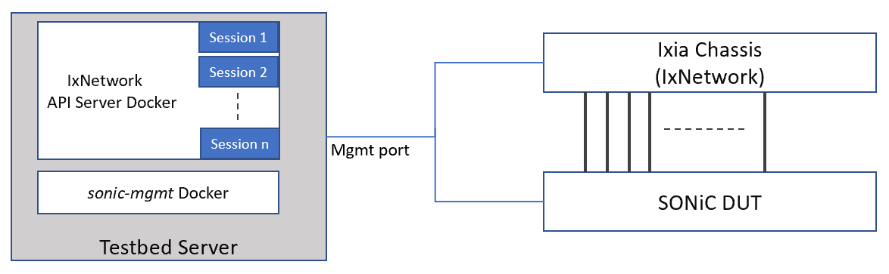
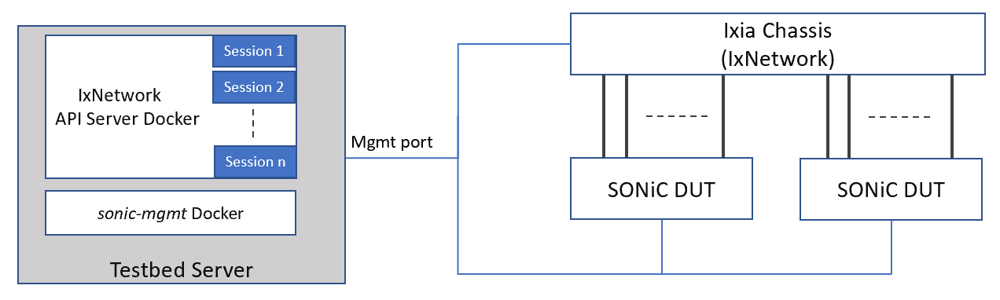
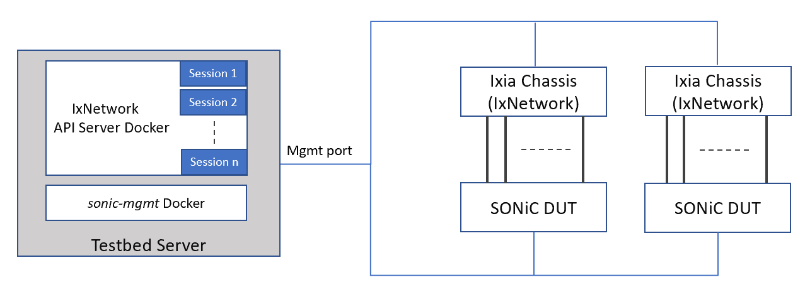
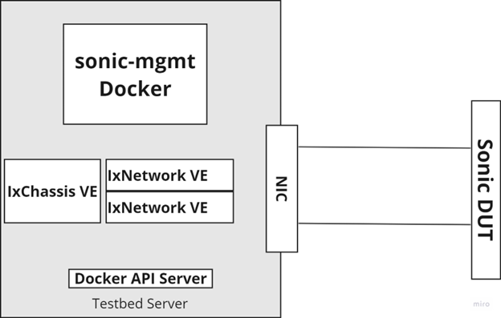

# SONiC Testbed with Keysight IxNetwork as Traffic Generator

This section gives an overview of the stand-alone testbed topology where SONiC DUT is directly connected with Keysight’s protocol emulator and traffic generator (IxNetwork).

## Physical Topology

Based on test need there may be multiple topologies possible as shown below :

- Single DUT Topology



- Multiple DUT Topology



- Multiple IxNetwork Topology


## Virtual Topology

## Topology Description

### Ixia Chassis (IxNetwork)
Keysight IxNetwork is used as the network tester to emulate protocol sessions eg. OSPF, BGP, LACP etc. and send data traffic with various user defined traffic profiles at line rate. Based on test need this can support line cards of varying speed ranging from 1G to 400G. It also supports vlan separated logical interfaces over each physical port.

### IxNetwork API Server Docker

The IxNetwork API Server docker is installed in the Testbed server along with sonic-mgmt docker. It provides API server, that is used to configure the Traffic Generator (IxNetwork) using restPy APIs. It is capable of offering multiple sessions of IxNetwork API server. Each session runs independent of each other and configures IxNetwork.

### Network connections
- IxNetwork API server is connected to IxNetwork via the management port.
- IxNetwork test ports are directly connected to single or multiple DUTs.

## Deploy IxNetwork API Server

### Download IxNetwork API Server docker image
1. Download IxNetwork Web Edition (Docker deployment) from [ here ](https://downloads.ixiacom.com/support/downloads_and_updates/public/ixnetwork/9.30/Ixia_IxNetworkWeb_Docker_9.30.2212.22.tar.bz2)

2. Copy the tar.bz2 file on the testbed server.

3. Make sure the interface has promiscuous mode enabled
```
 ifconfig ens160  promisc
 ```

3. Decompress the file (it may take a few minutes):
```
tar xvjf <path_to_tar_file>
```
### Run IxNetwork API Server docker

1. Load the image to docker:
```
docker load -i Ixia_IxNetworkWeb_Docker_<version>.tar
```
2. Loaded image : `ixnetworkweb_<version>_image`

3. Create the macvlan bridge to be used by IxNetwork Web Edition:
```
docker network create -d macvlan -o parent=ens160 --subnet=192.168.x.0/24 --gateway=192.168.x.254 <bridge_name>
(NOTE: Use your subnet, prefix length and gateway IP address.)
```

4. Verify bridge got created properly:
```
docker network ls
docker network inspect IxNetVlanMac
```
5. Deploy the IxNetwork Web Edition container using the following command ixnetworkweb_\<version>_image  should be as shown in step 2 above):
```
docker run --net <bridge_name> \
--ip <container ip> \
--hostname <hostname> \
--name <container name> \
--privileged \
--restart=always \
--cap-add=SYS_ADMIN \
--cap-add=SYS_TIME \
--cap-add=NET_ADMIN \
--cap-add=SYS_PTRACE \
-i -d \
-v /sys/fs/cgroup:/sys/fs/cgroup \
-v /var/crash/=/var/crash \
-v /opt/container/one/configs:/root/.local/share/Ixia/sdmStreamManager/common \
-v /opt/container/one/results:/root/.local/share/Ixia/IxNetwork/data/result \
-v /opt/container/one/settings:/root/.local/share/IXIA/IxNetwork.Globals \
--tmpfs /run \
ixnetworkweb_<version>_image

Note : The folders within /opt/container/one/ should to be created with read and write permission prior docker run.

```

6. Launch IxNetworkWeb using browser `https://container ip`


## For Virtual Topology next steps are required
### Deploy Ixia_Virtual_Chassis

1. Download Ixia_Virtual_Chassis image from:
https://downloads.ixiacom.com/support/downloads_and_updates/public/IxVM/9.30/9.30.0.328/Ixia_Virtual_Chassis_9.30_KVM.qcow2.tar.bz2
2. Start the VMs:

Example is for the image located in /vms
 ```
 cd /vms
 sudo tar xjf Ixia_Virtual_Chassis_9.30_KVM.qcow2.tar.bz2
 virt-install --name IxChassis --memory 16000 --vcpus 8 --disk /vms/Ixia_Virtual_Chassis_9.30_KVM.qcow2,bus=sata --import --os-variant centos7.0 --network bridge=br1,model=virtio --noautoconsole

 ```
3. If a dhcp server is present we can observe the IP assigned
```
  Welcome to Ixia Virtual Chassis
  CentOS Linux 7
  Kernel 3.10 on x86_64
  Management IPv4: 10.36.78.217/22
  IxOS Version: 9.30.3001.12
  IxNetwork Protocol Version: 9.30.2212.1
```
Note: If the Ixia Virtual Chassis dont take the ip from DHCP server this solutions might help you:
- Disable firewall
```
sudo ufw disable
```
- Instead of command in step 2
```
virt-install --name IxChassis --memory 16000 --vcpus 8 --disk /vms/Ixia_Virtual_Chassis_9.30_KVM.qcow2,bus=sata --import --os-variant centos7.0 --network bridge=br1,model=virtio --noautoconsole
```
Try to use this
```
virt-install --name IxChassis --memory 16000 --vcpus 8 --disk /vms/Ixia_Virtual_Chassis_9.30_KVM.qcow2,bus=sata --import --osinfo detect=on,require=off --network bridge=br1,model=virtio --noautoconsole
```

### Deploy two Ixia Virtual Load Module
#### Prerequisite
1. For PCI forwarding the SR-IOV and IOMMU must be enabled in BIOS
2. In ubuntu server the file /etc/default/grub must be edited. Add the arguments "intel_iommu=on iommu=pt" for the GRUB_CMDLINE_LINUX_DEFAULT line
```
GRUB_CMDLINE_LINUX_DEFAULT="quiet splash intel_iommu=on iommu=pt"
```
Example of file:
```
GRUB_DEFAULT=0
GRUB_TIMEOUT_STYLE=hidden
GRUB_TIMEOUT=0
GRUB_DISTRIBUTOR=`lsb_release -i -s 2> /dev/null || echo Debian`
GRUB_CMDLINE_LINUX_DEFAULT="quiet splash intel_iommu=on iommu=pt"
GRUB_CMDLINE_LINUX=""
```

#### Identify the PCI device designated for passthrough to the Load Modules
1. Get the pci number of the device designated for passthrough
```
lspci | grep Ethernet
```
Output example
```
04:00.0 Ethernet controller: Intel Corporation I210 Gigabit Network Connection (rev 03)
05:00.0 Ethernet controller: Intel Corporation I210 Gigabit Network Connection (rev 03)
21:00.0 Ethernet controller: Mellanox Technologies MT27700 Family [ConnectX-4]
21:00.1 Ethernet controller: Mellanox Technologies MT27700 Family [ConnectX-4]
```
So in this case the device designated for passthrough to the Load Modules are:

21:00.0 for Load Module 1 (virt-install require the different syntax 21:00.0 -> pci_0000_21_00_0)

21:00.1 for Load Module 2 (virt-install require the different syntax 21:00.1 -> pci_0000_21_00_1)


#### Load Module 1
1. Download Ixia_Load_Module image from:
   https://downloads.ixiacom.com/support/downloads_and_updates/public/IxVM/9.30/9.30.0.328/Ixia_Virtual_Load_Module_IXN_9.30_KVM.qcow2.tar.bz2
3. Start the VMs:

Example is for the image located in /vms
```
cd /vms
sudo tar xjf Ixia_Virtual_Load_Module_IXN_9.30_KVM.qcow2.tar.bz2
mv Ixia_Virtual_Load_Module_IXN_9.30_KVM.qcow2 IxLM1.qcow2

sudo virt-install --name IxLM1 \
--ram 4096 \
--vcpus 4 \
--network bridge=br1,model=virtio \
--host-device=pci_0000_21_00_0 \      #Change the pci_0000_21_00_0 to yours from "Identify the PCI device designated for passthrough to the Load Modules" section
--serial pty \
--serial unix,path=/tmp/Virtual_Load_Module_1 \
--disk path=/vms/IxLM1.qcow2,device=disk,bus=sata,format=qcow2 \
--channel unix,target_type=virtio,name=org.qemu.guest_agent.0 \
--boot hd \
--vnc \
--noautoconsole \
--osinfo detect=on,require=off \
--force

```
3. If a dhcp server is present we can observe the IP assigned
```
Welcome to Ixia Virtual Load Module
CentOS Linux 7
Kernel 3.10 on x86_64
Management IPv4: 10.36.78.31/22
IxOS Version: 9.30.3001.12
IxVM Status: Active: activating (start) since Fri 2023-06-16 13:54:35 PDT; 1s ago
```

#### Load Module 2
1. Start the VMs:

Example is for the image located in /vms
```
cd /vms
sudo tar xjf Ixia_Virtual_Load_Module_IXN_9.30_KVM.qcow2.tar.bz2
mv Ixia_Virtual_Load_Module_IXN_9.30_KVM.qcow2 IxLM2.qcow2

sudo virt-install --name IxLM2 \
--ram 4096 \
--vcpus 4 \
--network bridge=br1,model=virtio \
--host-device=pci_0000_21_00_1 \       #Change the pci_0000_21_00_1 to yours from "Identify the PCI device designated for passthrough to the Load Modules" section
--serial pty \
--serial unix,path=/tmp/Virtual_Load_Module_2 \
--disk path=/vms/IxLM2.qcow2,device=disk,bus=sata,format=qcow2 \
--channel unix,target_type=virtio,name=org.qemu.guest_agent.0 \
--boot hd \
--vnc \
--noautoconsole \
--osinfo detect=on,require=off \
--force
```
2. If a dhcp server is present we can observe the IP assigned
```
Welcome to Ixia Virtual Load Module
CentOS Linux 7
Kernel 3.10 on x86_64
Management IPv4: 10.36.78.219/22
IxOS Version: 9.30.3001.12
IxVM Status: Active: activating (start) since Fri 2023-06-16 16:42:40 PDT; 1s ago
```
