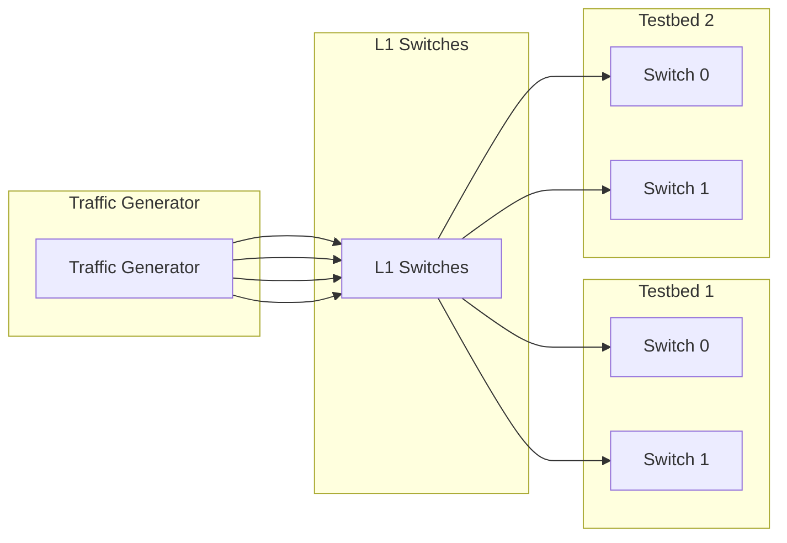

# L1 (OCS) support for Network Under Test (NUT) testbed

1. [1. Overview](#1-overview)
2. [2. Testbed definition](#2-testbed-definition)
   1. [2.1. Device definition](#21-device-definition)
   2. [2.2. Link definition](#22-link-definition)
   3. [2.3. Inventory definition](#23-inventory-definition)
   4. [2.4. Testbed YAML definition](#24-testbed-yaml-definition)
3. [3. L1 switch config generation](#3-l1-switch-config-generation)
   1. [3.1. Build L1 link graph](#31-build-l1-link-graph)
   2. [3.2. Create json patch for L1 switch config](#32-create-json-patch-for-l1-switch-config)
      1. [3.2.1. L1 switch ports](#321-l1-switch-ports)
      2. [3.2.2. L1 switch cross connects](#322-l1-switch-cross-connects)
   3. [3.3. Apply config](#33-apply-config)
4. [4. Testbed CLI and Run Test CLI](#4-testbed-cli-and-run-test-cli)

## 1. Overview

Hardware traffic generator is usually fairly expensive devices and shared by multiple testbeds. In practice, they might not directly connected to the testbeds, but first being connected to a L1 switch (also known as OCS, Optical Circuit Switch). Whenever we execute the tests, we configurate the L1 switch to connect the traffic generator to the testbed, and then run the tests, as below. This helps saving the costs.



[Network Under Test (NUT)](./README.testbed.NUT.md) is a SONiC testbed that is designed to support the testbed setup using traffic generator without any virtual neighbors such as cEOS. This document describes how to add L1 switch support to support the NUT testbed.

## 2. Testbed definition

Let's say all the DUTs and traffic generators are added under an inventory called `lab`, and here is what we should do to get the L1 switch support added for NUT testbed.

### 2.1. Device definition

First we need to add the L1 switches into the device list, which is in the `sonic_*_devices.csv` file, just like all the other devices.

- The L1 switches should have type set to `FanoutL1Sonic`.
- Please log into the L1 switch and make sure the HWSKU name is matched.

The following example represents a simple yet typical device list for 2 testbeds sharing a traffic generator and an OCS:

```csv
Hostname,ManagementIp,HwSku,Type,Protocol
tg-1,10.0.0.200/24,IXIA-tester,DevIxiaChassis,
switch-t0-1,10.0.0.100/24,HWSKU-TO-TEST,DevSonic,
switch-t0-2,10.0.0.101/24,HWSKU-TO-TEST,DevSonic,
ocs-1,10.0.0.200/24,OCS-HWSKU,FanoutL1Sonic,
```

### 2.2. Link definition

Once devices are defined, we need to define the links between the devices in 2 different files.

Because L1 switch doens't affect any actual network settings, such as P2P IP allocation and BGP configurations. In `sonic_*_links.csv` file, we still define the links between the traffic generator and DUTs as normal. Hence, no changes to this file at all. Here is an example below, and we can see the `Port1.1` of the traffic generator is connected to both `switch-t0-1` and `switch-t0-2` on `Ethernet0`.

```csv
StartDevice,StartPort,EndDevice,EndPort,BandWidth,VlanID,VlanMode,AutoNeg
switch-t0-1,Ethernet0,tg-1,Port1.1,100000,,Access,
switch-t0-2,Ethernet0,tg-1,Port1.1,100000,,Access,
```

Then we defines all links to L1 devices to `sonic_*_l1_links.csv`. Similar to `sonic_*_links.csv`, but please keep a few things in mind when defining the links to L1 switches:

1. All links to the L1 devices are defined in this file, including the ones goes to both traffic generator and DUTs.
2. The traffic generator and DUTs should always be put as `StartDevice`, and the L1 switch should always be put as `EndDevice`.
3. It is expected that this file doesn't have a `Speed` column, as the L1 switch is not aware of the speed of the links and works for any speed.

Here is an example of how the `sonic_*_l1_links.csv` file looks like for the above example:

```csv
StartDevice,StartPort,EndDevice,EndPort
tg-1,Port1.1,ocs-1,1
switch-t0-1,ocs-1,2
switch-t0-2,ocs-1,3
```

### 2.3. Inventory definition

In the inventory file, we need to add the L1 switches into the `l1_switch` group, so that they can use the correct secrets. Here is an example of how the inventory file looks like:

```yaml
all:
  children:
    l1_switch:

l1_switch:
  hosts:
    ocs-1:
      ansible_host: 10.0.0.200
```

The secrets for the L1 switches are defined in `ansible/group_vars/l1_switch/secrets.yml` file.

### 2.4. Testbed YAML definition

In `testbed.nut.yml`, we need to add more fields enabling the L1 switches being configuration by testbed CLI:

```yaml
- name: testbed-nut-1
  duts:
    - switch-t0-1
    - switch-t0-2
  tgs:
    - tg-1
  l1s: # This is the new field for L1 switches
    - ocs-1
  ...
```

Once these things are done, we can use the testbed CLI to configure the L1 switches and run tests.

## 3. L1 switch config generation

With the devices and links configurations above, we will go through the following steps to generate the L1 switch configuration.

### 3.1. Build L1 link graph

First of all, we will build the link graph for all L1 switches as below.

```json
"device_from_l1_links[inventory_hostname]": {
    "1": { "peerdevice": "tg-1", "peerport": "Port1.1" },
    "2": { "peerdevice": "switch-t0-1", "peerport": "Ethernet0" },
    "3": { "peerdevice": "switch-t0-2", "peerport": "Ethernet0" },
    ...
}
```

From links between the traffic generator and DUTs along with the L1 link info about, we will be above to find all the cross connects that need to be configured on the L1 switches, for example to switch to `switch-t0-1`, the following cross-connects will be configured:

```json
"device_l1_cross_connects": {
    "1A": "2B",
    "2A": "1B",
}
```

We will also fetch the config on the L1 switch and get all the existing cross connects that are being involved by the newly setup ports. In later steps, we will have these config removed.

```json
"device_l1_existing_cross_connects": {
    "1A": "17B",
    "17A": "1B",
}
```

### 3.2. Create json patch for L1 switch config

With the information above, we can now create a JSON patch for both L1 switch ports and cross connects.

#### 3.2.1. L1 switch ports

The following json patch will be created for clean up the old port states. In here, `17A` and `17B` was previously being used, and now being cleaned up, because `1A` and `1B` will be connected to the new ports:

```json
  { "op": "add", "path": "/OCS_PORT/1A/label", "value": "" },
  { "op": "add", "path": "/OCS_PORT/17B/label", "value": "" },
  { "op": "add", "path": "/OCS_PORT/1B/label", "value": "" },
  { "op": "add", "path": "/OCS_PORT/17A/label", "value": "" },
  ...
```

And the following json patch will be created each newly configurated ports:

```json
  { "op": "add", "path": "/OCS_PORT/1A/label", "value": {} },
  { "op": "add", "path": "/OCS_PORT/1A/label", "value": "Link to tg-1 Port1.1 RX" },
  { "op": "add", "path": "/OCS_PORT/1A/state", "value": "normal" },
  { "op": "add", "path": "/OCS_PORT/1B/label", "value": {} },
  { "op": "add", "path": "/OCS_PORT/1B/label", "value": "Link to tg-1 Port1.1 TX" },
  { "op": "add", "path": "/OCS_PORT/1B/state", "value": "normal" },
  // More here for 2A and 2B .....
```

Here is the end result of L1 switch port configuration:

```json
  "OCS_PORT": {
    "1A": { "label": "Link to tg-1 Port1.1 RX", "state": "normal" },
    "1B": { "label": "Link to tg-1 Port1.1 TX", "state": "normal" },
    // More here for 2A and 2B .....
  }
```

#### 3.2.2. L1 switch cross connects

Similar to L1 switch ports, we generate the JSON patch for the cross connects too. The following json patch will be created for clean up the old cross connects. In here, `1A-17B` and `17A-1B` were previously being used, and now being cleaned up, because `1A-2B` and `2A-1B` will be connected to the new ports:

```json
  { "op": "remove", "path": "/OCS_CROSS_CONNECT/1A-17B" },
  { "op": "remove", "path": "/OCS_CROSS_CONNECT/17A-1B" },
```

And the following json patch will be created each newly configurated cross connects:

```json
  { "op": "add", "path": "/OCS_CROSS_CONNECT/1A-2B", "value": {} },
  { "op": "add", "path": "/OCS_CROSS_CONNECT/1A-2B/a_side", "value": "1A" },
  { "op": "add", "path": "/OCS_CROSS_CONNECT/1A-2B/b_side", "value": "2B" },
  { "op": "add", "path": "/OCS_CROSS_CONNECT/2A-1B", "value": {} },
  { "op": "add", "path": "/OCS_CROSS_CONNECT/2A-1B/a_side", "value": "2A" },
  { "op": "add", "path": "/OCS_CROSS_CONNECT/2A-1B/b_side", "value": "1B" },
```

And here is the end result of L1 switch cross connect configuration:

```json
  "OCS_CROSS_CONNECT": {
    "1A-2B": { "a_side": "1A", "b_side": "2B" },
    "2A-1B": { "a_side": "2A", "b_side": "1B" },
    // ...
  }
```

### 3.3. Apply config

With the JSON patch created, we can now copy them to the device and apply it to the existing configurations. A `config reload` will be executed to get the new configuration applied.

## 4. Testbed CLI and Run Test CLI

During the `deploy-cfg`, the testbed CLI will automatically configure the L1 switches based on the `sonic_*_l1_links.csv` file. There is no changes to both testbed CLI and run test CLI.

However, if you would like to skip the L1 switch configuration or switch the DUT configuration, we provided a few commandline parameters to help you do that:

- `-e config_duts=false`: This will skip the configuration of the DUTs.
- `-e config_l1s=false`: This will skip the configuration of the L1 switches.

And here is an example output of testbed CLI when L1 switches are configured:

```bash
$ ./testbed-cli.sh -t testbed.nut.yaml deploy-cfg some-testbed inv password-file.txt -e config_duts=false;

Deploying config to testbed 'some-testbed'
Reading NUT testbed file 'testbed.nut.yaml' for testbed 'some-testbed'

Testbed found: some-testbed
- Inventory: inv
- Test Tags: snappi-capacity
- DUTs: switch-t0-1,switch-t0-2
- L1s: ocs-1

Devices to generate config for: switch-t0-1,switch-t0-2,ocs-1

....

Friday 04 July 2025  05:38:20 +0000 (0:00:01.796)       0:02:24.501 ***********
===============================================================================
testbed/finalize : reload config to pick up new config_db.json -------------------------------------------------- 31.52s
testbed/nut : reload config to pick up new config_db.json ------------------------------------------------------- 31.40s
testbed/prepare : rotate the password --------------------------------------------------------------------------- 11.16s
testbed/nut : wait for switch to become reachable again --------------------------------------------------------- 10.40s
testbed/finalize : wait for switch to become reachable again ---------------------------------------------------- 10.31s
testbed/nut : get connection graph if defined for dut ------------------------------------------------------------ 2.28s
testbed/finalize : bring up all bgp sessions for test ------------------------------------------------------------ 1.80s
testbed/nut : save the configuration ----------------------------------------------------------------------------- 1.70s
testbed/finalize : Generate server cert using openssl. ----------------------------------------------------------- 1.69s
testbed/finalize : Generate dsmsroot cert using openssl. --------------------------------------------------------- 1.62s
testbed/finalize : Generate server cert using openssl. ----------------------------------------------------------- 1.45s
testbed/nut : reload qos config ---------------------------------------------------------------------------------- 1.20s
testbed/nut : copy config patch to remote machine ---------------------------------------------------------------- 1.12s
testbed/nut : save the configuration ----------------------------------------------------------------------------- 1.09s
testbed/nut : generate new clean config_db.json ------------------------------------------------------------------ 1.07s
testbed/finalize : enable core uploader service ------------------------------------------------------------------ 1.02s
testbed/nut : get current cross connects using required ports ---------------------------------------------------- 0.75s
testbed/nut : backup config_db.json to /tmp ---------------------------------------------------------------------- 0.71s
testbed/finalize : include_tasks --------------------------------------------------------------------------------- 0.69s
testbed/finalize : include_tasks --------------------------------------------------------------------------------- 0.69s
Done
```
