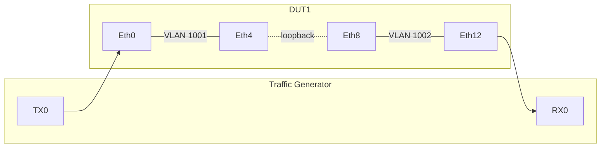
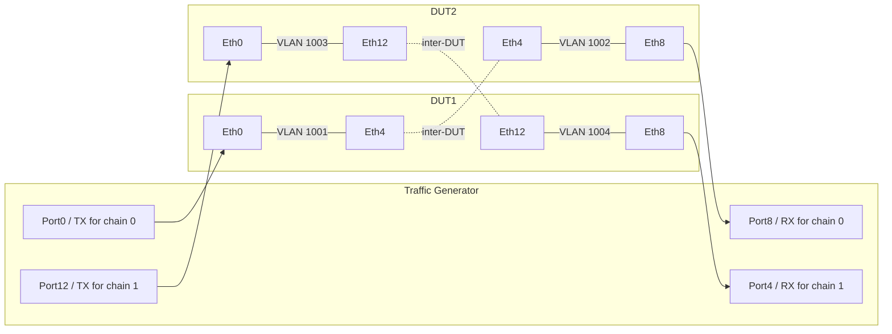

# L2 Snake Testbed Design for SONiC NUT

## 1. Overview

This document describes L2 snake support for SONiC NUT (Network Under Test) in `sonic-mgmt`.

L2 snake mode provisions **pure Layer-2 forwarding chains** instead of the existing NUT L3 routed topology. Traffic enters from the traffic generator (TG), traverses one or more DUT ports through VLAN-bridged hops, and exits back to the TG.

The design now supports two deployment modes:

- **Single-DUT L2 snake**: one DUT, with external loopback cables forming the snake body.
- **Multi-device L2 snake**: two or more DUTs, where the snake can cross DUT boundaries through inter-DUT links.

This mode is intended for throughput, port validation, and end-to-end forwarding checks without requiring IP or BGP setup.

## 2. Background

The existing NUT `deploy-cfg` flow targets routed, multi-tier L3 topologies. L2 snake has different requirements.

| | NUT (L3) | L2 Snake |
|--|----------|----------|
| Forwarding | L3 (IP/BGP) | L2 (VLAN bridge) |
| Topology | Multi-tier routed fabric | Linear snake chains |
| DUT count | 1+ | 1+ |
| Neighbors | BGP peers between tiers | None |
| Traffic path | TG → T0 → T1 → T2 | TG TX → snake hops → TG RX |
| Config | IP + BGP per interface | VLANs + VLAN members |

## 3. Architecture

### 3.1. Mode A: Single-DUT snake

In single-DUT mode:

- The TG connects to an even number of DUT ports.
- The DUT's TG-connected ports are naturally sorted.
- The **first half** of the DUT's TG ports are TX (ingress).
- The **second half** are RX (egress).
- All remaining snake hops are formed by external loopback cables on that same DUT.



### 3.2. Mode B: Multi-device snake

In multi-device mode:

- The snake can traverse **multiple DUTs**.
- A hop can end on:
  - an RX TG port,
  - a loopback cable on the same DUT, or
  - an inter-DUT physical link.
- The chain tracing logic remains global and lockstep, but transitions can cross DUT boundaries.
- TG ports are still split into TX/RX, but the split is done **per DUT first**, then assembled globally.

This prevents misclassification when multiple DUTs each have both TG ingress and TG egress ports.

### 3.3. Multi-device topology example

Example: two DUTs, two parallel chains, TG connected to both DUTs.

- Chain 0 starts on DUT1, crosses DUT2, exits on DUT2.
- Chain 1 starts on DUT2, crosses DUT1, exits on DUT1.
- Each DUT port belongs to exactly one chain in the illustration below.
- A simpler deployment may also keep each chain local to a DUT; the allocator supports either as long as the graph is valid.



## 4. Port classification

Each DUT port in `device_port_links[dut]` is classified as one of the following:

1. **TGen port**
   - `peerdevice ∈ tgs`
   - Endpoint between TG and DUT
   - Participates as either TX or RX

2. **Loopback port**
   - `peerdevice == dut`
   - Physical snake continuation on the same DUT

3. **Inter-DUT port**
   - `peerdevice ∈ duts` and `peerdevice != dut`
   - Physical transition from one DUT to another

Any other peer type is invalid for L2 snake allocation.

## 5. Chain tracing algorithm

All chains are traced **in lockstep** so one chain cannot consume ports intended for another. VLAN IDs are assigned only after tracing succeeds.

### 5.1. Input data

The allocator uses the existing `LabGraph` / `conn_graph_facts`-derived `device_port_links`.

Example shape:

```python
{
    "dut1": {
        "Ethernet0": {"peerdevice": "tg1",  "peerport": "Port1"},
        "Ethernet4": {"peerdevice": "dut2", "peerport": "Ethernet4"},
        "Ethernet8": {"peerdevice": "tg1",  "peerport": "Port2"},
    },
    "dut2": {
        "Ethernet0": {"peerdevice": "tg1",  "peerport": "Port3"},
        "Ethernet4": {"peerdevice": "dut1", "peerport": "Ethernet4"},
        "Ethernet8": {"peerdevice": "tg1",  "peerport": "Port4"},
    },
}
```

### 5.2. TX/RX split

The TX/RX split must be derived **per DUT**:

1. For each DUT, collect its TG-connected ports.
2. `natsort` them.
3. The first half are that DUT's TX ports.
4. The second half are that DUT's RX ports.
5. Concatenate all per-DUT TX lists in DUT order to form the global TX list.
6. Concatenate all per-DUT RX lists in DUT order to form the global RX list.

This is required because a simple global midpoint split can break when TG ports are interleaved by DUT.

### 5.3. Tracing rules

For each active chain:

1. Start at its TX port.
2. On the current DUT, scan forward in naturally sorted local port order to find the next unused partner port.
3. Record a VLAN pair on that DUT.
4. If the partner is an RX port, the chain completes.
5. If the partner is a loopback port, transition to its peer on the same DUT.
6. If the partner is an inter-DUT port, transition to its peer on the remote DUT.
7. Continue until every chain completes.

Pseudo flow:

```text
for dut in duts:
    tgen_ports[dut] = natsorted(TG-connected ports on dut)
    tx[dut] = first half
    rx[dut] = second half

global_tx = concat(tx[dut] in DUT order)
global_rx = concat(rx[dut] in DUT order)

used = set(global_tx)
for each chain i:
    current = global_tx[i]

repeat in lockstep:
    partner = next unused local port after current
    add VLAN pair (current, partner) on current DUT

    if partner in global_rx:
        chain complete
    elif partner is loopback:
        current = loopback peer
    elif partner is inter-DUT:
        current = remote DUT peer
    else:
        error
```

### 5.4. Worked multi-device split example

Given DUT order `[dut1, dut2]`:

- `dut1` TG ports: `[Ethernet0, Ethernet12]` → TX=`[Ethernet0]`, RX=`[Ethernet12]`
- `dut2` TG ports: `[Ethernet0, Ethernet12]` → TX=`[Ethernet0]`, RX=`[Ethernet12]`

Global lists become:

- `global_tx = [(dut1, Ethernet0), (dut2, Ethernet0)]`
- `global_rx = [(dut1, Ethernet12), (dut2, Ethernet12)]`

A naive midpoint split over the global list would incorrectly produce:

- TX=`[(dut1, Ethernet0), (dut1, Ethernet12)]`
- RX=`[(dut2, Ethernet0), (dut2, Ethernet12)]`

That can dead-end tracing because `dut1:Ethernet12` is actually an RX port, not a TX starting point.

## 6. Data model

### 6.1. Testbed YAML examples

#### Single-DUT example

From `ansible/testbed.nut.yaml`:

```yaml
- name: vnut-l2-snake-single
  comment: "vNUT L2 snake testbed with 1 DUT and 1 TG"
  inv_name: lab
  topo: nut-l2-snake
  test_tags: []
  duts:
    - vnut-l2-snake-single
  tgs:
    - vnut-l2snk-tg
  tg_api_server: 10.250.0.221:443
  auto_recover: 'True'
```

#### Multi-device KVM/vNUT example

From `ansible/testbed.nut.yaml`:

```yaml
- name: vnut-l2-snake-multi
  comment: "L2 snake multi-device testbed"
  inv_name: lab
  topo: nut-l2-snake
  test_tags: []
  duts:
    - vnut-l2msnk-01
    - vnut-l2msnk-02
  tgs:
    - vnut-l2snk-tg
  tg_api_server: 10.250.0.221:443
  auto_recover: 'True'
```

### 6.2. Lab device example

From `ansible/files/sonic_lab_devices.csv`:

```csv
Hostname,ManagementIp,HwSku,Type,Protocol,Os,AuthType
vnut-l2msnk-01,10.250.0.214/24,Force10-S6000,DevSonic,,sonic,
vnut-l2msnk-02,10.250.0.215/24,Force10-S6000,DevSonic,,sonic,
vnut-l2snk-tg,10.250.0.221/24,IxiaChassis,DevIxiaChassis,,ixia,
```

### 6.3. Simplified lab link example

Illustrative multi-device wiring pattern inspired by `ansible/files/sonic_lab_links.csv` (not a literal dump of the full deployable CSV):

```csv
vnut-l2msnk-01,Ethernet0,vnut-l2snk-tg,Ethernet0,10000,,,
vnut-l2msnk-01,Ethernet4,vnut-l2msnk-02,Ethernet4,10000,,,
vnut-l2msnk-01,Ethernet8,vnut-l2snk-tg,Ethernet8,10000,,,
vnut-l2msnk-02,Ethernet0,vnut-l2snk-tg,Ethernet4,10000,,,
vnut-l2msnk-02,Ethernet4,vnut-l2msnk-01,Ethernet4,10000,,,
vnut-l2msnk-02,Ethernet8,vnut-l2snk-tg,Ethernet12,10000,,,
```

This example demonstrates:

- two virtual DUTs,
- a shared TG,
- one inter-DUT link,
- TG attached to both DUTs,
- `nut-l2-snake` as the topology type.

### 6.4. Topology YAML

`ansible/vars/nut_topos/nut-l2-snake.yml`:

```yaml
type: l2-snake
vlan_base: 1001
```

No IP pools, DUT templates, or TG templates are required for the L2 snake allocator.

## 7. Per-DUT VLAN output

The allocator returns a per-DUT compatibility/debug view that flattens each DUT's local VLAN pairs into a single `vlans` list.

Example shape:

```python
{
    "device_vlans": {
        "dut1": {
            "vlans": [
                {"vlan_id": 1001, "ports": ["Ethernet0", "Ethernet4"]}
            ]
        },
        "dut2": {
            "vlans": [
                {"vlan_id": 1002, "ports": ["Ethernet4", "Ethernet8"]}
            ]
        }
    }
}
```

Properties:

- `device_vlans` is a dictionary keyed by DUT name.
- Each DUT entry is a dictionary with a `vlans` list.
- Every item in `vlans` has the shape `{"vlan_id": <int>, "ports": [<port_a>, <port_b>]}`.
- VLAN IDs are globally unique across the testbed.
- Each DUT only receives the local VLAN pairs that terminate on that DUT.
- Chain-level metadata is intentionally not preserved in this flattened compatibility/debug view.
- A global chain may appear as partial VLAN segments on multiple DUTs.

## 8. `deploy-cfg` flow for L2 snake

`deploy-cfg` for `nut-l2-snake` differs from L3 NUT as follows:

| Step | Action |
|------|--------|
| 1 | Load testbed facts and connection graph |
| 2 | Run L2 snake allocator in `nut_allocate_ip.py` |
| 3 | Build per-DUT VLAN/VLAN_MEMBER config from `device_vlans` |
| 4 | Apply port settings (speed/FEC/admin state) as usual |
| 5 | Skip interface IP allocation |
| 6 | Skip BGP neighbor generation |
| 7 | Apply config reload / patches |

Config patch example:

```json
[
  {"op": "add", "path": "/VLAN/Vlan1001", "value": {"vlanid": "1001"}},
  {"op": "add", "path": "/VLAN_MEMBER/Vlan1001|Ethernet0", "value": {"tagging_mode": "untagged"}},
  {"op": "add", "path": "/VLAN_MEMBER/Vlan1001|Ethernet4", "value": {"tagging_mode": "untagged"}}
]
```

Rules:

- Every snake port belongs to exactly one VLAN.
- VLAN membership is untagged.
- No BGP, loopback IP, or P2P interface config is created.
- STP should remain disabled for these snake VLANs.

## 9. Validation and error handling

The allocator validates at least the following conditions:

1. **At least two TG-connected ports exist globally**.
2. **Global TG-connected port count is even**.
3. **Per-DUT TG-connected port count is even** so each DUT can derive TX/RX halves correctly.
4. **Every traced hop finds a forward local partner** in natural port order.
5. **Every non-RX partner has a valid continuation**, either loopback or inter-DUT.
6. **Transition targets are not reused** by another chain.
7. **No port is assigned to multiple VLANs**.
8. **VLAN range does not overflow 4094**.

Typical failures should include actionable context, such as the chain ID and the DUT/port where tracing stopped.

## 10. Traffic generator setup

TG setup remains L2-only:

1. Configure TX ports to send Ethernet frames.
2. Configure RX ports to measure end-to-end forwarding.
3. Use distinct MAC streams per chain to avoid MAC flapping.
4. Map TG ports according to the per-DUT TX/RX split, not by a naive global midpoint.
5. In multi-device mode, ensure the TG cabling matches the lab CSV and testbed entry exactly.

## 11. Reference example files

The following files provide concrete examples for both single-DUT and multi-device L2 snake:

- `ansible/testbed.nut.yaml`
- `ansible/files/sonic_lab_devices.csv`
- `ansible/files/sonic_lab_links.csv`
- `ansible/lab`
- `ansible/vars/nut_topos/nut-l2-snake.yml`

In particular, `vnut-l2-snake-multi` is the reference dual-DUT KVM/vNUT example for multi-device L2 snake deployment.
