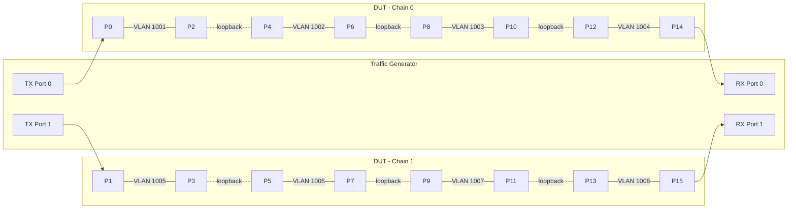

# L2 Snake Testbed Design for SONiC NUT

## 1. Overview

This document describes the design for L2 snake testbed support within the SONiC NUT (Network Under Test) framework in `sonic-mgmt`. L2 snake testing sends traffic through a single DUT by snaking it across all ports via external loopback cables and L2 VLAN bridging — used for throughput stress testing, port validation, and latency measurement.

## 2. Background

The existing NUT testbed (`deploy-cfg`) supports multi-tier L3 topologies with BGP routing. L2 snake is fundamentally different:

| | NUT (L3) | L2 Snake |
|--|----------|----------|
| Forwarding | L3 (BGP routes) | L2 (VLAN bridge) |
| Topology | Multi-tier, multi-device | Single DUT |
| Neighbors | BGP sessions between tiers | None |
| Traffic path | TG → T0 → T1 → T2 | TG TX → snake loop × N → TG RX |
| Config | IP + BGP per interface | VLANs + port pairs |

## 3. Architecture

### 3.1. Single DUT, Parallel Chains

- Always single DUT.
- TG connects to `T` ports on the DUT (must be even).
- First `T/2` TG-connected ports (sorted by port index) = TX (ingress), last `T/2` = RX (egress).
- All remaining DUT ports are snake body ports, connected in pairs using external loopback cables with a stride of `T/2`.
- This creates `T/2` independent parallel snake chains.

### 3.2. Example

DUT with 16 ports (P0–P15), TG with 4 ports (T=4, T/2=2), creating 2 parallel chains:



**Legend:**
- Solid lines with VLAN labels = L2 forwarding inside the DUT (two ports bridged in one VLAN)
- Dotted lines (loopback) = external loopback cables
- Arrows from/to TG = traffic ingress/egress

## 4. Data Model

### 4.1. Input Data

The algorithm operates on data from the existing `LabGraph` (`graph_utils.py`) and `nut_test_facts`. The key input is `device_port_links[dut]`, which is a dict of DUT port → link info:

```python
# device_port_links["switch-t0-1"] (from conn_graph_facts / LabGraph)
{
    "Ethernet0":  {"peerdevice": "tg-1",        "peerport": "Port1.1", "speed": "100000"},
    "Ethernet4":  {"peerdevice": "tg-1",        "peerport": "Port1.2", "speed": "100000"},
    "Ethernet16": {"peerdevice": "switch-t0-1", "peerport": "Ethernet24", "speed": "100000"},  # loopback
    "Ethernet20": {"peerdevice": "switch-t0-1", "peerport": "Ethernet28", "speed": "100000"},  # loopback
    "Ethernet32": {"peerdevice": "switch-t0-1", "peerport": "Ethernet40", "speed": "100000"},  # loopback
    "Ethernet36": {"peerdevice": "switch-t0-1", "peerport": "Ethernet44", "speed": "100000"},  # loopback
    "Ethernet48": {"peerdevice": "tg-1",        "peerport": "Port1.3", "speed": "100000"},
    "Ethernet52": {"peerdevice": "tg-1",        "peerport": "Port1.4", "speed": "100000"},
}
```

- **TGen ports**: entries where `peerdevice ∈ tgs`
- **Loopback ports**: entries where `peerdevice == dut` itself (self-links, already recognized by existing code)

Note: The links CSV may not be sorted. All ports must be sorted by `natsort` before processing.

### 4.2. Testbed YAML

```yaml
- name: testbed-snake-1
  comment: "L2 snake single-DUT testbed"
  inv_name: lab
  topo: nut-l2-snake
  duts:
    - switch-t0-1
  tgs:
    - tg-1
  tg_api_server: 10.2.0.1:443
```

### 4.3. Topology Definition

`ansible/vars/nut_topos/nut-l2-snake.yml`:

```yaml
type: l2-snake
vlan_base: 1001
```

The `type` field drives which allocator strategy is used. No `dut_templates`, no `tg_template`, no IP pools needed — everything is auto-derived from the connection graph.

## 5. Chain Tracing Algorithm

All chains are traced **in lockstep** (one hop per round, all chains advance together) to prevent one chain from greedily consuming ports meant for another.

```
Input:
  device_port_links[dut]  — port → link info dict
  tgs                     — list of TGen device names

Steps:

1. Classify ports:
   - tgen_ports: ports where peerdevice ∈ tgs
   - loopback_ports: ports where peerdevice == dut  →  {port: peerport}

2. Sort tgen_ports by natsort(port_name):
   - TX = first T/2
   - RX = last T/2

3. Build all_linked_ports = natsorted(all ports in device_port_links[dut])

4. Initialize:
   - used = set(all TX ports ∪ all RX ports)   # reserve TGen ports
   - For each chain k: chain[k].current = TX[k]

5. Lockstep tracing (repeat until all chains complete):
   For each active chain k (in order k = 0..T/2-1):
       partner = next port in all_linked_ports after chain[k].current, not in used
       used.add(partner)
       Create VLAN pair: (chain[k].current, partner)

       if partner ∈ RX ports → mark chain k complete
       elif partner ∈ loopback_ports →
           chain[k].current = loopback_ports[partner]
           used.add(chain[k].current)
       else → error: dead end
```

### 5.1. Worked Example

Given the data in section 4.1 (T=4, T/2=2):

**TGen ports** (natsorted): `[Ethernet0, Ethernet4, Ethernet48, Ethernet52]`
- TX: `[Ethernet0, Ethernet4]`
- RX: `[Ethernet48, Ethernet52]`

**Loopback map**: `{Ethernet16↔Ethernet24, Ethernet20↔Ethernet28, Ethernet32↔Ethernet40, Ethernet36↔Ethernet44}`

**All linked ports** (natsorted): `[Ethernet0, Ethernet4, Ethernet16, Ethernet20, Ethernet24, Ethernet28, Ethernet32, Ethernet36, Ethernet40, Ethernet44, Ethernet48, Ethernet52]`

**used** (initial): `{Ethernet0, Ethernet4, Ethernet48, Ethernet52}`

**Round 1:**
```
Chain 0: current=Ethernet0  → next unused after Ethernet0  = Ethernet16 → VLAN1001(Ethernet0, Ethernet16)  → loopback → current=Ethernet24
Chain 1: current=Ethernet4  → next unused after Ethernet4  = Ethernet20 → VLAN1002(Ethernet4, Ethernet20)  → loopback → current=Ethernet28
```

**Round 2:**
```
Chain 0: current=Ethernet24 → next unused after Ethernet24 = Ethernet32 → VLAN1003(Ethernet24, Ethernet32) → loopback → current=Ethernet40
Chain 1: current=Ethernet28 → next unused after Ethernet28 = Ethernet36 → VLAN1004(Ethernet28, Ethernet36) → loopback → current=Ethernet44
```

**Round 3:**
```
Chain 0: current=Ethernet40 → next unused after Ethernet40 = Ethernet48 (RX!) → VLAN1005(Ethernet40, Ethernet48) → complete
Chain 1: current=Ethernet44 → next unused after Ethernet44 = Ethernet52 (RX!) → VLAN1006(Ethernet44, Ethernet52) → complete
```

## 6. Implementation: Strategy Pattern in `nut_allocate_ip.py`

Instead of a separate module, we extend `nut_allocate_ip.py` with a strategy pattern based on topo type:

```python
# nut_allocate_ip.py

class L3IpAllocator:
    """Existing NUT L3 strategy — IP + BGP allocation."""
    # Current GenerateDeviceConfig logic moves here

class L2SnakeVlanAllocator:
    """L2 snake strategy — VLAN pair allocation, no IP/BGP."""
    # Chain tracing + VLAN generation logic

STRATEGY_MAP = {
    "nut": L3IpAllocator,
    "l2-snake": L2SnakeVlanAllocator,
}

class DeviceConfigAllocator:
    def __init__(self, testbed_facts, device_info, device_port_links, device_port_vrfs):
        topo_type = testbed_facts['topo']['properties'].get('type', 'nut')
        strategy_cls = STRATEGY_MAP[topo_type]
        self.strategy = strategy_cls(testbed_facts, device_info, device_port_links, device_port_vrfs)

    def run(self):
        return self.strategy.run()
```

### 6.1. L2SnakeVlanAllocator Output

```python
# ansible_facts output
{
    "device_meta": {
        "switch-t0-1": {
            "type": "ToRRouter"
            # No BGP ASN, no router ID, no loopback IPs
        }
    },
    "device_vlans": {
        "switch-t0-1": {
            "chains": [
                {
                    "chain_id": 0,
                    "tx_port": "Ethernet0",
                    "rx_port": "Ethernet48",
                    "vlan_pairs": [
                        {"vlan_id": 1001, "ports": ["Ethernet0", "Ethernet16"]},
                        {"vlan_id": 1002, "ports": ["Ethernet24", "Ethernet32"]},
                        {"vlan_id": 1003, "ports": ["Ethernet40", "Ethernet48"]}
                    ]
                },
                {
                    "chain_id": 1,
                    "tx_port": "Ethernet4",
                    "rx_port": "Ethernet52",
                    "vlan_pairs": [
                        {"vlan_id": 1004, "ports": ["Ethernet4", "Ethernet20"]},
                        {"vlan_id": 1005, "ports": ["Ethernet28", "Ethernet36"]},
                        {"vlan_id": 1006, "ports": ["Ethernet44", "Ethernet52"]}
                    ]
                }
            ]
        }
    }
}
```

## 7. `deploy-cfg` Flow for L2 Snake

| Step | Action |
|------|--------|
| 1. Initial config | Same as NUT L3 — backup tables, generate clean config via `sonic-cfggen` |
| 2. Device metadata | Hostname and type only. **No BGP ASN or router ID.** |
| 3. Port config | Speed, FEC, admin status from links CSV — same as NUT L3 |
| 4. VLAN config | **NEW** — generate VLAN + VLAN_MEMBER patches from `device_vlans` output |
| 5. Interface IPs | **Skip** — no IPs needed |
| 6. BGP neighbors | **Skip** — no BGP needed |
| 7. Apply config | `config reload` — same as NUT L3 |

### 7.1. Config Patch Example

```json
[
  { "op": "add", "path": "/VLAN/Vlan1001", "value": { "vlanid": "1001" } },
  { "op": "add", "path": "/VLAN_MEMBER/Vlan1001|Ethernet0", "value": { "tagging_mode": "untagged" } },
  { "op": "add", "path": "/VLAN_MEMBER/Vlan1001|Ethernet16", "value": { "tagging_mode": "untagged" } },
  { "op": "add", "path": "/VLAN/Vlan1002", "value": { "vlanid": "1002" } },
  { "op": "add", "path": "/VLAN_MEMBER/Vlan1002|Ethernet24", "value": { "tagging_mode": "untagged" } },
  { "op": "add", "path": "/VLAN_MEMBER/Vlan1002|Ethernet32", "value": { "tagging_mode": "untagged" } }
]
```

## 8. Traffic Generator Setup

During the pretest fixture:

1. Configure TG TX ports to send L2 traffic (frames with appropriate MACs).
2. Configure TG RX ports to receive and measure.
3. No BGP sessions needed on TG side — pure L2 traffic.
4. MAC addresses can be auto-generated or test-defined.

## 9. Validation

- Verify all VLANs are created: `show vlan brief`
- Verify port membership: `show vlan config`
- Verify traffic flows end-to-end: TG TX counters match TG RX counters
- Per-port counters can identify which snake hop is failing
