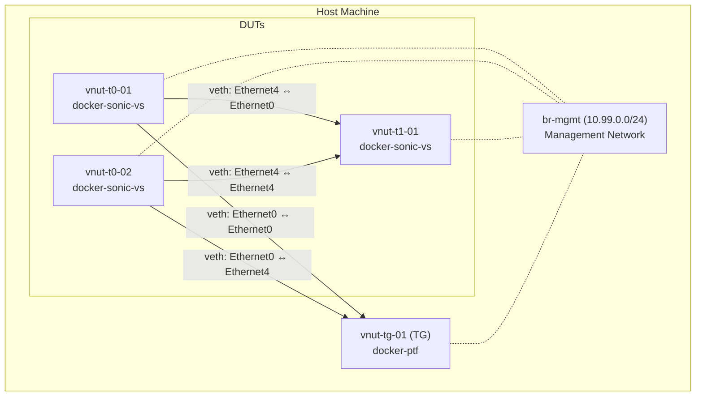

# vNUT.cSONiC - Virtual NUT Testbed with cSONiC Containers

## 1. Overview

vNUT.cSONiC allows developers to run sonic-mgmt NUT tests locally on a single host without any physical switches or traffic generators. It provides a fully virtualized alternative to the hardware-based NUT testbed described in [README.testbed.NUT.md](README.testbed.NUT.md).

Key characteristics:

- Uses `docker-sonic-vs` containers as DUTs (Device Under Test) and `docker-ptf` containers as traffic generators
- Reuses existing testbed YAML/CSV formats, topology definitions (`nut-*`), and `testbed-cli.sh` commands
- All containers share a management bridge network (`br-mgmt`) for SSH and API access
- Enables rapid local development and testing without lab hardware

## 2. Architecture

vNUT.cSONiC creates a containerized network topology on a single host machine. The example below shows a 2-tier topology (`nut-2tiers`) with 3 DUTs and 1 traffic generator:



### Network Planes

- **Management network**: A Linux bridge (`br-mgmt`) on the `10.99.0.0/24` subnet connects all containers for SSH and API access. The subnet is configurable via `defaults/main.yml` (`vnut_mgmt_subnet`) and the inventory files — choose a range that does not conflict with existing host networking. NAT and IP forwarding are configured to give containers internet connectivity.
- **Data plane**: veth pairs connect DUT ports to TG ports (and DUT-to-DUT links), managed by the custom Ansible module `vnut_network.py`. Each veth pair directly links an interface in one container's network namespace to an interface in another.

### Topology: nut-2tiers

The `nut-2tiers` topology consists of:
- 2× T0 DUTs (`vnut-t0-01`, `vnut-t0-02`)
- 1× T1 DUT (`vnut-t1-01`)
- 1× Traffic Generator (`vnut-tg-01`)

Links:
| Source | Source Port | Destination | Destination Port |
|--------|------------|-------------|-----------------|
| vnut-t0-01 | Ethernet0 | vnut-tg-01 | Ethernet0 |
| vnut-t0-01 | Ethernet4 | vnut-t1-01 | Ethernet0 |
| vnut-t0-02 | Ethernet0 | vnut-tg-01 | Ethernet4 |
| vnut-t0-02 | Ethernet4 | vnut-t1-01 | Ethernet4 |

## 3. Prerequisites

### Host Preparation

For host preparation (Docker installation, SSH setup, management network configuration), refer to [README.testbed.VsSetup.md](README.testbed.VsSetup.md). No additional host setup steps are required for vNUT beyond what VsSetup covers.

### sonic-mgmt Container Setup

The recommended way to set up the sonic-mgmt container is using `setup-container.sh` as documented in [README.testbed.VsSetup.md](README.testbed.VsSetup.md). This script handles all required Docker flags and volume mounts automatically.

If not using `setup-container.sh`, ensure these flags are passed when launching the sonic-mgmt container manually:
  ```bash
  docker run -it --pid host --network host --privileged \
    -v /var/run/docker.sock:/var/run/docker.sock \
    <sonic-mgmt-image>
  ```
  The `--pid host` and `--network host` flags allow the sonic-mgmt container to manage sibling Docker containers and host networking. The Docker socket mount enables container orchestration.

  > **⚠️ Security note:** The `--privileged` flag and Docker socket mount (`/var/run/docker.sock`) grant the container full access to the host system. This is required for managing sibling containers and host networking, but should only be used on dedicated development or CI machines — never on shared or production hosts.

### Container Images

- **`docker-sonic-vs:latest`** — The SONiC virtual switch image used as DUTs. Download from the [sonic-buildimage](https://github.com/sonic-net/sonic-buildimage) build artifacts, or build locally. Load the image with `docker load -i <image-file>`.
- **`docker-ptf:latest`** — The PTF test framework container used as traffic generators. Available from the sonic-mgmt build artifacts.

### Resource Requirements

Approximate minimum resources for a `nut-2tiers` testbed (3 DUTs + 1 TG):

- **RAM**: 8 GB+ (each `docker-sonic-vs` container uses ~1–2 GB)
- **CPU**: 4+ cores recommended
- **Disk**: 20 GB+ free for container images and logs

Larger topologies will require proportionally more resources.

## 4. Testbed Definition

vNUT.cSONiC reuses the same YAML and CSV formats as the hardware NUT testbed.

### Testbed YAML (`testbed.vnut.yaml`)

```yaml
- name: vnut-2tier-test
  comment: "vNUT.cSONiC 2-tier testbed for local testing"
  inv_name: vnut-lab
  topo: nut-2tiers
  test_tags: []
  duts:
    - vnut-t0-01
    - vnut-t0-02
    - vnut-t1-01
  tgs:
    - vnut-tg-01
  # tg_api_server is required by _read_nut_testbed_topo_from_yaml() to extract ptf_ip.
  # PTF doesn't expose a real API server on 443; this is a framework convention.
  tg_api_server: "10.99.0.20:443"
  # String 'True' (not boolean) is intentional — the testbed YAML parser expects string values.
  auto_recover: 'True'
```

Fields follow the same schema as standard NUT testbed definitions. The `inv_name` points to the `vnut-lab` inventory directory.

### Inventory (`vnut-lab/`)

The inventory directory contains an Ansible hosts file and device/link CSV files.

#### `vnut-lab/hosts`

vNUT.cSONiC uses the same credential resolution as the standard VS testbed and cSONiC testbed. No passwords should be hardcoded in the inventory. Credentials are resolved from:

- `group_vars/vm_host/creds.yml` — host credentials (`ansible_user`, `vm_host_user`)
- `group_vars/sonic/variables` — DUT credentials (`sonicadmin_user`, `sonicadmin_password`, `ansible_altpassword`)

See [README.testbed.cSONiC.md](README.testbed.cSONiC.md) for details on credential resolution.

```yaml
all:
  children:
    lab:
      vars:
        mgmt_subnet_mask_length: 24
        ansible_python_interpreter: /usr/bin/python3
      children:
        sonic:
          hosts:
            vnut-t0-01:
              ansible_host: 10.99.0.10
            vnut-t0-02:
              ansible_host: 10.99.0.11
            vnut-t1-01:
              ansible_host: 10.99.0.12
        ptf:
          hosts:
            vnut-tg-01:
              ansible_host: 10.99.0.20
```

#### `vnut-lab/files/sonic_lab_devices.csv`

The `HwSku` and `Type` values below are inherited from the NUT testbed framework, which was originally designed for Ixia traffic generators. The framework's testbed parser keys on these fields, so they must remain consistent. Future work could introduce PTF-specific device types (e.g., `PtfContainer` / `DevPtfContainer`).

> **Note:** `Force10-S6000` is used because `docker-sonic-vs` is built with this platform profile. Tests that branch on HwSku may produce results specific to this platform — this is a known limitation of virtual testbeds.

```csv
Hostname,ManagementIp,HwSku,Type,Protocol,Os,AuthType
vnut-t0-01,10.99.0.10/24,Force10-S6000,DevSonic,,sonic,
vnut-t0-02,10.99.0.11/24,Force10-S6000,DevSonic,,sonic,
vnut-t1-01,10.99.0.12/24,Force10-S6000,DevSonic,,sonic,
vnut-tg-01,10.99.0.20/24,IxiaChassis,DevIxiaChassis,,ixia,
```

#### `vnut-lab/files/sonic_lab_links.csv`

```csv
StartDevice,StartPort,EndDevice,EndPort,BandWidth,VlanID,VlanMode,AutoNeg
vnut-t0-01,Ethernet0,vnut-tg-01,Ethernet0,10000,,,
vnut-t0-01,Ethernet4,vnut-t1-01,Ethernet0,10000,,,
vnut-t0-02,Ethernet0,vnut-tg-01,Ethernet4,10000,,,
vnut-t0-02,Ethernet4,vnut-t1-01,Ethernet4,10000,,,
```

## 5. Deployment

Deploy the vNUT.cSONiC testbed using `testbed-cli.sh`:

```bash
./testbed-cli.sh -t testbed.vnut.yaml -m <inventory> add-vnut-topo <testbed-name> <vault-password-file>
```

For example:

```bash
cd ansible
./testbed-cli.sh -t testbed.vnut.yaml -m vnut-lab add-vnut-topo vnut-2tier-test password.txt
```

### Deployment Steps

The `add-vnut-topo` action executes the following sequence:

1. **Read testbed definition** — Parse `testbed.vnut.yaml` to determine topology, DUTs, TGs, and links.
2. **Create management network** — Create the `br-mgmt` Linux bridge on the `10.99.0.0/24` subnet with NAT and IP forwarding rules.
3. **Launch containers** — Start `docker-sonic-vs` containers for each DUT and a `docker-ptf` container for the TG. Containers start on the default bridge network, then are attached to `br-mgmt` with static IPs (see [Container Launch](#container-launch) for details on the two-phase approach).
4. **Create veth links** — Use the `vnut_network.py` Ansible module to create veth pairs connecting container interfaces according to the link definitions in `sonic_lab_links.csv`.
5. **Start SONiC services** — Ensure supervisord and SONiC services are running inside each DUT container.
6. **Wait for readiness** — Poll each DUT for SSH availability and service readiness.
7. **Provision admin user** — Create the `admin` user with sudo privileges on each DUT for Ansible access.

### Configuration Deployment

vNUT testbeds use `deploy-cfg` (not `deploy-mg`) for configuration deployment — no minigraph generation is involved. After initial topology deployment, apply configuration with:

```bash
./testbed-cli.sh -t testbed.vnut.yaml -m vnut-lab deploy-cfg vnut-2tier-test password.txt
```

> **Note:** `deploy-cfg` integration for vNUT is planned future work. See [Section 9](#9-limitations-and-future-work) for details.

### Post-Deployment Verification

After deployment, verify the testbed is functioning correctly:

1. **Check all containers are running:**
   ```bash
   docker ps --filter name=vnut
   ```
   All DUT and TG containers should be in the `running` state.

2. **SSH into each DUT and verify SONiC services:**
   ```bash
   ssh admin@10.99.0.10
   show services
   ```

3. **Wait for BGP sessions to come up** — this is the key verification step. BGP convergence may take 1–2 minutes after deployment:
   ```bash
   admin@vnut-t0-01:~$ show ip bgp sum

   IPv4 Unicast Summary:
   BGP router identifier 10.0.0.1, local AS number 65001
   Neighbor        V    AS   MsgRcvd MsgSent   TblVer  InQ OutQ Up/Down  State/PfxRcd
   10.0.0.5        4 65100        12      10        0    0    0 00:01:23        2
   ```
   Verify that all expected BGP neighbors show `Established` state (a numeric `State/PfxRcd` value indicates an established session).

## 6. Teardown

Remove the vNUT.cSONiC testbed:

```bash
./testbed-cli.sh -t testbed.vnut.yaml -m <inventory> remove-vnut-topo <testbed-name> <vault-password-file>
```

For example:

```bash
cd ansible
./testbed-cli.sh -t testbed.vnut.yaml -m vnut-lab remove-vnut-topo vnut-2tier-test password.txt
```

The teardown process cleans up all resources:

- Stops and removes all DUT and TG containers
- Deletes veth pairs between containers
- Removes the `br-mgmt` bridge
- Cleans up iptables NAT and forwarding rules

## 7. Running Tests

Once the testbed is deployed, run tests using `run_tests.sh`:

```bash
cd tests
bash run_tests.sh -f ../ansible/testbed.vnut.yaml -i ../ansible/vnut-lab \
  -n vnut-2tier-test -d all -t nut,any -m individual -a False -u -l debug \
  -e "--skip_sanity --disable_loganalyzer" -c <test_file>
```

Key parameters:
- `-n vnut-2tier-test` — testbed name from the YAML file
- `-d all` — run on all DUTs
- `-t nut,any` — topology tags (NUT topology, any sub-topology)
- `-m individual` — run each test case individually rather than grouped, which improves isolation and makes failures easier to diagnose
- `-a False` — disable auto-recovery during test runs (prevents the framework from attempting testbed recovery on failures)
- `-u` — upload test results
- `-e "--skip_sanity --disable_loganalyzer"` — extra pytest options (recommended for virtual testbeds)
- `-c <test_file>` — the test file or directory to run

## 8. Implementation Details

### vnut_network.py

A custom Ansible module that manages veth pair creation and deletion between container network namespaces.

- **Hash-based naming**: veth interfaces on the host are named using `vm{md5[:8]}a` and `vm{md5[:8]}b`, where the MD5 hash input is the link ID string `"vl{idx}"` (e.g., `"vl0"`, `"vl1"`). Each link in the testbed definition has a unique index, ensuring unique hash-based names and avoiding collisions.
- **IFNAMSIZ compliance**: Inside containers, interfaces use the `vl{idx}` naming pattern to stay within the Linux 15-character interface name limit.
- **Operations**: Supports `create` (create a veth pair and move endpoints into container namespaces), `delete` (remove a specific veth pair), and `cleanup` (remove all veth pairs for a testbed). Cleanup identifies testbed veth pairs by the `vl{idx}` naming convention, and the `vnut_network.py` module tracks created links. Multiple testbeds on the same host would need different link index ranges to avoid conflicts.

> **Note on `vm` prefix:** The `vm` prefix in host-side veth names can collide with veth names used by `vs` testbeds. This will be addressed in the implementation PR (#22976) — a `vn` prefix is under consideration.

### Management Network

The deployment creates a `br-mgmt` Linux bridge with:
- Subnet `10.99.0.0/24` with the bridge at `10.99.0.1`
- iptables MASQUERADE rule for NAT (container internet access)
- IP forwarding enabled via `sysctl`

### Container Launch

- **DUT containers**: Run the `docker-sonic-vs` image with `--privileged` and `--network bridge` initially, then attach to `br-mgmt` with a static IP. The two-step approach is necessary because Docker's default bridge does not support static IP assignment — containers must first start on the default bridge, then get connected to `br-mgmt` where a specific IP can be assigned.
- **TG containers**: Run `docker-ptf` with the PTF test framework pre-installed, attached to `br-mgmt` with a static IP.
- All containers run with `--restart unless-stopped` for resilience. Note that if the testbed is torn down while a container restart is in progress, orphaned containers may remain. Use `docker ps --filter name=net_vnut` to detect orphans, or run `remove-vnut-topo` which handles full cleanup.

### Service Readiness

After container launch, the deployment:
1. Waits for SSH to become available on each container
2. Waits for supervisord to report all SONiC services as running
3. Provisions the `admin` user with password authentication and sudo access

## 9. Limitations and Future Work

- **Empty `build_version`**: The `docker-sonic-vs` image may report an empty `build_version` field. Tests should either skip version checks when running on vNUT.cSONiC, or the `wait_ready.yml` task should inject a placeholder version string. This is handled in the implementation PR.
- **HwSku-specific behavior**: Since `docker-sonic-vs` uses the `Force10-S6000` platform profile, tests that branch on HwSku may produce platform-specific results that differ from production hardware.
- **Test compatibility**: L2/L3 forwarding tests and basic configuration tests are expected to pass. Tests requiring hardware-specific features (ASIC counters, line-rate traffic, specific optics) will not work in the virtual environment. Performance-sensitive tests may also behave differently due to the overhead of containerized networking.
- **Single topology**: Currently supports the `nut-2tiers` topology. The design is extensible to other NUT topologies (e.g., single-tier, 3-tier).
- **Future: deploy-cfg integration**: Integrate with the `deploy-cfg` testbed-cli action to deploy full BGP configuration on virtual DUTs, enabling end-to-end routing tests. This will allow automated configuration deployment as part of the standard testbed workflow. No tracking issue exists yet for this work.
