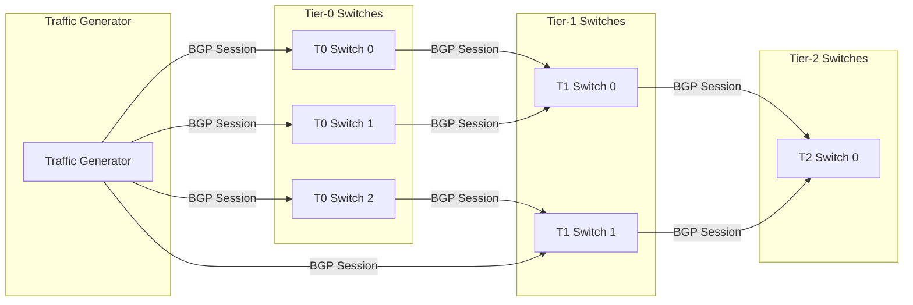
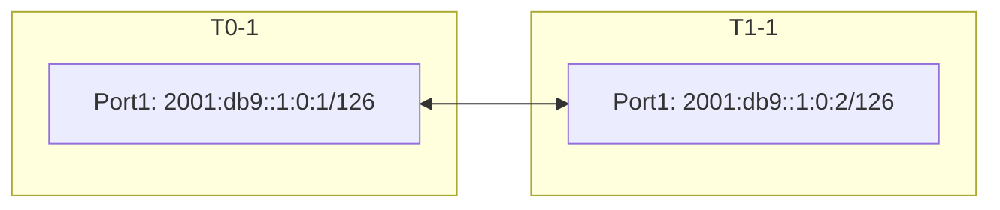

# Testbed Setup with Network Under Test (NUT)

1. [1. Overview](#1-overview)
2. [2. Testbed CLI: `deploy-cfg`](#2-testbed-cli-deploy-cfg)
3. [3. Testbed definition](#3-testbed-definition)
   1. [3.1. Device and link definition](#31-device-and-link-definition)
   2. [3.2. Testbed YAML definition](#32-testbed-yaml-definition)
4. [4. NUT config deployment: `deploy-cfg`](#4-nut-config-deployment-deploy-cfg)
   1. [Initial config generation](#initial-config-generation)
   2. [4.1. Generate device metadata](#41-generate-device-metadata)
   3. [4.2. Generate port config](#42-generate-port-config)
   4. [4.3. Establish BGP Sessions](#43-establish-bgp-sessions)
      1. [4.3.1. Enable BGP Feature](#431-enable-bgp-feature)
      2. [4.3.2. Interface IP assignment](#432-interface-ip-assignment)
      3. [4.3.3. Generate BGP Neighbor configuration](#433-generate-bgp-neighbor-configuration)
   5. [4.4. Verifying BGP Establishment](#44-verifying-bgp-establishment)
5. [5. Traffic generator setup](#5-traffic-generator-setup)
   1. [5.1. Port configuration](#51-port-configuration)
   2. [5.2. Routes advertisement](#52-routes-advertisement)
   3. [5.3. Verifying Route Advertisement](#53-verifying-route-advertisement)

## 1. Overview

This document provides a comprehensive guide for building a SONiC testbed that supports using multiple devices in multi-tier topology as the test target (Network Under Test, NUT), without any neighbors such as cEOS. This testbed is particularly helpful to support test cases that doesn't require any virtual neighbors to be created to help with traffic routing and use hardware traffic generators to generate traffic.

Just like what the datacenter network is designed today, this tested leverages BGP (Border Gateway Protocol) to facilitate scalable route management. In this multi-tier network:

1. All devices will have BGP enabled and sessions to be created on each logical port pairs as long as it is defined in the links csv.
2. The topology only creates the BGP sessions to facilitate traffic routing, but no routes will be created during the `deploy-mg` and `add-topo` steps.
3. Each test needs to inject the routes into the network from the ports that directly connected to traffic generator in its pretest setup fixture. Then the routes will be advertised all the way from lower tiers to higher tiers, tier by tier.



## 2. Testbed CLI: `deploy-cfg`

Because our current testbed-cli and topology management (`deploy-mg` and `add-topo`) is designed to support SONiC testbed with virtual neighbors, and hard to make it compatible with this type of testbed, we will create a new testbed-cli command `deploy-cfg` to deploy the NUT configuration.

This command will skip the minigraph generator and directly generates the required configuration in the format of config DB JSON. This simplifies the deployment process and allows for a more straightforward and flexiable configuration of the NUT.

## 3. Testbed definition

### 3.1. Device and link definition

Just like how regular SONiC testbed is defined, The devices and links between all devices in the NUT need to be defined in the `sonic_*_devices.csv` and `sonic_*_links.csv` file.

The following example represents a definition of a T0 switch:

```csv
Hostname,ManagementIp,HwSku,Type,Protocol
tg-1,10.0.0.200/24,IXIA-tester,DevIxiaChassis,
switch-t0-1,10.0.0.123/24,HWSKU-TO-TEST,DevSonic,
```

The following example represent a 100G link from the traffic generator port 1 to the first port of a T0 switch:

```csv
StartDevice,StartPort,EndDevice,EndPort,BandWidth,VlanID,VlanMode,AutoNeg
switch-t0-1,Ethernet0,tg-1,Port1.1,100000,,Access,
switch-t1-1,Ethernet0,switch-t0-1,Ethernet256,100000,,Access,
```

### 3.2. Testbed YAML definition

The current testbed yaml definition is not designed to support NUT, so we will create a new testbed YAML definition `testbed.nut.yml` that is compatible with the NUT. The following example shows how to define a testbed for NUT with multiple tiers:

```yaml
- conf-name: testbed-nut-1
  dut:
    - switch-t0-1
    - switch-t0-2
    - switch-t0-3
    - switch-t1-1
    - switch-t1-2
    - switch-t2-1
  dut_template:
    - { name: ".*-t0-.*", type: "ToRRouter", loopback_v4: "100.1.0.0/24", loopback_v6: "2064:100:0:0::/64", start_asn: 64001, p2p_v4: "10.0.0.0/16", p2p_v6: "fc0a::/64" }
    - { name: ".*-t1-.*", type: "LeafRouter", loopback_v4: "100.1.1.0/24", loopback_v6: "2064:100:0:1::/64", start_asn: 65001, p2p_v4: "10.0.0.0/16", p2p_v6: "fc0a::/64" }
    - { name: ".*-t2-.*", type: "SpineRouter", loopback_v4: "100.1.2.0/24", loopback_v6: "2064:100:0:2::/64", start_asn: 63001, p2p_v4: "10.0.0.0/16", p2p_v6: "fc0a::/64" }
  tg:
    - tg-1
  inv_name: lab
  auto_recover: 'True'
  comment: "Testbed for NUT with multi-tier topology"
```

## 4. NUT config deployment: `deploy-cfg`

### Initial config generation

First, the device basic config must be generated using the device information defined in the `sonic_*_devices.csv` file. The `deploy-cfg` command will first read the device definitions from `sonic_*_devices.csv` file, then use `sonic-cfggen` to generate the basic configuration based on the HWSKU and save it to disk, as below:

```bash
sonic-cfggen -H -k <hwsku-name> --write-to-db
config save -y
```

After this, all other changes will be made to the config DB via standard GCU (Generic Config Update) commands.

### 4.1. Generate device metadata

There are a few things that needs to be updated in the device metadata, such as BGP ASN, router ID, and other device-specific information. The `deploy-cfg` command will generate the patch for each device.

```json
[
  { "op": "replace", "path": "/DEVICE_METADATA/localhost/hostname", "value": "switch-t0-1" },
  { "op": "replace", "path": "/DEVICE_METADATA/localhost/type", "value": "ToRRouter" },
  { "op": "replace", "path": "/DEVICE_METADATA/localhost/bgp_asn", "value": "64001" },
  { "op": "replace", "path": "/DEVICE_METADATA/localhost/bgp_router_id", "value": "10.100.0.81" },
  ...
]
```

Here is an example of the device metadata for a T0 switch after the `deploy-cfg` command is executed:

```json
"DEVICE_METADATA": {
    "localhost": {
        "bgp_asn": "64001",
        "buffer_model": "traditional",
        "cloudtype": "Public",
        "default_bgp_status": "up",
        "default_pfcwd_status": "enable",
        "deployment_id": "1",
        "docker_routing_config_mode": "separated",
        "hostname": "switch-t0-0",
        "hwsku": "ABCDEFG",
        "region": "None",
        "synchronous_mode": "enable",
        "timezone": "UTC",
        "type": "ToRRouter",
        "yang_config_validation": "disable",
        "bgp_router_id": "10.100.0.81"
    }
}
```

Certain information is not defined specifically in the `sonic_*_devices.csv` file, such as the BGP Autonomous System Number (ASN), router ID and role. These info will be automatically generated by the `deploy-cfg` tool based on the testbed-wise global information defined in the testbed YAML file.

The detailed step follows the following algorithm:

1. Read all IP pools defined in the testbed YAML file and unify the IP pools across all devices. (Different devices can share the same IP pool.)
2. Walk through the devices defined in the testbed from first to last. For each device,
   1. Curve out a loopback v4 IP from the unified IP pool (1 IP), based on the device index.
   2. Curve out a loopback v6 IP from the unified IP pool (1 IP), based on the device index.
   3. If loopback V4 IP pool is not assigned, curve out a router ID v4 IP from the unified IP pool (1 IP), based on the device index.
   4. Curve out BGP ASN from the testbed-wide defined ASN range, based on the device index.

### 4.2. Generate port config

With the link definition, the port configuration will be update on the T0 switch during `deploy-cfg`, which setup port speed, FEC, auto negotiation, and other port attributes.

```json
[
  { "op": "replace", "path": "/PORT/Ethernet256/admin_status", "value": "up" },
  { "op": "replace", "path": "/PORT/Ethernet256/fec", "value": "rs" },
  { "op": "replace", "path": "/PORT/Ethernet256/speed", "value": "100000" },
  ...
]
```

An example of the port configuration generated for the T0 switch is as follows:

```json
"PORT": {
    "Ethernet256": {
        "admin_status": "up",
        "alias": "etp33a",
        "description": "etp33a",
        "fec": "rs",
        "index": "33",
        "lanes": "273",
        "mtu": "9100",
        "pfc_asym": "off",
        "speed": "100000",
        "subport": "1",
        "tpid": "0x8100"
    }
}
```

Each interface will also have IP address assigned, which will be explained as part of the BGP session establishment in the next section.

### 4.3. Establish BGP Sessions

To establish BGP sessions between the switches and the traffic generators, the following steps are required:

#### 4.3.1. Enable BGP Feature

First, BGP must be enabled to allow them to participate in BGP-based route exchange.

```json
[
  { "op": "replace", "path": "/FEATURE/bgp/auto_restart", "value": "enabled" },
  { "op": "replace", "path": "/FEATURE/bgp/state", "value": "enabled" }
]
```

This will enable the BGP feature on the device. In the end, the configuration will look like this:

```json
"FEATURE": {
    "bgp": {
        "auto_restart": "enabled",
        "check_up_status": "false",
        "delayed": "False",
        "has_global_scope": "False",
        "has_per_asic_scope": "True",
        "high_mem_alert": "disabled",
        "set_owner": "local",
        "state": "enabled",
        "support_syslog_rate_limit": "true"
    }
}
```

#### 4.3.2. Interface IP assignment

`deploy-cfg` will automatically assign IP addresses to the interfaces based on the testbed-wide defined IP pools:

```yaml
dut_template:
  - { name: ".*-t0-.*", p2p_v4: "10.0.0.0/16", p2p_v6: "2001:db9::/64", ... }
  - { name: ".*-t1-.*", p2p_v4: "10.0.0.0/16", p2p_v6: "2001:db9::/64", ... }
  - { name: ".*-t2-.*", p2p_v4: "10.0.0.0/16", p2p_v6: "2001:db9::/64", ... }
```

The detailed step follows the following algorithm:

1. Read all IP pools defined in the testbed YAML file and unify the IP pools across all devices. (Different devices can share the same IP pool.)
2. Set devices in the TG (Traffic generator) list in the testbed as the start devices.
3. Walk through the links defined in the `sonic_*_links.csv` file in BFS order.
4. For each link (port pair), curve out a 2-bit subnet from the unified IP pool (4 IPs), where the second IP will be used on the downlink port, while the third IP will be used on the uplink port.
5. Generate the interface configuration for each port for each devices as config shows below.

```json
[
  { "op": "add", "path": "/INTERFACE/Ethernet256|2001:db9::1:0:1/126", "value": "" },
  ...
]
```

And here is the example of the interface configuration generated for the T0 switch:

```json
"INTERFACE": {
    "Ethernet256": {},
    "Ethernet256|2001:db9::1:0:1/126": {}
}
```

In the end, the devices will have the following interface IPs assigned:



#### 4.3.3. Generate BGP Neighbor configuration

To enable BGP sessions, the BGP neighbor configuration must be generated for each switch. This configuration includes the ASN, hold time, keepalive time, local address, and other necessary parameters.

<table>
<tr>
<td>T0-0 Configuration:</td>
<td>T1-0 Configuration:</td>
</tr>
<td>

```json
[
  {
    "op": "add",
    "path": "/BGP_NEIGHBOR/2001:db9::1:0:2",
    "value": {
        "admin_status": "up",
        "asn": 65001,
        "holdtime": "10",
        "keeplive": "3",
        "local_addr": "2001:db9::1:0:1",
        "name": "switch-t1-0",
        "nhopself": "0",
        "rrclient": "0"
    },
  },
  {
    "op": "add",
    "path": "/DEVICE_NEIGHBOR/Ethernet256",
    "value": {
        "name": "switch-t1-0",
        "port": "Ethernet256"
    }
  },
  {
    "op": "add",
    "path": "/DEVICE_NEIGHBOR_METADATA/switch-t1-0",
    "value": {
        "cluster": "StressTest",
        "deployment_id": "1",
        "lo_addr": "100.1.1.1/32",
        "lo_addr_v6": "2064:100:0:1::1/128",
        "mgmt_addr": "10.250.1.1/24",
        "mgmt_addr_v6": "fec0::1:1/64",
        "hwsku": "ABCDEFG",
        "type": "LeafRouter"
    }
  }
]
```

</td>
<td>

```json
[
  {
    "op": "add",
    "path": "/BGP_NEIGHBOR/2001:db9::1:0:1",
    "value": {
        "admin_status": "up",
        "asn": 64001,
        "holdtime": "10",
        "keeplive": "3",
        "local_addr": "2001:db9::1:0:2",
        "name": "switch-t0-0",
        "nhopself": "0",
        "rrclient": "0"
    },
  },
  {
    "op": "add",
    "path": "/DEVICE_NEIGHBOR/Ethernet0",
    "value": {
        "name": "T0-A-0",
        "port": "Ethernet0"
    }
  },
  {
    "op": "add",
    "path": "/DEVICE_NEIGHBOR_METADATA/switch-t0-0",
    "value": {
        "cluster": "StressTest",
        "deployment_id": "1",
        "lo_addr": "100.1.0.1/32",
        "lo_addr_v6": "2064:100:0:0::1/128",
        "mgmt_addr": "10.250.0.1/24",
        "mgmt_addr_v6": "fec0::0:1/64",
        "hwsku": "ABCDEFG",
        "type": "ToRRouter"
    }
  }
]
```

</td>
</tr>
</table>

### 4.4. Verifying BGP Establishment

Once the configurations are applied, the BGP session will be established, and the switches will begin exchanging routing information. Proper verification using `show bgp summary` and `show bgp neighbors` commands can be conducted to confirm session establishment and route propagation.

## 5. Traffic generator setup

Although certain traffic generator configurations can be generated in the `deploy-cfg` step, it is deferred to the pretest fixture of each test case. This allows the traffic generators to be shared by all the tests in the most flexiable way - they are only configured whenever they are actually needed.

### 5.1. Port configuration

During the pretest fixture, the test will read the configurations from the device, for example, port configurations, IP address, and VLAN settings. Then generate the traffic generator configuration accordingly and apply it for later usage, which includes:

- Port breakout, speed and FEC settings.
- IP address assignment for each port.
  - This can be deducted from the port IP subnet. Use the second IP in the subnet.
  - For example, if the switch port is assigned with `2001:db9::1:0:2/126`, the traffic generator port will be assigned with `2001:db9::1:0:1/126`.
- Estabilishing BGP sessions from each traffic generator logical port.
  - To get thing started, the ASN range of the traffic generater is set to 60000-61000.

### 5.2. Routes advertisement

If more routes is required for testing, the test case will need to inject routes into the NUT. This is done by configuring the traffic generator to advertise specific routes via BGP sessions established in the pretext fixture.

### 5.3. Verifying Route Advertisement

To verify that routes are being correctly advertised, we can run `show ip route bgp` or `show ipv6 route bgp` on the T0 switch and confirm all routes advertised by the traffic generator are visible in the routing table. This ensures that the routes injected by the traffic generator are propagated through the multi-tier network.
