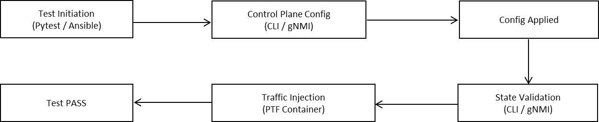

# Integrating SONiC OCS in sonic-mgmt Test Framework
## High Level Document

## Table of Contents
- [Integrating SONiC OCS in sonic-mgmt Test Framework](#integrating-sonic-ocs-in-sonic-mgmt-test-framework)
- [High Level Document](#high-level-document)
- [Table of Contents](#table-of-contents)
  - [Revision](#revision)
  - [Overview](#overview)
  - [Scope](#scope)
  - [Relationship with Existing OCS Documentation](#relationship-with-existing-ocs-documentation)
    - [Document Scope Clarification](#document-scope-clarification)
    - [Recommended Reading Path](#recommended-reading-path)
  - [Definitions/Abbreviations](#definitionsabbreviations)
  - [Requirements](#requirements)
    - [Existing Test Adaptation Support](#existing-test-adaptation-support)
    - [OCS Specific Test Suites](#ocs-specific-test-suites)
  - [High-Level Design](#high-level-design)
    - [Design Principles](#design-principles)
    - [Test Framework for SONiC OCS](#test-framework-for-sonic-ocs)
    - [OCS Integration Design](#ocs-integration-design)
      - [Infrastructure Adaptation](#infrastructure-adaptation)
      - [Test Case Adaptation](#test-case-adaptation)
      - [OCS specific Test Suites](#ocs-specific-test-suites-1)
    - [OCS Validation Workflow](#ocs-validation-workflow)
    - [OCS Failure Handling Model](#ocs-failure-handling-model)
  - [Limitations and Future Work](#limitations-and-future-work)

### Revision

| Rev  | Rev Date   | Author(s)                                    | Change Description |
| ---- | ---------- | -------------------------------------------- | ------------------ |
| v0.2 | 2026-04-08 | Xin Huang, Hong Zeng, Haitao Chen (SVT Team) | Initial version    |

### Overview

This document describes the high-level design for integrating Optical Circuit Switch (OCS) devices into the SONiC test management framework (`sonic-mgmt`).  
OCS devices differ fundamentally from traditional Ethernet switches — they establish exclusive light-path circuits between port pairs rather than forwarding packets based on MAC addresses.  
This document explains how the existing sonic-mgmt framework is extended to support OCS specific topology deployment, device configuration, and testing.

### Scope

The end goal is to be able to run the existing Open Source Community tests in sonic-mgmt repository against an OCS system with minimal changes to test cases itself.

### Relationship with Existing OCS Documentation

This HLD document is part of a suite of OCS-related documentation in the sonic-mgmt repository. The following documents work together to provide a complete guide to OCS testing:

| Document | Path | Scope |
| -------- | ---- | ----- |
| **OCS Topology Definition** | `docs/testbed/README.testbed.OCS.md` | Defines the physical and logical topology for OCS testbeds, including hardware requirements, port configurations, and network architecture |
| **OCS Testbed Setup Guide** | `docs/testbed/README.testbed.OCSSetup.md` | Provides step-by-step instructions for setting up an OCS testbed environment, including host preparation, Docker configuration, and topology deployment |
| **OCS High Level Design** | `docs/testbed/README.testbed.OCS.HLD.md` | Describes the high-level architecture and design principles for integrating OCS devices into the sonic-mgmt test framework |

#### Document Scope Clarification

- **HLD Scope**: This document focuses on the *design architecture* and *validation strategy* for OCS integration. It covers test framework design, validation workflows, failure handling models, and test suite definitions. Readers interested in understanding the "why" and "what" of OCS testing should start here.

- **Setup Scope**: The `README.testbed.OCSSetup.md` document focuses on the *operational procedures* for deploying an OCS testbed. It covers host preparation, Docker container setup, Ansible configuration, and topology deployment steps. Readers who need to *deploy and configure* an OCS testbed should start there.

- **Topology Scope**: The `README.testbed.OCS.md` document focuses on the *physical and logical topology* requirements. It defines the hardware components, cabling requirements, and logical connections needed for OCS testing. Readers who need to understand the *testbed architecture* should reference this document.

#### Recommended Reading Path

1. **Start here** if you want to understand the overall design and validation approach
2. Refer to `README.testbed.OCS.md` for topology requirements
3. Follow `README.testbed.OCSSetup.md` for step-by-step deployment instructions

### Definitions/Abbreviations

- **OCS** - Optical Circuit Switch
- **CLI** - Command Line Interface
- **gNMI** - gRPC Network Management Interface
- **Layer 0** - Physical layer in OSI model (optical domain)
- **Cross-Connect** - OCS optical path connection between ports

### Requirements

#### Existing Test Adaptation Support
- Support selective execution of existing sonic-mgmt test cases based on OCS capabilities
- Enable tagging or classification of test cases for OCS specific applicability

#### OCS Specific Test Suites
- Configuration & State Validation (Control Plane)
- Traffic Validation (Data Plane)
- System Lifecycle Validation
  - Reboot Resilience & Service Recovery
  - Factory Reset Behavior
  - Upgrade and Downgrade Validation
- Negative and Failure Scenarios

### High-Level Design

#### Design Principles

The design of the OCS test framework follows the principles below:

- Reusability: Leverage existing SONiC test cases and infrastructure wherever possible
- Extensibility: Enable seamless addition of OCS specific test scenarios and features
  - Layered Validation: Separate validation across control plane, system state, and data plane
  - Automation: Ensure fully automated test execution and validation
  - Fault Isolation: Provide clear failure classification to simplify debugging

#### Test Framework for SONiC OCS
The framework extends sonic-mgmt by introducing OCS specific test cases, topology definitions, and fixture adaptations.

The system integrates Ansible for configuration and deployment, Pytest for test orchestration, and PTF for traffic generation, enabling end-to-end validation from test execution to device-level behavior.

#### OCS Integration Design

##### Infrastructure Adaptation

**Topology Extension**
- A new topology definition file `topo_ocs.yml` will be created under `sonic-mgmt/ansible/vars/`, extending the existing SONiC topology framework to support OCS-specific port configurations and cross-connect requirements. This file defines the host interfaces, port mappings, and VLAN configurations necessary for OCS testing.

**Inventory Support**
- A dedicated inventory file `inventory/host_vars/ocs.yml` will be added to define OCS-specific device properties, including a new `device_type: ocs` attribute that distinguishes OCS devices from traditional SONiC switches. The inventory will reference OCS-specific hardware SKUs (e.g., `DLXA64B64HNLA1MS`) and management interface configurations. Additionally, a new inventory group `sonic_ocs` will be created under the `sonic` parent group to logically separate OCS devices from standard SONiC switches.

**Ansible Adaptation**
- **Modify existing files**: The `testbed_cli.sh` script will be updated to support OCS topology operations, and `add_topo.yml` playbook will be extended to handle OCS-specific topology additions.
- **Create new files**: 
  - `svt.yml`: Host variables for SVT-specific OCS test configurations
- Existing Ansible playbooks leverage OCS-specific inventory groups and group variables through Ansible's variable precedence mechanism, enabling OCS-appropriate configurations without requiring separate playbook variants.

##### Test Case Adaptation

**Reuse Existing SONiC Tests**
- Existing SONiC test classes in scope include configuration management tests, system lifecycle tests (reboot, upgrade, factory reset), and basic connectivity tests. These tests can be reused for OCS by adding the `@pytest.mark.topology("ocs")` marker to indicate compatibility with OCS topology. Tests can specify multiple topologies using `@pytest.mark.topology("t0", "t1", "ocs")`, allowing them to run on multiple device types. The test framework uses the `--topology ocs` command-line parameter to filter and execute only OCS-compatible tests.

##### OCS specific Test Suites
- Verify that configuration commands (single and batch) are accepted and executed successfully, such as gNMI and CLI.
- Validate consistency between configuration interfaces and system state
- Validate end-to-end connectivity by ensuring traffic entering an ingress port exits the correct egress port based on configured cross-connects.
    This led to the following validation checkpoints:
    - Cross-connect state verification
    - Optical signal presence
    - End-to-end connectivity validation
- Verify that the system successfully boots and all critical services are operational after reboot
- Verify that persisted configurations are restored after reboot
- Verify that non-persisted configurations are not present after reboot
- Validate that traffic connectivity is restored based on restored configuration
- Verify that factory reset clears all user configurations (including cross-connects are cleared after factory reset)
- Verify that the system successfully upgrades and downgrades between supported software versions
- Verify that system services are operational after upgrade or downgrade
- Verify that system state remains consistent after upgrade or downgrade
- Verify that traffic connectivity is maintained or restored after upgrade or downgrade
- Verify cross-connect creation fails with invalid parameters
- Verify deletion of non-existent cross-connects returns appropriate errors
- Verify conflicting cross-connect configurations are rejected

#### OCS Validation Workflow

The validation workflow follows a closed-loop model across control plane configuration, system state verification, and data plane validation.

Test execution applies cross-connect configurations through control interfaces, followed by state validation to ensure consistency across system representations. Traffic is then injected to verify end-to-end connectivity, and the test is considered successful only when all validation stages pass.

#### OCS Failure Handling Model
The validation workflow illustrates the normal execution path of test cases,
while the failure handling model defines how failures are detected and
classified across different validation stages.

The system adopts a layered failure detection model:
- Configuration Failure: Invalid or conflicting configurations at the control plane
- State Validation Failure: Inconsistencies across CLI, gNMI, and STATE_DB
- Traffic Validation Failure: Data plane forwarding issues despite valid configuration

A test passes only when all stages succeed, ensuring correct configuration, consistent system state, and valid end-to-end connectivity.

This model improves observability and enables precise fault isolation, reducing debugging complexity and improving system reliability.

### Limitations and Future Work

**Current Limitations**
- Traffic validation is currently limited to basic connectivity checks; advanced traffic pattern testing will be added based on test requirements.
- OCS-specific hardware monitoring metrics are not yet integrated into the existing telemetry framework.
- Optical performance metrics such as switching time and insertion loss (IL) cannot be measured using the current SONiC test framework alone, requiring external optical test equipment for accurate measurement.

**Future Work**
- Integrate OCS-specific telemetry metrics into the existing monitoring infrastructure
- Develop performance benchmarking tests for optical cross-connect latency and throughput
- Add support for dynamic cross-connect reconfiguration testing under traffic load
- Integrate external optical test equipment such as Optical Performance Monitors (OPM) to enable measurement of optical metrics including switching time and insertion loss (IL)

