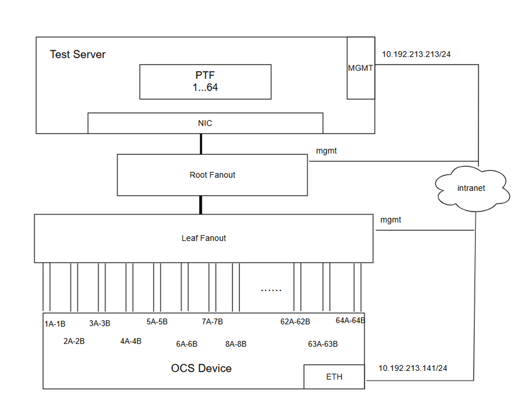
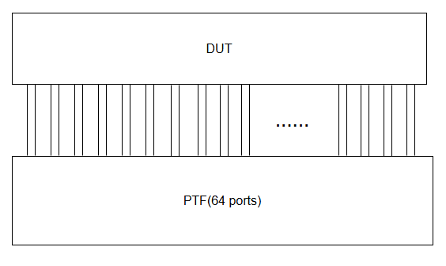

# OCS Topology Definition

## Table of Contents
  * [Revision History](#revision-history)
  * [Objective](#objective)
  * [Physical Topology](#physical-topology)
  * [Logical Topology](#logical-topology)
  * [Testbed Requirements](#testbed-requirements)

## Revision History

| Date       | Author    | Description   |
| ---------- | --------- | ------------- |
| 2025-07-09 | Huang Xin | Initial draft |

## Objective
This document defines the topology of the Optical Circuit Switch (OCS) to verify the basic functionality of the OCS device. 

## Physical Topology

Key components in the physical connection: 
* Test servers
* Fanout switches
  *     Root fanout switch (optional)
  *     Leaf fanout switch
* OCS device

Key aspects of the physical connection:
1. Each OCS port operates exclusively as either a Rx (receive) or a Tx (transmit) port. A Tx port and its corresponding Rx port form a pair to establish an exclusive, transparent tunnel for data transmission—a fundamental contrast to the operation of a traditional Ethernet switch.
2. The leaf fanout switch has unique VLAN tag for each pair of OCS ports
3. Root fanout switch connects leaf fanout switch and test servers using 802.1Q trunks
4. The test server can SSH to OCS device and configure the OCS device 

With this design, all OCS  port pairs can be exposed in test server. In test servers, a PTF container can be deployed to inject and capture packets. The PTF container, the VLAN interfaces in test server can be interconnected by open vSwitch bridges. Through the VLAN Trunk of the fanout switches, the PTF container can communicate with the OCS device.

## Logical Topology

## Testbed Requirements

### Required Equipment
List of hardware and minimum specifications needed to construct the testbed

| Equipment       | Quantity | Minimal Requirements                    |
| --------------- | -------- | --------------------------------------- |
| OCS             | 1        |                                         |
| Test Server     | 1        | Ubuntu 20.04, CPU 2 cores, RAM 4GB,50Gb |
| Ethernet cables |          | Gigabit Ethernet cables                 |
| Fiber Modules   | 64       | OSFP Transceiver                        |
| Optical Fiber   |          | single-mode fiber                       |

### Additional Notes
In-Band Management: The OCS device is managed via in-band (OOB) management interface (e.g., SSH or gNMI) from the test server.
PTF Container: Ensure that the PTF container is properly set up with necessary dependencies such as Python, Scapy, and pypcap if required.
Open vSwitch Configuration: Use Open vSwitch to interconnect VLAN interfaces and the PTF container within the test server