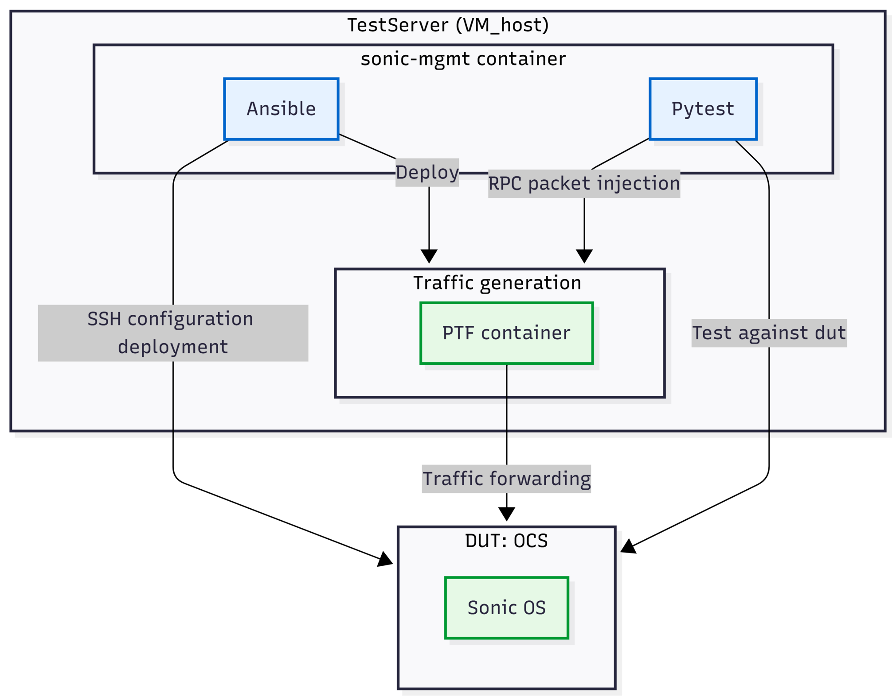
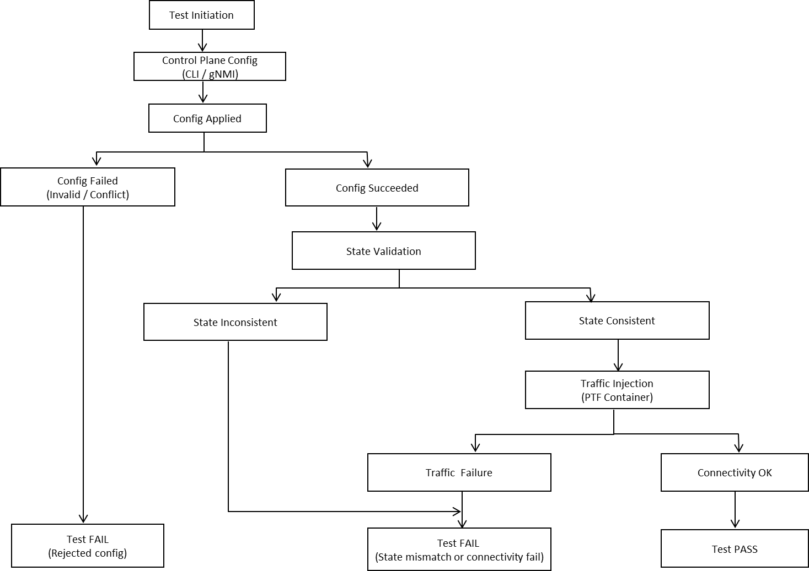

# Integrating SONiC OCS in sonic-mgmt Test Framework
# High Level Document

# Table of Contents
- [Integrating SONiC OCS in sonic-mgmt Test Framework](#integrating-sonic-ocs-in-sonic-mgmt-test-framework)
- [High Level Document](#high-level-document)
- [Table of Contents](#table-of-contents)
  - [Revision](#revision)
  - [Overview](#overview)
  - [Scope](#scope)
  - [Definitions/Abbreviations](#definitionsabbreviations)
  - [Requirements](#requirements)
    - [Existing Test Adaptation Support](#existing-test-adaptation-support)
    - [OCS Specific Test Suites](#ocs-specific-test-suites)
  - [High-Level Design](#high-level-design)
    - [Design Principles](#design-principles)
    - [Test Framework for SONiC OCS](#test-framework-for-sonic-ocs)
    - [OCS Integration Design](#ocs-integration-design)
      - [Infrastructure Adaptation](#infrastructure-adaptation)
      - [Test Case Adaptation](#test-case-adaptation)
      - [OCS specific Test Suites](#ocs-specific-test-suites-1)
    - [OCS Validation Workflow](#ocs-validation-workflow)
    - [OCS Failure Handling Model](#ocs-failure-handling-model)

## Revision

| Rev  | Rev Date   | Author(s)                                    | Change Description |
| ---- | ---------- | -------------------------------------------- | ------------------ |
| v0.1 | 04/08/2026 | Xin Huang, Hong Zeng, Haitao Chen (SVT Team) | Initial version    |

## Overview

This document describes the high-level design for integrating Optical Circuit Switch (OCS) devices into the SONiC test management framework (`sonic-mgmt`). 
OCS devices differ fundamentally from traditional Ethernet switches — they establish exclusive light-path circuits between port pairs rather than forwarding packets based on MAC addresses. 
This document explains how the existing sonic-mgmt framework is extended to support OCS specific topology deployment, device configuration, and testing

## Scope

The end goal is to be able to run the existing Open Community tests in sonic-mgmt repository against an OCS system with minimal changes to test cases itself.

## Definitions/Abbreviations

- **OCS** - Optical Circuit Switch
- **CLI** - Command Line Interface
- **gNMI** - gRPC Network Management Interface
- **Layer 0** - Physical layer in OSI model (optical domain)
- **Cross-Connect** - OCS optical path connection between ports

## Requirements

### Existing Test Adaptation Support
- Support selective execution of existing sonic-mgmt test cases based on OCS capabilities
- Enable tagging or classification of test cases for OCS specific applicability

### OCS Specific Test Suites
- Configuration & State Validation (Control Plane)
- Traffic Validation (Data Plane)
- System Lifecycle Validation
  - Reboot Resilience & Service Recovery
  - Factory Reset Behavior
  - Upgrade and Downgrade Validation
- Negative and Failure Scenarios

## High-Level Design

### Design Principles

The design of the OCS test framework follows the principles below:

- Reusability: Leverage existing SONiC test cases and infrastructure wherever possible
- Extensibility: Enable seamless addition of OCS specific test scenarios and features
  - Layered Validation: Separate validation across control plane, system state, and data plane
  - Automation: Ensure fully automated test execution and validation
  - Fault Isolation: Provide clear failure classification to simplify debugging

### Test Framework for SONiC OCS
The framework extends sonic-mgmt by introducing OCS specific test cases, topology definitions, and fixture adaptations.

  

The system integrates Ansible for configuration and deployment, Pytest for test orchestration, and PTF for traffic generation, enabling end-to-end validation from test execution to device-level behavior.

### OCS Integration Design

#### Infrastructure Adaptation
- topology extension
- inventory support
- Ansible adaptation

#### Test Case Adaptation
- reuse existing SONiC tests
- skip unsupported cases
- fixture adaptation

#### OCS specific Test Suites
- Verify that configuration commands (single and batch) are accepted and executed successfully,such as gNMI and CLI etc.
- Validate consistency between configuration interfaces and system state
- Validate end-to-end connectivity by ensuring traffic entering an ingress port exits the correct egress port based on configured cross-connects.
    This Led to the following accomplishments:
    - Cross-connect state verification
    - Optical signal presence
    - End-to-end connectivity validation
- Verify that the system successfully boots and all critical services are operational after reboot
- Verify that persisted configurations are restored after reboot
- Verify that non-persisted configurations are not present after reboot
- Validate that traffic connectivity is restored based on restored configuration
- Verify that factory reset clears all user configurations (including cross-connects are cleared after factory reset)
- Verify that the system successfully upgrades and downgrades between supported software versions
- Verify that system services are operational after upgrade or downgrade
- Verify that system state remains consistent after upgrade or downgrade
- Verify that traffic connectivity is maintained or restored after upgrade or downgrade
- Verify cross-connect creation fails with invalid parameters
- Verify deletion of non-existent cross-connects returns appropriate errors
- Verify conflicting cross-connect configurations are rejected

###  OCS Validation Workflow

   
 
 

The validation workflow follows a closed-loop model across control plane configuration, system state verification, and data plane validation.

Test execution applies cross-connect configurations through control interfaces, followed by state validation to ensure consistency across system representations. Traffic is then injected to verify end-to-end connectivity, and the test is considered successful only when all validation stages pass.

### OCS Failure Handling Model
The validation workflow illustrates the normal execution path of test cases,
while the failure handling model defines how failures are detected and
classified across different validation stages.

  
 
 

The system adopts a layered failure detection model:
- Configuration Failure: Invalid or conflicting configurations at the control plane
- State Validation Failure: Inconsistencies across CLI, gNMI, and STATE_DB
- Traffic Validation Failure: Data plane forwarding issues despite valid configuration

A test passes only when all stages succeed, ensuring correct configuration, consistent system state, and valid end-to-end connectivity.

This model improves observability and enables precise fault isolation, reducing debugging complexity and improving system reliability