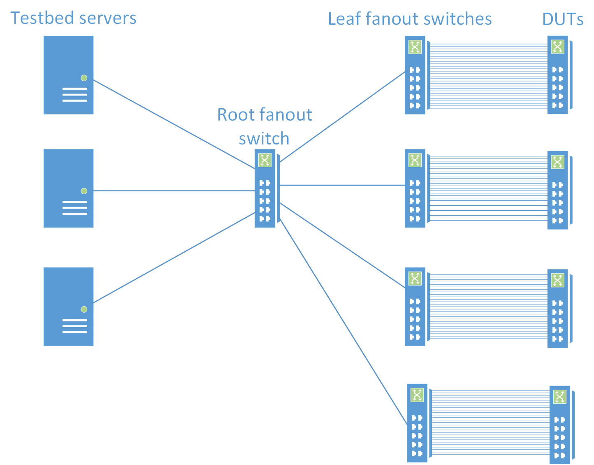
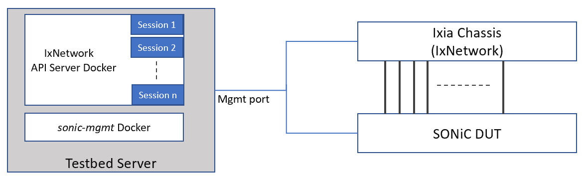
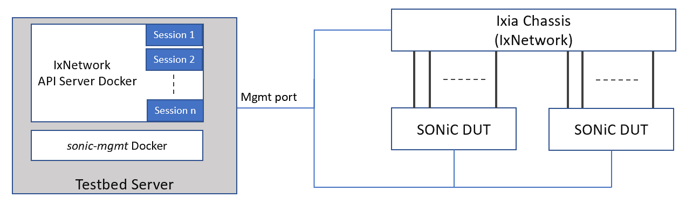
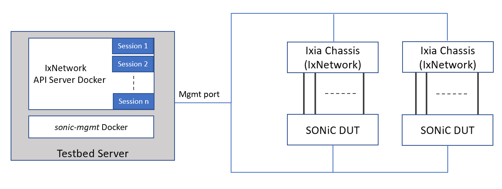

# SONiC Testbed Overview

This document gives overview of the SONiC testbed. 

## Physical topology



1. Every DUT port is connected to one of leaf fanout switches
2. Every leaf fanout switch has unique vlan tag for every DUT port
3. Root fanout switch connects leaf fanout switches and testbed servers
4. Connections from root fanout switches are 802.1Q trunks
5. Any testbed server can access any DUT port by sending a packet with the port vlan tag (root fanout switch should have this vlan number enabled on the server trunk)

## Fanout switch
*Fanout switch*: A physical switch which enables VLAN trunking. 
   * Hardware SKU: Arista 7260 or similar
   * Et33 is a vlan trunking port and is connected to the eth0 port of the linux host.
   * Et1-Et32 are vlan access ports and are connect to DUT.
   * Enable LACP/LLDP passthrough
   * Disable spanning tree protocol

## Testbed server

- Server SKU (this is what we are using, not mandatory): Dell 730; 2 CPUs each has 18 cores; 192G memory; hard disk:2X500G
- NIC: Mellanox MT27700 Family CX4


### Network connections

- The testbed server has 2 network ports:
  - Trunk port (Mellanox MT27700 Family CX4) to root fanout switch
  - Server management port to manage the server, VMs and PTF containers on the server
 
### VMs

The VMs use Arista vEOS. They are using to setup protocol test such as BGP, LACP, LLDP. They are created using ```testbed-cli.sh start-vms``` command. Each VM uses 2G of RAM and has 10 network interfaces:

- 8 front panel ports. These ports are connected to openvswitch bridges, which are connected to vlan interfaces. The vlan interfaces are connected to the fanout switch (through physical port).
- 1 back panel port. All VMs in one topology have their 9th port connected to this backplane network.
- 1 management port. This port is used to connect to the VMs

### PTF

PTF container is used to send and receive data packets to validate the DUT data plane.

#### PTF with direct port


DUT front panel port is directly connected to one of PTF container ports. Usually eth0 port of PTF container connects Ethernet0 port of DUT, eth1 port of PTF container connects Ethernet4 port of DUT and so on. This is usually used in PTF topologies to connect DUT ports to PTF container ports.

#### PTF with injected port


DUT front panel port is directly connected to one of VMs interfaces. But also we have a tap into this connection. Packets coming from the physical vlan interface are sent to both the VMs and the PTF docker. Packets from the VM and PTF docker are sent to the vlan interface. It allows us to inject packets from the PTF host to DUT and maintain a BGP session between VM and DUT at the same time.

# SONiC Testbed with Keysight IxNetwork as Traffic Generator

This section gives an overview of the stand-alone testbed topology where SONiC DUT is directly connected with Keysight’s protocol emulator and traffic generator (IxNetwork).

## Physical Topology

Based on test need there may be multiple topologies possible as shown below :

- Single DUT Topology



- Multiple DUT Topology



- Multiple IxNetwork Topology


## Topology Description

### Ixia Chassis (IxNetwork)
Keysight IxNetwork is used as the network tester to emulate protocol sessions eg. OSPF, BGP, LACP etc. and send data traffic with various user defined traffic profiles at line rate. Based on test need this can support line cards of varying speed ranging from 1G to 400G. It also supports vlan separated logical interfaces over each physical port.

### IxNetwork API Server Docker

The IxNetwork API Server docker is installed in the Testbed server along with sonic-mgmt docker. It provides API server, that is used to configure the Traffic Generator (IxNetwork) using restPy APIs. It is capable of offering multiple sessions of IxNetwork API server. Each session runs independent of each other and configures IxNetwork.

### Network connections
- IxNetwork API server is connected to IxNetwork via the management port. 
- IxNetwork test ports are directly connected to single or multiple DUTs.

## Deploy IxNetwork API Server

### Download IxNetwork API Server docker image
1. Download IxNetwork Web Edition (Docker deployment) from [ here ](https://ks-aws-prd-itshared-opix.s3-us-west-1.amazonaws.com/IxSoftwareUpgrades/IxNetwork/9.0_Update3/Ixia_IxNetworkWeb_Docker_9.00.100.213.tar.bz2)

2. Copy the tar.bz2 file on the testbed server.

3. Make sure the interface has promiscuous mode enabled
```
 ifconfig ens160  promisc
 ```

3. Decompress the file (it may take a few minutes): 
```
tar xvjf <path_to_tar_file>
```
### Run IxNetwork API Server docker

1. Load the image to docker:
```
docker load -i Ixia_IxNetworkWeb_Docker_<version>.tar
```
2. Loaded image : `ixnetworkweb_<version>_image`

3. Create the macvlan bridge to be used by IxNetwork Web Edition:
```
docker network create -d macvlan -o parent=ens160 --subnet=192.168.x.0/24 --gateway=192.168.x.254 <bridge_name>
(NOTE: Use your subnet, prefix length and gateway IP address.)
```

4. Verify bridge got created properly:
```
docker network ls
docker network inspect IxNetVlanMac
```
5. Deploy the IxNetwork Web Edition container using the following command ixnetworkweb_\<version>_image  should be as shown in step 2 above):
```
docker run --net <bridge_name> \
--ip <container ip> \
--hostname <hostname> \
--name <container name> \
--privileged \
--restart=always \
--cap-add=SYS_ADMIN \
--cap-add=SYS_TIME \
--cap-add=NET_ADMIN \
--cap-add=SYS_PTRACE \
-i -d \
-v /sys/fs/cgroup:/sys/fs/cgroup \
-v /var/crash/=/var/crash \
-v /opt/container/one/configs:/root/.local/share/Ixia/sdmStreamManager/common \
-v /opt/container/one/results:/root/.local/share/Ixia/IxNetwork/data/result \
-v /opt/container/one/settings:/root/.local/share/IXIA/IxNetwork.Globals \
--tmpfs /run \
ixnetworkweb_<version>_image

Note : The folders within /opt/container/one/ should to be created with read and write permission prior docker run.

```

6. Launch IxNetworkWeb using browser `https://container ip`

