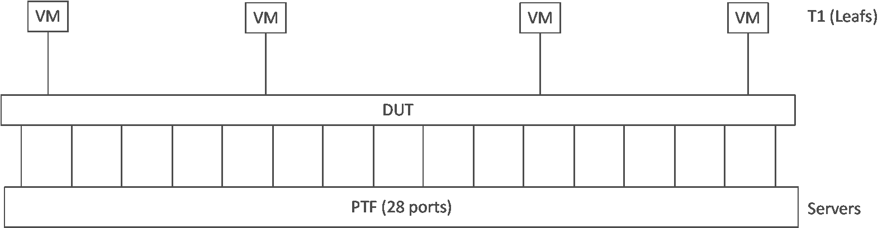
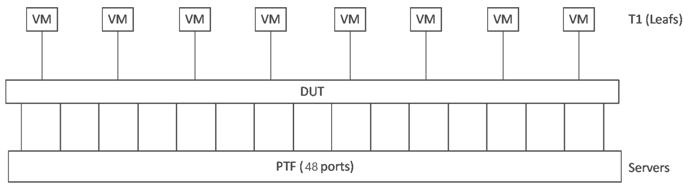
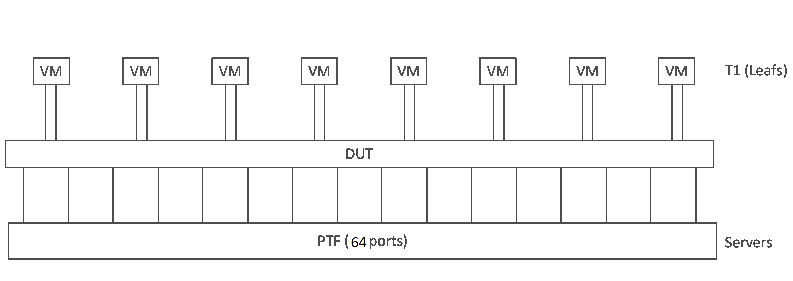
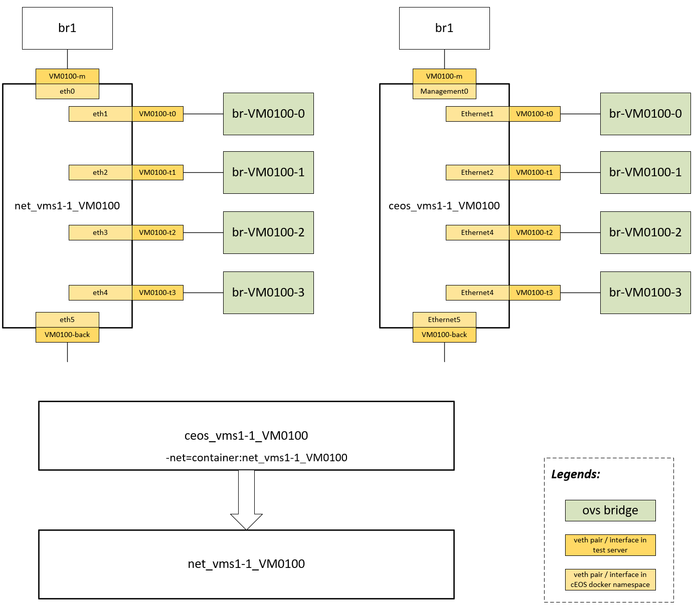
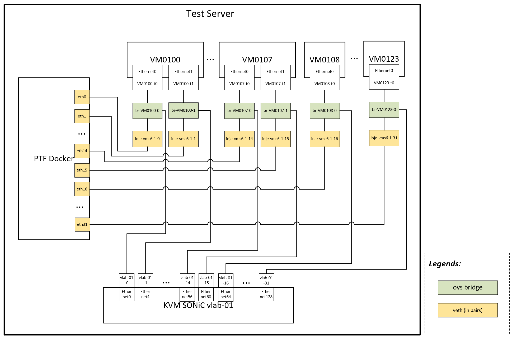

# SONiC Testbed Topology

[TOC]

This [sonic-mgmt repository](https://github.com/sonic-net/sonic-mgmt) contains all the scripts for setting up testbed and running feature/functional tests. Documents under this folder are for explaining the SONiC testbed and running tests.

## Physical topology

In a data center, typically there are rows of racks. Each rack has servers installed. Different tiers of network devices forming a modified clos network serve the traffic between devices in and between racks. The network device tiers are Tier0, Tier1 and Tier2.


For a Tier0, or T0 device, it usually sit on top of a rack. That's why a T0 device is also called a ToR (Top of Rack) device. For downstream, the T0 device is connected to all the servers in the rack. For upstream, the T0 device is connected to multiple T1 devices.

For a Tier1, or T1 device, it is usually connected to multiple downstream T0 devices and multiple upstream T2 devices.

For a Tier2, or T2 device, it is usually connected to multiple downstream T1 devices and multiple upstream Regional Gateways. Alternatively, the regional gateways can also be called T3 devices.

|Tiers | Downstream Devices | Upstream Devices |
|--|--|--|
|T0 | Servers | T1 devices|
|T1 | T0 devices | T2 devices|
|T2 | T1 devices | Regional Gateways (T3 devices)|

The tests in this sonic-mgmt repository are mainly for testing features and functions of SONiC running as T0/T1/T2 network devices in data center. For that purpose, testbeds need to have the same topology of T0/T1/T2 devices. This means that in a testbed, all the neighbor devices of DUT (Device Under Test) are required. To test a network device, besides the neighbor devices, the capability of injecting traffic to and sniffing traffic from any port of the DUT is also required. Considering the number of neighbor devices, it would be more realistic and flexible to simulate them instead of setting up real physical neighbor devices.

To meet the requirements of simulating neighbor devices and injecting/sniffing packets, the physical connection of testbed is designed like below:


Key components in the physical connection:

* Test servers
* Fanout switches
  * Root fanout switch (optional)
  * Leaf fanout switch
* SONiC DUT

Key aspects of the physical connection:

1. Every DUT port is connected to one of leaf fanout switches.
2. Every leaf fanout switch has unique VLAN tag for every DUT port.
3. Root fanout switch connects leaf fanout switches and test servers using 802.1Q trunks. *The root fanout switch is not mandatory if there is only one testbed or a test server is only used by one testbed. In this case, the leaf fanout switch can be directly connected with NIC of test server by 802.1Q trunk.*
4. Any test server can access any DUT port by sending a packet with the port VLAN tag (The root fanout switch should have this VLAN number enabled on the server trunk)

With this design, all the SONiC DUT ports can be exposed in any test server. In test servers, a set of VMs can be created for running NOS like EOS to simulate neighbors of the SONiC DUT. Also a PTF container (based on the [PTF test framework](https://github.com/p4lang/ptf)) for injecting/sniffing packets can be created. The PTF docker, the VMs (Virtual Machine) and VLAN interfaces in test server can be interconnected by [open vSwitch](https://www.openvswitch.org) bridges. Through the VLAN tunnels of the fanout switches, the PTF docker and VMs can be connected to the ports of SONiC DUTs in flexible ways. Then different testbed topologies can be simulated by creating different number of VMs and establish different connections between the VMs and SONiC DUTs.

Please be noted that the number of test servers, fanout switches and SONiC DUTs are not fixed. They depend on the actual number of test devices available in lab.

## Logical topologies

Mainly 4 types of testbed topologies can be simulated based on the physical topology.

* T0
* T1
* T2
* PTF

Details of the logical topologies are defined in `ansible/vars/topo_*.yml` files.

### T0 type topology

The T0 type topology is to simulate a SONiC DUT running as a T0 device.

For this type of topology, a set of of the DUT ports are connected to VMs simulating upstream T1 neighbors. Rest of the ports are connected to a PTF docker simulating downstream servers.

**The PTF docker also has injected ports connected to the open vSwitch bridges interconnecting VMs and DUT ports. The injected ports can be used for both injecting packets to DUT and sniffing packets from DUT. Details of the injected ports will be explained in later sections.**

The T0 type topology has different variations. The differences are just the number of upstream T1 neighbors and downstream servers. Current variations of the T0 type topology:

* t0
* t0-16
* t0-35
* t0-52
* t0-56
* t0-56-po2vlan
* t0-80
* t0-116
* t0-120
* t0-backend

Below are details of some of the T0 variations:

#### Variation t0



* The DUT has 32 ports.
* Requires 4 VMs.
* The first 28 ports are connected to PTF docker simulating servers.
* The last 4 ports are connected to 4 VMs simulating T1 devices. The connection to each of the upstream T1 is configured as a port-channel with single link.

#### Variation t0-56



* The DUT has 56 ports.
* Requires 8 VMs.
* 48 of the DUT ports are connected to PTF docker simulating servers.
* 8 of the DUT ports are connected to 8 VMs simulating T1 devices. The connection to each of the upstream T1 is configured as a port-channel with single link.

#### Variation t0-80



* The DUT has 80 ports.
* Requires 8 VMs.

* 64 of the DUT ports are connected to PTF docker simulating servers.

* 16 of the DUT ports are connected to 8 VMs simulating T1 devices. Each VM has 2 links connected. The connection to each upstream T1 is configured as a port-channel with 2 links.

### T1 type topology

The T1 type topology is to simulate a SONiC DUT running as a T1 device. For this type of topology, a set of DUT ports are connected to VMs simulating upstream T2 neighbors. Another set of DUT ports are connected to VMs simulating downstream T0 neighbors.

The T1 type topology also has a PTF docker.  **But the PTF docker does not have ports directly connected to DUT ports for simulating servers. The PTF docker only has injected ports connected to the open vSwitch bridges interconnecting VMs and DUT ports. The injected ports can be used for both injecting packets to DUT and sniffing packets from DUT. Details of the injected ports will be explained in later sections.**

Like the T0 type topology, the T1 type topology also has variations:

#### Variation t1


* The DUT has 32 ports.
* Requires 32 VMs.
* 16 of the ports are connected to 16 VMs simulating upstream T2 neighbors. The connections to upstream T2s are single link without port channel configured.
* 16 of the ports are connected to another 16 VMs simulating downstream T0 neighbors. No port-channel is configured for the links between DUT and T0 neighbors.

#### Variation t1-lag


* The DUT has 32 ports.
* Requires 24 VMs.
* 16 of the ports are connected to 16 VMs simulating upstream T2 neighbors. Each VM has 2 links connected. The connection to each upstream T2 is configured as a port-channel with 2 links.
* 16 of the ports are connected to another 16 VMs simulating downstream T0 neighbors. No port-channel is configured for the links between DUT and T0 neighbors.

### T2 type topology

The T2 type topology is to simulate a SONiC DUT running as a T2 device. For a T2 device, in most case it is a chassis with multiple line cards and a supervisor card. For this type of topology, a set of DUT ports on some line cards are connected to VMs simulating upstream T3 neighbors. Another set of DUT ports on some line cards are connected to VMs simulating downstream T1 neighbors.

The T2 type topology also has a PTF docker. **Like the PTF docker for T1 type topology, the PTF docker does not have ports directly connected to DUT ports. The PTF only has injected ports connected to the open vSwitch bridges interconnecting VMs and DUT ports. The injected ports can be used for both injecting packets to DUT and sniffing packets from DUT. Details of the injected ports will be explained in later sections.**

The T2 type topology has variations:

* t2
* t2-vs

#### Variation t2


* The DUT has 3 line cards.
* Each line card has 32 ports. Totally there are 96 DUT ports.
* Requires 72 VMs.
* DUT ports on line card 1 are connected to 24 VMs simulating upstream T3 devices.
  * 8 of the VMs have 2 links connected to DUT. The 2 links to each VM are configured as a port-channel.
  * 16 of the VMs has single link connected to DUT. No port-channel is configured for these VMs.
* DUT ports on line card 2 are connected to 24 VMs simulating downstream T1 devices.
  * 8 of the VMs have 2 links connected to DUT. The 2 links to each VM are configured as a port-channel.
  * 16 of the VMs has single link connected to DUT. No port-channel is configured for these VMs.
* DUT ports on line card 3 are connected to 24 VMs simulating downstream T1 devices.
  * 8 of the VMs have 2 links connected to DUT. The 2 links to each VM are configured as a port-channel.
  * 16 of the VMs has single link connected to DUT. No port-channel is configured for these VMs.

* The supervisor card does not have DUT ports.

### M0 type topology

The M0 type topology is to simulate a SONiC DUT running as a Management ToR Router device. For this type of topology, a set of DUT ports are connected to VMs simulating upstream M1 (Management Leaf Router) neighbors. Another set of the ports are connected to a PTF docker simulating downstream servers. Rest of the ports are connected to VMs simulating downstream Mx (BMC Management Router) neighbors.

**The PTF docker also has injected ports connected to the open vSwitch bridges interconnecting VMs and DUT ports. The injected ports can be used for both injecting packets to DUT and sniffing packets from DUT. Details of the injected ports will be explained in later sections.**


* The DUT has 52 ports.
* Requires 6 VMs.
* The first 46 ports are connected to PTF docker simulating servers.
* The next 2 ports are connected to 2 VMs simulating downstream Mx neighbors. No port-channel is configured for the links between DUT and Mx neighbors.
* The last 4 ports are connected to another 4 VMs simulating upstream M1 devices. The connection to each of the upstream M1 is configured as a port-channel with single link.

### PTF type topology

The PTF type topology does not have VMs. All the DUT ports are connected to a PTF docker. Because there is no VM, the PTF docker does not have injected ports. The PTF type topology has variations:

* ptf32
* ptf64

#### Variation ptf32


* The DUT has 32 ports.
* Requires no VM.
* All the DUT ports are connected to the PTF docker.

#### Variation ptf64


* The DUT has 64 ports.
* Requires no VM.
* All the DUT ports are connected to the PTF docker.

## Build testbed

### Hardware Requirements

#### Leaf fanout switch

- Arista 7260 or similar that has more ports than the SONiC DUT.
- Supports LACP/LLDP passthrough
- Supports 802.1Q tunning (QinQ)

#### Root fanout switch

* Same requirements as the leaf fanout switch

#### Test server

- Server SKU (this is what we are using, not mandatory): Dell 730; 2 CPUs each has 18 cores; 192G memory; hard disk:2X500G
- NIC: Mellanox MT27700 Family CX4
- Server management port to management network

### Physical connections

* DUT - leaf fanout

Each of the DUT port is connected to a leaf fanout port.

* leaf fanout - root fanout

A 802.1Q VLAN trunk port of leaf fanout is connected to root fanout switch

* root fanout - test server

A 802.1Q VLAN trunk port of root fanout is connected to NIC of test server.

### Setup the testbed topology

After the physical connection is ready, the components need to be configured for the logical testbed topology to be up and running. The test server, root and leaf fanout switches all need to be configured to deploy a testbed topology. The sonic-mgmt repository contains the scripts and tools for configuring the components to setup testbed topology. The scripts and tools are based on ansible. Please refer to [Testbed Setup](./README.testbed.Setup.md) for more details.

## Testbed topology internals

This section is to demystify how a testbed topology is fully connected and configured. The most complicated part is how the VMs and PTF docker are connected with the VLAN interfaces in test server through open vSwitch bridges.

### t0 topology internal

According to [Testbed Setup](./README.testbed.Setup.md), to deploy a testbed topology, the ansible inventory files, ansible variable files, connection graph files and testbed definition in `testbed.csv` or `testbed.yaml` must be ready. Then the key tool to deploy a testbed topology is the `ansible/testbed-cli.sh` script. This shell script supports multiple sub-commands for different purposes. The sub-commands for deploying a testbed topology are: `start-vms` or `start-topo-vms`(recommended), `add-topo`. Full syntax is like below:

```shell
./testbed-cli.sh -t <testbed_file> -m <vm_inventory_file> -k <vm_type> start-topo-vms <testbed_name> <vault-password-file>
./testbed-cli.sh -t <testbed_file> -m <vm_inventory_file> -k <vm_type> add-topo <testbed_name> <vault-password-file>
```

To explain how a t0 testbed topology is deployed, some assumptions need to be made:

1. Testbed file is `testbed.yaml`.
2. VM inventory file is `veos`.
3. VM type vEOS is used. (Alternatively, VM type cEOS and vSONiC are also supported. cEOS will be explained later).
4. Below example testbed is defined in the `testbed.yaml` file. Name of the example testbed is `example_testbed`. The testbed is to run t0 topology.

```yaml
- conf-name: example_testbed
  group-name: vms1-1
  topo: t0
  ptf_image_name: docker-ptf
  ptf: ptf-1
  ptf_ip: 10.250.0.102/24
  ptf_ipv6: fec0::ffff:afa:2/64
  server: server_1
  vm_base: VM0100
  dut:
    - sonic-dut-01
  comment: Example testbed
```

5. Interface of the NIC in test server is `p4p1`.
6. Vault password file is `password.txt`.

#### start VMs for the testbed topology

After everything  for a testbed topology is ready, the first step to deploy it is to run command like below:

```
./testbed-cli.sh -t testbed.yaml -m veos -k veos start-topo-vms example_testbed password.txt
```

Under the hood, this command runs an ansible playbook to start VMs required by testbed `example_testbed`. Totally 4 KVM VMs will be created in test server after this step. According to testbed definition, the base VM is VM0100. This means that this topology will need VMs: VM0100, VM0101, VM0102, VM0103. This logic of getting list of VM names is defined in the called ansible playbook for starting VMs.

The created KVM VM is loaded with [vEOS]([CloudEOS and vEOS Router - Overview - Arista](https://www.arista.com/en/cg-veos-router/veos-router-overview)) image and looks like below. The below example is for VM0100. It is similar for other VMs.


Template of the KVM VM is defined in [sonic-mgmt/ansible/roles/vm_set/templates/arista.xml.j2](https://github.com/sonic-net/sonic-mgmt/blob/master/ansible/roles/vm_set/templates/arista.xml.j2). Based on the template, each VM is created with 6 interfaces. The same interface may have different name if view from test server or view inside the VM. Take VM0100 as an example, it has below interfaces:

| Network    | Internal Name | External Name |
| ---------- | ------------- | ------------- |
| Management | Management1   | VM0100-m      |
| Dataplane  | Ethernet1     | VM0100-t0     |
| Dataplane  | Ethernet2     | VM0100-t1     |
| Dataplane  | Ethernet3     | VM0100-t2     |
| Dataplane  | Ethernet4     | VM0100-t3     |
| Backplane  | Ethernet5     | VM0100-back   |

* For the management interface, it is attached to an ethernet bridge with name `br1` created during a step of setting up the test server. Management interface of all VMs and PTF docker are all attached to the same bridge `br`. Then they can talk to each other through the management network.

* Totally 4 dataplane interfaces are created for each VM. For the t0 topology, only the first dataplane interface will be used.

* For the dataplane interfaces, a dedicated open vSwitch bridge is created for each of them.

* The backplane interface is for the VM to learn IP routes from PTF docker. It will be explained in more details in later sections.

#### add the testbed topology

After the VMs are started for the testbed, the next step is to bind the topology using command like below:

```
./testbed-cli.sh -t testbed.yaml -m veos -k veos add-topo example_testbed password.txt
```

Under the hood, another ansible playbook is executed to do stuff like creating VLAN interfaces in test server, creating PTF docker, and then binding the VMs, PTF docker and VLAN interfaces together.

##### Create VLAN interfaces

For each testbed, the physical connection need to be described in files called connection graph. Example connection graph files are under [sonic-mgmt/ansible/files](https://github.com/sonic-net/sonic-mgmt/tree/master/ansible/files). There are couple of .csv files for describing physical devices and physical connections between the physical devices. Script tool `creategraphy.py` can generate a connection graph xml file based on the input .csv files. The VLAN id assigned to each fanout port connected with DUT port is defined in the connection graph. Based on the VLAN assignment, a VLAN interface is created for each of the DUT port. VLAN id of the VLAN interface in test server is the VLAN id assigned to the fanout port connected with the corresponding DUT port.

The t0 topology assumes that the DUT has 32 ports. Totally 32 VLAN interfaces are created for a DUT running t0 topology.

The below example diagram shows VLAN interfaces created for two testbeds. Each of the testbed has a DUT with 32 ports. The VLAN ids assigned to fanout ports for the first testbed are 100-131. The VLAN ids assigned to fanout ports for the second testbed are 132-163.


##### bind the topology

After the VLAN interfaces are created, the playbook will run other steps to create PTF docker and bind them together.

Below is the diagram of a bond t0 topology. Here the t0 topology means topology variation **t0**, not the general T0 topology type. Other t0 variations have different number of DUT ports or number of VMs.


* A PTF docker is created for the testbed.
* For t0 topology, the first 28 DUT ports are designed to connect with downstream servers. After the topology is deployed, the corresponding 28 VLAN interfaces in test server are **moved to network namespace of the PTF docker**. They are also renamed to names like `eth0` - `eth27` inside the PTF docker. Scripts running in PTF docker can simulate servers send/receive packet to/from the 28 DUT downstream ports.
* The last 4 ports are designed to connect with upstream neighbors. Each one of them is attached to the open vSwitch bridge for the first dataplane port of each VM.
* A pair of veth interfaces are created for each of the neighbor VM. One end of the veth pair is moved into network namespace of the PTF docker. The other end of the eth pair is attached to same open vSwitch bridge for the first dataplane port of the neighbor VM. The veth interfaces moved into PTF docker are renamed to names like `eth28` - `eth31`. The veth interfaces attached to OVS (Open vSwitch) bridge have name like `inje-vms1-1-28` - `inje-vms1-1-31`. These are the injected interfaces. The middle part `vms1-1` of the injected interface name is defined in field `group-name` of the current testbed in `testbed.yaml`.
* Then the ovs bridge for the first data interface of each VM has 3 ports attached:
  * VM dataplane interface
  * PTF injected interface
  * DUT VLAN interface

For the 3 parties to properly communicate with each other, the OVS bridge also has open flow rules configured to control the traffic flow:


* All packets sent out from VM are only forwarded to DUT.
* All packets sent out from DUT are forwarded to both VM and PTF.
* All packets sent out from PTF are only forwarded to DUT.

With this design, the VM can properly exchange traffic with DUT to establish BGP sessions, etc. The PTF can sniff all traffic sent out from DUT. The PTF also can inject packet just into the DUT. Because of the configured flows, injecting packets to DUT from the PTF docker won't reach VM and affect VM.

### t1-lag topology internals

For the example t1-lag testbed topology, assume the testbed is defined in `testbed.yaml` like below:

```yaml
- conf-name: example_testbed
  group-name: vms1-1
  topo: t1-lag
  ptf_image_name: docker-ptf
  ptf: ptf-1
  ptf_ip: 10.250.0.102/24
  ptf_ipv6: fec0::ffff:afa:2/64
  server: server_1
  vm_base: VM0100
  dut:
    - sonic-dut-01
  comment: Example testbed
```

Example commands for deploying a t1-lag testbed topology:

```
./testbed-cli.sh -t testbed.yaml -m veos -k veos start-topo-vms example_testbed password.txt
./testbed-cli.sh -t testbed.yaml -m veos -k veos add-topo example_testbed password.txt
```

The first command will start 24 VMs for the `example_testbed`. The first 8 VMs are for simulating T2 neighbors. The last 16 VMs are for simulating T0 neighbors. The second command will create a PTF docker, create VLAN interfaces and bind them together with the VMs.

The example deployed t1-lag testbed topology looks like below:


* No VLAN interface is moved to network namespace of the PTF docker.
* Each VM simulating upstream T2 device uses two dataplane interfaces.
* Each VM simulating downstream T1 device uses one dataplane interface.
* PTF injected ports are created in the similar way like the T0 topology. Similar open flow rules are configured in the OVS bridges.
* In SONiC DUT, the two links to same upstream T2 neighbor is configured as a port-channel.

### Management and backplane networks

After a testbed topology is deployed, the VMs and PTF docker are also attached to management network and backplane network in the test server.


#### Management network

For all the VMs, simply attach their management interface to the `br` bridge.

For PTF docker, a veth pair is created. One end of the veth interface is moved to network namespace of the PTF docker. Then it is renamed to `mgmt` in PTF docker. The other end of the veth interface is attached to the `br` bridge.

#### Backplane network

For each testbed, an ethernet bridge or OVS bridge is created for the backplane network. Type of the bridge depends on the VM type. If KVM based VMs are used, like vEOS and vSONiC, ethernet backplane bridge is created. For cEOS, OVS backplane bridge is created.

The backplane network is totally independent and isolated for rest of the networks.

For the VMs and PTF docker of a same testbed, their backplane interfaces are attached to the same backplane bridge for the testbed. The backplane interfaces of VMs and PTF docker have unique IP address and are in same subnet. This means that the VMs and PTF docker of same testbed can communicate through the backplane network. Purpose of the backplane network is for the VMs to learn IP routes from PTF docker.

For SONiC DUT, it needs to establish BGP session with its neighbors and learn IP routes from them. The IP routes learnt from VMs were statically added to the VMs in previous old design. Because of some drawbacks, a new design was introduced. The new design is to start some exabgp processes in PTF docker. The VMs establish BGP sessions with the PTF docker through the backplane network. Then IP routes are dynamically injected into the PTF docker through API exposed by the exabgp processes. Then the VMs can learn the IP routes from the PTF docker. Eventually, the SONiC DUT can learn the dynamically injected IP routes from the VMs. For more details, please refer to [Testbed Routing](./README.testbed.Routing.md)

### VM type cEOS

If VM type is set to cEOS, then docker based neighbors are created instead of KVM VMs. The cEOS neighbors are created during `testbed-cli.sh add-topo`. The step for starting VMs is not required for cEOS. Example command line for deploying a cEOS based topology:

```
./testbed-cli.sh -t testbed.yaml -m veos -k ceos add-topo example_testbed password.txt
```

Comparing with VM type vEOS, the created cEOS neighbor has the same set of network interfaces.



* For each cEOS based neighbor, two dockers containers are created.
  * One docker container has name like `net_vms1-1_VM0100`. The last part is the VM name. The middle part `vms1-1` is defined in field `group-name` of the current testbed in `testbed.yaml` (or `testbed.csv`). This docker container just runs a bare Debian image. The network interfaces are created to the `net_vms1-1-VM0100` docker container.
  * The other docker container has name like `ceos_vms1-1_VM0100`. This docker container runs the cEOS image. Its network mode is set to use network namespace of another docker container `net_vms1-1_VM0100`. This means that it shares the same network namespace of docker container `net_vms1-1_VM0100`. All the interfaces created for `net_vms1-1_VM0100` are also available in `ceos_vms1-1_VM0100`.
  * For each of the neighbor VM, a pair of such docker containers are created.

* The cEOS based neighbors have the same set of network interfaces. The deployed testbed topology is the same comparing with vEOS.

* The internal difference between cEOS and vEOS is that all the network interfaces of cEOS are all veth pairs. One end of the veth interface is moved to network namespace of docker container. The other end remains in test server.

### KVM based SONiC DUT (VS Setup)

To save lab device resources, KVM based SONiC DUT (VS Setup) can be used for control plane testing. Please refer to [VS Setup](./README.testbed.VsSetup.md) for more details of setting up a testbed uses KVM based SONiC DUT.

Assume a t0 topology testbed uses KVM based SONiC DUT is defined as below in `testbed.yaml`:

```yaml
- conf-name: example_testbed
  group-name: vms6-1
  topo: t0
  ptf_image_name: docker-ptf
  ptf: ptf-1
  ptf_ip: 10.250.0.102/24
  ptf_ipv6: fec0::ffff:afa:2/64
  server: server_1
  vm_base: VM0100
  dut:
    - vlab-01
  comment: Example testbed
```

After the above example testbed is deployed, internal of the topology looks like below:


Because the SONiC DUT is a KVM VM running in the same test server, no fanout switch is required. Similarly, VLAN interfaces for the SONiC DUT are not required either. The DUT ports are directly available in the test server with interface names like `vlab-01-0` - `vlab-01-31`. For the t0 topology, the DUT ports for connecting servers can be directly moved to the network namespace of PTF docker. The DUT ports for connecting neighbor VMs can be directly attached to the corresponding OVS bridges.

Assume a t1-lag topology testbed uses KVM based SONiC DUT is defined as below in `testbed.yaml`:

```yaml
- conf-name: example_testbed
  group-name: vms6-1
  topo: t1-lag
  ptf_image_name: docker-ptf
  ptf: ptf-1
  ptf_ip: 10.250.0.102/24
  ptf_ipv6: fec0::ffff:afa:2/64
  server: server_1
  vm_base: VM0100
  dut:
    - vlab-01
  comment: Example testbed
```

After the above example testbed is deployed, internal of the t1-lag topology looks like below:

