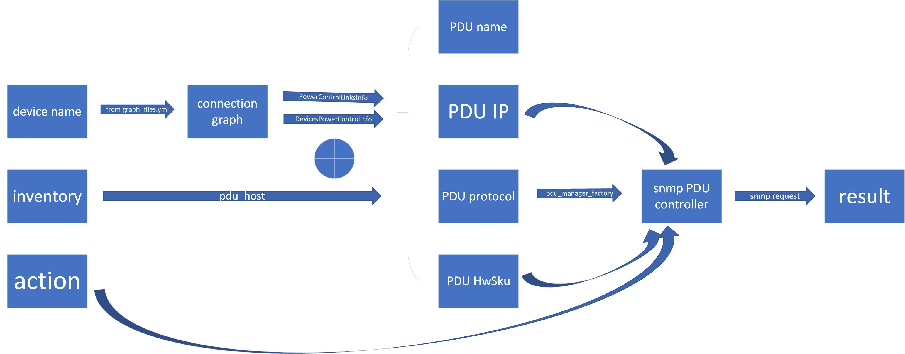

# Define your PDU wiring.

1. Navigate to ansible/files.
2. Define PDU devices in sonic_<Inventory>_devices.csv, which is sonic_lab_devices.csv in our example. For PDU devices, type should be Pdu and currently Protocol only supports snmp. HwSku was discovered through snmp and the field HwSku is never actually used in previous versions before this README, and it will be used starting from this PR. There could be mistakes with HwSku and things might work fine. HwSku currently supports value Apc, Sentry, Sentry4, Vertiv and Emerson.
3. Define PDU to DUT link in sonic_<Inventory>_pdu_links.csv file, which is sonic_lab_pdu_links.csv in our example. It defines which PDU outlet is connected to which DUT port.
4. Generate new connection graph by running the command below.
```
python2 ./creategraph.py -i <Inventory> -o <Connection graph name>
```
Devutils tools will read from the connection graph and fall back to inventory when missing.

# Use devutils to control devics.

To control a device (pdu_on, pdu_off, pdu_reboot, pdu_status), use devutils tool.
```
./devutils -g <sonic/ptf/pdu/all> -i <Inventory> -l <target device name> -a <pdu_reboot/pdu_on/pdu_off/pdu_status>
```

# What devutils does.

After we inform devutils of the hostname and expected action, devutils attempt to retrieve its PDU information from connection graph. We can also directly see it under PowerControlLinksInfo section in the connection graph xml, which shows the PDU names and ports that a devices is connected to. PDU devices themselves are listed under DevicePowerControlInfo, with its HwSku, ManagementIP, Protocol (snmp only) and Type (Pdu).
If getting from connection graph failed, script attempts to retrieve from the inventory file, under the section pdu_host of a device, but they are not guaranteed to exist.
After collecting PDU info, devutils proceed with pdu_manager_factory from tests/common/plugins/pdu_controller/pdu_manager.py. Exact PDU management information is acquired from the PDU name and added to the controller. When carrying out an operation, the matching controller, which is always snmp controller for now, uses the correct OID for every particular HwSku, which is provided to pdu_manager_factory.




