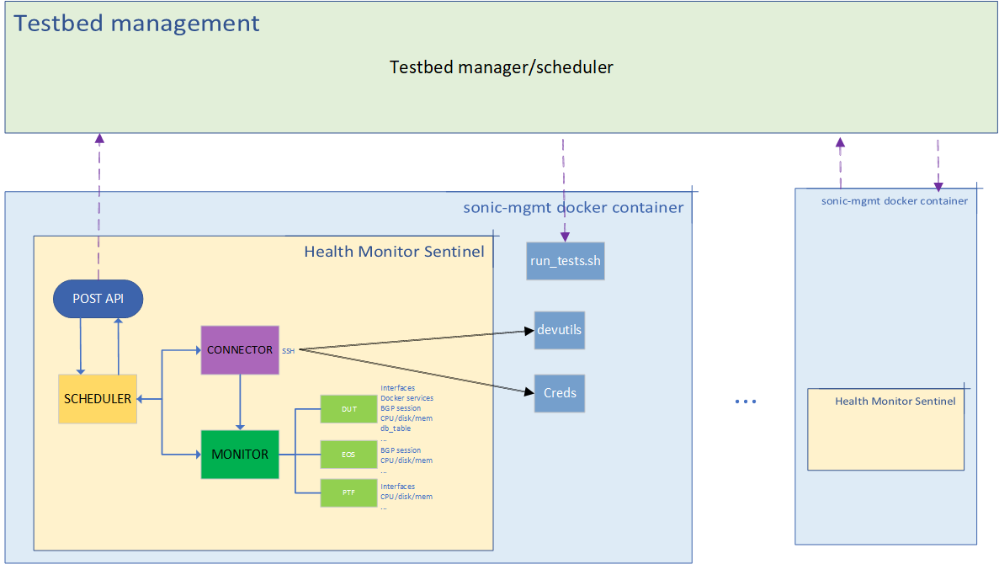

# Sentinel

Currently, we don't have a system to monitor all devices of the testbed, including SONiC DUT, EOS neighbors and PTF. Testbed management is a web tool for managing testbeds, developers use it to book testbed for development work, it also allocates corresponding testbeds for nightly test. 

It should have a monitor tool to collect health information on these devices and decide which testbeds are healthy and which are not, and then avoid nightly test running on an unhealth testbed.

Sentinel is such a service running in sonic-mgmt container that periodically collects various health information from all devices of the testbed. 

It logs in to devices and runs commands to show relevant information, then transforms the output of commands into data in json format and finally reports these data to testbed management. The sentinel process is running all the time at background to ensure the latest health information is collected and aims to keep monitoring the health of testbed.


# Design

Sentinel will be deployed by testbed management. Once the testbed is set up, testbed management will deploy Sentinal service for this testbed on host server. Sentinel will then run as an endless service in sonic-mgmt docker container.

It has 3 modules including scheduler, connector and monitor.

* Scheduler is responsible to get credential information of all devices with testbed name. And then create two threads, one is to maintain ssh connections for all devices,  another thread to collect relevant health information.
It also reports all health data to testbed management with POST API.
For credential part, this is the benefit of running sentinel in sonic-mgmt container, it can easily get credential information without having to send sensitive credential data with parameters that we have to take into account if deploying it standalone.

* Connector is responsbile to login devices and maintain all ssh connections. 
When devices go down due to reboot or network issue, the ssh connections will be updated and monitor cannot collect any data from these devices. If devices come back up, their ssh connections will be recreated and monitor will be able to collect health data as well. SSH login part uses existing SSHClient class in devutils, this is another benefit to run sentinel in sonic-mgmt, it's easy to use libaries and modules in sonic-mgmt, we don't have to write duplicated code for same functions.

* Monitor will run different commands on different devices, then parse the output of commands into json formatted data. 
For CPU/memory/disk, these are common health data that must be collected on every device. 
For DUT, monitor additionally collects docker services, bgp sessions and interfaces status. 
For EOS neighbors, monitor collects bgp sessions, etc. 
This module can be enhanced by adding and parsing more health commands in the future.


# Framework

The design framework of sentinel is shown in the following figure:



Testbed scheduler will also trigger `run_tests.sh` to run test cases on testbeds, it's the part of testbed scheduler implementation


# Usage

The basic usage does like this:

```
sudo python sentinel.py <testbed name> [-v]
```

`testbed name` is `conf-name` in [ansible/testbed.yaml](https://github.com/Azure/sonic-mgmt/tree/master/ansible/testbed.yaml), it can be used to read credential, ip and hostname for DUT, PTF and EOS neighbors for this testbed.

Specify `"-v"` for DEBUG level logging.

sentinel log is saved in `/tmp/sentinel.log`

The following three values are intervals of monitor process, connection checking process and report process.

```
MONITOR_INTERVAL = 60
CONNECTION_INTERVAL = 60
REPORT_INTERVAL = 60
```


# Post API

TBD.
