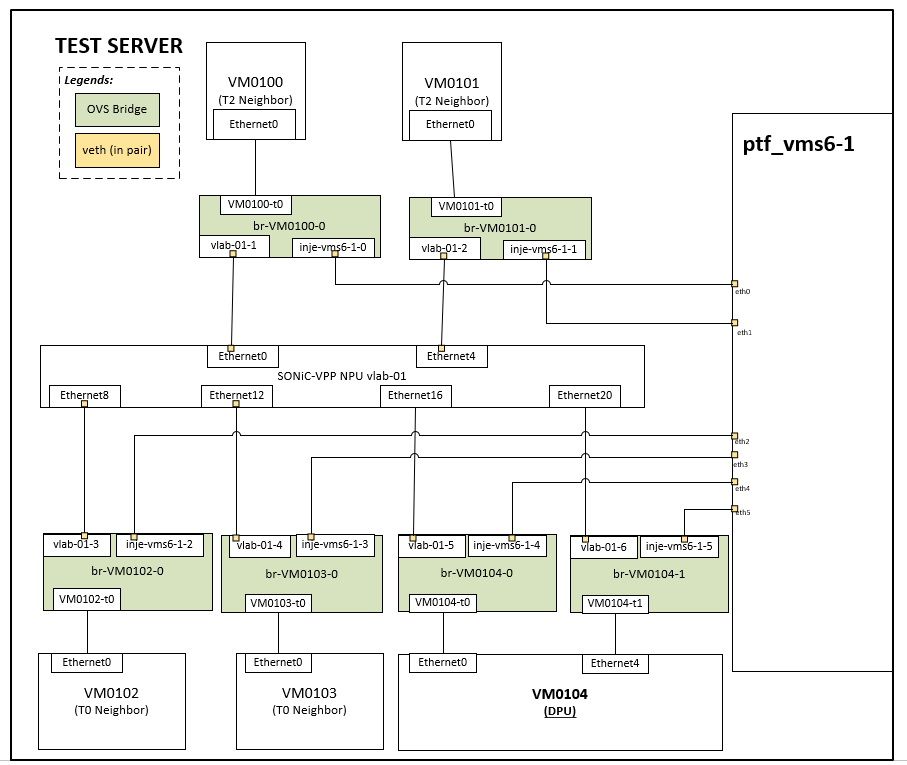

# SmartSwitch Testbed Setup

1. [1. Prepare the environment](#1-prepare-the-environment)
2. [2. Deploy the testbed](#2-deploy-the-testbed)
3. [3. Configurate DPU](#3-configurate-dpu)
   1. [3.1. Setup mgmt network connection on DPU](#31-setup-mgmt-network-connection-on-dpu)
   2. [3.2. Setup port config on DPU](#32-setup-port-config-on-dpu)
   3. [3.3. Upgrade DPU image to DASH BMv2](#33-upgrade-dpu-image-to-dash-bmv2)
   4. [3.4. Enable DASH BMv2 Pipeline](#34-enable-dash-bmv2-pipeline)
   5. [3.5. Initialize DASH BMv2 Pipeline](#35-initialize-dash-bmv2-pipeline)

## 1. Prepare the environment

1. Follow [instructions](https://github.com/sonic-net/sonic-mgmt/blob/master/docs/testbed/README.testbed.VsSetup.md#option-2-ceos-container-based-image-recommended) to download cEOS image, this image will be used for T2 and T0 neighbors.

1. Follow [instructions](https://github.com/sonic-net/sonic-mgmt/blob/master/docs/testbed/README.testbed.VsSetup.md#download-the-sonic-vs-image) to download sonic-vs images.

    In our case, images are probably built locally, make sure:

    * Your NPU image should be named as "sonic-vs.img" and be put under `~/sonic-vm/images`.
    * Your DPU image should be named as "sonic-vs.img" too and be put under `~/veos-vm/images`.

1. If you haven't, follow instructions below to setup your sonic-mgmt docker.
    * [Setup sonic-mgmt docker](https://github.com/sonic-net/sonic-mgmt/blob/master/docs/testbed/README.testbed.VsSetup.md#setup-sonic-mgmt-docker)
    * [Setup host public key in sonic-mgmt docker](https://github.com/sonic-net/sonic-mgmt/blob/master/docs/testbed/README.testbed.VsSetup.md#setup-host-public-key-in-sonic-mgmt-docker)

1. Fetch my branch from [sonic-mgmt PR#14595](https://github.com/sonic-net/sonic-mgmt/pull/14595).

## 2. Deploy the testbed

1. Deploy the topology.

    ```bash
    cd /data/sonic-mgmt/ansible
    ./testbed-cli.sh -t vtestbed.yaml -m veos_vtb -k ceos add-topo vms-kvm-t1-smartswitch password.txt
    ```

    The whole topology contains:
    * 4 cEOS neighbors VM0100, VM0101, VM0102 and VM0103. 2 of them are simulating T2s, and the other 2 are simulating T0s.
    * 2 SONiC VMs. One is named as `vlab-01` running as NPU, the other is named `VM0104` running as DPU.
    * 1 PTF docker for test utilities, packets sending and sniffing.
    * OVS bridges binding the interfaces.

    Diagram below illustrates the topology.
    

1. Deploy minigraph.

    ```bash
    ./testbed-cli.sh -t vtestbed.yaml -m veos_vtb gen-mg vms-kvm-t1-smartswitch veos_vtb password.txt
    ./testbed-cli.sh -t vtestbed.yaml -m veos_vtb deploy-mg vms-kvm-t1-smartswitch veos_vtb password.txt
    ```

## 3. Configurate DPU

### 3.1. Setup mgmt network connection on DPU

1. telnet to DPU VM

    ```bash
    telnet 127.0.0.1 7004

    User: admin
    Password: YourPaSsWoRd
    ```

1. Configure mgmt interface

    ```bash
    sudo config interface ip add eth0 10.250.0.55/24
    ```

### 3.2. Setup port config on DPU

1. copy minigraph to DPU

    ```bash
    scp sonic-mgmt/ansible/minigraph/SONIC01DPU.xml admin@10.250.0.55:

    User:admin
    Password: YourPaSsWoRd
    ```

1. load minigraph on DPU

    ```bash
    sudo cp SONIC01DPU.xml /etc/sonic/minigraph.xml
    sudo config load_minigraph -y

    sudo config save -y
    ```

<details>
<summary>Optional: A small test to validate the topology</summary>
The sender sciprt below injects some simple tcp packets to `eth0` on ptf docker, which connects to one of the T2 neighbor's bridge.The `10.0.0.37` was configured on the first front panel port on DPU neighbor.

    # sender.py
    from scapy.all import *
    from time import sleep

    eth_dst = "22:48:23:27:33:d8"
    eth_src = "9a:50:c1:b1:9f:00"
    src_ip = "10.0.0.1"
    dst_ip = "10.0.0.37"
    ip_ttl = 255
    tcp_dport = 5000
    tcp_sport = 1234

    packet = Ether(dst=eth_dst, src=eth_src) / IP(src=src_ip, dst=dst_ip, ttl=ip_ttl) / TCP(dport=tcp_dport, sport=tcp_sport) / Raw(load="Hello World"*100)

    while True:
        sendp(packet, iface="eth0")
        sleep(0.1)

Thus, the packets are supposed to be sniffed on `eth4` (binding to DPU) on PTF.

    # sniffer.py
    def packet_callback(packet):
        print(packet.summary())

    # Sniff packets from the specified interface (e.g., 'eth0')
    sniff(iface='eth4', prn=packet_callback, count=10)


</details>

### 3.3. Upgrade DPU image to DASH BMv2

1. Login on sonic VM and upgrade it with the 1st-step compiled vsonic image sonic-vs.bin and reboot it

    ```bash
    admin@vlab-01:~$ sudo sonic-installer install -y sonic-vs.bin
    admin@vlab-01:~$ sudo reboot
    ```

### 3.4. Enable DASH BMv2 Pipeline

1. Specify switch type dpu

    ```bash
    admin@vlab-01:~$ sonic-db-cli CONFIG_DB hset 'DEVICE_METADATA|localhost' switch_type dpu
    admin@vlab-01:~$ sudo config save -y
    ```

1. Enable service dash-engine

    ```bash
    admin@vlab-01:~$ sudo systemctl enable dash-engine && sudo systemctl start dash-engine
    ```

1. Specify command syncd_dash instead of syncd in container syncd

    ```bash
    admin@vlab-01:~$ docker exec syncd sed -i '/CMD_SYNCD/s/syncd/syncd_dash/' /usr/bin/syncd_init_common.sh
    ```

1. Manually configure IP on dpu interface eth1/eth2

    ```bash
    admin@vlab-01:~$ sudo ifconfig eth1 10.0.0.37/31 up && sudo ifconfig eth2 10.0.0.39/31 up
    ```

1. config reload

    ```bash
    admin@vlab-01:~$ sudo config reload -y
    ```

### 3.5. Initialize DASH BMv2 Pipeline

1. Update libdashsai package on your sonic-mgmt test repo. Without this, calling gNMI and set DASH config will not work:

    ```bash
    r12f@r12f-dl380:~/code/sonic/mgmt
    $ sudo dpkg -i libdashapi_1.0.0_amd64.deb
    ```

    libdashapi_1.0.0_amd64.deb can be found under “target/debs/bookworm”.

1. Install p4runtime shell in DPU KVM: [p4lang/p4runtime-shell](https://github.com/p4lang/p4runtime-shell)

    The DPU KVM might not have internet access, hence we will need to pull the container outside the KVM, save and copy it in, then import the container.

    1. Run following command outside KVM:

        ```bash
        docker pull p4lang/p4runtime-sh
        docker save p4lang/p4runtime-sh:latest -o p4runtime-sh.tar
        scp p4runtime-sh.tar admin@10.250.0.55:/home/admin
        ```

    1. Run following command inside KVM:

        ```bash
        docker load -i p4runtime-sh.tar
        ```

1. Manually configure underlay route (for neighbor) of dash pipeline bmv2 with p4runtime-sh. Currently configuring underlay route via northbound dash API is still not working.

    ```bash
    $ docker run --rm -ti --network=host p4lang/p4runtime-sh --grpc-addr 127.0.0.1:9559 --device-id 0 --election-id 0,1
    underlay_entry = table_entry["dash_ingress.underlay.underlay_routing"](action="dash_ingress.underlay.pkt_act")
    underlay_entry.match["meta.dst_ip_addr"] = "::10.0.0.37/127"
    underlay_entry.action["packet_action"] = "1"
    underlay_entry.action["next_hop_id"] = "0"
    underlay_entry.insert

    underlay_entry.match["meta.dst_ip_addr"] = "::10.0.0.39/127"
    underlay_entry.action["packet_action"] = "1"
    underlay_entry.action["next_hop_id"] = "1"
    underlay_entry.insert

    underlay_entry.match["meta.dst_ip_addr"] = "::30.30.30.30/128"
    underlay_entry.action["packet_action"] = "1"
    underlay_entry.action["next_hop_id"] = "1"
    underlay_entry.insert
    ```
