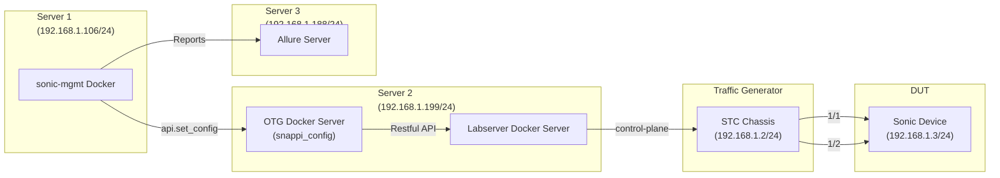
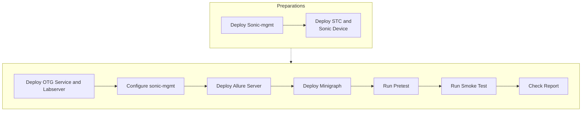

# Examples to Run Snappi Tests

- [1. STC examples](#1-stc-examples)
  - [1.1 Quick start for the smoke test](#11-quick-start-for-the-smoke-test)
    - [1.1.1 Deploy OTG Service and Labserver](#111-deploy-otg-service-and-labserver)
    - [1.1.2 Configurations for sonic-mgmt](#112-configurations-for-sonic-mgmt)
    - [1.1.3 Deploy Allure Server](#113-deploy-allure-server)
    - [1.1.4 Create and deploy the minigraph](#114-create-and-deploy-the-minigraph)
    - [1.1.5 Run the pretest](#115-run-the-pretest)
    - [1.1.6 Run the smoke test](#116-run-the-smoke-test)
    - [1.1.7 Check the test reports](#117-check-the-test-reports)
- [References](#references)


## 1. STC examples

### 1.1 Quick start for the smoke test


* Topology




* Overview



> [!NOTE]
> Preparations including deployment of sonic-mgmt, STC and Sonic devices will not be described in this document.


#### 1.1.1 Deploy OTG Service and Labserver

Please refer to [stc-otg-setup: Deploy OTG & Labserver Services](https://github.com/Spirent-STC/stc-otg-setup/blob/main/README.md#step-4-deploy-otg--labserver-services).

#### 1.1.2 Configurations for sonic-mgmt
* Testbed

    File: ansible/testbed.yaml

```yaml
- conf-name: vms-snappi-sonic
  group-name: vms6-1
  topo: tgen_ptf32
  ptf_image_name: docker-stc-api-server
  ptf: snappi-sonic-ptf
  ptf_ip: 192.168.1.199
  ptf_ipv6:
  server: server_6
  vm_base:
  dut:
    - sonic-s6100-dut1
  inv_name: snappi-sonic
  auto_recover: 'True'
  comment: Batman
```


* Topology

    Add File: ansible/vars/topo_tgen_ptf32.yml

```yaml
topology:
  host_interfaces:
    - 0
    - 1
    - 2
    - 3
    - 4
    - 5
    - 6
    - 7
    - 8
    - 9
    - 10
    - 11
    - 12
    - 13
    - 14
    - 15
    - 16
    - 17
    - 18
    - 19
    - 20
    - 21
    - 22
    - 23
    - 24
    - 25
    - 26
    - 27
    - 28
    - 29
    - 30
    - 31
```

* Devices

   File: ansible/files/sonic_snappi-sonic_devices.csv

```csv
snappi-sonic-stc,192.168.1.2/24,SNAPPI-tester,DevSnappiChassis
sonic-s6100-dut1,192.168.1.3/24,Force10-S6000,DevSonic
snappi-sonic-api-serv,192.168.1.199/24,SNAPPI-tester,DevSnappiApiServ
```

* Links

    File: ansible/files/sonic_snappi-sonic_links.csv

```csv
StartDevice,StartPort,EndDevice,EndPort,BandWidth,VlanID,VlanMode
sonic-s6100-dut1,Ethernet0,snappi-sonic-stc,Card1/Port1,40000,1000,Access
sonic-s6100-dut1,Ethernet4,snappi-sonic-stc,Card1/Port2,40000,1000,Access

```
* Inventory

    File: ansible/snappi-sonic

```ini
[sonic_dell64_40]
sonic-s6100-dut1     ansible_host=192.168.1.3

[sonic_dell64_40:vars]
hwsku="Force10-S6000"
iface_speed='40000'

[server_6]
snappi-sonic-stc          ansible_host=192.168.1.2   os=snappi

[sonic:children]
sonic_dell64_40

[sonic:vars]
mgmt_subnet_mask_length='23'

[snappi-sonic-stc:children]
sonic
snappi_chassis

[ptf]
snappi-sonic-ptf     ansible_host='192.168.1.199'

```

* Snappi api server

    File: ansible/group_vars/snappi-sonic/snappi-sonic.yml

```yaml
snappi_api_server: {user: admin, password: admin, rest_port: 50051, session_id: "None"}
```

* Login sonic device

    File: ansible/group_vars/snappi-sonic/secrets.yml

```yml
ansible_ssh_pass: YourPaSsWoRd
ansible_become_pass: YourPaSsWoRd
sonicadmin_user: admin
sonicadmin_password: YourPaSsWoRd
sonicadmin_initial_password: YourPaSsWoRd

```

#### 1.1.3 Deploy Allure Server

One method to deploy allure server using [docker-compose](
https://github.com/fescobar/allure-docker-service-examples/tree/master/allure-docker-multi-project-example)


* docker-compose.yml

```yaml
version: '3'

services:
  allure:
    image: "frankescobar/allure-docker-service"
    environment:
      CHECK_RESULTS_EVERY_SECONDS: NONE
      KEEP_HISTORY: 1
      KEEP_HISTORY_LATEST: 25
    ports:
      - "5050:5050"
    volumes:
      - ${PWD}/projects:/app/projects

  allure-ui:
    image: "frankescobar/allure-docker-service-ui"
    environment:
      ALLURE_DOCKER_PUBLIC_API_URL: "http://192.168.1.188:5050"
      ALLURE_DOCKER_PUBLIC_API_URL_PREFIX: ""
    ports:
      - "5252:5252"
```

* Start/stop the server
```sh
sudo PWD=./ docker-compose up -d
sudo PWD=./ docker-compose down
```


#### 1.1.4 Create and deploy the minigraph

```sh
cd /sonic/sonic-mgmt/ansible
./testbed-cli.sh -t testbed.yaml deploy-mg vms-snappi-sonic snappi-sonic password.txt -vvv
```

#### 1.1.5 Run the pretest

```sh
cd /sonic/sonic-mgmt/tests

export ANSIBLE_CONFIG=../ansible
export ANSIBLE_LIBRARY=../ansible

python3 -m pytest --inventory ../ansible/snappi-sonic --host-pattern sonic-s6100-dut1 --testbed vms-snappi-sonic --testbed_file ../ansible/testbed.yaml --show-capture=stdout --capture=no --log-cli-level debug -vvvvv --showlocals -ra --allow_recover --skip_sanity --disable_loganalyzer --allure_server_addr=192.168.1.188 --allure_server_port=5050 --allure_server_project_id=pretest001 --alluredir=/tmp/allure_results/pretest001 --enable-snappi-dynamic-ports test_pretest.py

```

#### 1.1.6 Run the smoke test

```sh
cd /sonic/sonic-mgmt/tests

python3 -m pytest --inventory ../ansible/snappi-sonic --host-pattern sonic-s6100-dut1 --testbed vms-snappi-sonic --testbed_file ../ansible/testbed.yaml --show-capture=stdout --capture=no --log-cli-level debug -vvvvv --showlocals -ra --allow_recover --skip_sanity --disable_loganalyzer --allure_server_addr=192.168.1.188 --allure_server_port=5050 --allure_server_project_id=testsnappi001 --alluredir=/tmp/allure_results/testsnappi001 --enable-snappi-dynamic-ports snappi_tests/test_snappi.py

```

#### 1.1.7 Check the test reports
Visit the following link to check reports

http://192.168.1.188:5050/allure-docker-service/projects/testsnappi001/reports/latest/index.html

## References
- [Running Snappi Tests and Snappi Configuration](README.testbed.SnappiTests.md)