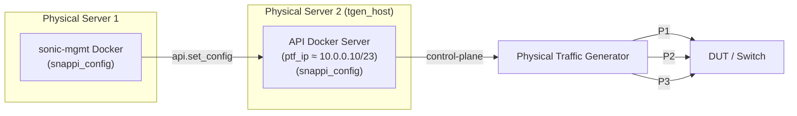
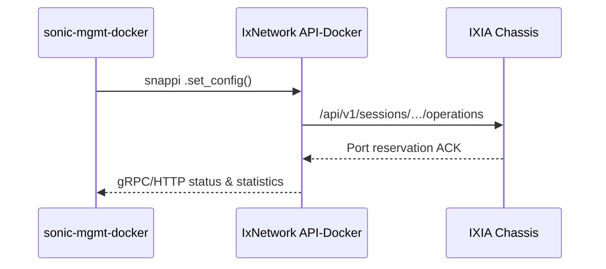
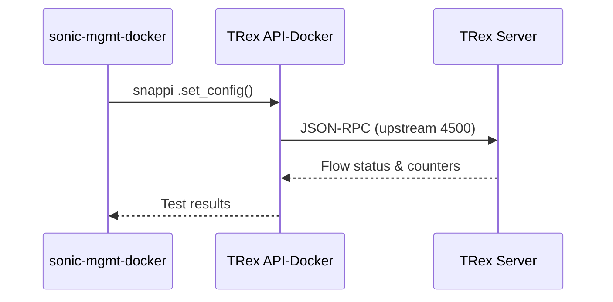

# Running Snappi Tests and Snappi Configuration

### Author

| Version | Name          | Role          |
| ------- | ------------- | ------------- |
| 1.0     | Dev Ojha      | Spec Guide    |


## 1 Physical Topology

### 1.1 Purpose

Each DUT front-panel port is cabled 1-to-1 to a traffic-generator port of equal speed so that Snappi test scripts can exercise link-level features and inject/measure traffic end-to-end.

### 1.2 Sample link map

| StartDevice | StartPort | EndDevice | EndPort | Bandwidth (Mb/s) | VLAN ID | VLAN Mode |
| ----------- | --------- | --------- | ------- | ---------------- | ------- | --------- |
| `dut1`      | Ethernet1 | `tgen1`   | P1      | 100 000          |         | Access    |
| `dut1`      | Ethernet2 | `tgen1`   | P2      | 100 000          |         | Access    |

The CSV file that carries this information is called **`sonic_tgen_links.csv`** and must reside next to the Ansible playbooks (`/ansible` directory) so that `conn_graph_facts.py` can feed the tests. This is similar in format to [sonic_snappi-sonic_links.csv](https://github.com/sonic-net/sonic-mgmt/blob/master/ansible/files/sonic_snappi-sonic_links.csv).

#### Topology Rules
* Snappi tests treat every DUT front-panel port listed in `sonic_tgen_links.csv` as *test-traffic* capable; they do **not** distinguish between traditional “uplink” and “down-link” roles.
* Any port that is cabled to the traffic generator **must** appear in the CSV; ports omitted from the file are ignored by the test harness.
* Good practice is to keep the port numbering symmetric (e.g. `Ethernet1 ↔ P1`, `Ethernet2 ↔ P2`) but the framework does not enforce this.

## 2 Testbed Configuration Files

### 2.1 `testbed.yaml`

Each block describes one logical topology; the `ptf_ip` is the management address of the traffic-generator’s API-Docker container. If you add multiple testbeds/devices, you can use the same Docker API Server (more below), so the `ptf_ip` would be the same for these testbeds.

```yaml
- conf-name: lab-t0-dut1
  group-name: lab-grp
  topo: tgen
  ptf_image_name: docker-api-server
  ptf: tgen1
  ptf_ip: 10.0.0.10/23      # ← API-Docker IP
  server: tgen_host
  vm_base: VM00001
  dut:
    - dut1
  inv_name: lab
  comment: example
```

Key fields:

| Field           | Description                                                                                                           |
|-----------------|-----------------------------------------------------------------------------------------------------------------------|
| `conf-name`     | Referred to as the **testbed-name** in CLI scripts.                                                                   |
| `topo`          | Specifies the SONiC topology (e.g., `t0`, `t1`).                                                                      |
| `ptf_image_name`| Name of the API Docker server; can be arbitrary.                                                                      |
| `ptf`           | Not relevant for Snappi tests; can be any value.                                                                      |
| `ptf_ip`        | IP address (IPv4/6) accessible from the testbed server running the Docker API Server.                                 |
| `vm_base`       | Not relevant for Snappi tests; can be any value.                                                                      |
| `server`        | The physical or virtual server (as listed in the Ansible inventory) hosting the Docker API Server.                    |
| `dut`           | Lists one or more devices under test.                                                                                 |

> **Note — `ptf_image_name`**
> For legacy PTF tests this field points to the container image pushed to the ptf based traffic-generator VM. In Snappi workflows the same key is parsed by the `deploy-mg` helper to know **which API-server Docker image to copy and start** on the traffic generator server during `add-topo`. Leaving it blank disables automatic deployment.



### Single-server alternative

> **Transparency note** — **PS1** and **PS2** can be the *same* physical machine.
> Just ensure:
>
> 1. The host NIC (or a dedicated NIC) is placed in **promiscuous / macvlan** mode so each container obtains its own routable MAC/IP address.
> 2. The host has enough CPU / RAM to accommodate both the `sonic-mgmt` control-plane container and the traffic-generator API-server workload concurrently.


### 2.2 `sonic_tgen_links.csv`

Must list every link between the DUT and the TG (see §1.2). Leave `VlanID` blank for access ports.

---

## 3 Environment Preparation

> **Linux host:** Any distribution ≥ Ubuntu 20.04 with Docker 20.10+ and Python 3.9+.

### 3.1 Common Python dependencies

All python dependencies are installed in the `sonic-mgmt` docker container from where tests are run.

---

### 3.2 Keysight IxNetwork Path

#### 3.2.1 Deploying the IxNetwork API Server Docker

To deploy the IxNetwork API Server Docker, follow these steps:

1. **Obtain the Docker Image**: Download the IxNetwork Web Edition Docker image (e.g., `IxNetworkWeb_Docker_<version>.tar`) from the [Keysight support portal](https://support.ixiacom.com/version/ixnetwork-1000-update-1). It will be the `IxNetwork Web Edition - Docker deployment`.
    
2. **Transfer the Image to the Host**: Copy the `.tar`/`tar.bz2` file to your testbed server (can be a Linux machine).

3. Make sure the management interface has promiscuous mode enabled

```bash
 ifconfig eth1  promisc
```

*Enable promiscuous mode on **the physical NIC that fronts the macvlan bridge** (example: `eth1` on Linux hosts as this is the management port). Promiscuous mode is required so the parent interface can forward frames for all container MAC addresses created by the macvlan driver.*
([OpenIxia][1], [Docker Community Forums][2])

[1]: https://www.openixia.com/tutorials?page=apiServer.html&subject=ixNetwork%2Fdockers "Deploying IxNetwork Web Edition as a Docker container"
[2]: https://forums.docker.com/t/why-is-promiscuous-mode-needed-for-macvlan-driver/37416 "Why is promiscuous mode needed for macvlan driver? - General"

4. Decompress the file (it may take a few minutes):

```bash
tar xvjf <path_to_tar_file>
```
	
5. **Load the Docker Image**: On the host machine, load the Docker image using:
    
    ```bash
    docker load -i IxNetworkWeb_Docker_<version>.tar
    ```
    

6. **Create a Macvlan Network**: To allow the container to communicate on the network, create a macvlan bridge:
    
    ```bash
    docker network create -d macvlan \
      -o parent=<host_interface> \
      --subnet=<subnet> \
      --gateway=<gateway> \
      ixnet_macvlan
    ```
    

Replace `<host_interface>`, `<subnet>`, and `<gateway>` with your network interface and subnet details. *As you are setting the IPs, please keep note that the IxNetwork Docker Server, `sonic-mgmt` docker and traffic generator need to be reachable between each other (that means there either needs to be a tunnel between the 3 machines or they should be under a larger subnet)*.

7. Verify bridge got created properly:

```bash
docker network ls
docker network inspect IxNetVlanMac
```

8. **Run the IxNetwork Container**: Start the container with the following command:
    
    ```bash
    docker run --net <bridge_name> \
	--ip <container ip> \
	--hostname <hostname> \
	--name <container name> \
	--privileged \
	--restart=always \
	--cap-add=SYS_ADMIN \
	--cap-add=SYS_TIME \
	--cap-add=NET_ADMIN \
	--cap-add=SYS_PTRACE \
	-i -d \
	-v /sys/fs/cgroup:/sys/fs/cgroup \
	-v /var/crash/=/var/crash \
	-v /opt/container/one/configs:/root/.local/share/Ixia/sdmStreamManager/common \
	-v /opt/container/one/results:/root/.local/share/Ixia/IxNetwork/data/result \
	-v /opt/container/one/settings:/root/.local/share/IXIA/IxNetwork.Globals \
	--tmpfs /run \
	ixnetworkweb_<version>_image:<image-tag>

Note : The folders within /opt/container/one/ should to be created with read and write permission prior docker run.

    ```
    

Replace `<container_ip>` with an available IP address in your subnet.

9. **Access the Web Interface**: Open a browser and navigate to `http://<container_ip>/api/v1` to verify the API server is running (assuming your testbed server has a browser on it with a GUI).
    

For more detailed instructions, refer to the official [IxNetwork Docker deployment guide](https://www.openixia.amzn.keysight.com/static/tutorials/ixNetwork/dockers/IxNetwork_docker_installation.pdf).

---

### 3.3 Cisco TRex Path

#### 3.3.1 Deploying the TRex Docker Container

To deploy the TRex Docker container, follow these [steps](https://github.com/open-traffic-generator/snappi-trex/blob/main/docs/trex-tutorial.md).

#### 3.3.2 Installing snappi-trex

To install `snappi-trex` on your testbed server and run tests using your physical testbed server as a traffic generator, follow these [steps](https://github.com/open-traffic-generator/snappi-trex/blob/main/docs/quickstart.md#installing-snappi-trex).

---

## 4 Provisioning the Testbed

1. **Generate & deploy a minigraph** matching your topology:
    
    ```bash
    ./testbed-cli.sh deploy-mg <testbed-name> <inventory> password.txt
    ```
    
    These commands build a DUT-specific `minigraph.xml` and push it via Ansible ([GitHub](https://github.com/Azure/sonic-mgmt/blob/master/docs/testbed/README.testbed.Minigraph.md)).
    
2. **Add the topology:**
    
    ```bash
    ./testbed-cli.sh -t testbed.yaml -m veos -k veos add-topo <testbed-name> password.txt
    ```
    
    The `add-topo` action provisions the API Docker container.

> **Important** — Build & network the API-server container *before* running `add-topo`. The automation assumes the container is already reachable at `ptf_ip`; it does **not** import images or create macvlan bridges for you. Follow § 3.2.1 steps 1-8 first.
    

---

## 5 Running Snappi Tests

From the `tests` directory of **`sonic-mgmt`** (master branch):

```bash
./run_tests.sh \
  -n <testbed-name> \
  -d <dut1> \
  -c tests/snappi_tests/ \
  -f ansible/testbed.yaml \
  -i <inventory>,ansible/veos \
  -u \
  -e "--skip_sanity"
```

The wrapper discovers `ptf_ip`, copies scripts into the API-Docker, executes them, and collects results.

---

## 6 Traffic Flow Sequence

### 6.1 IxNetwork



### 6.2 TRex



---

## 7 Common Pitfalls & Remedies

| Symptom                                    | Likely Cause                                 | Fix                                                                                                                                                                             |
| ------------------------------------------ | -------------------------------------------- | ------------------------------------------------------------------------------------------------------------------------------------------------------------------------------- |
| `connect() failed` from Snappi client      | `ptf_ip` wrong or port 11009/4500 blocked    | Check Docker IP, update firewall/NAT rules.                                                                                                                                     |
| Ports stay “Reserved” in IxNetwork UI      | API server lacks `macvlan` access to chassis | Recreate container with correct `--network` settings.([openixia.com](https://www.openixia.com/tutorials?page=apiServer.html&subject=ixNetwork%2Fdockers "www.openixia.com"))    |
| `No matching link in sonic_tgen_links.csv` | CSV missing a DUT port                       | Add row for every active interface, regenerate facts.                                                                                                                           |
| `minigraph mismatch` during deploy         | Wrong `topo` in `testbed.yaml`               | Align `topo` with lab cabling and rerun `deploy-mg`.                                                                                                                            |
| TRex script hangs on connect               | Server started in stateful mode              | Launch with `-i` for stateless STL mode.([trex-tgn.cisco.com](https://trex-tgn.cisco.com/trex/doc/trex_stateless.html "TRex Stateless support - Cisco")) |

---

## 9 Quick Smoke Test

The `sonic-mgmt` repository already ships a self-contained [smoke test](https://github.com/sonic-net/sonic-mgmt/blob/master/tests/snappi_tests/test_snappi.py) at `tests/snappi_tests/test_snappi.py`. This verifies that:

- all TG↔DUT links are operational;
    
- ARP resolution succeeds;
    
- bidirectional “all-to-all” IPv4 traffic flows between every pair of test-bed ports;
    
- every transmitted frame is received and the observed packet count is within ±5 % of the theoretical value.
    

The script relies exclusively on Snappi APIs and generic fixtures—no lab-specific secrets—so vendors can run it unmodified once their **`testbed.yaml`** and **`sonic_tgen_links.csv`** are in place.

---

### 9.1 How the test works (high-level)

1. **Fixture orchestration**
    `snappi_api`, `snappi_testbed_config`, `conn_graph_facts`, etc. create a fresh Snappi session, discover port maps and pick a random loss-less priority.
    
2. **Dynamic traffic matrix**
    Helper `__gen_all_to_all_traffic()` builds one flow per ordered port-pair (Tx ≠ Rx) and assigns an equal share of line-rate so aggregate load is 100%.
    
3. **Execution & polling**
    Traffic runs for 2 s; the script polls flow metrics until every stream reports `stopped`.
    
4. **Assertions**
    For each flow it asserts _Rx = Tx_ and that the actual packet count deviates ≤5 % from theory (based on speed, rate %, duration, and size).
    

Passing this test is a quick guarantee that cabling, API-Docker reachability, and DUT forwarding are all correct.

---

### 9.2 Running the smoke test

From the **test directory of `sonic-mgmt` on your sonic-mgmt docker**:

```bash
./run_tests.sh \
  -n <testbed-name> \
  -d <dut1> \
  -c tests/snappi_tests/test_snappi.py \
  -f ansible/testbed.yaml \
  -i <inventory-file>,ansible/veos \
  -u \
  -e "--skip_sanity"
```

Replace `<testbed-name>`, `<dut1>`, and `<inventory-file>` with your own identifiers. Learn more about inventory files [here](https://docs.ansible.com/ansible/latest/inventory_guide/intro_inventory.html).

---

### 9.3 Expected console output

```
pytest -q tests/snappi_tests/test_snappi.py ...
PASSED [100%]  test_snappi.py::test_snappi PASSED
=============================================================================
1 passed in  1 min 12 s
=============================================================================
```

A single **“PASSED”** means every port transmitted/received traffic loss-free.

---

### 9.4 If it fails

| Failure symptom                                        | Probable cause                                        | Quick check                                                                                                     |
| ------------------------------------------------------ | ----------------------------------------------------- | --------------------------------------------------------------------------------------------------------------- |
| `Flows do not stop in 20 seconds`                      | API-Docker cannot push config to TG chassis           | Ensure the IxNetwork/TRex container can reach the chassis, and that ports are free.                             |
| `packet losses for Flow X -> Y (Tx ≠ Rx)`              | Cabling mismatch or VLAN / priority mis-config        | Compare `sonic_tgen_links.csv` to physical patch-panel; verify DUT interfaces are in the correct VLAN/priority. |
| `pytest_require(len(port_config_list) >= 2)` assertion | Only one link described in CSV                        | Add at least two DUT↔TG links to **`sonic_tgen_links.csv`**; re-run `add-topo`.                                 |
| Script hangs at ARP wait                               | Host subnet or gateway fields wrong in `testbed.yaml` | Confirm `ip`, `gateway`, `prefix_len` for each port in the YAML reflect actual lab addressing.                  |

Resolve the issue, rerun the command, and proceed to the full Snappi regression suite once the smoke test passes.

## 10 Further References

- Snappi SDK overview – PyPI([PyPI](https://pypi.org/project/snappi/))
    
- Snappi-IxNetwork plugin – PyPI & GitHub([PyPI](https://pypi.org/project/snappi-ixnetwork/), [GitHub](https://github.com/open-traffic-generator/snappi-ixnetwork))
    
- Snappi-TRex plugin – PyPI & GitHub([PyPI](https://pypi.org/project/snappi-trex/0.0.95/), [GitHub](https://github.com/open-traffic-generator/snappi-trex ))
    
- IxNetwork API-Docker deployment guide – OpenIxia ([openixia.com](https://www.openixia.com/tutorials?page=apiServer.html&subject=ixNetwork%2Fdockers "www.openixia.com"))
    
- TRex Stateless user guide – Cisco ([trex-tgn.cisco.com](https://trex-tgn.cisco.com/trex/doc/trex_manual.html))
