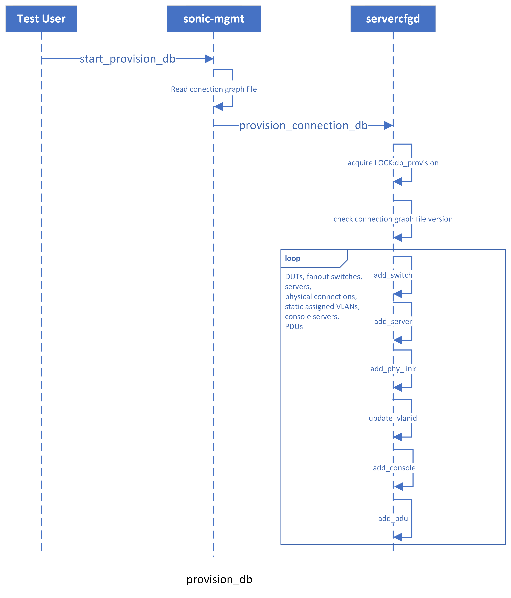

# Testbed V2 Design
# High Level Design Document


# Table of Contents
  * [About this Manual](#about-this-manual)
  * [Requirement Overview](#Requirement-Overview)
  * [Components](#Components)
  * [Database Schema](#Database-Schema)
  * [Implementation Plan](#Implementation-Plan)


## About this Manual
This documentation provides general information about the Testbed V2 feature implementation for `sonic-mgmt`. Testbed V2 aims to support multi-DUTs deployment with dynamic VLAN assignment and inter-DUTs link state propagation. Based on the Redis Pub/Sub paradigm, the connection status changes(physical connections, virtual connections, VLAN assignments, etc) from test users into `connection_db` will signal the daemons over fanout switches about the key-space events to manipulate the physical devices/ports.

## Requirement Overview
* Maintain compatibility with existing testbed.
* Support testbed/topology with multiple DUTs that have inter-DUTs connections.
* Support flexible VLAN assignment.

## Components
* `test user`
* `connection_db`
  * Redis databases running on certain test server hosting connection-related metadata.
* `servercfgd`
  * running on the same server as `connection_db`.
  * a RPC server that is responsible for `connection_db` initial setup and provision.
* `labcfgd`
  * running on root/fanout switches
  * subscribe to keyspace events of `connection_db` and act accordingly.

## Database Schema
* `DB_CONNECTION_GRAPH_VERSIONS`
```
; ZSET that stores md5sum values of connection graph files that are used to provision `connection_db`
key                              = LAB_CONNECTION_GRAPH_VERSIONS
```
* `DB_META`
```
; Defines database metadata
key                              = DB_META
; field                          = value
DBState                      = "active"/"provisioning"/"down"
```
* `SWITCH_TABLE`
```
; Defines switch metadata
key                              = SWITCH_TABLE:switch_name
; field                          = value
HwSku                            =                                                  ; switch platform hwsku
ManagementIp                     =
Type                             = "leaf_fanout"/"root_fanout"/"dev_sonic"
ProvisionStatus                  = "not_provisioned"/"in_progress"/"provisioned"    ; provision status for "dev_sonic"
ConsoleServer                    = FK to CONSOLE_SERVER_TABLE
ConsolePort                      =
```
* `DUT_LIST`
```
; List contains all the SONiC DUTs defined in the lab
key                              = DUT_LIST                                         ; contains DUT names that are FK to `SWITCH_TABLE`
```
* `TEST_SERVER_LIST`
```
; List contains all the test servers defined in the lab
key                              = DUT_LIST                                         ; contains test server names that are FK to `TEST_SERVER_TABLE`
```
* `TEST_SERVER_TABLE`
```
; Defines test server metadata
key                              = SERVER_TABLE:test_server_name
; field                          = value
HwSku                            = "TestServ"
ManagementIp                     =
Type                             = "Server"
ServerStatus                     = "active"/"down"
```
* `CONSOLE_SERVER_LIST`
```
; List contains all the console servers defined in the lab
key                              = CONSOLE_SERVER_LIST                                         ; contains console server names that are FK to `CONSOLE_SERVER_TABLE`
```
* `CONSOLE_SERVER_TABLE`
```
; Defines console server metadata
key                              = SERVER_TABLE:console_server_name
; field                          = value
HwSku                            =
ManagementIp                     =
Type                             = "ConsoleServer"
Protocol                         =
```
* `PDU_LIST`
```
; List contains all the PDUs defined in the lab
key                              = PDU_LIST                                         ; contains PDU names that are FK to `PDU_TABLE`
```
* `PDU_TABLE`
```
; Defines PDU metadata
key                              = PDU_TABLE:pdu_hostname
; field                          = value
HwSku                            =
ManagementIp                     =
Type                             = Pdu
Protocol                         =
```
* `PORT_LIST`
```
; List contains physical ports of either a root/leaf fanout switch, DUT or server 
key                              = PORT_LIST:<switch_name|dut_name|server_name>
```
* `PORT_TABLE`
```
; Defines port metadata
key                              = PORT_TABLE:<switch_name|dut_name|server_name>:port_name
; field                          = value
BandWidth                        =
VlanType                         = "access"/"trunk"
PhyPeerPort                      =                                                  ; physical peer port
```
* `VLAN_LIST`
```
; List contains VLAN ids assigned to a physical port
key                              = VLAN_LIST:endport                                ; endport is FK to `PORT_TABLE`
```
* `USED_VLANIDPOOL_SET`
```
; Set contains used available VLAN ids
key                              = VLANIDPOOL_SET
```
* `VIRTLINK_TABLE`
```
; a virtual link between DUTs
key                              = VIRTLINK_TABLE:endport0:endport1                  ; endport0 and endport1 are FK to `PORT_TABLE
; field                          = value
Status                           = "active"/"inactive"
```
* `PSU_TABLE`
```
; Stores the mappings between a switch PSUs and its peer PDU ports
key                              = SWITCH_PDU_TABLE:<switch_name>
; field                          = value
PSU<1|2>                         = jsonified peer PDU port meta
```

## Implementation Plan
* The whole process is divided into three stages:
   1. stage#1: initial `connection_db` setup and provision
   2. stage#2: dynamic vlan assignment support
   3. stage#3: link state propagation support

### Stage#1
* In stage#1, we only cover initial `connection_db` setup and provision:
  1. Install Redis and its Python packages over selected test server.
  2. Run `servercfgd` over the selected test server.
  3. Provision the `connection_db` with the physical connections defined in the connection graph file.
* All the modules/plays to cover the functionalities list above will be included in Ansible role `connection_db`.
* Users are provided with a play `config_connection_db.yml` to call `connection_db` role to setup, provision or remove `connection_db`.

#### db setup
* Ensure Redis and py-redis packages are installed.
* Ensure Redis service is running.
* start `connection_db`.


#### db provision
* Provision the `connection_db` with the physical connections and static VLAN assignments defined in the connection graph file defined in [ansible/files](https://github.com/Azure/sonic-mgmt/tree/master/ansible/files).




#### changes to `conn_graph_files`
There will be an extra parameter added to `conn_graph_facts`: `conn_graph_facts_src`, it could be either `from_db`, which will retrieve the connection data from `connection_db`, or it could be `from_file` to get the data from parsing connection graph file like before. One thing to notice is that if `conn_graph_facts` fails with `conn_graph_facts_src=from_db`, it will fall back to `from_file`.
