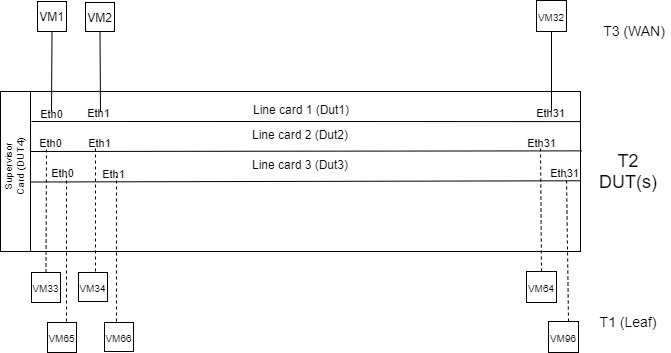
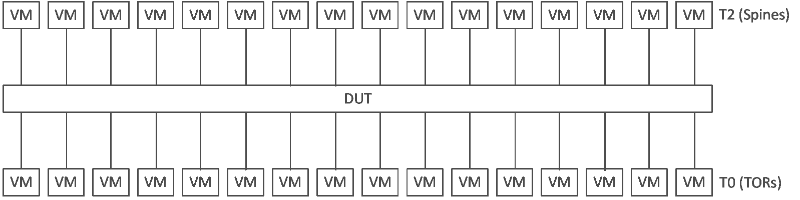
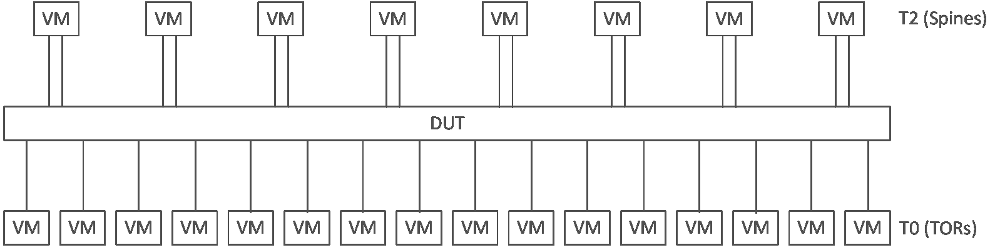
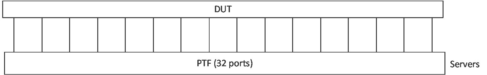
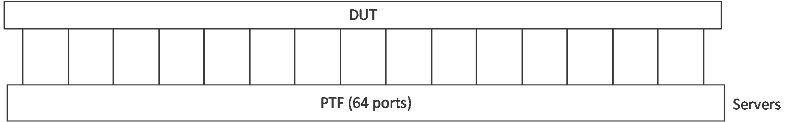
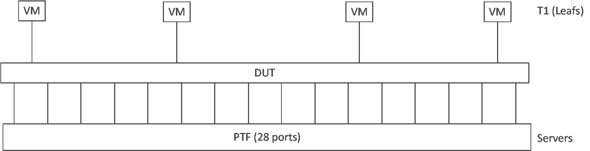
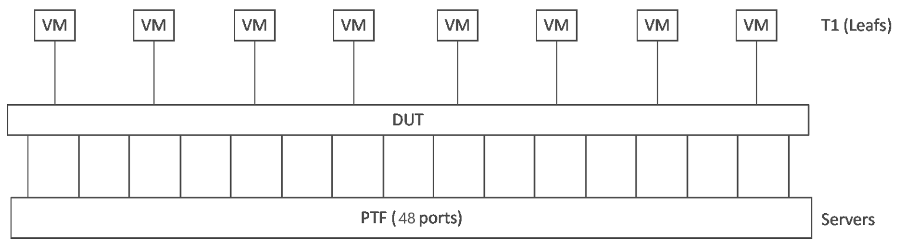
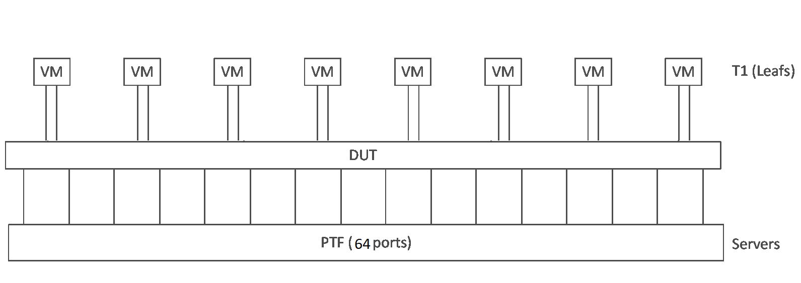

# Topologies

1. Configuration of a testbed topology is defined in one file: [```testbed.csv```](/ansible/testbed.csv)
2. One script to operate all testbeds: [```testbed-cli.sh```](/ansible/testbed-cli.sh)
3. Flexible topologies which allow to use VM_SET and PTF container as one entity
4. All VM management ip information in one place: [```veos```](/ansible/veos) inventory file
5. PTF container is generalized and used in every topology
6. Automatic provisioning of fanout switch configuration (should be refactored)
7. Please follow the [Example](README.testbed.Example.md) section if you want to set up any testbed and topology.

## Testbed topology configuration

- One entry in ```testbed.csv``` consist of:
  - physical topology: How ports of VMs and PTF connected to DUT
  - configuration templates for VMs
- Topologies are defined in vars/topo_*.yml files
- Current topologies are:
  - t1: 32 VMs + PTF container for injected ports
  - t1-lag: 24 VMs + PTF container for injected ports. 8 VMs has two ports each in LAG
  - ptf32: classic PTF container with 32 ports connected directly to DUT ports
  - ptf64: as ptf32, but with 64 ports
  - t0: 4 VMs + ptf. PTF container has 4 injected ports + 28 directly connected ports

## Current topologies

### t2



 - Requires 72 VMs
 - All DUT ports are connected to VMs
 - PTF container has injected ports only
### t1



 - Requires 32 VMs
 - All DUT ports are connected to VMs
 - PTF container has injected ports only

### t1-lag



 - Requires 24 VMs
 - All DUT ports are connected to VMs
 - PTF container has injected ports only

### ptf32



 - Requires 0 VMs
 - All DUT ports are directly connected to PTF container
 - PTF container has no injected ports

### ptf64



 - Requires 0 VMs
 - All DUT ports are directly connected to PTF container
 - PTF container has no injected ports

### t0



 - Requires 4 VMs
 - 4 DUT ports are connected to VMs
 - PTF container has 4 injected ports and 28 directly connected ports


### t0-56



 - Requires 8 VMs
 - 8 DUT ports are connected to VMs
 - PTF container has 8 injected ports and 48 directly connected ports
 
 
### t0-80



 - Requires 8 VMs
 - 16 DUT ports are connected to VMs
 - PTF container has 16 injected ports and 64 directly connected ports

