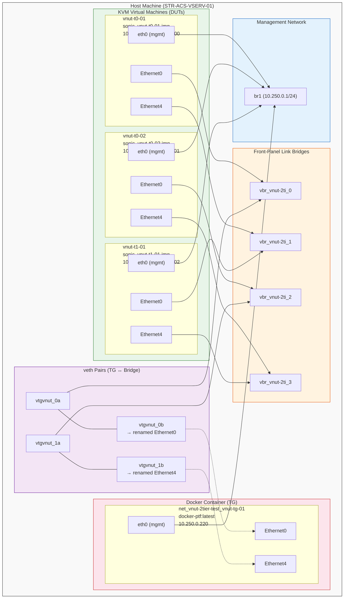

# Virtual NUT Testbed (vNUT)

<!-- TOC -->
- [1. Overview](#1-overview)
- [2. Architecture](#2-architecture)
- [3. Prerequisites](#3-prerequisites)
- [4. Testbed Definition](#4-testbed-definition)
- [5. Deployment](#5-deployment)
- [6. Teardown](#6-teardown)
- [7. Running Tests](#7-running-tests)
- [8. Implementation Details](#8-implementation-details)
- [9. Limitations and Future Work](#9-limitations-and-future-work)
- [10. Example: nut-2tiers Topology](#10-example-nut-2tiers-topology)
<!-- /TOC -->

## 1. Overview

The Virtual NUT (vNUT) testbed allows developers to run sonic-mgmt NUT tests locally on a single host without any physical switches or traffic generators. It extends the NUT testbed framework described in [README.testbed.NUT.md](README.testbed.NUT.md) with KVM-based virtual SONiC instances.

Key characteristics:

- Uses KVM-based virtual SONiC instances as DUTs and `docker-ptf` containers as traffic generators
- Reuses existing testbed YAML/CSV formats, topology definitions (`nut-*`), and `testbed-cli.sh` commands
- Shares the existing management bridge (`br1`) and management subnet with other virtual testbeds
- Enables rapid local development and testing without lab hardware

## 2. Architecture

The vNUT testbed creates a virtualized network topology on a single host machine. It supports all existing NUT topologies (e.g., `nut-2tiers`, and any future `nut-*` topologies) since it reuses the same topology definitions as the hardware NUT testbed.

The general architecture consists of:

- **DUT instances** (KVM-based virtual SONiC): Each DUT in the topology runs as a separate KVM virtual machine. Front-panel interfaces are attached to Linux bridges via libvirt.
- **TG containers** (`docker-ptf`): Traffic generators run as PTF containers. Interfaces are connected to the same Linux bridges via veth pairs.
- **Management network**: Uses the shared management bridge (`br1`) on the existing management subnet (e.g., `10.250.0.0/24`), the same bridge used by VS and other virtual testbeds.
- **Data plane links**: Each link in the topology is represented by a Linux bridge (`vbr_*`). DUT interfaces attach directly to the bridge (via libvirt), and TG interfaces connect via veth pairs moved into the container namespace.

### Network Planes

- **Management network**: Uses the shared management bridge (`br1`) configured via `host_vars/STR-ACS-VSERV-01.yml` (`mgmt_bridge`, `mgmt_gw`, `mgmt_prefixlen`). vNUT instances are assigned static IPs on this subnet. Since `br1` is shared with VS and other virtual testbeds, choose IP addresses that do not conflict with existing allocations.
- **Data plane**: Each front-panel link is backed by a Linux bridge named `vbr_<testbed>_<index>`. DUT ports attach to these bridges via libvirt XML configuration. TG ports attach via veth pairs (`vtg<testbed[:4]>_<idx>a/b`) where one end joins the bridge and the other is moved into the TG container's network namespace and renamed to the expected interface name (e.g., `Ethernet0`).

See [Section 10: Example](#10-example-nut-2tiers-topology) for a concrete example using the `nut-2tiers` topology with exact resource names.

## 3. Prerequisites

### Host Preparation

For host preparation (KVM/QEMU installation, SSH setup, management network configuration), refer to [README.testbed.VsSetup.md](README.testbed.VsSetup.md). The host must support KVM virtualization.

### sonic-mgmt Container Setup

Set up the sonic-mgmt container using `setup-container.sh` as documented in [README.testbed.VsSetup.md](README.testbed.VsSetup.md). All testbed operations (`add-vnut-topo`, `deploy-cfg`, `run_tests.sh`) must be executed **inside the sonic-mgmt container**.

### SONiC Image

- **SONiC VS image** — The SONiC virtual switch image used as DUTs. Download from the [sonic-buildimage](https://github.com/sonic-net/sonic-buildimage) build artifacts, or build locally.
- **`docker-ptf:latest`** — The PTF test framework container used as traffic generators. Available from the sonic-mgmt build artifacts.

### Resource Requirements

Resource requirements scale with the chosen topology. Each virtual SONiC DUT uses ~1–2 GB of RAM. For example, a `nut-2tiers` testbed (3 DUTs + 1 TG) needs approximately:

- **RAM**: 8 GB+
- **CPU**: 4+ cores recommended
- **Disk**: 20 GB+ free for images and logs

## 4. Testbed Definition

The vNUT testbed reuses the same YAML and CSV formats as the hardware NUT testbed. For the NUT testbed definition format, see [README.testbed.NUT.md](README.testbed.NUT.md).

### Credential Resolution

The vNUT testbed uses the same credential resolution as the standard VS testbed. No passwords should be hardcoded in the inventory. Credentials are resolved from:

- `group_vars/lab/secrets.yml` — DUT credentials (`sonicadmin_user`, `sonicadmin_password`)
- `group_vars/all/creds.yml` — default passwords (`sonic_default_passwords`)
- `host_vars/STR-ACS-VSERV-01.yml` — management network settings (`mgmt_bridge`, `mgmt_gw`, `mgmt_prefixlen`)

See [Section 10: Example](#10-example-nut-2tiers-topology) for complete example files.

## 5. Deployment

All deployment commands must be run **inside the sonic-mgmt container**.

Deploy the vNUT testbed using `testbed-cli.sh`:

```
cd ansible
./testbed-cli.sh -t <testbed-yaml> add-vnut-topo <testbed-name> <inventory> <vault-password-file>
```

For example:

```
./testbed-cli.sh -t testbed.nut.yaml add-vnut-topo vnut-2tier-test veos_vtb password.txt
```

### Deployment Steps

The `add-vnut-topo` action executes the following sequence:

1. **Read testbed definition** — Parse the testbed YAML to determine topology, DUTs, TGs, and links.
2. **Create management network** — Check if the shared management bridge (`br1`) exists; if not, create it with NAT and IP forwarding rules.
3. **Launch instances** — Start KVM virtual machines for each DUT and a `docker-ptf` container for the TG, attaching them to `br1` with static IPs.
4. **Create veth links** — Use the `vnut_network.py` Ansible module to create veth pairs connecting interfaces according to the link definitions in `sonic_lab_links.csv`.
5. **Start SONiC services** — Ensure supervisord and SONiC services are running inside each DUT.
6. **Wait for readiness** — Poll each DUT for SSH availability and service readiness.
7. **Provision admin user** — Create the admin user with sudo privileges on each DUT for Ansible access.

### Configuration Deployment

After topology deployment, apply configuration with:

```
./testbed-cli.sh -t <testbed-yaml> deploy-cfg <testbed-name> <inventory> <vault-password-file>
```

### Post-Deployment Verification

After deployment, verify the testbed:

1. **SSH into each DUT and verify SONiC services:**
   ```
   ssh admin@<dut-management-ip>
   show services
   ```

2. **Wait for BGP sessions to come up** (may take 1–2 minutes):
   ```
   admin@vnut-t0-01:~$ show ip bgp sum
   ```
   A numeric `State/PfxRcd` value indicates an established session.

## 6. Teardown

Remove the vNUT testbed (run inside the sonic-mgmt container):

```
cd ansible
./testbed-cli.sh -t <testbed-yaml> remove-vnut-topo <testbed-name> <inventory> <vault-password-file>
```

The teardown process:

- Stops and removes all DUT KVM instances and TG containers
- Deletes veth pairs between instances
- Does **not** remove the shared `br1` bridge (it may be used by other testbeds)

## 7. Running Tests

Run tests **inside the sonic-mgmt container** using `run_tests.sh`:

```
cd tests
./run_tests.sh -n <testbed-name> -d all -t nut,any -c <test_file> \
  -f ../ansible/<testbed-yaml> -i ../ansible/<inventory> \
  -m individual -a False -u -l debug \
  -e "--skip_sanity --disable_loganalyzer"
```

Key parameters:
- `-n <testbed-name>` — testbed name from the YAML file
- `-d all` — run on all DUTs
- `-t nut,any` — topology tags (NUT topology, any sub-topology)
- `-c <test_file>` — the test file or directory to run
- `-m individual` — run each test case individually for better isolation
- `-a False` — disable auto-recovery during test runs
- `-e "--skip_sanity --disable_loganalyzer"` — extra pytest options (recommended for virtual testbeds)

### Pretest Verification

After deployment, run `test_pretest.py` to verify basic testbed connectivity and configuration:

```
cd tests
./run_tests.sh -n <testbed-name> -d all -t nut,any -c common/test_pretest.py \
  -f ../ansible/<testbed-yaml> -i ../ansible/<inventory> \
  -m individual -a False -u -l debug \
  -e "--skip_sanity --disable_loganalyzer"
```

## 8. Implementation Details

### Ansible Roles

The vNUT testbed is implemented as three Ansible roles:

- **`nut-vtopo-common`** — Shared role that runs first in both create and remove playbooks. It loads the testbed definition via `conn_graph_facts`, builds the device-to-bridge mapping (`device_bridge_map`), and provides all shared default variables. Contains the `vnut_network.py` module.
- **`nut-vtopo-create`** — Creates the management network, launches DUT VMs and TG containers, creates front-panel link bridges, connects interfaces, kicks SONiC config, and waits for readiness. Contains symlinks to `kickstart.py` and `sonic_kickstart.py` from the `vm_set` role.
- **`nut-vtopo-remove`** — Tears down DUT VMs, TG containers, front-panel link bridges, and veth pairs.

### Bridge-Based Data Plane

Each front-panel link in the topology is represented by a dedicated Linux bridge:

- **Bridge naming**: `vbr_<testbed_name[:8]>_<index>` (e.g., `vbr_vnut-2ti_0`). The index is assigned in order of first appearance when iterating through links.
- **DUT connections**: DUT front-panel interfaces are attached to bridges via libvirt XML `<interface type='bridge'>` configuration. The VM's first interface is always the management bridge (`br1`), followed by front-panel interfaces in port order.
- **TG connections**: TG interfaces connect via veth pairs. One end (`vtg<testbed[:4]>_<idx>a`) is attached to the bridge on the host. The other end (`vtg<testbed[:4]>_<idx>b`) is moved into the TG container's network namespace and renamed to the expected interface name (e.g., `Ethernet0`).

This bridge-based approach allows multiple endpoints (DUTs and TGs) to share the same link segment, which is essential for multi-tier topologies where a bridge connects a T0 DUT, a T1 DUT, and/or a TG.

### vnut_network.py

A custom Ansible module that manages veth pair creation and deletion for connecting containers to bridges.

- **Operations**: Supports `create` (create a veth pair, attach one end to a bridge, move the other into a container namespace), `delete` (remove a specific veth pair), and `cleanup` (remove all veth pairs for a testbed).

### Management Network

The deployment uses the shared management bridge (`br1`) configured in `host_vars/STR-ACS-VSERV-01.yml`. If the bridge does not exist, it is created with:
- The configured management subnet with the bridge at the gateway address
- iptables MASQUERADE rule for NAT (instance internet access)
- IP forwarding enabled via `sysctl`

Since `br1` is shared, teardown does not remove the bridge or its iptables rules.

### Instance Launch

- **DUT instances**: KVM virtual machines using `sonic-vs.img`. The libvirt XML template (`vnut-sonic.xml.j2`) defines the VM with management interface on `br1` and front-panel interfaces on the corresponding `vbr_*` bridges. Each VM gets a dedicated disk image, serial port, and static management IP.
- **TG containers**: `docker-ptf` containers attached to `br1` with a static IP. Front-panel interfaces are added post-launch via veth pairs.

### Service Readiness

After instance launch, the deployment:
1. Kicks SONiC initial configuration via serial console (`sonic_kickstart` module)
2. Waits for SSH to become available on each instance
3. Waits for all critical services to be monitored and running via `monit`

## 9. Limitations and Future Work

- **HwSku-specific behavior**: Virtual SONiC DUTs use the `Force10-S6000` platform profile. Tests that branch on HwSku may produce platform-specific results.
- **Test compatibility**: L2/L3 forwarding and basic configuration tests are expected to pass. Tests requiring hardware-specific features (ASIC counters, line-rate traffic, specific optics) will not work.
- **IP address allocation**: vNUT instances share the management subnet with VS and other virtual testbeds. Choose IP addresses carefully to avoid conflicts.

## 10. Example: `nut-2tiers` Topology

This section provides a complete example using the `nut-2tiers` topology — 3 DUTs and 1 traffic generator, showing the exact resource names created during deployment.

### Topology Details

- 2× T0 DUTs (`vnut-t0-01`, `vnut-t0-02`) — KVM virtual machines
- 1× T1 DUT (`vnut-t1-01`) — KVM virtual machine
- 1× Traffic Generator (`vnut-tg-01`) — docker-ptf container

Links (from `sonic_lab_links.csv`):
| Source | Source Port | Destination | Destination Port | Bridge |
|--------|------------|-------------|-----------------|--------|
| vnut-t0-01 | Ethernet0 | vnut-tg-01 | Ethernet0 | vbr_vnut-2ti_0 |
| vnut-t0-01 | Ethernet4 | vnut-t1-01 | Ethernet0 | vbr_vnut-2ti_1 |
| vnut-t0-02 | Ethernet0 | vnut-tg-01 | Ethernet4 | vbr_vnut-2ti_2 |
| vnut-t0-02 | Ethernet4 | vnut-t1-01 | Ethernet4 | vbr_vnut-2ti_3 |

### Resource Diagram

The following diagram shows the exact resources created by `add-vnut-topo` for the `vnut-2tier-test` testbed:



### Resource Summary

| Resource | Name | Type | Details |
|----------|------|------|---------|
| DUT VM | `vnut-t0-01` | KVM (libvirt) | Disk: `sonic_vnut-t0-01.img`, IP: 10.250.0.210, Serial: 9100 |
| DUT VM | `vnut-t0-02` | KVM (libvirt) | Disk: `sonic_vnut-t0-02.img`, IP: 10.250.0.211, Serial: 9101 |
| DUT VM | `vnut-t1-01` | KVM (libvirt) | Disk: `sonic_vnut-t1-01.img`, IP: 10.250.0.212, Serial: 9102 |
| TG Container | `net_vnut-2tier-test_vnut-tg-01` | Docker (docker-ptf) | IP: 10.250.0.220 |
| Mgmt Bridge | `br1` | Linux bridge | 10.250.0.1/24, shared with other testbeds |
| Link Bridge | `vbr_vnut-2ti_0` | Linux bridge | vnut-t0-01:Eth0 ↔ vnut-tg-01:Eth0 |
| Link Bridge | `vbr_vnut-2ti_1` | Linux bridge | vnut-t0-01:Eth4 ↔ vnut-t1-01:Eth0 |
| Link Bridge | `vbr_vnut-2ti_2` | Linux bridge | vnut-t0-02:Eth0 ↔ vnut-tg-01:Eth4 |
| Link Bridge | `vbr_vnut-2ti_3` | Linux bridge | vnut-t0-02:Eth4 ↔ vnut-t1-01:Eth4 |
| veth Pair | `vtgvnut_0a` / `vtgvnut_0b` | veth | Host→vbr_vnut-2ti_0, Container→Ethernet0 |
| veth Pair | `vtgvnut_1a` / `vtgvnut_1b` | veth | Host→vbr_vnut-2ti_2, Container→Ethernet4 |

### Testbed YAML (`testbed.nut.yaml`)

```yaml
- name: vnut-2tier-test
  comment: "vNUT 2-tier testbed for local testing"
  inv_name: lab
  topo: nut-2tiers
  test_tags: []
  duts:
    - vnut-t0-01
    - vnut-t0-02
    - vnut-t1-01
  tgs:
    - vnut-tg-01
  tg_api_server: "10.250.0.220:443"
  auto_recover: 'True'
```

### Lab Inventory Entries

Add the following entries to your inventory files.

#### Ansible Hosts (`ansible/lab`)

Add to the `sonic` and `ptf` groups:

```yaml
# Under sonic_vnut group (children of sonic):
sonic_vnut:
  vars:
    hwsku: Force10-S6000
    iface_speed: 10000
  hosts:
    vnut-t0-01:
      ansible_host: 10.250.0.210
      type: kvm
      serial_port: 9100
      num_asics: 1
    vnut-t0-02:
      ansible_host: 10.250.0.211
      type: kvm
      serial_port: 9101
      num_asics: 1
    vnut-t1-01:
      ansible_host: 10.250.0.212
      type: kvm
      serial_port: 9102
      num_asics: 1

# Under ptf hosts:
vnut-tg-01:
  ansible_host: 10.250.0.220
```

#### `ansible/files/sonic_lab_devices.csv`

```csv
vnut-t0-01,10.250.0.210/24,Force10-S6000,DevSonic,,sonic,
vnut-t0-02,10.250.0.211/24,Force10-S6000,DevSonic,,sonic,
vnut-t1-01,10.250.0.212/24,Force10-S6000,DevSonic,,sonic,
vnut-tg-01,10.250.0.220/24,IxiaChassis,DevIxiaChassis,,ixia,
```

#### `ansible/files/sonic_lab_links.csv`

```csv
vnut-t0-01,Ethernet0,vnut-tg-01,Ethernet0,10000,,,
vnut-t0-01,Ethernet4,vnut-t1-01,Ethernet0,10000,,,
vnut-t0-02,Ethernet0,vnut-tg-01,Ethernet4,10000,,,
vnut-t0-02,Ethernet4,vnut-t1-01,Ethernet4,10000,,,
```

### Deployment Commands

All commands below must be run **inside the sonic-mgmt container**.

```bash
# Deploy the testbed
cd ansible
./testbed-cli.sh -t testbed.nut.yaml add-vnut-topo vnut-2tier-test veos_vtb password.txt

# Deploy configuration (use 'lab' inventory so DUT hosts are matched)
./testbed-cli.sh -t testbed.nut.yaml deploy-cfg vnut-2tier-test lab password.txt

# Run pretest verification
cd ../tests
./run_tests.sh -n vnut-2tier-test -d all -t nut,any -c common/test_pretest.py \
  -f ../ansible/testbed.nut.yaml -i ../ansible/lab \
  -m individual -a False -u -l debug \
  -e "--skip_sanity --disable_loganalyzer"

# Run other tests
./run_tests.sh -n vnut-2tier-test -d all -t nut,any -c <test_file> \
  -f ../ansible/testbed.nut.yaml -i ../ansible/lab \
  -m individual -a False -u -l debug \
  -e "--skip_sanity --disable_loganalyzer"

# Teardown
cd ../ansible
./testbed-cli.sh -t testbed.nut.yaml remove-vnut-topo vnut-2tier-test veos_vtb password.txt
```

### Post-Deployment Verification

After deployment, verify BGP convergence (may take 1–2 minutes):

```
admin@vnut-t0-01:~$ show ip bgp sum

IPv4 Unicast Summary:
BGP router identifier 10.0.0.1, local AS number 65001
Neighbor        V    AS   MsgRcvd MsgSent   TblVer  InQ OutQ Up/Down  State/PfxRcd
10.0.0.5        4 65100        12      10        0    0    0 00:01:23        2
```

A numeric `State/PfxRcd` value indicates an established session.
