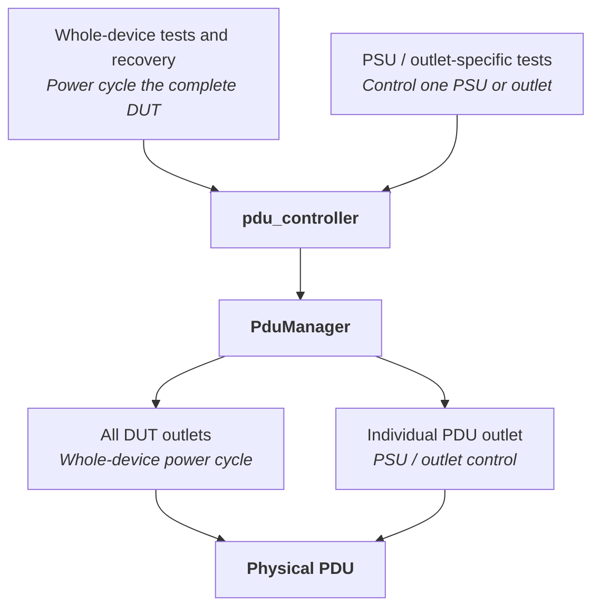
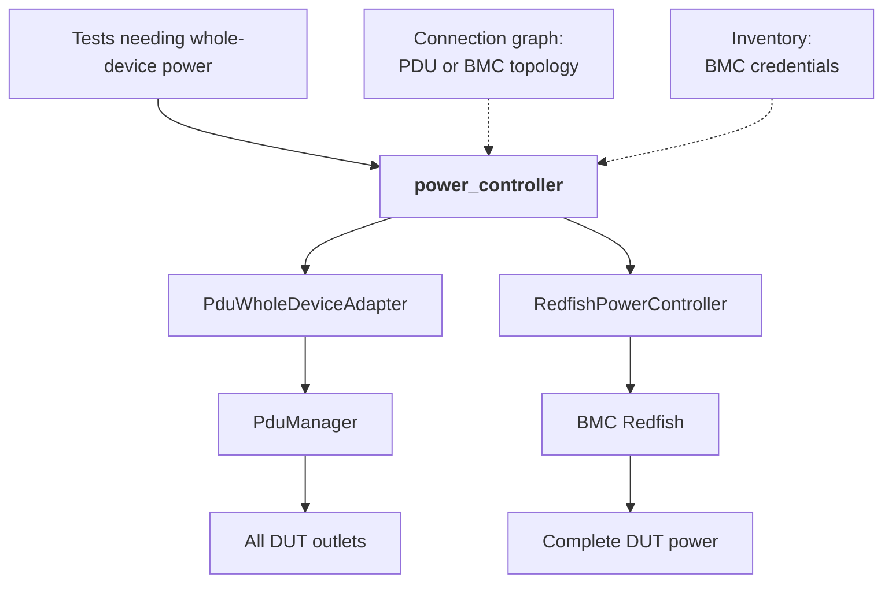

# Backend-Neutral Whole-Device Power Control
## High Level Design

## Overview

sonic-mgmt currently has one way to describe how a DUT receives power: PDU outlets,
controlled through the `pdu_controller` fixture. There is no way to declare that a DUT's
power is controlled by a BMC.

That gap matters because a number of tests depend on power cycling the DUT. In most of them
the power cycle is not the subject of the test but the recovery step that runs after the
test has deliberately put the DUT into an unusable state, such as a read-only root
filesystem, an out of memory condition, a kernel panic, or a critical process that will not
restart.

On a testbed whose DUT has no PDU wiring, `pdu_controller` returns nothing. The affected
tests either skip or fail while attempting to recover, and the DUT is not restored.

This document proposes adding the BMC as a second power backend, behind a small abstraction
that lets a test request whole-device power without naming the mechanism.

## Today: power control is PDU only

Every power operation ends at a physical PDU, whether it targets the whole DUT or a single
outlet. A DUT without PDU wiring therefore has no power path at all.

The connection graph can already describe a BMC link, but nothing on the test side reads it
and no controller exists to act on it. The information is present in the testbed data and
currently unused.

## Proposed: add a BMC backend behind a common interface

A test asks `power_controller` to power the DUT off or on. The fixture reads the connection
graph, determines which backend the testbed provides, and returns an object exposing the
same four methods in either case.

`PduWholeDeviceAdapter` contains no power logic of its own. It calls the existing
`PduManager` without an outlet argument, which the manager already treats as every outlet
belonging to the DUT. `RedfishPowerController` issues `ComputerSystem.Reset` actions against
the BMC.

The BMC is deliberately not modelled as another PDU protocol. A BMC controls the whole
device and has no concept of an outlet, so presenting it as one would mean inventing outlet
identities that do not exist, and would hide the difference between a testbed that can
control individual PSUs and one that cannot.

`pdu_controller` is unchanged and continues to serve tests that operate on individual
outlets. The two fixtures coexist, so existing PDU-wired testbeds keep their current
behaviour and tests can move to `power_controller` individually rather than in a single
sweep.

## Backend selection

For a given DUT the fixture prefers the PDU when the connection graph lists PDU links, falls
back to the BMC when it lists a BMC link, and returns nothing when neither is present so
that the caller can skip.

PDU takes priority for two reasons. Every community testbed today is PDU wired, so this
ordering leaves existing behaviour untouched. Beyond that, a PDU removes AC from the
chassis, whereas Redfish `ForceOff` powers down the host while the BMC keeps running, which
makes the PDU the more faithful reproduction of a power loss.

Both inputs already exist. `device_pdu_links` and `device_bmc_link` are produced today by
`ansible/module_utils/graph_utils.py` from the CSV files under `ansible/files/`. Credentials
reuse `sonic_bmc_root_user` and `sonic_bmc_root_password`, which are already defined in
`ansible/group_vars/lab/secrets.yml` and already read by
`tests/platform_tests/api/test_bmc.py`. No new graph plumbing, CSV format or credential is
introduced.

## Interface

| Method | Returns | Description |
| ------ | ------- | ----------- |
| `power_off()` | `bool` | Remove power from the whole DUT. |
| `power_on()` | `bool` | Restore power to the whole DUT. |
| `get_power_state()` | `str` | `"On"`, `"Off"`, or `"Unknown"`. |
| `close()` | `None` | Release backend resources. |

The fixture is module-scoped and restores power at teardown, so a test that fails between
`power_off()` and `power_on()` cannot leave the DUT without power for later modules.

A shared helper combines the two calls into a single power cycle and waits between them,
since hardware needs a gap before power is reapplied. That interval is a parameter of the
helper rather than a fixed sleep, so callers whose hardware needs longer can extend it.

Redfish resource paths are resolved at runtime rather than hard coded, because BMC
implementations name the system resource differently. Both `System_0` and `system` occur in
practice, the latter being what `tests/redfish/test_redfish_computer_reset.py` already
expects. The controller resolves the member from `GET /redfish/v1/Systems`, reads the action
target from `Actions["#ComputerSystem.Reset"]["target"]`, and selects the power-off type
from `ResetType@Redfish.AllowableValues` instead of assuming `ForceOff`. Resolution happens
when the controller is created and fails loudly, so an unreachable BMC or a wrong credential
is reported up front rather than as a silent failure during recovery.

## Planned scope

The consumers below use power cycling purely as a recovery step, so the backend can change
without altering what they verify. They are the intended first migration.

- `tests/common/utilities.py`, the shared `power_cycle()` helper
- `tests/process_monitoring/test_critical_process_monitoring.py`
- `tests/platform_tests/test_memory_exhaustion.py`
- `tests/platform_tests/test_kdump.py`
- `tests/tacacs/test_ro_disk.py`
- `tests/bgp/test_bgp_operation_in_ro.py`
- `tests/platform_tests/fwutil/test_fwutil.py`

## Open issues

**Per-PSU tests.** `test_platform_info.py`, `test_snmp_phy_entity.py` and
`test_power_off_reboot.py` switch individual PSUs and assert on per-PSU state. A BMC cannot
express that operation. It is not yet decided whether these should skip on BMC-managed
testbeds, be split so their whole-device portions still run, or be gated by an explicit
capability flag on the controller.

**Power loss at the BMC itself.** `test_bmcctld.py` verifies behaviour across an
interruption to the BMC's own power. A BMC cannot remove power from itself, so there is no
path for this test on a testbed without a PDU. The open question is how such tests should
declare that they require a PDU specifically.

**Remaining whole-device callers.** `test_tor_failure.py` and `test_fwutil_cisco.py` also
power cycle the DUT but are not part of the first migration. They run on PDU-wired testbeds
today so nothing breaks, but leaving them behind means two mechanisms coexist for the same
operation.

**BMC link naming.** The `EndPort` column of the BMC CSV becomes the key that identifies a
BMC link, and the one existing upstream example uses `iDRAC`. A convention needs to be
agreed so that lookups do not depend on a particular label.

**Automated recovery tooling.** The scripts under `.azure-pipelines/` that recover or
reimage a testbed still assume a PDU, so a BMC-managed DUT that goes down needs manual
intervention.

## Follow-up work

Consolidate with `tests/redfish/redfish_utils.py`, which is currently mTLS only, once the
authentication mechanism is pluggable.

## Validation

Both backends have been exercised on internal testbeds. The Redfish path was driven through
a real power off and power on using the critical process monitoring test, whose database
container phase always forces a power cycle during recovery. The same test was then run on a
PDU-wired testbed to confirm the existing path is selected and unchanged.
