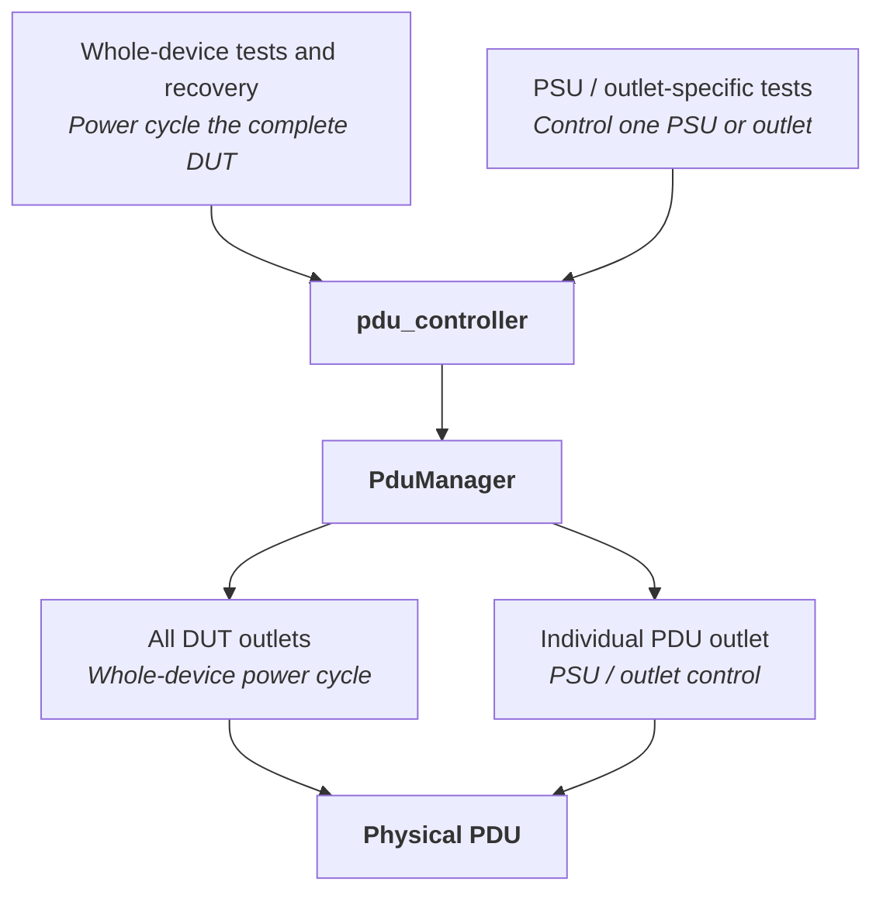
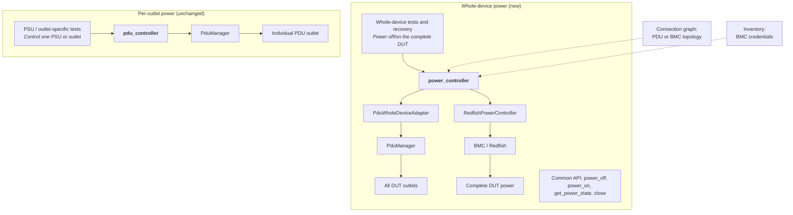
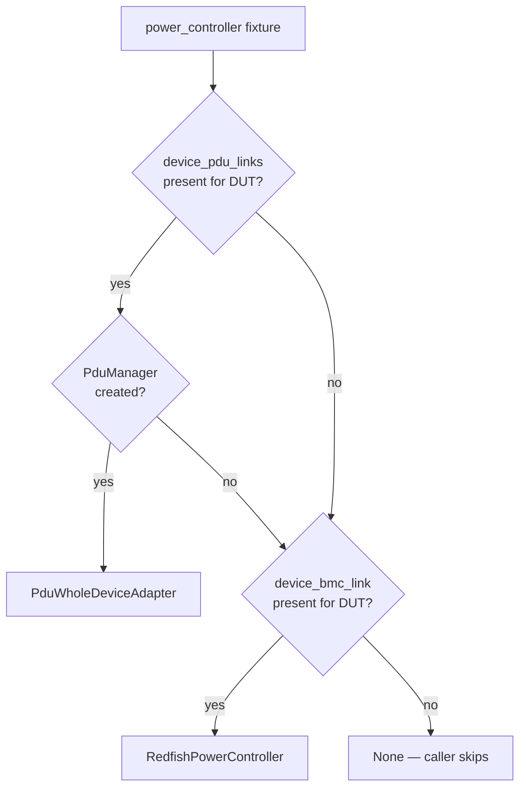

# Backend-Neutral Whole-Device Power Control
## High Level Design

| Rev  | Date       | Author(s)   | Description     |
| ---- | ---------- | ----------- | --------------- |
| v0.1 | 2026-09-01 | Itamar Yair | Initial version |

## Overview

Many sonic-mgmt tests need to remove and restore power to the entire DUT — usually not as
the subject of the test, but as a last-resort recovery step after the test has deliberately
pushed the DUT into an unusable state: a read-only root filesystem, an out-of-memory
condition, a kernel panic, or a critical process that will not restart.

All of them reach for the `pdu_controller` fixture, which models power as individually
switchable PDU outlets. That assumption does not hold everywhere. Some switches ship with
no PDU wiring to the DUT, and their only out-of-band power path is a BMC reachable over
Redfish. On those testbeds `pdu_controller` returns nothing and the affected tests skip or
fail during recovery — the worst possible moment, since the DUT is left in the broken state
the test created.

This document proposes a whole-device power abstraction that lets a test say *power the box
off and back on* without naming the mechanism.

### Relationship to existing BMC documentation

`docs/testplan/bmc/` and `docs/testplan/redfish/` treat the **BMC as the DUT** and verify
BMC features and Redfish conformance. This document treats the **switch as the DUT** and
uses the BMC merely as one backend for powering it. In short: those documents test the BMC,
this one uses the BMC to test something else.

## Today: everything goes through the PDU

Both kinds of test depend on physical PDU outlets, and no BMC backend exists.

The problem is visible in the diagram: two very different intents — "reboot the box" and
"toggle one PSU" — enter through the same door and are expressed in the same per-outlet
vocabulary. A platform that can satisfy the first but not the second has no way to say so.

## Proposed: separate the two power models

Whole-device power becomes backend-neutral; per-outlet PDU behaviour remains unchanged.

Walking the left branch: a test asks `power_controller` for power off or on. The fixture
consults the connection graph, decides which backend this testbed actually has, and returns
one of two objects behind an identical four-method API. `PduWholeDeviceAdapter` holds no
power logic of its own — it calls the existing `PduManager` with no outlet argument, which
the manager already interprets as "every outlet belonging to this DUT".
`RedfishPowerController` issues `ComputerSystem.Reset` actions against the BMC.

The right branch is deliberately untouched. Tests that toggle one PSU keep using
`pdu_controller` directly, because their intent genuinely is outlet-level and a
whole-device API cannot express it.

## Backend selection flow

PDU is tried first, for two reasons. Practically, every testbed in the community today is
PDU wired, so this ordering guarantees no existing testbed changes behaviour. Technically, a
PDU genuinely removes AC from the chassis whereas Redfish `ForceOff` powers down the host
while the BMC stays alive — the PDU is the more faithful power loss and should win where
it exists.

Both inputs already exist: `device_pdu_links` and `device_bmc_link` are produced today by
`ansible/module_utils/graph_utils.py`. This design adds no new graph plumbing, no new CSV
format, and no new credentials — BMC links use the existing
`ansible/files/sonic_lab_bmc_links.csv` format, and credentials reuse the
`sonic_bmc_root_user` / `sonic_bmc_root_password` variables already consumed by
`tests/platform_tests/api/test_bmc.py`.

## Interface

| Method | Returns | Description |
| ------ | ------- | ----------- |
| `power_off()` | `bool` | Remove power from the whole DUT. |
| `power_on()` | `bool` | Restore power to the whole DUT. |
| `get_power_state()` | `str` | `"On"`, `"Off"`, or `"Unknown"`. |
| `close()` | `None` | Release backend resources. |

The fixture is module-scoped and restores power at teardown, so a test failing between
`power_off()` and `power_on()` cannot leave the DUT dark for later modules.

**Redfish paths are discovered, not hard-coded.** BMC implementations name the system
resource differently — both `System_0` and `system` occur in practice, the latter being what
`tests/redfish/test_redfish_computer_reset.py` already expects. The controller therefore
resolves the member from `GET /redfish/v1/Systems`, reads the action target from
`Actions["#ComputerSystem.Reset"]["target"]`, and picks the power-off type from
`ResetType@Redfish.AllowableValues` rather than assuming `ForceOff`. Discovery happens at
construction and raises on failure, so an unreachable BMC or a bad credential surfaces up
front instead of as a silent `False` during recovery.

## Scope

Migrated — these use power cycling purely as recovery, so the mechanism can change without
altering what they verify:

- `tests/common/utilities.py` — the shared `power_cycle()` helper
- `tests/process_monitoring/test_critical_process_monitoring.py`
- `tests/platform_tests/test_memory_exhaustion.py`
- `tests/platform_tests/test_kdump.py`
- `tests/tacacs/test_ro_disk.py`
- `tests/bgp/test_bgp_operation_in_ro.py`
- `tests/platform_tests/fwutil/test_fwutil.py`

Out of scope, each for a technical reason:

- **Per-PSU tests** (`test_platform_info.py`, `test_snmp_phy_entity.py`,
  `test_power_off_reboot.py`) assert on individual PSU state. Mapping them onto a
  whole-device API would silently turn a redundancy test into a reboot test.
- **`test_bmcctld.py`** needs power removed from the BMC itself. A BMC cannot do that to
  itself, so this test requires a PDU by construction.
- **`test_tor_failure.py`** runs on dual-ToR testbeds, which are PDU wired, so the fallback
  would never engage.
- **`test_fwutil_cisco.py`** carries vendor-specific power handling; migrating it adds churn
  without establishing anything new.

## Alternatives considered

The BMC could instead be implemented as another `PduControllerBase` protocol, requiring no
test changes at all. This was rejected because it is dishonest about the hardware:
`get_outlet_status()` must return a synthetic outlet list, so callers that group outlets by
PSU receive entries with no `psu_name` and either misbehave or quietly do nothing. It also
makes a testbed that can do per-PSU work indistinguishable from one that cannot. The failure
mode is a redundancy test that passes without testing redundancy — worse than one that
skips.

## Validation

The Redfish backend was exercised on a platform with a BMC link and no PDU wiring, using the
critical-process test because its database-container phase always forces a real power cycle
during recovery. The same test was then run on a conventionally PDU-wired testbed to confirm
the PDU path is still selected and unchanged. A deliberately wrong BMC credential produced
an HTTP 401, which is what motivated the fail-fast discovery step above.

## Future work

- Share one auth-agnostic Redfish helper with `tests/redfish/redfish_utils.py`, which is
  currently mTLS-only while OpenBMC uses basic auth.
- Migrate the remaining whole-device callers listed as out of scope.
- Give per-PSU tests a capability flag so they skip explicitly on BMC-only platforms rather
  than by absence of a fixture.
- Extend the fallback to the testbed recovery tooling under `.azure-pipelines/`, which still
  assumes a PDU.
- Remove the temporary `pdu_reboot()` shim once all callers are migrated.
