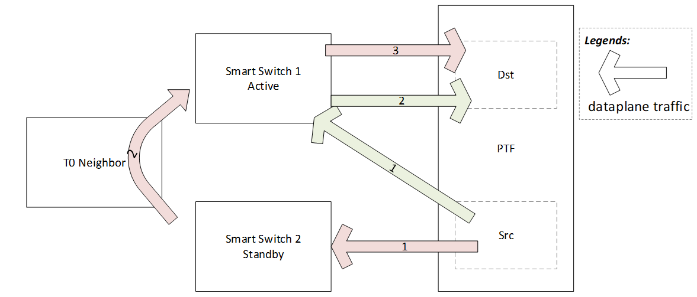
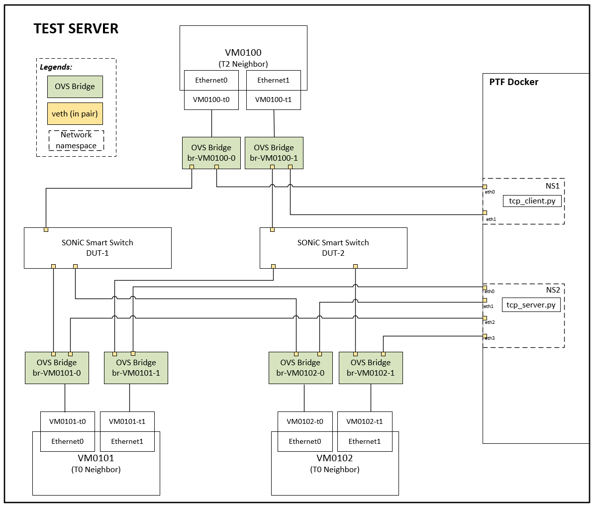
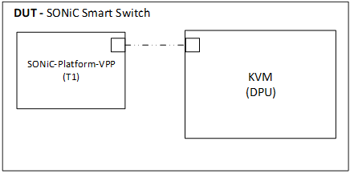
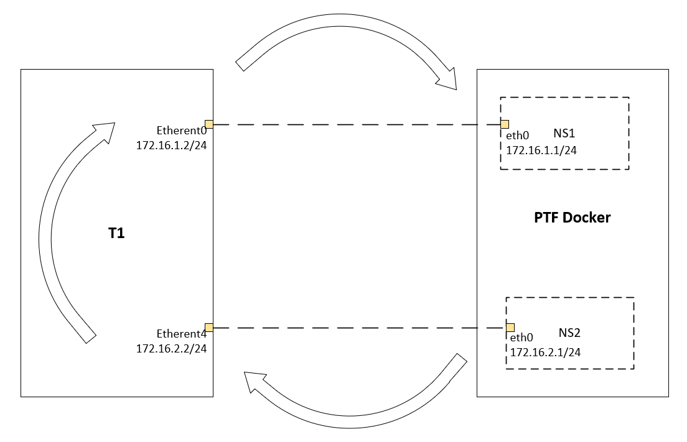
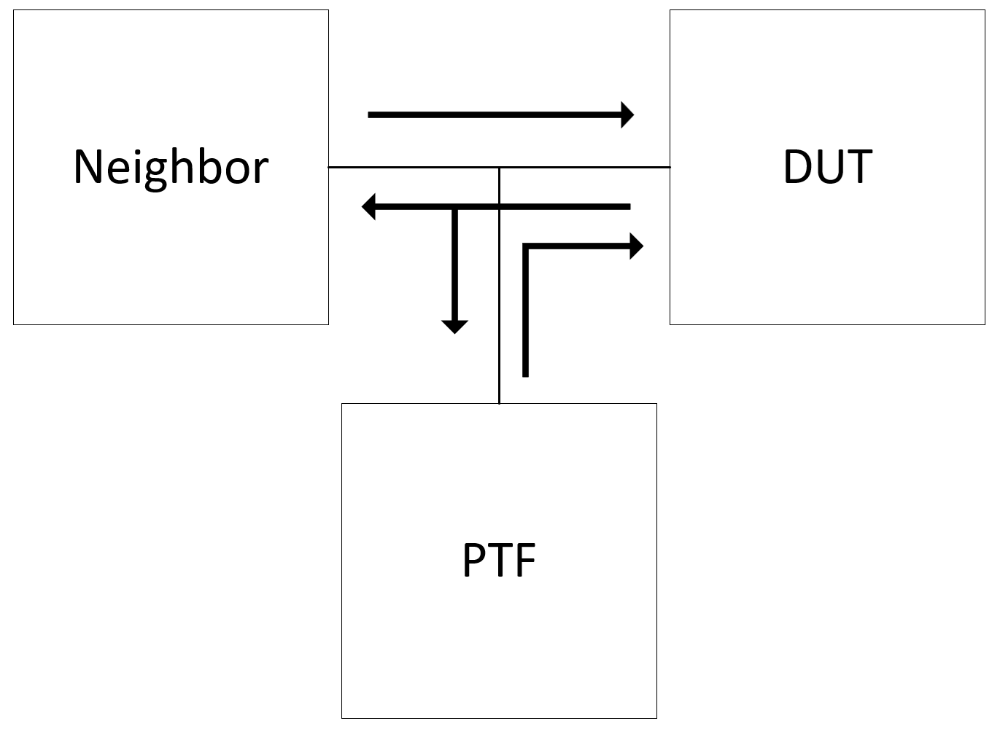
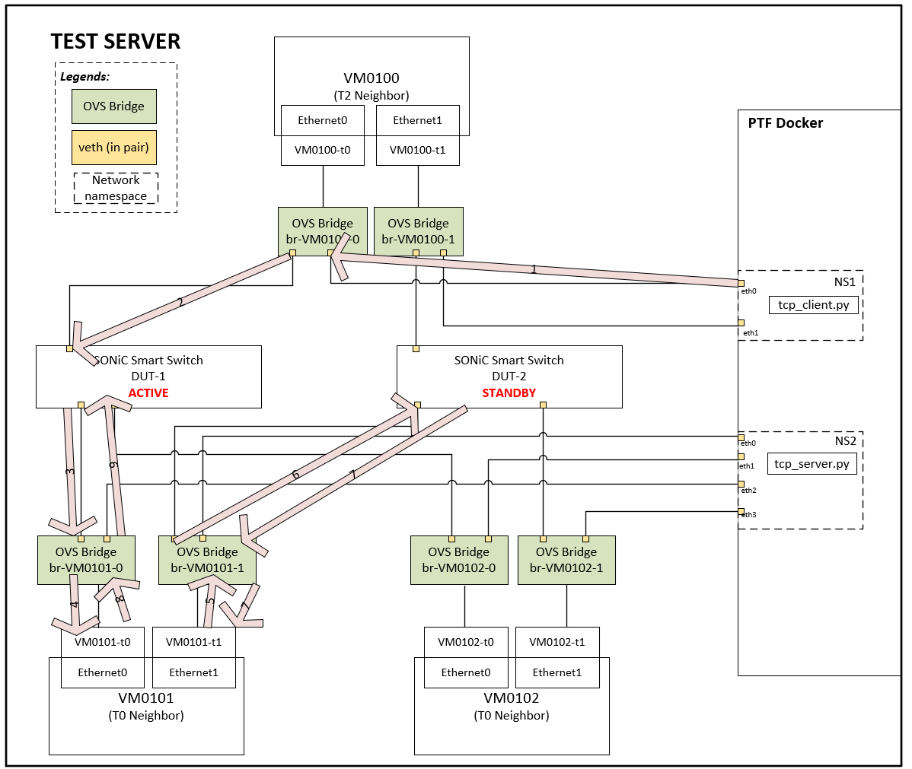
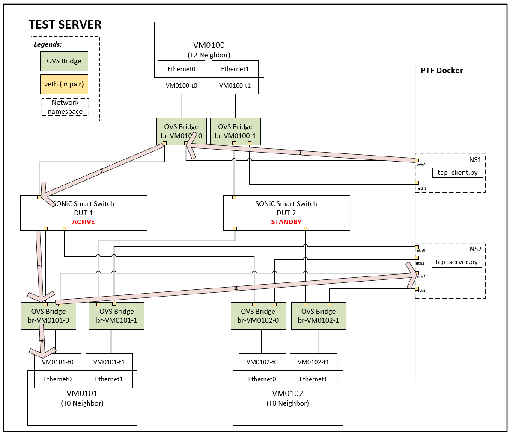
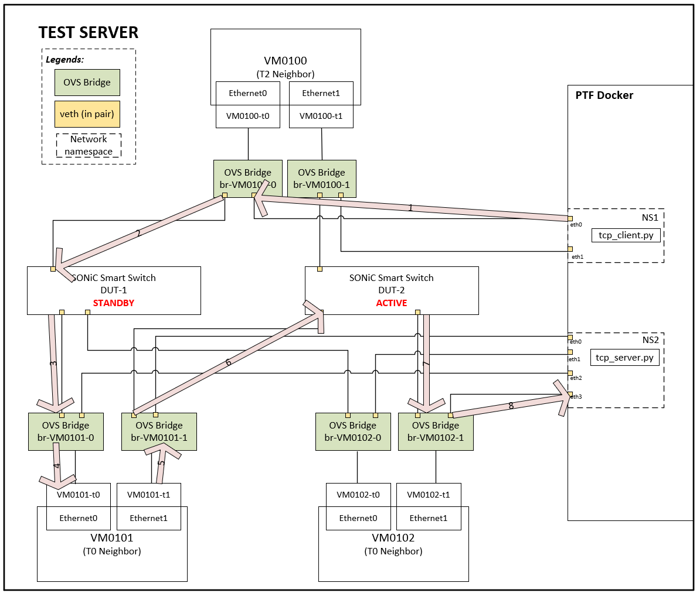

# SmartSwitch Virtual Testbed

## Revision History

| Date       | Author        | Description                      |
|------------|---------------|----------------------------------|
| 2024-02-06 | Jing Zhang   | Initial draft                    |

## Table of Content

- [Scope](#scope)
- [Terminology](#terminology)
- [Virtual Testbed Design](#virtual-testbed-design)
  - [Testbed Topology](#testbed-topology)
    - [Platform VPP Solution for DUT](#platform-vpp-solution-for-dut)
    - [DUT Neighbors](#dut-neighbors)
    - [PTF Container](#ptf-container)
    - [OVS Bridges](#ovs-bridges)
  - [Traffic Flow](#traffic-flow)
    - [Flow Creation and Replication](#flow-creation-and-replication)
    - [Traffic Lands on Active Side](#traffic-lands-on-active-side)
    - [Traffic Lands on Standby Side](#traffic-lands-on-standby-side)

## Scope

This document proposes solutions for Smart Switch High-Availability test plans. The document will cover smart switch virtual testbed topology.

The goal of this testbed design is to verify HA state machine behavior in normal operation scenarios and network failure scenarios. Both control plane and data plane will need to be verified in the test cases.

## Terminology
| Term | Explanation               |
|------|---------------------------|
| DUT  | Device under test         |
| HA   | High availability         |
| NOS  | Network operating system  |
| OVS  | Open vSwitch              |
| DPU  | Data processing unit      |
| T1   | Tier 1                    |
| T0   | Tier 0                    |
| T2   | Tier 2                    |

## Virtual Testbed Design
The assumptions that are widely used in SONiC lab environments, apply to this Smart Switch test plan as well, including but not limited to:
* Switches in the test topology other than the DUT (in this case, T2 and T0), are simulated with docker containers and OVS bridges.
* Verification traffic is sent from PTF and sniffed from PTF. Sender and Sniffer processes run in PTF docker, as a part of the test utilities.
* Due to the hardness of simulating some network failures, test utilities will be implemented to “fake” failure signatures.

To save lab device resources, I will propose a Virtual Machine based testbed design.

The main goal of this test plan to verify smart switch HA features. So, with the testbed topology, we should be able to achieve:
1.	Establish TCP connection between a source and a destination.
2.	Traffic between source and destination should go through smart switch.
3.	Traffic landed on standby side smart switch, should be encapsulated, forwarded to active side smart switch through tunnel, decapsulated, and then forwarded to destination.
4.	Traffic landed on the active side, should be forwarded directly to the destination.

### Testbed Topology
Docker containers will be created for running cEOS to simulate neighbors of DUT. A PTF container will also be created for injecting and sniffing packets. The PTF docker, the cEOS dockers and interfaces within test server will be interconnected with OVS bridges.  
The testbed topology is shown below. 

#### Platform VPP Solution for DUT
This solution leverages [sonic-net/sonic-platform-vpp](https://github.com/sonic-net/sonic-platform-vpp/tree/main), and replaces T1 devices with a VPP platform image. The benefit of using VPP platform is that we won’t have any dependency on SAI SDK implementation. The repository has a clear a [roadmap](https://github.com/sonic-net/sonic-platform-vpp/blob/main/TODO.md) of supporting existing SAI APIs in phases. As we have built and experimented, sonic-platform-vpp is well maintained, basic functionality like ACL works just fine.

A KVM will be created to run DPU image. The midplane connection between T1 docker and KVM with a bridge. 

The DUT in this design will look like diagram below. 

#### DUT Neighbors
* 3 cEOS based neighbors are created. The first one is for simulating the T2 neighbor, the other two are for simulating T0 neighbors. DUT ports for connecting neighbors can be directly connected to the corresponding OVS bridges.  Based on SONiC test topology naming conventions, they will be named VM0100, VM0101, VM0102. 
* Each simulated T2 device has two dataplane interfaces. 
* Each simulated T0 device has two dataplane interfaces.
* For each neighbor, the configure detail and deployment method is included in [sonic-mgmt/testbed.overview/VM type cEOS](https://github.com/sonic-net/sonic-mgmt/blob/master/docs/testbed/README.testbed.Overview.md#vm-type-ceos). All the network interfaces of cEOS are all veth pairs, one end of which is moved the network namespace of the docker container, the other end remains in test server.

#### PTF Container
* A PTF docker will be created for the testbed. 
* A key feature of smart switch HA is the flow replication. The simplest way to understand that is, in failure scenarios, a TCP connection should not be disrupted if failover happens successfully. We will host a server and a client on PTF docker to test that feature. 
* To avoid the packets being routed locally and bypassing the DUT devices, 2 network namespaces will be created on PTF dockers. Scripts running in the namespaces can simulate servers and client send/receive packet to/from.
* 2 ports are created and moved to NS1, they are designed to connect to upstream neighbors, and the IP address will fall under the same subnet as the  upstream neighbors.
* 4 ports are created and moved to NS2, they are designed to connect to downstream neighbors.
* Below is a high-level diagram. Routing rules need to be manually configured in the network namespaces as well to make sure the traffic flow works. Take the diagram below as an example: 

__Ip netns exec ns1 ip route add 172.16.2.0/24 via 172.16.1.2__  
__Ip netns exec ns2 ip route add 172.16.1.0/24 via 172.16.2.2__

#### OVS Bridges
The OVS bridges have 3 ports connected to it:
  * Neighbor docker dataplane interface
  * PTF injected interface
  * DUT interface

For the 3 parties to communicate with each other, open flow rules are configured to control the traffic flow:
  * All packets sent out from Neighbor are only forwarded to DUT
  * All packets sent out from DUT are forwarded to Neighbor and PTD
  * All packets sent out from PTF are only forwarded to DUT 

So that the Neighbor can properly exchange traffic with DUT to establish BGP sessions, etc. PTF can sniff all traffic sent out from DUT or inject packet directly to DUT. 

### Traffic Flow 
#### Flow Creation and Replication
When packets land on active DPU and create a new flow, the new flow will be replicated to the standby DPU inline. Standby side then will send an acknowledgement to the active side. After that, flow creation and replication are completed. 

#### Traffic Lands on Active Side
When traffic arrives on the active side, it will be forwarded directly to the designated T0 neighbor. Because of the open flow rule we configure on OVS bridge, packet will also be duplicated to PTF docker, so we will be able to sniff it. 

#### Traffic Lands on Standby Side
When packets land on standby side, they will be tunneled to the active.

