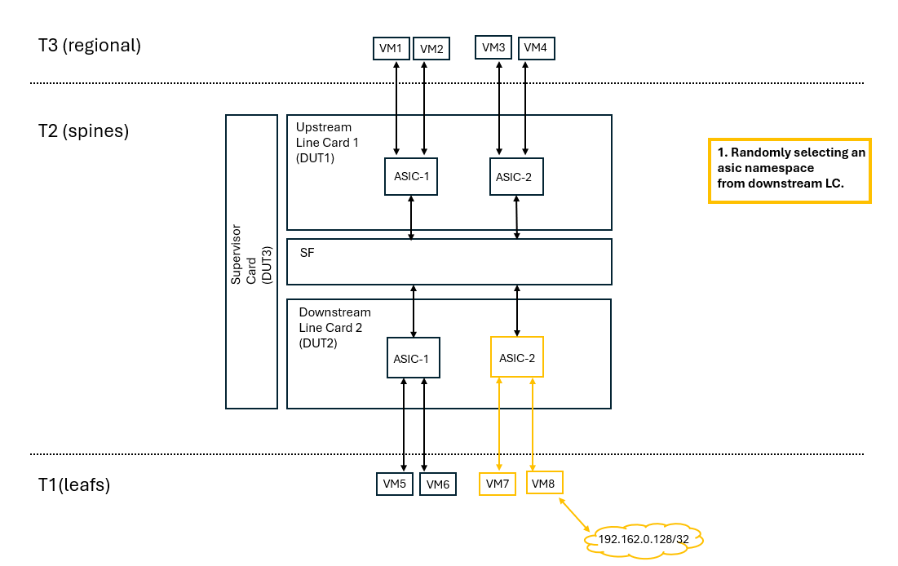
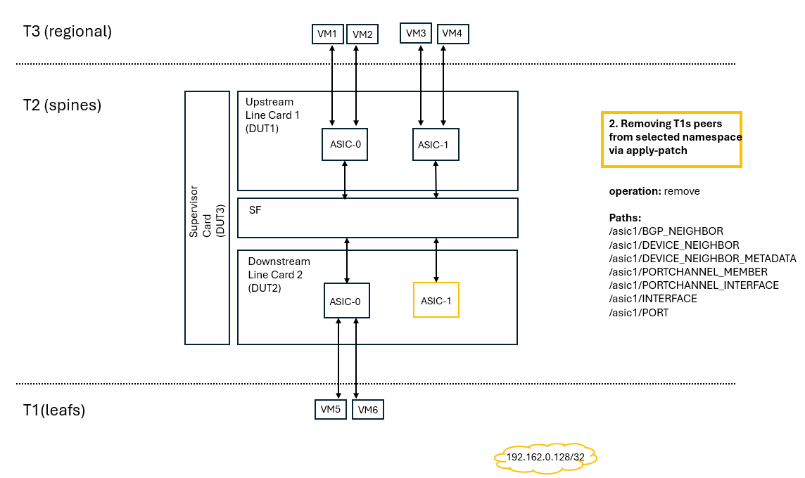
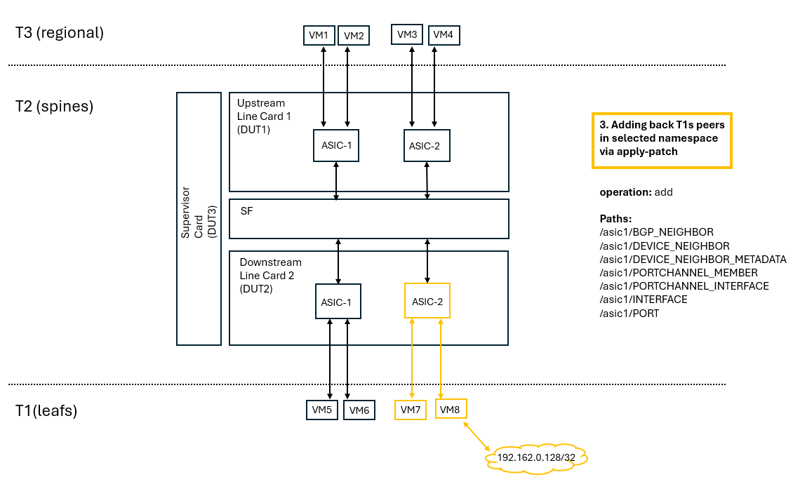
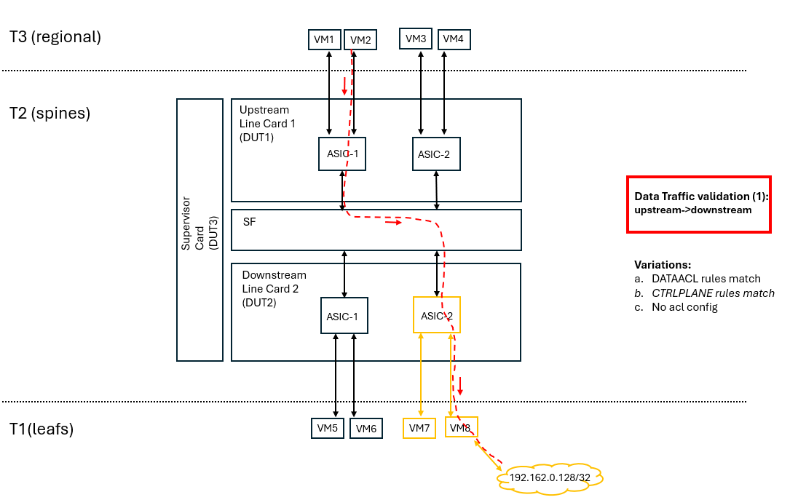
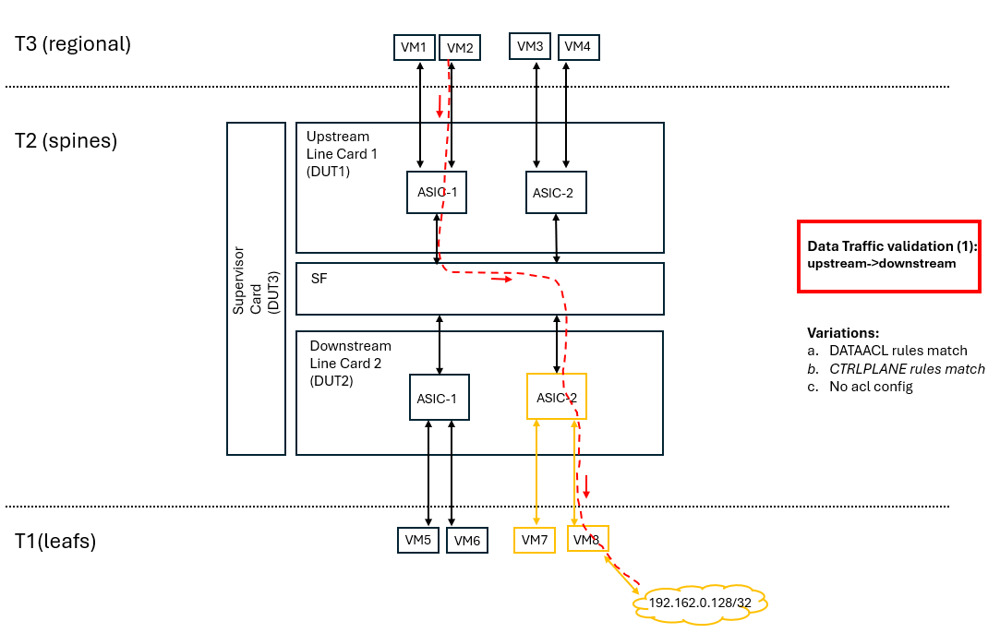

# Add cluster with Generic Config Updater (GCU) Test Plan

## Overview

This test plan covers the dynamic addition of new T1 devices to a running T2 cluster. The feature allows updating the configuration at runtime using generic config update mechanisms, enabling the integration of new neighbors into the system without service disruption.

### Objective
Verify that:
- New T1 devices can be added to a live T2 cluster via runtime configuration updates.
- The devices are correctly registered in the system database.
- Neighbor connections are established successfully.
- The newly added devices are operational and can forward data traffic.

### Affected Configuration Tables
The following configuration/state tables are updated dynamically as part of this test:
<pre>
/BGP_NEIGHBOR
/BUFFER_PG
/CABLE_LENGTH
/DEVICE_NEIGHBOR
/DEVICE_NEIGHBOR_METADATA
/INTERFACE
/PORT
/PORTCHANNEL
/PORTCHANNEL_MEMBER
/PORTCHANNEL_INTERFACE
/PFC_WD
/PORT_QOS_MAP
/QUEUE
</pre>

##  Generic Config Updater (GCU) Test Coverage for Multi-ASIC Support
The existing community test coverage for the Generic Config Updater (GCU) has been enhanced to support running in multi-ASIC platforms and t2 topology.

### Key Changes
1. Multi-ASIC Adaptation:
Test cases have been adapted to use a fixture that returns a random ASIC namespace for verification.

2. Namespace Customization:
For multi-ASIC DUT hosts, JSON patch paths are customized to include the namespace prefix. For changes in global paths, the /localhost prefix was added to the path.

3. Single-ASIC Compatibility:
For single-ASIC DUT hosts, no changes were made to the paths, ensuring compatibility with the existing test setup.

### Test Case Updates

- test_ipv6.py --> test_ip_bgp.py
Previously, this test case verified paths only for IPv6 BGP neighbors. It has been expanded to run repeatedly for both IPv4 and IPv6 BGP neighbor types. As a result, the test suite file has been renamed to test_ip_bgp.py to reflect its broader scope.

### Test PRs

Above changes were added via Test PRs:
- [Generalizing GCU test suite to verify both ip types (IPV4, IPV6) for BGP Neighbors](https://github.com/sonic-net/sonic-mgmt/pull/13650)
- [[GCU] [MA] Adding support in existing tests - Common changes](https://github.com/sonic-net/sonic-mgmt/pull/15182)
Separate test PRs handled the addition of T2/multi-ASIC GCU support. They can be tracked from PR #15182, as all related PRs are referenced there.

## Testbed

The test will run on T2 testbeds.

## Testing Plan

### Test Suite # 1 - Basic Add Cluster With Data Traffic

#### Test Objective

To verify updates in config paths:
<pre>
/BGP_NEIGHBOR
/DEVICE_NEIGHBOR
/DEVICE_NEIGHBOR_METADATA
/PORTCHANNEL_MEMBER
/PORTCHANNEL_INTERFACE
/INTERFACE
/PORT
/PORTCHANNEL
/BUFFER_PG
/CABLE_LENGTH
/PFC_WD
/PORT_QOS_MAP
/QUEUE
</pre>

#### Test Requirements:

At least two frontend DUT hosts are required to perform traffic. Modifications via apply-patch are applied on the downstream frontend DUT host. The scenario verifies data traffic from upstream to downstream and downstream to downstream.

#### Testing Parameters

- With/without acl config.
- Apply-patch standalone/aggregrated changes.

#### Setup Configuration

- Select a random ASIC from the downstream host.
- Select a random BGP neighbor from that namespace and announce a static route for a DST_IP that is advertised only via this neighbor.
- Verify the route table in the downstream DUT host to ensure that the static route is visible.

Remove Peers from Downstream Namespace:
- Remove all BGP neighbors for the selected ASIC namespace via apply-patch.
- Verify the route table. All routes for BGP neighbors should be gone. Additionally, all kernel and directly connected routes toward the neighbor IPs should be removed.
- Shutdown local interfaces for the selected ASIC namespace via apply-patch.
- Verify that the admin status of local interfaces in the selected ASIC namespace is down/down.
- Perform data traffic tests toward a randomly selected neighbor. Traffic should fail.
- Perform data traffic tests toward the static route from the randomly selected neighbor. Traffic should fail.

Re-add Peers and Re-enable Interfaces:
- Change cable lengths.
- Re-add peers in the downstream namespace. -
- Re-enable interfaces.
- Verify that the peers are re-added, BGP sessions are established, and the route table is updated.
- Verify the buffer profile exists in CONFIG_DB, APPL_DB, and ASIC_DB.

#### Testing Steps

Data traffic verifications:
- Perform data traffic tests toward a randomly selected neighbor/the static route from the randomly selected neighbor. Traffic should pass. Verify there are no packet drops via checking pkt counters.
- Perform data traffic from upsteram to downstream linecard (interlinecard). Perform data traffic from the other asic of the same downsteram linecard (innerlinecard).
- Variation with acl config (DATAACL, CTRLPLANE) verifies traffic passes/drops based on acl rules and src/dst port criterion.

### PortChannel Member Staged Restore Variation

When the selected downstream ASIC has an oper-up external PortChannel with at least two members and a configured `min_links` value greater than one, `test_add_cluster.py` runs an additional staged restore check. If no qualifying PortChannel exists, the test keeps the original full add-cluster restore flow.

#### Runtime Selection

- Select the downstream frontend DUT and frontend ASIC from the existing add-cluster fixtures.
- Read the running CONFIG_DB and minigraph data from the DUT.
- Select one external PortChannel whose members are front-panel ports and whose
  aggregate operational status is already up.
- Require at least two members and integer `min_links > 1`.
- Withhold one member from the first add-cluster restore and lower the PortChannel `min_links` by one.

#### Staged Restore Flow

1. Remove cluster config for the selected ASIC namespace using the existing remove-cluster path.
2. Reload and validate the DUT config after removal.
3. Re-add cluster config with GCU while excluding the withheld PortChannel member's physical `PORT` config, member-scoped config, and `PORTCHANNEL_MEMBER` entry.
4. Re-add the remaining PortChannel members and set `PORTCHANNEL|<portchannel>/min_links` to `original_min_links - 1`.
5. Verify the withheld member is still absent from exact member-scoped CONFIG_DB
   keys, including `PORTCHANNEL_MEMBER`, `INTERFACE`, `PORT_QOS_MAP`, and
   `QUEUE`, and that `PORT|<member>/admin_status` remains `down`.
6. Poll the PortChannel operational state. If it does not become up, log the last status and continue.
7. Apply one GCU patch that restores the withheld member's physical port config, port-scoped config, `PORTCHANNEL_MEMBER|<portchannel>|<member>`, and the original PortChannel `min_links` value. Port-scoped config includes QoS, queue, PFC watchdog, and cable-length entries when present in the pre-test CONFIG_DB.
8. Verify the member exists again, the original `min_links` value is restored,
   and the final `BUFFER_PG` and `QUEUE` tables match the pre-test values.
9. Poll the PortChannel operational state again and fail if it does not return
   to up.
10. Verify restored LAG runtime state:
    - `teamd`/`lag_facts` reports the restored member configured, selected, and link-up.
    - `ASIC_DB` contains `SAI_OBJECT_TYPE_LAG_MEMBER` objects for every expected restored PortChannel member under one LAG object, and none of those members are egress-disabled.
    - `COUNTERS_DB` exposes readable member counters and, when available, LAG counters.
    - Existing `ACL_TABLE`/Mirror/Everflow bindings that reference the PortChannel or member remain visible through `acl_facts` and `show acl table`.
    - PTF traffic toward an unused temporary restored-PortChannel route hashes to the restored member while varying source IP and TCP port fields, after traffic counters are cleared and a post-clear baseline is captured, and member TX counter deltas increase by the sent packet count.

`CONFIG_DB` `PORTCHANNEL|<portchannel>/min_links` is the authoritative hard check for the restored `min_links` value. The test also logs the `teamd`/`lag_facts` runner `min_ports` value as runtime evidence, but does not fail solely on a runner `min_ports` mismatch after CONFIG_DB is restored.

The temporary dataplane route is selected from a candidate list only when it is absent before validation starts. Cleanup withdraws only the route installed by the test and asserts that the route is removed from the selected ASIC.

#### Chassis-packet Flow

For `switch_type == "chassis-packet"`, the test uses the chassis-packet add/remove helpers. These helpers preserve internal backplane objects:

- `Ethernet-BP*` interfaces are excluded.
- PortChannels with backplane members are treated as internal and are skipped.
- GCU patches are scoped to ASIC namespace paths.
- The first add-cluster restore applies PortChannel member/interface/base config before BGP and remaining tables.
- The staged final patch is a single ASIC-namespace GCU patch containing the withheld `PORT`, member-scoped config, `PORTCHANNEL_MEMBER`, and `PORTCHANNEL min_links` restore.

#### Non-chassis-packet / VLAN-localhost Flow

For the non-`chassis-packet` path, the test uses the generic add/remove helpers. This path updates both ASIC namespace paths and `/localhost` paths:

- Front-panel interface names are translated to minigraph aliases for localhost entries.
- PortChannel member keys are translated to the localhost-facing alias form where needed.
- ACL table port lists are restored under `/localhost`.
- The staged final patch includes the ASIC namespace restore and, when applicable, localhost `DEVICE_NEIGHBOR`, `INTERFACE`, `PORTCHANNEL_MEMBER`, and `PORTCHANNEL min_links` operations in the same GCU apply.

The difference is that chassis-packet protects backplane/internal objects and does not add localhost namespace patches, while the non-chassis-packet path restores both ASIC and localhost/VLAN-visible configuration.

### Test Case # 2 - Update CABLE Length

#### Test Objective

To verify updates in config path
</pre>
/CABLE_LENGTH
</pre>

#### Testing Steps

- Select a random ASIC namespace and shut down the interfaces.
- Update cable length via apply-patch. Identify the current cable length and add the previous or next supported length value for this frontend card.
- Bring the interfaces back up via apply-patch.
- Verify that the interfaces are up.
- Verify in CONFIG_DB and APPL_DB that the new cable length is applied.
- Verify that updated pg lossless profile was created in CONFIG_DB and APPL_DB and that it was assigned to active interfaces.

### Test Case # 3 - Load QoS

#### Test Objective
To verify qos updates in multi-asic t2 platform.
To verify updates in tables
<pre>
/BUFFER_PG
/PORT_QOS_MAP
/QUEUE
</pre>

#### Testing Steps

- Select a random ASIC namespace and shut down the interfaces. (to be modified per interface)
- Remove QoS config via apply-patch remove operation for tables
  "BUFFER_PG", "PORT_QOS_MAP", "QUEUE".
- Verify that configuration is cleared in CONFIG_DB, APPL_DB.
- Add back QoS config via apply-patch add operation in tables "BUFFER_PG", "PORT_QOS_MAP", "QUEUE".
- Verify that configuration is populated to CONFIG_DB, APPL_DB.
- Bring the interfaces back up via apply-patch.
- Verify that the interfaces are up.

### Test PRs

Above changes were added via Test PR:
- [Adding new Tests for Chassis/Multi-ASIC GCU](https://github.com/sonic-net/sonic-mgmt/pull/14887)
