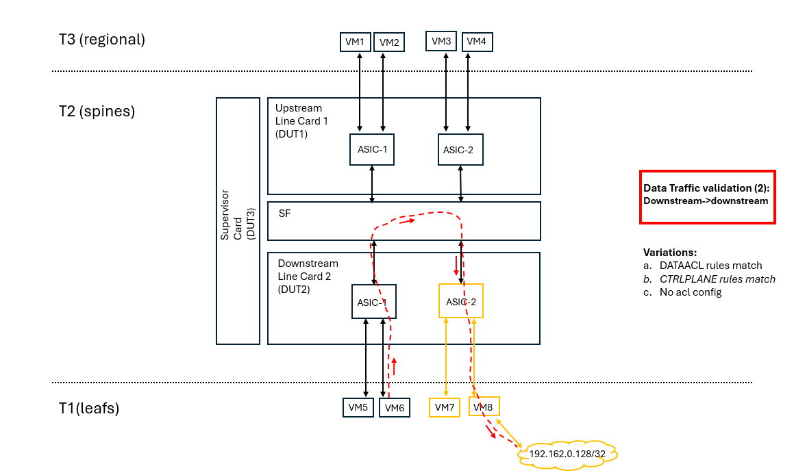

# Add cluster with Generic Config Updater (GCU) Test Plan

## Overview

This test plan covers the dynamic addition of new T1 devices to a running T2 cluster. The feature allows updating the configuration at runtime using generic config update mechanisms, enabling the integration of new neighbors into the system without service disruption.

### Objective
Verify that:
- New T1 devices can be added to a live T2 cluster via runtime configuration updates.
- The devices are correctly registered in the system database.
- Neighbor connections are established successfully.
- The newly added devices are operational and can forward data traffic.

### Affected Configuration Tables
The following configuration/state tables are updated dynamically as part of this test:
<pre>
/BGP_NEIGHBOR
/BUFFER_PG
/CABLE_LENGTH
/DEVICE_NEIGHBOR
/DEVICE_NEIGHBOR_METADATA
/INTERFACE
/PORT
/PORTCHANNEL_MEMBER
/PORTCHANNEL_INTERFACE
/PORT_QOS_MAP
</pre>

##  Generic Config Updater (GCU) Test Coverage for Multi-ASIC Support
The existing community test coverage for the Generic Config Updater (GCU) has been enhanced to support running in multi-ASIC platforms and t2 topology.

### Key Changes
1. Multi-ASIC Adaptation:
Test cases have been adapted to use a fixture that returns a random ASIC namespace for verification.

2. Namespace Customization:
For multi-ASIC DUT hosts, JSON patch paths are customized to include the namespace prefix. For changes in global paths, the /localhost prefix was added to the path.

3. Single-ASIC Compatibility:
For single-ASIC DUT hosts, no changes were made to the paths, ensuring compatibility with the existing test setup.

### Test Case Updates

- test_ipv6.py --> test_ip_bgp.py
Previously, this test case verified paths only for IPv6 BGP neighbors. It has been expanded to run repeatedly for both IPv4 and IPv6 BGP neighbor types. As a result, the test suite file has been renamed to test_ip_bgp.py to reflect its broader scope.

### Test PRs

Above changes were added via Test PRs:
- [Generalizing GCU test suite to verify both ip types (IPV4, IPV6) for BGP Neighbors](https://github.com/sonic-net/sonic-mgmt/pull/13650)
- [[GCU] [MA] Adding support in existing tests - Common changes](https://github.com/sonic-net/sonic-mgmt/pull/15182)
Separate test PRs handled the addition of T2/multi-ASIC GCU support. They can be tracked from PR #15182, as all related PRs are referenced there.

## Testbed

The test will run on T2 testbeds.

## Testing Plan

### Test Suite # 1 - Basic Add Cluster With Data Traffic

#### Test Objective

To verify updates in config paths:
<pre>
/BGP_NEIGHBOR
/DEVICE_NEIGHBOR
/DEVICE_NEIGHBOR_METADATA
/PORTCHANNEL_MEMBER
/PORTCHANNEL_INTERFACE
/INTERFACE
/PORT
</pre>

#### Test Requirements:

At least two frontend DUT hosts are required to perform traffic. Modifications via apply-patch are applied on the downstream frontend DUT host. The scenario verifies data traffic from upstream to downstream and downstream to downstream.

#### Testing Parameters

- With/without acl config.
- Apply-patch standalone/aggregrated changes.

#### Setup Configuration

- Select a random ASIC from the downstream host.
- Select a random BGP neighbor from that namespace and announce a static route for a DST_IP that is advertised only via this neighbor.
- Verify the route table in the downstream DUT host to ensure that the static route is visible.

Remove Peers from Downstream Namespace:
- Remove all BGP neighbors for the selected ASIC namespace via apply-patch.
- Verify the route table. All routes for BGP neighbors should be gone. Additionally, all kernel and directly connected routes toward the neighbor IPs should be removed.
- Shutdown local interfaces for the selected ASIC namespace via apply-patch.
- Verify that the admin status of local interfaces in the selected ASIC namespace is down/down.
- Perform data traffic tests toward a randomly selected neighbor. Traffic should fail.
- Perform data traffic tests toward the static route from the randomly selected neighbor. Traffic should fail.

Re-add Peers and Re-enable Interfaces:
- Change cable lengths.
- Re-add peers in the downstream namespace. -
- Re-enable interfaces.
- Verify that the peers are re-added, BGP sessions are established, and the route table is updated.
- Verify the buffer profile exists in CONFIG_DB, APPL_DB, and ASIC_DB.

#### Testing Steps

Data traffic verifications:
- Perform data traffic tests toward a randomly selected neighbor/the static route from the randomly selected neighbor. Traffic should pass. Verify there are no packet drops via checking pkt counters.
- Perform data traffic from upsteram to downstream linecard (interlinecard). Perform data traffic from the other asic of the same downsteram linecard (innerlinecard).
- Variation with acl config (DATAACL, CTRLPLANE) verifies traffic passes/drops based on acl rules and src/dst port criterion.

[to be enhanced]
As a test variation, instead of applying changes per ASIC namespace, the same scenario shall be adapted to apply changes to a randomly selected interface that is a member of a portchannel from a randomly selected namespace.

### Test Case # 2 - Update CABLE Length

#### Test Objective

To verify updates in config path
</pre>
/CABLE_LENGTH
</pre>

#### Testing Steps

- Select a random ASIC namespace and shut down the interfaces.
- Update cable length via apply-patch. Identify the current cable length and add the previous or next supported length value for this frontend card.
- Bring the interfaces back up via apply-patch.
- Verify that the interfaces are up.
- Verify in CONFIG_DB and APPL_DB that the new cable length is applied.
- Verify that updated pg lossless profile was created in CONFIG_DB and APPL_DB and that it was assigned to active interfaces.

### Test Case # 3 - Load QoS

#### Test Objective
To verify qos updates in multi-asic t2 platform.
To verify updates in tables
<pre>
/BUFFER_PG
/PORT_QOS_MAP
</pre>

#### Testing Steps

- Select a random ASIC namespace and shut down the interfaces. (to be modified per interface)
- Remove QoS config via apply-patch remove operation for tables "BUFFER_PG", "PORT_QOS_MAP".
- Verify that configuration is cleared in CONFIG_DB, APPL_DB.
- Add back QoS config via apply-patch add operation in tables "BUFFER_PG", "PORT_QOS_MAP".
- Verify that configuration is populated to CONFIG_DB, APPL_DB.
- Bring the interfaces back up via apply-patch.
- Verify that the interfaces are up.

### Test PRs

Above changes were added via Test PR:
- [Adding new Tests for Chassis/Multi-ASIC GCU](https://github.com/sonic-net/sonic-mgmt/pull/14887)

### Test Case # 4 - Port Speed Change

#### Test Objective
Verify port speed change behavior on a multi-ASIC T2 platform.

The test updates the following DB tables:
<pre>
/BUFFER_QUEUE
/QUEUE
/PORT
/INTERFACE
/BGP_NEIGHBOR
/DEVICE_NEIGHBOR
/DEVICE_NEIGHBOR_METADATA
</pre>

#### Test Variations:
The test case runs in two variations to verify both:
- Upgrade scenario
- Downgrade scenario
If the topology does not support one of the operations, that scenario will be skipped.

#### Test Requirements:
At least two frontend DUTs are required to generate and validate traffic.
Configuration changes via gcu apply-patch are applied on the downstream frontend DUT.
The scenario verifies:
- Upstream -> Downstream traffic
- Downstream -> Downstream traffic

#### Testing Setup
- Select a random asic namespace and a random active interface from that namespace
- Capture initial speed for that interface (speedA), identify supported speeds for the interface and randomly select a second speed to change to (speedB)
- Change speed via gcu apply-patch from initial speed (speedA) to intermediate speed (speedB).
- Verify that speed changes are populated to DB. Expect setup is not fully-functional after this change.
    Reason for that is the following:
    In a functional setup it is expected that after this change setup will not be functional. Most probably the interface will be down as physical changes need to be performed in hw in case transceivers do not support both speeds.
- Save configuration and do config reload. After this step the initial state for test case is ready.

- Select a random ASIC namespace and a random active interface within that namespace.
- Capture the initial speed of the interface (speedA).
- Identify supported interface speeds and randomly select a second speed (speedB).
- Change speed using gcu apply-patch from speedA -> speedB.
- Verify DB reflects the speed change.
> The system is expected not to be fully functional at this point because physical hardware (transceivers) may not support both speeds, causing the interface to go down.
- Save configuration and perform config reload.
This completes the initial setup.

#### Testing Steps
- Change speed via gcu apply-patch back to the original speed (speedA).
- Verify DB reflects the change.
> The system is expected to be fully functional and all interfaces should be up.
- Run data traffic toward the selected interface.
  - Verify lossless traffic
  - Verify ACL traffic

#### Testing Teardown
- Restore configuration with load minigraph.

#### Port Speed Change Json File
- An example of a json file performed port speed changes is similar to below:
<pre>
[
  {
    "op": "remove",
    "path": "/asic1/BUFFER_QUEUE/ixre-egl-board33|asic1|Ethernet200|0-2"
  },
  {
    "op": "remove",
    "path": "/asic1/BUFFER_QUEUE/ixre-egl-board33|asic1|Ethernet200|3-4"
  },
  {
    "op": "remove",
    "path": "/asic1/BUFFER_QUEUE/ixre-egl-board33|asic1|Ethernet200|5-6"
  },
  {
    "op": "remove",
    "path": "/asic1/QUEUE/ixre-egl-board33|asic1|Ethernet200|0"
  },
  {
    "op": "remove",
    "path": "/asic1/QUEUE/ixre-egl-board33|asic1|Ethernet200|1"
  },
  {
    "op": "remove",
    "path": "/asic1/QUEUE/ixre-egl-board33|asic1|Ethernet200|2"
  },
  {
    "op": "remove",
    "path": "/asic1/QUEUE/ixre-egl-board33|asic1|Ethernet200|3"
  },
  {
    "op": "remove",
    "path": "/asic1/QUEUE/ixre-egl-board33|asic1|Ethernet200|4"
  },
  {
    "op": "remove",
    "path": "/asic1/QUEUE/ixre-egl-board33|asic1|Ethernet200|5"
  },
  {
    "op": "remove",
    "path": "/asic1/QUEUE/ixre-egl-board33|asic1|Ethernet200|6"
  },
  {
    "op": "add",
    "path": "/asic1/PORT/Ethernet200/admin_status",
    "value": "down"
  },
  {
    "op": "add",
    "path": "/asic1/PORT/Ethernet200/lanes",
    "value": "128,129,130,131"
  },
  {
    "op": "add",
    "path": "/asic1/PORT/Ethernet200/speed",
    "value": "100000"
  },
  {
    "op": "add",
    "path": "/asic1/PORT/Ethernet200/fec",
    "value": "rs"
  },
  {
    "op": "add",
    "path": "/asic1/INTERFACE/Ethernet200",
    "value": {

    }
  },
  {
    "op": "add",
    "path": "/asic1/INTERFACE/Ethernet200|11.0.0.34~131",
    "value": {

    }
  },
  {
    "op": "add",
    "path": "/asic1/INTERFACE/Ethernet200|2001::AB:45~1126",
    "value": {

    }
  },
  {
    "op": "add",
    "path": "/localhost/INTERFACE/Ethernet26~11",
    "value": {

    }
  },
  {
    "op": "add",
    "path": "/localhost/INTERFACE/Ethernet26~11|11.0.0.34~131",
    "value": {

    }
  },
  {
    "op": "add",
    "path": "/localhost/INTERFACE/Ethernet26~11|2001::AB:45~1126",
    "value": {

    }
  },
  {
    "op": "add",
    "path": "/localhost/BGP_NEIGHBOR/11.0.0.35",
    "value": {
      "admin_status": "up",
      "asn": "65200",
      "holdtime": "10",
      "keepalive": "3",
      "local_addr": "11.0.0.34",
      "name": "ARISTA18T3",
      "nhopself": "0",
      "rrclient": "0"
    }
  },
  {
    "op": "add",
    "path": "/localhost/BGP_NEIGHBOR/2001::AB:46",
    "value": {
      "admin_status": "up",
      "asn": "65200",
      "holdtime": "10",
      "keepalive": "3",
      "local_addr": "2001::AB:45",
      "name": "ARISTA18T3",
      "nhopself": "0",
      "rrclient": "0"
    }
  },
  {
    "op": "add",
    "path": "/localhost/DEVICE_NEIGHBOR/Ethernet26~11",
    "value": {
      "name": "ARISTA18T3",
      "port": "Ethernet1"
    }
  },
  {
    "op": "add",
    "path": "/localhost/DEVICE_NEIGHBOR_METADATA/ARISTA18T3",
    "value": {
      "hwsku": "Arista-VM",
      "mgmt_addr": "10.250.32.176",
      "type": "AZNGHub"
    }
  },
  {
    "op": "add",
    "path": "/asic1/BGP_NEIGHBOR/11.0.0.35",
    "value": {
      "admin_status": "up",
      "asn": "65200",
      "holdtime": "10",
      "keepalive": "3",
      "local_addr": "11.0.0.34",
      "name": "ARISTA18T3",
      "nhopself": "0",
      "rrclient": "0"
    }
  },
  {
    "op": "add",
    "path": "/asic1/BGP_NEIGHBOR/2001::AB:46",
    "value": {
      "admin_status": "up",
      "asn": "65200",
      "holdtime": "10",
      "keepalive": "3",
      "local_addr": "2001::AB:45",
      "name": "ARISTA18T3",
      "nhopself": "0",
      "rrclient": "0"
    }
  },
  {
    "op": "add",
    "path": "/asic1/DEVICE_NEIGHBOR/Ethernet200",
    "value": {
      "name": "ARISTA18T3",
      "port": "Ethernet1"
    }
  },
  {
    "op": "add",
    "path": "/asic1/DEVICE_NEIGHBOR_METADATA/ARISTA18T3",
    "value": {
      "hwsku": "Arista-VM",
      "mgmt_addr": "10.250.32.176",
      "type": "AZNGHub"
    }
  },
  {
    "op": "add",
    "path": "/asic1/PORT/Ethernet200/admin_status",
    "value": "up"
  }
]
</pre>
