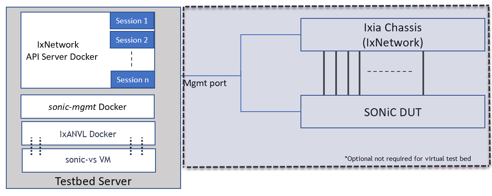

# BGP conformance using IxANVL

- [BGP conformance using IxANVL](#bgp-conformance-using-ixanvl)
  - [Purpose](#purpose)
  - [Scope](#scope)
  - [IxANVL Testbed](#ixanvl-testbed)
  - [Topology](#topology)
  - [Setup configuration](#setup-configuration)
  - [Test Methodology](#test-methodology)
    - [Test cases](#test-cases)
    - [Test results](#test-results)
  - [Call for action](#call-for-action)

## Purpose
SONiC today uses the FRRouting(FRR) protocol suite for implementing BGP. However in the final deployments for Hyperscalers and Network operators we see a lot of customnization to further optimization necessary for deisred performance. Each of these customization done to BGP needs to be validated to make sure it is not breaking the BGP conformance. This is mandatory to keep interoperability working between platforms in a heterogeneous environment which is very common in a data center. Network operators have challenges to make sure protocol conformance is maintained at each stage. 

One of the most efficient yet comprehensive way of validating protocol conformance is IxANVL. With IxANVL  (Automated Network Validation
Library), one can quickly and effortlessly access a
vast array of protocol libraries and utilities to validate
protocol compliance and interoperability. 
## Scope
In this test plan we will integrate IxANVL into the sonic-mgmt testbed server, enabling is to run end to end conformance test with either Anvl running in a docker with SONiC virtual DUT or physical DUT. Also for ease of use there will be ability to run with a Ixia chassis. 

## IxANVL Testbed
This can be run in the Keysight version of community test bed. In addition for simplicity we will discuss here how this can be run on a virtual test bed. 
Follow the instruction to setup a virtual test bed from this document:
https://github.com/Azure/sonic-mgmt/blob/master/docs/testbed/README.testbed.VsSetup.md
Only sonic-mgmt and sonic-vs steps are required.
For IxANVL download docker image from Ixia website (Link TBD)
IxANVL test bed deployment (PR Pending)

The tests will run on following testbeds:
* t0
  
## Topology

## Setup configuration
TDB

## Test Methodology
Here are the highlevel steps:
1. Pytest script pushes initial configuration in DUT using fixtures (duthost)
2. Pytest script kicks off IxANVL execution
3. IxANVL creates virtual interfaces with chassis for packet transmission and reception
4. IxANVL starts running test cases and does runtime DUT configurations using vtysh
5. Once the execution completes, pytest script fetches the run results

### Test cases
View IxANVL datasheet for details

https://www.keysight.com/us/en/assets/3120-1119/data-sheets/IxANVL-Automated-Network-Validation-Library.pdf 
### Test results
TDB
## Call for action
* Solicit experience in multi-DUT system test scenarios.
