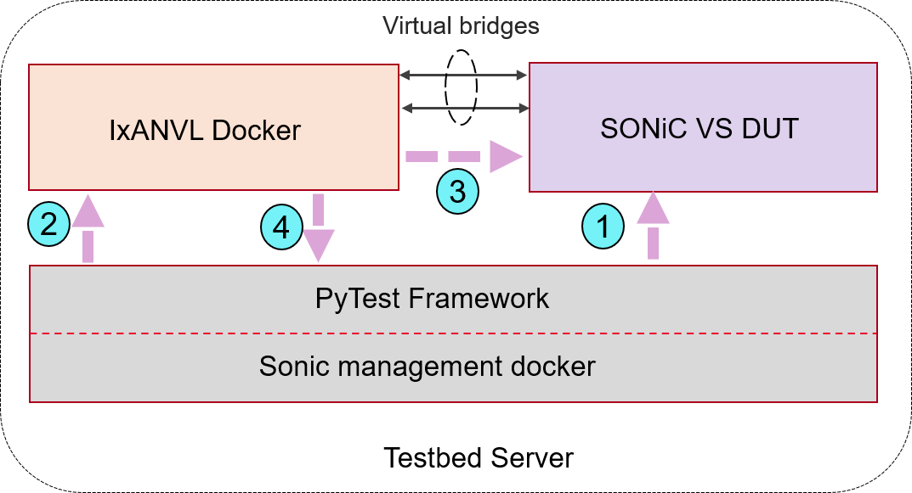

# BGP conformance using IxANVL

- [BGP conformance using IxANVL](#bgp-conformance-using-ixanvl)
  - [Purpose](#purpose)
  - [Scope](#scope)
  - [IxANVL Testbed](#ixanvl-testbed)
  - [Topology](#topology)
  - [Setup configuration](#setup-configuration)
  - [Test Methodology](#test-methodology)
    - [Test cases](#test-cases)
    - [Test results](#test-results)
  - [Call for actions](#call-for-actions)

## Purpose
SONiC today uses the FRRouting(FRR) protocol suite for implementing BGP. However in the final deployment network operators may have reasons to customize BGP implementation. Each of these customizations done to BGP needs to be validated to make sure it is not breaking the BGP conformance. This is mandatory to keep interoperability working between different implementations of BGP in a heterogeneous environment which is very common in different tiers of a data center. Network operators have challenges to make sure protocol conformance is maintained at each stage. 

A comprehensive way of validating protocol conformance is IxANVL. With IxANVL  (Automated Network Validation Library), one can quickly access a vast array of protocol libraries and utilities to validate protocol compliance and interoperability. FRR publishes IxANVL result for each release at https://www.frrouting.org/. IxANVL enables conformance comparisons of customized FRR forks mentioned above to the upstream FRR and other routing implementations. 

## Scope
In this test plan we will integrate IxANVL into the sonic-mgmt testbed server. This will include:

* Deployment of IxANVL docker using Ansible scripts
* SONiC DUT automation to run the IxANVL tests

Also option for using Keysight chassis connected to physical DUT workflow for ease of use will be included. 
To run these tests users will need to procure IxANVL license. 

## IxANVL Testbed
As discussed above the test bed will be hosted in the testbed server.
Follow the instruction to setup a virtual test bed from this document:
https://github.com/Azure/sonic-mgmt/blob/master/docs/testbed/README.testbed.VsSetup.md

Only sonic-mgmt and sonic-vs steps are required.
For IxANVL download, docker image from Ixia website (Link TBD)
IxANVL test bed deployment (PR TBD)
 
## Topology

## Setup configuration
1. Testbed Configuration script brings up the IxANVL docker and the SONiC VS DUT
2. Testbed Configuration script also brings up the connections between IxANVL docker and the SONiC VS DUT for test channel

## Test Methodology
Here are the highlevel steps:
1. Pytest script pushes initial configuration in DUT using fixtures (duthost)
2. Pytest script kicks off IxANVL execution
3. IxANVL starts running test cases and does runtime DUT configurations using vtysh
4. Once the execution completes, pytest script fetches the run results
   

### Test cases
View IxANVL datasheet for details (BGP4 Core)

https://www.keysight.com/us/en/assets/3120-1119/data-sheets/IxANVL-Automated-Network-Validation-Library.pdf 
### Test results
Number of tests run:          143 
Number of tests passed:       107 
Number of tests failed:       36
## Call for actions
What other protocols are cadidates for protocol conformance tests?
