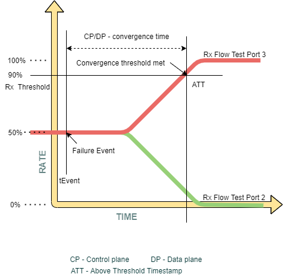

# BGP convergence test plan for benchmark performance

- [BGP convergence test plan for benchmark performance](#bgp-convergence-test-plan-for-benchmark-performance)
  - [Overview](#Overview)
    - [Scope](#Scope)
    - [Testbed](#Keysight-Testbed)
  - [Topology](#Topology)
    - [SONiC switch as ToR](#SONiC-switch-as-ToR)
    - [SONiC switch as Leaf](#SONiC-switch-as-Leaf)
  - [Setup configuration](#Setup-configuration)
  - [Test methodology](#Test-methodology)
  - [Test cases](#Test-cases)
    - [Test case # 1 – BGP Remote Link Failover Convergence (route withdraw)](#test-case--1--convergence-performance-when-remote-link-fails-route-withdraw)
      - [Test objective](#Test-objective)
      - [Test steps](#Test-steps)
      - [Test results](#Test-results)
      - [Test case](#Test-case)
    - [Test case # 2 – BGP RIB-IN Convergence](#Test-case--2--RIB-IN-Convergence)
      - [Test objective](#Test-objective-1)
      - [Test steps](#Test-steps-1)
      - [Test results](#Test-results-1)
      - [Test case](#Test-case-1)
    - [Test case # 3 - BGP Local Link Failover Convergence](#Test-case--3--Failover-convergence-with-local-link-failure) 
      - [Test objective](#Test-objective-2)
      - [Test steps](#Test-steps-2)
      - [Test results](#Test-results-2)
      - [Test case](#Test-case-2)
    - [Call for action](#Call-for-action)

## Overview
The purpose of these tests is to test the overall convergence of a data center network by simulating multiple network devices such as ToR/Leafs and using SONiC switch DUT as one of the ToR/Leaf, closely resembling production environment.

### Scope
These tests are targeted on fully functioning SONiC system. The purpose of these tests are to measure convergence when some unexpected failures such as remote link failure, local link failure, node failure or link faults etc occur and some expected failures such as maintenance or upgrade of devices occur in the SONiC system.

### Keysight Testbed
The tests will run on following testbeds:
* t0

## Topology
### SONiC switch as ToR

### SONiC switch as Leaf

## Setup configuration
IPv4 EBGP neighborship will be configured between SONiC DUT and directly connected test ports. Test ports inturn will simulate the ToR's and Leafs by advertising IPv4/IPv6, dual-stack routes.

## Test Methodology
Following test methodologies will be used for measuring convergence. 
* Traffic generator will be used to configure ebgp peering between chassis ports and SONiC DUT by advertising IPv4/IPv6, dual-stack routes. 
* Receiving ports will be advertising the same VIP(virtual IP) addresses. 
* Data traffic will be sent from  server to these VIP addresses. 
* Depending on the test case, the faults will be generated. Local link failures can be simulated on the port by "simulating link down" event. 
* Remote link failures can be simulated by withdrawing the routes.
* Control to data plane convergence will be measured by noting down the precise time of the control plane event and the data plane event. Convergence will be measured by taking the difference between contol and data plane events. Traffic generator will create those events and provide us with the control to data plane convergence value under statistics.
* RIB-IN Convergence is the time it takes to install the routes in its RIB and then in its FIB to forward the traffic without any loss. In order to measure RIB-IN convergence, initially IPv4/IPv6 routes will not be advertised. Once traffic is sent, IPv4/IPv6 routes will be advertised and the timestamp will be noted. Once the traffic received rate goes above the configured threshold value, it will note down the data plane above threshold timestamp. The difference between these two event timestamps will provide us with the RIB-IN convergence value.
* Route capacity can be measured by advertising routes in a linear search fashion. By doing this we can figure out the maximum routes a switch can learn and install in its RIB and then in its FIB to forward traffic without any loss.

## Test cases
### Test case # 1 – BGP Remote Link Failover Convergence (route withdraw)
#### Test objective
Measure the convergence time when remote link failure event happens with in the network.

  
   

#### Test steps
* Configure IPv4 EBGP sessions between Keysight ports and the SONiC switch.
* Advertise IPv4 routes along with AS number via configured IPv4 BGP sessions.
* Configure and advertise same IPv4 routes from both the test ports.
* Configure another IPv4 session to send the traffic. This is the server port from which traffic will be sent to the VIP addresses.
* Start all protocols and verify that IPv4 BGP neighborship is established.
* Create a data traffic between the server port and receiver ports where the same VIP addresses are configured and enable tracking by "Destination Endpoint" and by "Destination session description".
* Set the desired threshold value for receiving traffic. By default we will be set to 90% of expected receiving rate.
* Apply and start the data traffic.
* Verify that traffic is equally distributed between the receiving ports without any loss.
* Simulate remote link failure by withdrawing the routes from one receiving port. 
* Verify that the traffic is re-balanced and use the other available path to route the traffic.
* Drill down by "Destination Endpoint" under traffic statistics to get the control plane to data plane convergence value.
* In general the convergence value will fall in certain range. In order to achieve proper results, run the test multiple times and average out the test results. 
* Set it back to default configuration.
#### Test results
| Event | Number Of IPv4 Routes  | Convergence (ms)  |
| :---:   | :-: | :-: |
| Withdraw Routes | 1K | 388 |
| Withdraw Routes | 8K | 2870 |
| Withdraw Routes | 16K | 6188 |

For above test case, below are the test results when multiple remote link fails.

| Event | Number Of IPv4 Routes  | Convergence (ms)  |
| :---:   | :-: | :-: |
| Withdraw Routes | 1K | 438 |
| Withdraw Routes | 8K | 2800 |
| Withdraw Routes | 16K | 7176 |

### Test Case
* sonic-mgmt/tests/ixia/bgp/test_bgp_remote_link_failover.py 
### Test case # 2 – BGP RIB-IN Convergence 
#### Test objective
Measure the convergence time to install the routes in its RIB and then in its FIB to forward the packets after the routes are advertised.

  
   

#### Test steps
* Configure IPv4 EBGP sessions between Keysight ports and the SONiC switch.
* Configure IPv4 routes via configured IPv4 BGP sessions. Initially disable the routes so that they don't get advertised after starting the protocols.
* Configure the same IPv4 routes from both the test receiving ports.
* Configure another IPv4 session to send the traffic. This is the server port from which traffic will be sent to the VIP addresses.
* Start all protocols and verify that IPv4 BGP neighborship is established.
* Create a data traffic between the server port and receiver ports where the same VIP addresses are configured and enable tracking by "Destination Endpoint" and by "Destination session description".
* Set the desired threshold value for receiving traffic. By default we will be set to 90% of expected receiving rate.
* Apply and start the data traffic.
* Verify that no traffic is being forwarded. 
* Enable/advertise the routes which are already configured. 
* Control plane event timestamp will be noted down and once the receiving traffic rate goes above the configured threshold value, it will note down the data plane threshold timestamp.
* The difference between these two event timestamp will provide us with the RIB-IN convergence time.
* In general the convergence value will fall in certain range. In order to achieve proper results, run the test multiple times and average out the test results. 
* Set it back to default configuration.
#### Test results
| Event | Number Of IPv4 Routes  | Convergence (ms)  |
| :---:   | :-: | :-: |
| Advertise Routes | 1K | 493 |
| Advertise Routes | 8K | 2953 |
| Advertise Routes | 64K | 28301 |
| Advertise Routes | 98K | 43109 |
| Advertise Routes | 196K | 90615 |

In order to measure RIB-IN capacity of the switch, we can follow the same test methodology as RIB-IN convergence test. Below are the results for RIB-IN capacity test.

| Event | Number Of IPv4 Routes  | Convergence (ms)  | Loss % |
| :---:   | :-: | :-: | :-: |
| Advertise Routes | 256K | - | 25 |
| Advertise Routes | 198K | - | 0.50 |
| Advertise Routes | 196K | 85079 | 0 |
| Advertise Routes | 195K | 84487 | 0 |
| Advertise Routes | 194K | 83285 | 0 |

### Test Case
* sonic-mgmt/tests/ixia/bgp/test_bgp_rib_in_convergence.py 
* sonic-mgmt/tests/ixia/bgp/test_bgp_rib_in_capacity.py 
### Test case # 3 - BGP Local Link Failover Convergence 
#### Test objective
Measure the convergence time when local link failure event happens with in the network.

  

#### Test steps
* Configure IPv4 EBGP sessions between Keysight ports and the SONiC switch.
* Advertise IPv4 routes along with AS number via configured IPv4 BGP sessions.
* Configure and advertise same IPv4 routes from both the test ports.
* Configure another IPv4 session to send the traffic. This is the server port from which traffic will be sent to the VIP addresses.
* Start all protocols and verify that IPv4 BGP neighborship is established.
* Create a data traffic between the server port and receiver ports where the same VIP addresses are configured and enable tracking by "Destination Endpoint" and by "Destination session description".
* Set the desired threshold value for receiving traffic. By default it will be set to 95% of expected receiving rate.
* Apply and start the data traffic.
* Verify that traffic is equally distributed between the receiving ports without any loss.
* Simulate local link failure by making port down on test tool. 
* Verify that the traffic is re-balanced and use the other available path to route the traffic.
* Compute the failover convergence by the below formula
* Data Convergence Time(seconds) = (Tx Frames - Rx Frames) / Tx Frame Rate

### Test Results
Below table is the result of 3 way ECMP for 4 link flap iterations
| Event Name | No. of IPv4 Routes  | Iterations  | Avg Calculated Data Convergence Time(ms)  |
| :---:   | :-: | :-: | :-: |
| Test_Port_2 Link Failure | 1000 | 4 | 14.112 |
| Test_Port_3 Link Failure | 1000 | 4 | 14.336 |
| Test_Port_4 Link Failure | 1000 | 4 | 14.219 |

### Test Case
* sonic-mgmt/tests/ixia/bgp/test_bgp_local_link_failover.py 
### Call for action
* Solicit experience in multi-DUT system test scenarios.

