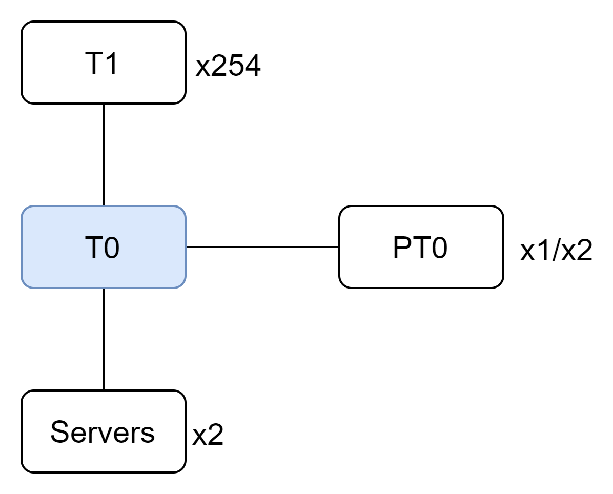
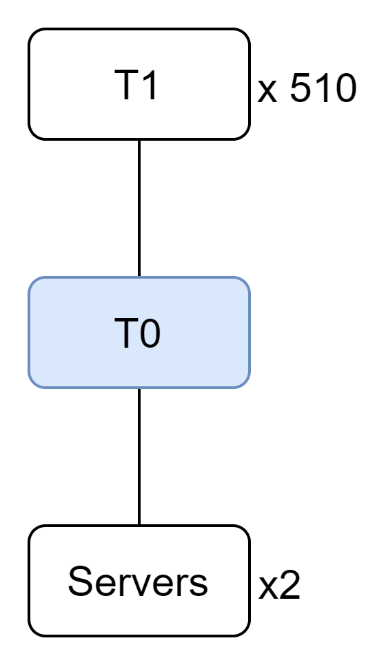
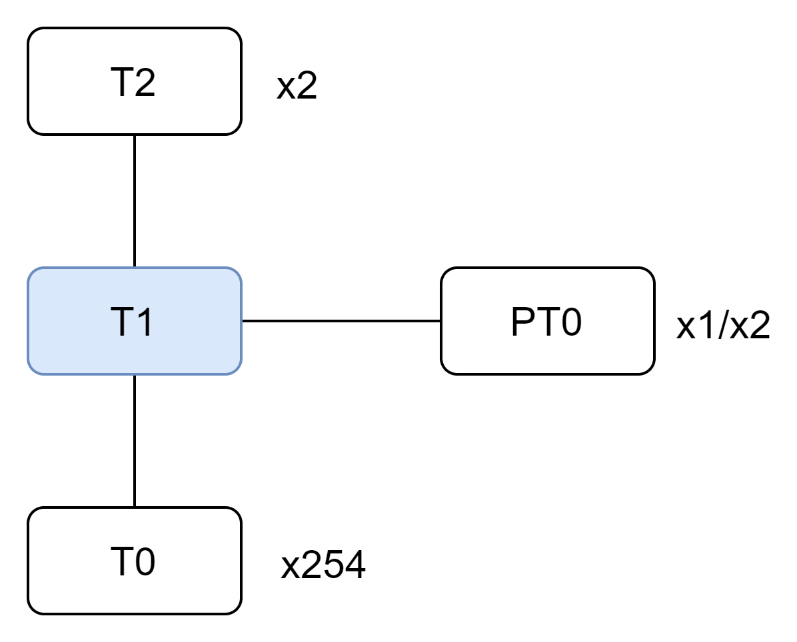
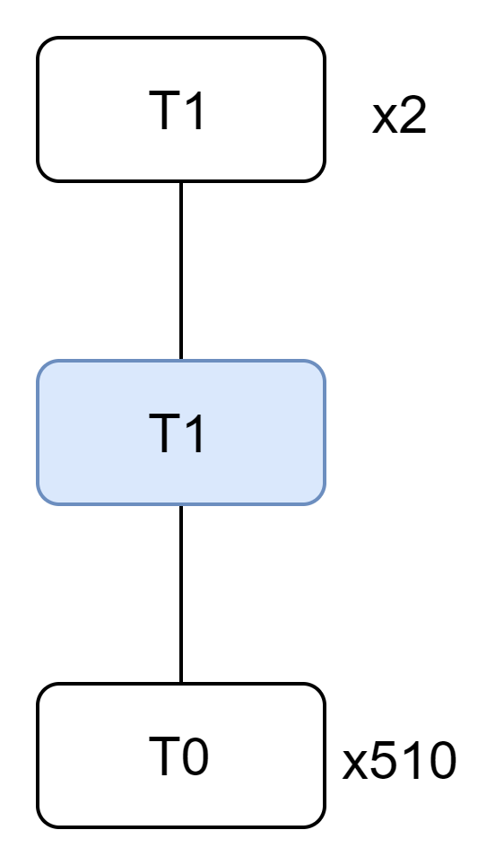

# BGP Scale Test Plan

- [Overview](#Overview)
  - [Goal](#Goal)
  - [Test Topology](#Test-Topology)
  - [Test Topology Scale](#Test-Topology-Scale)
- [Route Configuration Setup](#Route-Configuration-Setup)
- [Test Methodology](#Test-Methodology)
- [Test Cases](#Test-Cases)
  - [BGP Sessions Flapping Test](#BGP-Sessions-Flapping-Test)
  - [Unisolation Test](#Unisolation-Test)
  - [Nexthop Group Member Scale Test](#Nexthop-Group-Member-Scale-Test)

# Overview

This test plan is to test if control/data plane can handle the initialization/flapping of numerous BGP session holding a lot routes, and estimate the impact on it.

## Goal

This test plan runs on any device running SONIC system with fully functioning configuration with numerouse BGP peers with count 256/512.

This goal of the test plan is to show, when there are 256/512 bgp peers configurated:
- if there is any service crush
- if hardware resource run out
- if device has acceptable performance and data/control plane availability

## Test Topology

This test run on testbeds with topologies:
- t0: topo_t0-isolated-d2u254s1, topo_t0-isolated-d2u254s2, topo_t0-isolated-d2u510
- t1: topo_t1-isolated-d254u2s1, topo_t1-isolated-d254u2s2 and topo_t1-isolated-d510u2.

*Fig.1 topo_t0-isolated-d2u254s1/s2*

*Fig.2 topo_t0-isolated-d2u510*

*Fig.3 topo_t1-isolated-d254u2s1/s2*

*Fig.4 topo_t1-isolated-d510u2*

## Test Topology Scale
In this scale test, the maximum bgp peers number reach count 510.

With great number of bgp peers, come with the great number of ceos containers that are used to establish bgp sessions with full NOS functionality for all possible testing.

One ceos will comsume around 1.3-1.7GB memory, 510 means we need a server with 663-867GB. To deploy this topology with 510 even more bgp peers, we proposed a design to achieve [deploy testbed with multiple servers](https://github.com/sonic-net/sonic-mgmt/pull/15395), with this design, we can leverage multiple servers' CPU, memory and network capacity, to overcome the single server resource limitation.

# Route Configuration Setup
The count of routes from BGP peers is vital, we will leverage exabpg to advertise routes to all BGP peers, and those routes be be advertised to device under test finally.

When DUT is T0, via exabgp, we will advertise 511 routes with prefix length 120 and 511 rotues with prefix length 128 to each neighbor T1 devices. The prefixes with length 120 are mocking VLAN address on downstream T0s, and the prefixes with length 128 are mocking loopback address on downstream T0s.

When DUT is T1, via exabgp, we will advertise 1 route with prefix 120 to each neighbor T0 devices and every prefix in route is unique.

Detail route scale is described in below table:
| Topology Type                              | BGP Routes Count      | BGP Nexthop Group Count | BGP Nexthop Group Members Count |
| ------------------------------------------ | --------------------- | ----------------------- | ------------------------------- |
| t0-isolated-d2u254s1, t0-isolated-d2u254s2 |  254 * ( 511 + 511 )  | 254                     | 254                             |
| t0-isolated-d2u510                         |  510 * ( 511 + 511 )  | 510                     | 510                             |
| t1-isolated-d2u254s1, t1-isolated-d2u254s2 |  254 * ( 1 + 1 )      | 254                     | 1                               |
| t1-isolated-d2u510                         |   510 * ( 1 + 1 )     | 510                     | 1                               |

# Test Cases

## Initial State
All bgp sessions are up and established and all routes are stable with expected count.

## BGP Sessions Flapping Test
### Objective
When BGP sessions are flapping, make sure control plane is functional and data plane has no downtime or acceptable downtime.
### Steps
1. Start and keep sending packets with all routes to the random one open port via ptf.
1. Shutdown one or half random port(s) that establishing bgp sessions. (shut down T1 sessions ports on T0 DUT, shut down T0 sesssions ports on T1 DUT.)
1. Wait for routes are stable, check if all nexthops connecting the shut down ports are disappeared in routes.
1. Stop packet sending
1. Estamite data plane down time by check packet count sent, received and duration.

## Unisolation Test
### Objective
In the worst senario, verify control/data plane have acceptable conergence time.
### Steps
1. Shut down all ports on device. (shut down T1 sessions ports on T0 DUT, shut down T0 sesssions ports on T1 DUT.)
1. Wait for routes are stable.
1. Start and keep sending packets with all routes to all ports via ptf.
1. Unshut all ports and wait for routes are stable.
1. Stop sending packets.
1. Estamite control/data plane convergence time.

## Nexthop Group Member Scale Test
### Objective
When routes on BGP peers are flapping, make sure the large next hop group member is supported by the control plane and data plane within acceptable downtime.
### Steps
1. Split all routes into N groups that mapping to the N BGP peers.
#### Test Withdrawn
1. Start to sending packets with all routes with in fix time interval to all ports via ptf.
1. For each BGP peers, withdraw routes in group.
1. Wait for routes are stable.
1. Stop sending packets.
1. Estamite data plane down time.
#### Test Advertising
1. Start to sending packets with all routes with in fix time interval to all ports via ptf.
1. For each BGP peers, advertise routes in group.
1. Wait for routes are stable.
1. Stop sending packets.
1. Estamite control/data plane convergence time.
