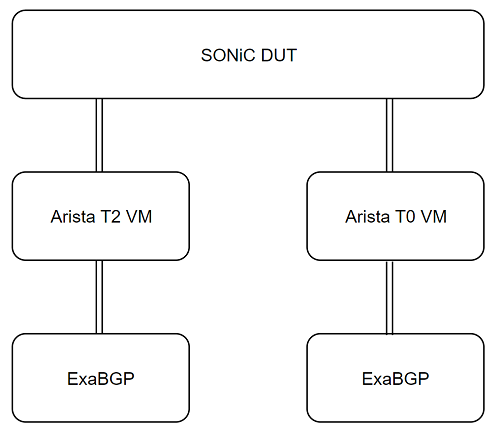

# BGP Suppress FIB Pending Test Plan

## Related documents

| **Document Name** | **Link** |
|-------------------|----------|
| BGP Suppress FIB Pending HLD | [https://github.com/stepanblyschak/SONiC/blob/bgp-suppress-fib-pending/doc/BGP/BGP-supress-fib-pending.md]|

## Overview

As of today, SONiC BGP advertises learnt prefixes regardless of whether these prefixes were successfully programmed into ASIC.
While route programming failure is followed by orchagent crash and all services restart, even for successfully created routes there is a short period of time when the peer will be black holing traffic.
Also, in the following scenario, a credit loop occurs:
###### Figure 1. Use case scenario


The problem with BGP programming occurs after the T1 switch is rebooted:
1. First, the T1 FRR learns a default route from at least 1 T2
2. The T0 advertises it’s prefixes to T1
3. FRR advertises the prefixes to T2 without waiting for them to be programmed in the ASIC
4. T2 starts forwarding traffic for prefixes not yet programmed, according to T1’s routing table, T1 sends it back to a default route – same T2

To avoid that, the route programming has to be synchronous down to the ASIC to avoid credit loops.

### Scope

The test is to verify the mechanism that allows BGP not to advertise routes that haven't been installed into ASIC yet.

### Scale / Performance

No scale/performance test involved in this test plan

### Related **DUT** CLI commands
Command to enable the feature:
```
admin@sonic:~$ sudo config suppress-fib-pending enabled
```
Command to disable the feature:
```
admin@sonic:~$ sudo config suppress-fib-pending disabled
```

### Supported Topology
The tests will be supported on t1 topo.

###### Figure 2. Logic Topology


## Test cases
### Test case # 1 - BGPv4 route suppress test
1. Enable BGP suppress-fib-pending function at DUT
2. Save configuration and execute one action randomly choosen from(__reboot__/__config reload__/__fast-reboot__/__warm-reboot__)
3. Suspend orchagent process to simulate a delay
```
kill -SIGSTOP $(pidof orchagent)
```
4. Announce BGP ipv4 prefixes to DUT from T0 VM by exabgp
5. Make sure announced BGP routes are in __queued__ state in the DUT routing table
6. Verify the routes are not announced to T2 VM peer
7. Send traffic matching the prefixes and verify packets are not forwarded to T0 VM
8. Restore orchagent process
```
kill -SIGCONT $(pidof orchagent)
```
9. Make sure announced BGP routes are not in __queued__ state in the DUT routing table
10. Make sure the routes are programmed in FIB by checking __offloaded__ flag in the DUT routing table
```
show ip route 1.1.1.0/24 json

{
    "1.1.1.0/24": [
        {
            "destSelected": true,
            "distance": 20,
            "installed": true,
            "installedNexthopGroupId": 277,
            "internalFlags": 264,
            "internalNextHopActiveNum": 1,
            "internalNextHopNum": 1,
            "internalStatus": 80,
            "metric": 0,
            "nexthopGroupId": 277,
            "nexthops": [
                {
                    "active": true,
                    "afi": "ipv4",
                    "fib": true,
                    "flags": 3,
                    "interfaceIndex": 17,
                    "interfaceName": "PortChannel1021",
                    "ip": "10.0.0.65",
                    "weight": 1
                }
            ],
            "offloaded": true,
            "prefix": "1.1.1.0/24",
            "prefixLen": 24,
            "protocol": "bgp",
            "selected": true,
            "table": 254,
            "uptime": "00:08:08",
            "vrfId": 0,
            "vrfName": "default"
        }
    ]
}
```
11. Verify the routes are announced to T2 peer
12. Send traffic matching the prefixes and verify packets are forwarded to T0 VM
13. This test should cover __default__ and __user defined vrf__

### Test case # 2 - BGPv6 route suppress test
1. Enable BGP suppress-fib-pending function at DUT
2. Save configuration and execute one action randomly choosen from(__reboot__/__config reload__/__fast-reboot__/__warm-reboot__)
3. Suspend orchagent process to simulate a delay
4. Announce BGP ipv6 prefixes to DUT from T0 VM by exabgp
5. Make sure announced BGP routes are in __queued__ state in the DUT routing table
6. Verify the routes are not announced to T2 VM peer
7. Send traffic matching the prefixes and verify packets are not forwarded to T0 VM
8. Restore orchagent process
9. Make sure announced BGP routes are not in __queued__ state in the DUT routing table
10. Make sure the routes are programmed in FIB by checking __offloaded__ flag in the DUT routing table
11. Verify the routes are announced to T2 peer
12. Send traffic matching the prefixes and verify packets are forwarded to T0 VM
13. This test should cover __default__ and __user defined vrf__

### Test case # 3 - Test BGP route without suppress
1. No BGP suppress-fib-pending function configured at DUT
2. Suspend orchagent process to simulate a delay
3. Announce BGP prefixes to DUT from T0 VM by exabgp
4. Make sure announced BGP routes are not in __queued__ state in the DUT routing table
5. Verify the BGP routes are announced to T2 peer
6. Restore orchagent process
7. Make sure the routes are programmed in FIB by checking __offloaded__ flag in the DUT routing table
8. Send traffic matching the prefixes and verify packets are forwarded to T0 VM

### Test case # 4 - Test BGP test work with suppress
1. No BGP suppress-fib-pending function configured at DUT
2. Run BGP test suite
3. Make sure BGP tests are not affected
4. Enable BGP suppress-fib-pending function at DUT
5. Run BGP test suite
6. Make sure BGP tests are not affected

### Test case # 5 - Test BGP route suppress under negative operation
1. Enable BGP suppress-fib-pending function at DUT
2. Suspend orchagent process to simulate a delay
3. Announce BGP prefixes to DUT from T0 VM by exabgp
4. Execute __BGP session restart__
5. Verify BGP neighborships are established
6. Make sure announced BGP routes are in __queued__ state in the DUT routing table
7. Configure __static routes__ then redistribute to BGP
8. Verify the __redistributed routes__ are in the DUT routing table
9. Verify the routes are announced to T2 VM peer
10. Send traffic matching the prefixes and verify packets are not forwarded to T0 VM
11. Restore orchagent process
12. Make sure announced BGP routes are not in queued state in the DUT routing table
13. Make sure the routes are programmed in FIB by checking __offloaded__ flag in the DUT routing table
14. Verify the BGP routes are announced to T2 peer
15. Send traffic matching the prefixes and verify packets are forwarded to T0 VM

### Test case # 6 - Test BGP route suppress in credit loops scenario
1. No BGP suppress-fib-pending function configured at DUT
2. Suspend orchagent process to simulate a delay
3. Announce a default route to DUT from T2 VM
4. Announce BGP prefixes to DUT from T0 VM by exabgp
5. Verify the BGP routes are announced to T2 VM peer
6. Send traffic matching the prefixes and verify packets are forwarded __back to T2 VM__
7. Enable BGP suppress-fib-pending function at DUT
8. Restore orchagent process
9. Make sure the routes are programmed in FIB by checking __offloaded__ flag in the DUT routing table
10. Send traffic matching the prefixes and verify packets are forwarded to __T0 VM__
