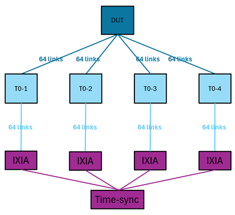

# SONiC Switch High-Scale IPv6 BGP Test

## Test Objective

This test verifies the scalability and stability of multiple BGP sessions on a SONiC switch. BGP sessions will be established between each Ethernet logical port of the DUT and its neighboring devices. The test evaluates the DUT’s ability to initiate and maintain BGP sessions, validates proper route learning, and measures BGP update convergence time under various conditions.

## Test Setup

This test is designed to be topology-independent, meaning it does not assume or enforce a specific network layout. The only requirement is that the DUT is fully connected to handle full traffic loads under stress. All logical Ethernet ports are utilized to establish BGP sessions. Assuming the DUT has X logical Ethernet ports and is connected to Y neighboring switches, we will establish X/Y BGP sessions between each neighbor and the DUT.

In the above example, the DUT has 256 logical Ethernet ports and is connected to 4 neighboring switches, we will establish 64 BGP sessions between each neighbor and the DUT.

## Test Steps

1. Assign a unique AS number to each of the five switches.

2. Between each of the four neighboring switches and the DUT: Configure X/Y BGP sessions. Each BGP session should have a dedicated pair of Ethernet ports (one on the DUT and the other on the neighboring device) whose IPv6 addresses are on the same subnet. Set up the BGP neighbors, device neighbors, and port IPv6 addresses for each BGP session.

3. Monitor the BGP session establishment on the DUT using command “show ipv6 bgp summary”. Ensure all X BGP sessions are established without errors.

4. In each neighboring switch: Configure a vlan,  assign 2500 IPv6 addresses with the specified prefix length and add all the Ethernet ports connected to IXIA to the vlan.

5. Monitor the BGP route learning on the DUT by running “show ipv6 route bgp”. Verify the DUT learns and installs all 10,000 routes.

6. Shut down one interface on the DUT. Wait till all routes advertised by the impacted BGP session are removed. Now bring up the interface and measure the time for BGP session and route reestablishment. Repeat this process and calculate the average update time of this scenario.

7. Stop the BGP container on the DUT. Wait till all BGP routes are removed. Now bring up the BGP container and measure the time for BGP session and route reestablishment. Repeat this process and calculate the average update time of this scenario.
