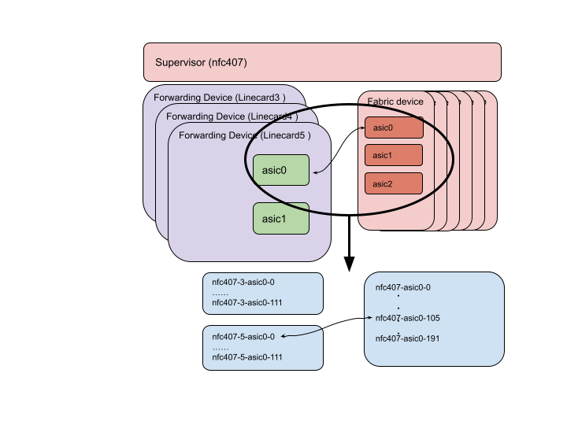

# **VOQ Chassis Fabric Test Plan**

 - [Introduction](#introduction)
   - [Scope](#scope)
   - [Assumptions](#assumptions)
   - [Test Setup](#test-setup)
 - [Test Cases](#test-cases)

# Introduction

This is the test plan for Fabric link testing on SONIC Distributed VOQ System, as described in the [VOQ Fabric HLD](https://github.com/sonic-net/SONiC/blob/master/doc/voq/fabric.md)

## Scope

The scope of this test plan is as follows:
* Check if all the expected fabric links are up.
* Check if the fabric counters work correctly when there is data traffic.
* Check if the fabric devices can reach all of the forwarding ASICs of the chassis (reachability)

The tests are expected to be done on Linecards and Fabriccards from supervisor.

## Assumptions

The current SW design for fabric does not cover events like card insertion/removal or reboots. This test plan depends on fabric counter cli support (work in progress).

## Test Setup

These test cases will be run in the proposed [T2 topology](https://github.com/sonic-net/sonic-mgmt/blob/master/ansible/vars/topo_t2.yml). It is assumed that such a configuration is deployed on the chassis.

These test cases will compare the following two sets of data on a chassis:
* Expected fabric link status
* Current fabric link status

The following section describes how to store and process the expected fabric link status for testing.



The above diagram illustrates an example system under test. Every forwarding ASIC is connected to every fabric ASIC.

The expected fabric link information is stored in seperate yaml files per SKU per slot. The filename is in the format of LinecardSKU_FabriccardSKU_LC<slotNumber>.yaml. In each file the information is stored per ASIC. An example is shown in the following table.

```
asic:
    link_id:
       peer asic: <asic id>
       peer lk: <link id>
       peer slot: <slot number>
```
This can be extended later for other fabric link related testing.

The files are stored in tests/voq/fabric_data, and only used by fabric testing right now. 

For example, Linecard3 Fap0 fabric serdes link 0 connects to Fabriccard3 FE0 serdes link 133 in a test system. The sku of Linecard 3 is 7800R3A-36D2-C72 and the sku of the Fabriccard is 7808R3A-FM. The information is stored in tests/voq/fabric_data/7800R3A-36D2-C72_7808R3A-FM_LC3.yaml:

```
asic0:               ----> Fap0
    0:               ----> serdes link 0 on Fap0
      peer asic: 0   ----> peer asic: Fe0
      peer lk: 133   ----> serdes 133 on Fe0
      peer slot: 3   ----> Fabriccard3
      ...
```

The voq tests read the information stored in these files as expected value to check the fabric link status of Linecards in a system.

As the fabric link connection information is huge and the connection from the Linecard side and Fabriccard side are the same, the information stored in the yaml files are from Linecards side of view only. When testing the supervisor(Fabriccards), the test creates a supReferenceData structure that stores fabric link information from the Fabriccard side of view while processing and testing Linecards. 

# Test Cases

## Test Case 1. Test Fabric connectivity

### Test Objective
Verify that when the chassis is up and running, the fabric links that are expected to be up are up.

### Test Steps
* For each ASIC in the chassis (across different duts), run `show fabric counters port` 

### Pass/Fail Criteria
* Verify for each ASIC, the number of links that are up matches the number of links per ASIC defined in the inventory. This is expected to be stored in the host_var attribute.

## Test Case 2. Test fabric reachability

### Test Objective
Verify that from each fabric ASIC, all forwarding ASICs are reachable.

### Test Steps
* Run `show fabric reachability -n asicN` for each fabric ASIC

### Pass/Fail Criteria
* Verify for each fabric ASIC, all the forwarding ASICs in the chassis are reachable and the switch ID matches the expected switch ID.

## Test Case 3. Test fabric counters under traffic

### Test Objective
Verify that under data traffic, all fabric links from an ASIC are utilized. The assumption is that the chassis architecture supports distributing data traffic across all fabric links.

Note that there may be some internal communication such as intra-chassis BGP, which means that the validation cannot strictly confirm exact match between ingress and egress traffic counts.
Instead, we will validate that the RX counts on the ASIC receiving traffic from the fabric are greater than or equal to the TX counts on the ASIC sending into the fabric.

### Test Steps
* Send a fixed number of packets traversing two ASICs
* Run `show fabric counters port -n asicN` for the ingress and egress ASIC.

Repeat the above test for the following packet sizes (bytes): 64, 256, 1512, 9000

### Pass/Fail Criteria
* Verify on the ingress ASIC that all fabric links have non-zero value for TX fabric data unit counter.
* Verify on the egress ASIC that all fabric links have non-zero value for RX fabric data unit counters.
* Verify that the RX fabric data unit counters are not less than the TX counters.
* Verify that there are no increments in error counters.
