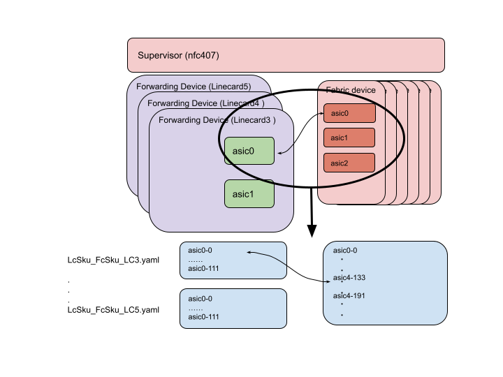

# **VOQ Chassis Fabric Test Plan**

 - [Introduction](#introduction)
   - [Scope](#scope)
   - [Assumptions](#assumptions)
   - [Test Setup](#test-setup)
 - [Test Cases](#test-cases)
     
# Introduction 

This is the test plan for Fabric link testing on SONIC Distributed VOQ System, as described in the [VOQ Fabric HLD](https://github.com/Azure/SONiC/blob/master/doc/voq/fabric.md)

## Scope

The scope of this test plan is as follows:
* Check if all the expected fabric links are up.
* Check if the fabric counters work correctly when there is data traffic.
* Check if the fabric devices can reach all of the forwarding ASICs of the chassis (reachability)

The tests are expected to be done on Linecards and Fabriccards from supervisor.

## Assumptions

The current SW design for fabric does not cover events like card insertion/removal or reboots. This test plan depends on fabric counter cli support (work in progress).

## Test Setup

These test cases will be run in the proposed [T2 topology](https://github.com/Azure/sonic-mgmt/blob/master/ansible/vars/topo_t2.yml). It is assumed that such a configuration is deployed on the chassis.

These test cases will compare the following two sets of data on a chassis:
* Expected fabric link status
* Current fabric link status

The following section describes how to store and process the expected fabric link status for testing.



The above diagram illustrates an example system under test. Every forwarding ASIC is connected to every fabric ASIC.

The expected fabric link status is stored in the last section of testbed.yaml file, which is called fabric_link_toplogy. This testbad.yaml file is generated dynamically when running the tests on a system. Each vendor provides their own expected fabric link information and stores in the format defined in the yaml file.  The expected status is provided per host and per ASIC, and the format is as follows:

```
host:
  asic:
      link_id:
         status: <connected/not_connected>
         peer_asic: <asic id>
         peer_id: <link id>
```
Initially, testbed.yaml will contain fabric link status, such as whether or not links are connected. In the future, this information may be extended to contain fabric link connection information.

In the above diagram, fabric link 105 on ASIC 0 of Fabric1 connects to fabric link 0 on ASIC 0 of Linecard5. The corresponding link status information as stored in testbed.yaml file will be encoded as follows:

```
# fabric_link_topology dictionary contains information about fabric serdes links
# topology (which fabric link is expected to be up etc.)
# fabric_link_topology is used to generate sonic_lab_fabric_links
# fabric_link_topology dictionary does not cross reference with other files 
fabric_link_topology:                      # source: sonic-mgmt/ansible/files/sonic_lab_fabric_links.csv
  nfc407-5:
     asic0:   
         0: 
           status: connected
           peer_asic: 0
           peer_id: 105
           ...
  ...
  nfc407:
     asic0:   
         ...
         105: 
           status: connected
           peer_asic: 0
           peer_id: 0
  ...
```

TestbedProcessing.py parses and processes the fabric_link_topology section and subsequently generates the output in files/sonic_lab_fabric_links.csv.

An excerpt of the generated output (/files/sonic_lab_fabric_links.csv) for the example link described earlier is as follows:

```
device,asic,link,status,peer_asic,peer_link
nfc407-5,0,0,connected,0,105
...
```

The VOQ tests use the information in files/sonic_lab_fabric_links.csv as the expected value to compare with the fabric link status on a system.

# Test Cases

## Test Case 1. Test Fabric connectivity

### Test Objective
Verify that when the chassis is up and running, the fabric links that are expected to be up are up.

### Test Steps
* For each ASIC in the chassis (across different duts), run `show fabric counters port -n <asic_name>` 

### Pass/Fail Criteria
* Verify for each ASIC, the number of links that are up matches the number of links per ASIC defined in the inventory. This is expected to be stored in the host_var attribute.

## Test Case 2. Test fabric reachability

### Test Objective
Verify that from each fabric ASIC, all forwarding ASICs are reachable.

### Test Steps
* Run `show fabric reachability -n asicN` for each fabric ASIC

### Pass/Fail Criteria
* Verify for each fabric ASIC, all the forwarding ASICs in the chassis are reachable and the switch ID matches the expected switch ID.

## Test Case 3. Test fabric counters under traffic

### Test Objective
Verify that under data traffic, all fabric links from an ASIC are utilized. The assumption is that the chassis architecture supports distributing data traffic across all fabric links. 

Note that there may be some internal communication such as intra-chassis BGP, which means that the validation cannot strictly confirm exact match between ingress and egress traffic counts.
Instead, we will validate that the RX counts on the ASIC receiving traffic from the fabric are greater than or equal to the TX counts on the ASIC sending into the fabric.

### Test Steps
* Send a fixed number of packets traversing two ASICs
* Run `show fabric counters port -n asicN` for the ingress and egress ASIC. 

Repeat the above test for the following packet sizes (bytes): 64, 256, 1512, 9000

### Pass/Fail Criteria
* Verify on the ingress ASIC that all fabric links have non-zero value for TX fabric data unit counter.
* Verify on the egress ASIC that all fabric links have non-zero value for RX fabric data unit counters.
* Verify that the RX fabric data unit counters are not less than the TX counters. 
* Verify that there are no increments in error counters.

