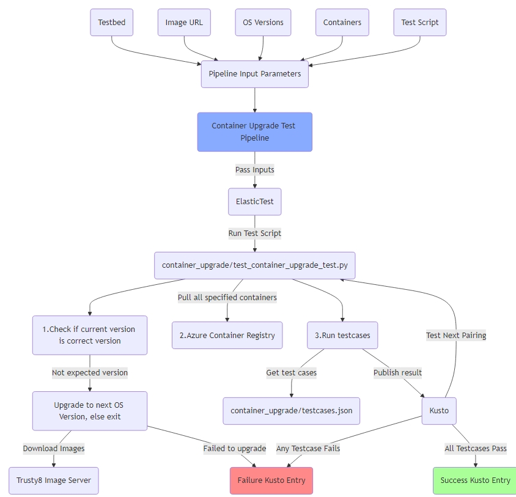

# SONiC Container Upgrade Nightly Test

- [Introduction](#introduction)
- [Scope](#scope)
- [Pipeline](#pipeline)
- [YAML](#yaml)
  - [Input Parameters](#input-parameters)
  - [Sample YAML](#sample-yaml)
- [Test](#test)
  - [Pytest](#pytest)
  - [Upgrading OS Versions](#upgrading-os-versions)
  - [Preparing Container for Test](#preparing-test-container)
  - [Sample parameters.json](#sample-parameters.json)
  - [Running Testcases](#running-test-cases)
  - [Sample testcases.json](#sample-testcases.json)
  - [Kusto Results](#kusto-results)
  - [Planned Minikube Enhancement](#minikube)
  - [Sample Template YAML](#sample-template-yaml)
- [Structure](#structure)
- [Future Optimizations](#future-optimizations)


## Introduction

With the introduction of KubeSONiC container upgrade, a feature that will support frequent rollouts of new versions of containers, there is a missing test gap between the expected behavior of running different versions of containers and the version running on the host. Up till now, container versions have always matched the version running on the host. With this new nightly test, we expect to bridge the test gap between different running versions of containers and the host to determine if it is safe to roll out such pairings. We will be able to test different OS version and container pairings on the same testbed. 

For each testplan, we will define the testbed, a list of OS Versions to be tested, where the first OS Version in the list is the base OS Version, and the bundle of containers that will be installed on each OS version.

For example, a testplan entry will look like (testbed-bjw-can-2700-2, "20240510.08|20240510.10|20240510.15|20240510.22|20241210.03", "docker-snmp:20240510.26|docker-sonic-telemetry:20240510.22|docker-sonic-gnmi:20240510.20"). This means that the following pairings will be executed on a single testbed in a single run of that testplan.

1. (testbed-bjw-can-2700-2, 20240510.08, docker-snmp:20240510.26|docker-sonic-telemetry:20240510.22|docker-sonic-gnmi:20240510.20)
2. (testbed-bjw-can-2700-2, 20240510.10, docker-snmp:20240510.26|docker-sonic-telemetry:20240510.22|docker-sonic-gnmi:20240510.20)
3. (testbed-bjw-can-2700-2, 20240510.15, docker-snmp:20240510.26|docker-sonic-telemetry:20240510.22|docker-sonic-gnmi:20240510.20)
4. (testbed-bjw-can-2700-2, 20240510.22, docker-snmp:20240510.26|docker-sonic-telemetry:20240510.22|docker-sonic-gnmi:20240510.20)
5. (testbed-bjw-can-2700-2, 20241210.03, docker-snmp:20240510.26|docker-sonic-telemetry:20240510.22|docker-sonic-gnmi:20240510.20)


## Scope

Establish a test plan that will be able to test different versions of containers running on different OS versions and run appropriate container testcases to verify that container and service is working as expected.


## Pipeline

We will accomplish this by:

- Creating a nightly test Azure Pipeline that will be able to run different host and container version pairings and then run appropriate testcases.

- Pipeline will take in inputs such as TESTBED_NAME, IMAGE_URL, IMAGE_URL_TEMPLATE, OSVERSIONS, CONTAINERS, MGMT_BRANCH, TEST_SCRIPTS, PARAMETERS_FILE, TESTCASE_FILE, MAX_RUN_TEST_MINUTES.

- Run test script using ElasticTest.

- Pull specified containers from Azure container registry and images from Trusty8 image server.

- For each specified pairing of OS version and containers, perform necessary upgrades and docker image installations, and run appropriate test cases.

- Publish test results to Kusto for each pairing.

## YAML

For our pipeline, we will create a YAML file "container_upgrade_test.yml". YAML file will take in a series of input parameters and run the test script using ElasticTest.

### Input Parameters

- **TESTBED_NAME**: Name of testbed to perform test on and lock.
  - Example: vms20-t0-7060
- **IMAGE_URL**: Base SONiC Image URL to download.
  - Example: http://10.201.148.43/pipelines/Networking-acs-buildimage-Official/broadcom/internal-202405/tagged/sonic-aboot-broadcom-20240510.10.swi
- **MGMT_BRANCH**: Branch to check out to run test script and test cases from
  - Example: internal-202405
- **SCRIPTS**: Scripts to be executed by ElasticTest
  - Default: container_upgrade/test_container_upgrade.py
- **SPECIFIC_PARAM**: Extra parameters to be used by test script
  - --containers: Container bundle to be installed on each OS version test run
    - Example: docker-snmp:20240510.26|docker-sonic-telemetry:20240510.22|docker-sonic-gnmi:20240510.20
  - --os_versions: OS Versions to be installed and tested on during this run
    - Example: 20240510.08|20240510.10|20240510.15|20240510.22|20241210.03
  - --image_url_template: Template URL that will be used by test script download the rest of the images.
    - Example: "http://10.201.148.43/pipelines/Networking-acs-buildimage-Official/broadcom/<osversion>/tagged/sonic-aboot-broadcom-<osversion>.swi"
  - --parameters_file: JSON file that will be used initally to fetch docker run parameters for docker pull/run, will later be replaced by YAML Template file to be used directly by miniKube.
    - Example: container_upgrade/parameters.json
  - --testcase_file: File that determines testcases to be executed after each OS version and docker images installations
    - Default: container_upgrade/testcases.json
  - Example: '[
      {"name": "container_upgrade/test_container_upgrade.py",
       "param: "--containers=docker-snmp:20240510.26|docker-sonic-telemetry:20240510.22|docker-sonic-gnmi:20240510.20 --os_versions=20240510.08|20240510.10|20240510.15|20240510.22|20241210.03 --image_url_template=http://10.201.148.43/pipelines/Networking-acs-buildimage-Official/broadcom/<osversion>/tagged/sonic-aboot-broadcom-<osversion>.swi --parameters_file=container_upgrade/parameters.json --testcase_file=container_upgrade/testcases.json"}
   ]'
- **MAX_RUN_TEST_MINUTES**: Timeout for test to finish
  - Example: 3600

### Sample YAML

```yaml
name: NightlyTest_$(Build.DefinitionName)_$(Build.BuildId)_$(Date:yyyyMMdd)$(Rev:.r)

trigger: none
pr: none


schedules:
  - cron: "0 4 * * 0,2,4"
    displayName: Nightly Scheduler
    branches:
      include:
        - internal
    always: true

resources:
  repositories:
    - repository: sonic-mgmt
      type: github
      name: sonic-net/sonic-mgmt
      ref: master
      endpoint: sonic-net

variables:
  - group: SONIC_IMAGE_URLS
  - group: SAITHRIFT_URLS


parameters:
  - name: TESTBED_NAME
    type: string
    default: "testbed-bjw-can-7260-8"
    displayName: "Testbed Name"

  - name: IMAGE_URL
    type: string
    default: $(BJW_IMAGE_BRCM_ABOOT_202405)
    displayName: "Image URL"

  - name: MGMT_BRANCH
    type: string
    default: internal-202405

  - name: SCRIPTS
    type: string
    default: "container_upgrade/test_container_upgrade.py"
    displayName: "Scripts to be executed"

  - name: COMMON_EXTRA_PARAMS
    type: string
    default: "--topology t0,any --py_saithrift_url=$(BJW_SAITHRIFT_BRCM_202405)"
    displayName: "Common test parameters"

  - name: SPECIFIC_PARAM
    type: string
    default: '[
      {"name": "container_upgrade/test_container_upgrade.py", "param: "--containers=docker-snmp:20240510.26|docker-sonic-telemetry:20240510.22|docker-sonic-gnmi:20240510.20 --os_versions=20240510.08|20240510.10|20240510.15|20240510.22|20241210.03 --image_url_template=http://10.201.148.43/pipelines/Networking-acs-buildimage-Official/broadcom/<osversion>/tagged/sonic-aboot-broadcom-<osversion>.swi --parameters_file=container_upgrade/parameters.json --testcase_file=container_upgrade/testcases.json"}
    ]'
    displayName: "Parameters to be used by test_container_upgrade.py"

  # Test timeout
  - name: MAX_RUN_TEST_MINUTES
    type: number
    default: 3600

stages:
- stage: Test

  variables:
    - group: SONiC-Elastictest

  jobs:
  - job:
    displayName: 7260cx.t0.202405.Container_Upgrade_Test.NightlyTest_by_Elastictest
    timeoutInMinutes: ${{ parameters.MAX_RUN_TEST_MINUTES }}
    continueOnError: false
    pool: sonic-ubuntu-1c
    steps:
    - template: ../../run-test-nightly-elastictest-template.yml
      parameters:
        TESTBED_NAME: ${{ parameters.TESTBED_NAME }}
        SCRIPTS: ${{ parameters.SCRIPTS }}
        COMMON_EXTRA_PARAMS: ${{ parameters.COMMON_EXTRA_PARAMS }}
        MGMT_BRANCH: ${{ parameters.MGMT_BRANCH }}
        MAX_RUN_TEST_MINUTES: ${{ parameters.MAX_RUN_TEST_MINUTES }}
        IMAGE_URL: ${{ parameters.IMAGE_URL }}
        SPECIFIC_PARAM: ${{ parameters.SPECIFIC_PARAM }}
        MIN_WORKER: 1
```

## Test

ElasticTest will run container_upgrade/test_container_upgrade_test.py that will take in specific params such as os_versions, containers, image_url, template file, and testcase file.


### Pytest

This pytest will be responsible for performing the following actions for each possible OS Version.

- **Pulling correct containers from docker registry**
- **Starting new container with pulled images with proper docker run parameters; start-up script in containers will stop old and remove old containers**
- **Reading testcase file and executing testcases listed**
- **Archive logs, collect result files, and publish test results to Kusto**
- **Upgrade to next image in iteration**


### Upgrading OS Versions

We will check if the current OS version is the expected OS version and if is not, we will upgrade. After each test, we will increment to the next OS version to be upgraded to. If we are unable to download the image or upgrade, we will publish failure entry in Kusto and then move on to the next image version.


### Preparing Containers for Test

We will docker pull the specified container images by specifying the container name, container version, and for some devices, the platform. After fetching the docker images, we will need to fetch the docker run parameters so that we run the container with the correct parameters. We will fetch these parameters from the parameters JSON file. The expectation is that these container images in their startup script, will stop and remove existing containers.

1. Pull specified containers

```
docker login {ACR_SERVER}
```

In the container string, we will split by '|', and for each pull the image.

```
docker pull {ACR_SERVER}/docker-sonic-telemetry:20240510.22-armhf
```

2. Retrieve docker run parameters for container from parameters file


3. Run new containers

```
docker run -d -privileged --pid=host --net=host -v /etc/localtime:/etc/localtime:ro -v /etc/sonic:/etc/sonic:ro --name docker-sonic-telemetry:container_test {ACR_SERVER}/docker-sonic-telemetry:internal-20240510.22-armhf
```

### Sample parameters.json

```json
{
  "docker-sonic-telemetry": {
    "parameters": "-privileged --pid=host --net=host -v /etc/localtime:/etc/localtime:ro -v /etc/sonic:/etc/sonic:ro"
  }
}
```

### Running Testcases

After upgrading to the next OS Version and pulling all containers, we will run all testcases in testcases.json.

After checking out the correct sonic-mgmt branch, we will call run_tests on each testcase in the file.

After run_tests has concluded for all tests, we will archive test result logs to build artifacts, and then publish results to Kusto, where we will create an entry in Kusto that has the testbed, OS version, container bundle, test result, and failing test cases if any.


### Sample testcases.json

We will have a source testcase file container_upgrade/testcases.json that will have a list of testcases to be executed. These testcases are not guaranteed to be in any order of execution regardless of order listed in the JSON.

```json
[
    telemetry/test_telemetry.py
    telemetry/test_telemetry_cert_rotation.py
    snmp/test_snmp_cpu.py
    snmp/test_snmp/default_route.py
    snmp/test_snmp_fdb.py
    snmp/test_snmp_interfaces.py
    snmp/test_snmp_link_local.py
    snmp/test_snmp_lldp.py
    snmp/test_snmp_loopback.py
    gnmi/test_gnmi.py
    gnmi/test_gnmi_appIdb.py
    gnmi/test_gnmi_configdb.py
    gnmi/test_gnmi_countersdb.py
    gnmi/test_gnoi_killprocess.py
]
```

### Kusto Results

Kusto entries will be published after each run and the schema for the Kusto entries are defined as:

```
.create table ContainerUpgradeTestResults (
    TestplanStartTime:  datetime, // Start time of when the testplan starts; Example: 2025-01-23T02:02:25Z
    UploadTimestamp:    datetime, // Time when entry is uploaded to Kusto; Example: 2025-01-23T23:21:37.868Z
    StartTime:          datetime, // Time of when the test cases for that pairing start; Example: 2025-01-23T20:51:17.060799Z
    EndTime:            datetime, // Time of when the test cases for that pairing finish; Example: 2025-01-23T20:52:06.203369Z
    AsicType:           string, // Asic Type; Example: broadcom
    HardwareSku:        string, // Hardware SKU; Example: Arista-7050CX3-32S-D48C8
    OSVersion:          string, // Current OS version that is being tested; Example: 20240510.23
    ContainerVersions:  string, // Container version bundle string that is being tested for this testplan; Example: docker-sonic-telemetry:20240510.26|docker-auditd:20240510.28
    Platform:           string, // Platform; Example: amd64
    Topology:           string, // Topology; Example: t0
    TestbedName:        string, // Testbed Name; Example: vms28-t0-7050-13
    BuildId:            string, // Id for testplan; Example: 6791bf37bf99d5a9384d5a00
    RunTime:            real, // Current runtime for testplan in minutes; 22.66
    Result:             string, // Success or Failure for testcase runs; Example: failure
    Summary:            string, // Additional details about potential errors or failures that occurred
    TestBranch:         string, // Mgmt branch checked out for test run; Example: internal-202405
    FailingTestCases:   dynamic, // List of failed testcases; Example: [telemetry.test_telemetry_cert_rotation.test_telemetry_cert_rotate, telemetry.test_telemetry_cert_rotation.test_telemetry_post_cert_add]
    Pipeline:           string // URL of ElasticTest run
)
```

### Planned Minikube Enhancement

As part of an effort to achieve better test coverage of integration test with KubeSONiC feature, we can utilize Minikube.

With this enhancement we can:

1. Simplify the pulling and running of docker containers by using kubectl command and template file directly.
2. Verify template files that will be utilized in production are correct and have no bugs or syntax issues.
3. Ensure that Minikube can pull the correct docker images and run them with correct parameters as listed in the template file.

Needed changes in pipeline and test script:

1. We will no longer take in or use a PARAMETERS_FILE, but instead will take in and use a TEMPLATE_FILE which will be the template YAML file that defines the daemonset manifest.
2. This template file will be hosted in the sonic-k8s-operator repo which will be a submodule in the sonic-mgmt-int repository for test to use and will be passed directly to miniKube after providing the needed values.
3. Download, install, and start Minikube on calling test management server if needed.
4. Ensure kubelet config is correct.
5. Create correct daemonset from template file passed to test script and deploy it.
6. Fetch certs for DUT to be able to join Minikube.
7. Ensure Minikube config is correct.
8. Create docker registry secret for miniKube to use when pulling from SONiC ACR.
9. Use Minikube to pull docker image from container registry and run docker container.

### Sample Template YAML

```yaml
apiVersion: apps/v1
kind: DaemonSet
metadata:
  name: {{.Name}}
  namespace: {{.Namespace}}
  annotations:
    rollingupdate.daemonset.sonic/max-unavailable: 25%
    deployment.daemonset.sonic/rollback-enabled: "true"
    deployment.daemonset.sonic/created-by-template: "true"
    daemonset.sonic/device-type: {{.DeviceType}}
    daemonset.sonic/region: {{.Region}}
    daemonset.sonic/availabilityzone: {{.Az}}
spec:
  template:
    metadata:
      labels:
        name: {{.DaemonSetName}}
        worker.sonic/region: {{.Region}}
        worker.sonic/device-type: {{.DeviceType}}
        worker.sonic/availabilityzone: {{.Az}}
      annotations:
        hook.daemonset.sonic/hook-checker-enabled: "true"
    spec:
      hostname: sonic
      hostNetwork: true
      hostPID: true
      imagePullSecrets:
        - name: {{.ImagePullSecretName}}
      containers:
      - name: dummyk8s
        image: {{.DummyImageName}}:{{.DummyImageVersion}}
        tty: true
        env:
        - name: IMAGE_VERSION
          value: "{{.DummyImageVersion}}.kube"
        - name: RUNTIME_OWNER
          value: "kube"
        securityContext:
          privileged: false
        volumeMounts:
        - name: sonic
          mountPath: /etc/sonic
          readOnly: true
        - name: dbus
          mountPath: /var/run/dbus
          readOnly: false
        - name: redis
          mountPath: /var/run/redis
          readOnly: false
        - name: redis-chassis
          mountPath: /var/run/redis-chassis
          readOnly: true
        imagePullPolicy: IfNotPresent
        readinessProbe:
          exec:
            command:
            - /bin/bash
            - /usr/bin/readiness_probe.sh
          initialDelaySeconds: 5
          periodSeconds: 10
      - name: auditd
        image: {{.AuditdImageName}}:{{.AuditdImageVersion}}
        tty: true
        env:
        - name: IMAGE_VERSION
          value: "{{.AuditdImageVersion}}.kube"
        - name: RUNTIME_OWNER
          value: "kube"
        securityContext:
          privileged: true
        volumeMounts:
        - name: sonic
          mountPath: /etc/sonic
          readOnly: true
        - name: dbus
          mountPath: /var/run/dbus
          readOnly: false
        - name: redis
          mountPath: /var/run/redis
          readOnly: false
        - name: redis-chassis
          mountPath: /var/run/redis-chassis
          readOnly: true
        - name: lib-systemd-system
          mountPath: /lib/systemd/system
          readOnly: false
        - name: etc-audit
          mountPath: /etc/audit
          readOnly: false
        imagePullPolicy: IfNotPresent
        readinessProbe:
          exec:
            command:
            - /bin/bash
            - /usr/bin/readiness_probe.sh
          initialDelaySeconds: 5
          periodSeconds: 10
      volumes:
      - name: sonic
        hostPath:
          path: /etc/sonic
      - name: dbus
        hostPath:
          path: /var/run/dbus
      - name: redis
        hostPath:
          path: /var/run/redis
      - name: redis-chassis
        hostPath:
          path: /var/run/redis-chassis
      - name: lib-systemd-system
        hostPath:
          path: /lib/systemd/system
      - name: etc-audit
        hostPath:
          path: /etc/audit
      nodeSelector:
        worker.sonic/region: {{.Region}}
        worker.sonic/device-type: {{.DeviceType}}
        worker.sonic/availabilityzone: {{.Az}}
  selector:
    matchLabels:
      name: {{.DaemonSetName}}     
      worker.sonic/region: {{.Region}}
      worker.sonic/device-type: {{.DeviceType}}
      worker.sonic/availabilityzone: {{.Az}}
  updateStrategy:
    type: OnDelete
```


# Structure



# Future Optimizations

1. Support multiple testbeds being able to run different OS version and container pairings.
2. Support multiple testbeds being able to run subset of testcases with the same OS version and container pairing.
