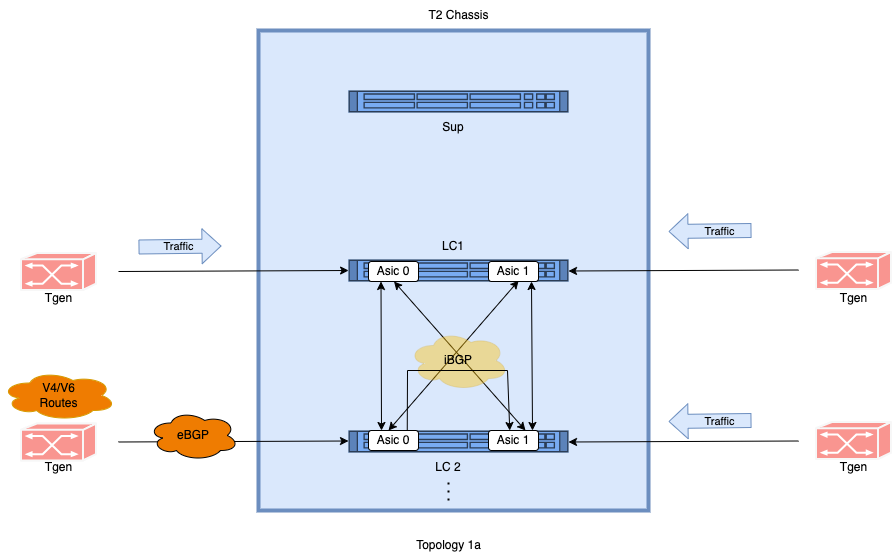
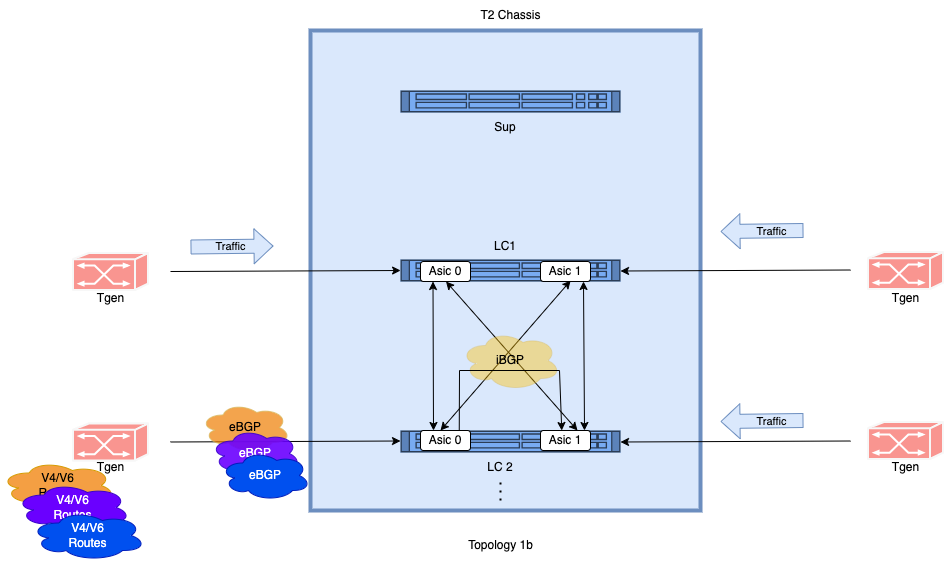
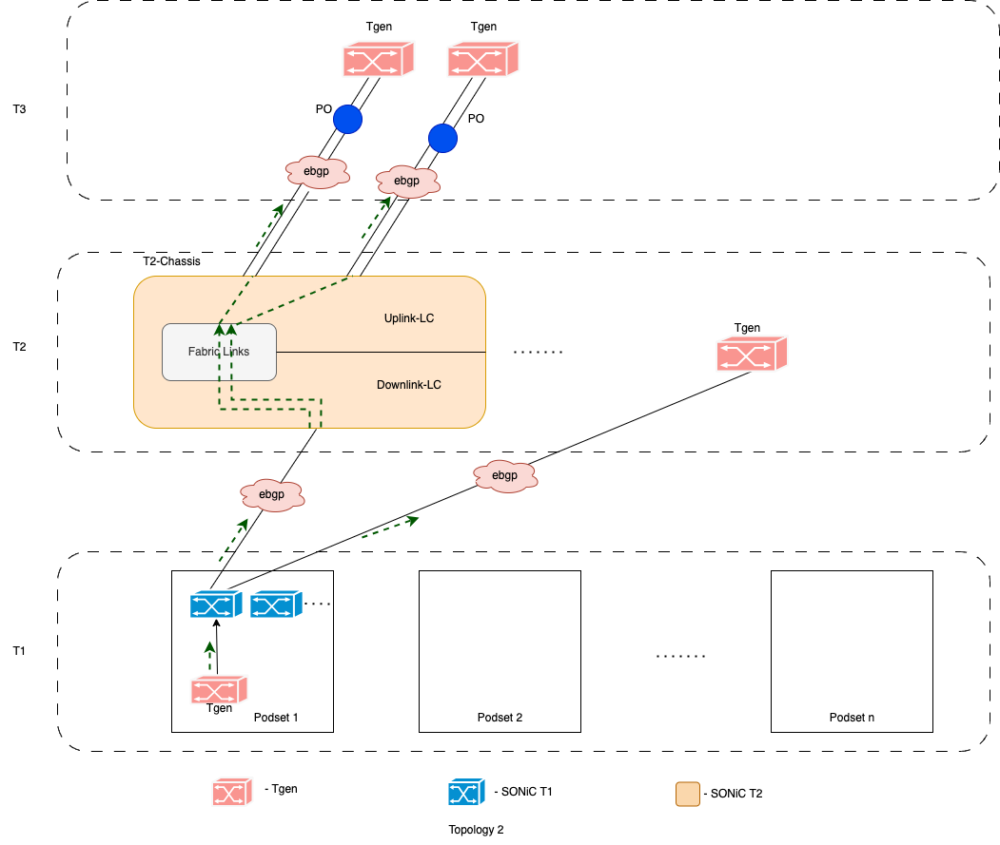
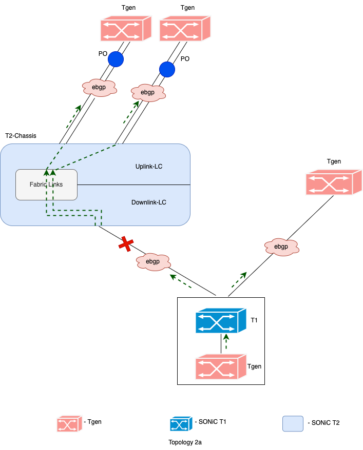
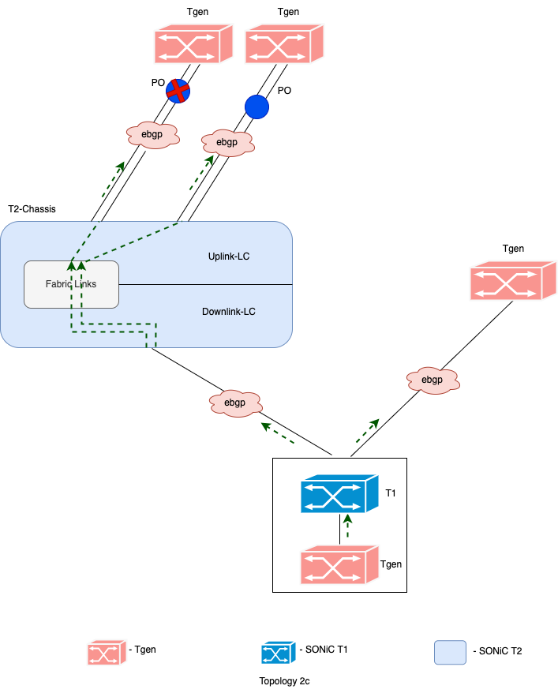
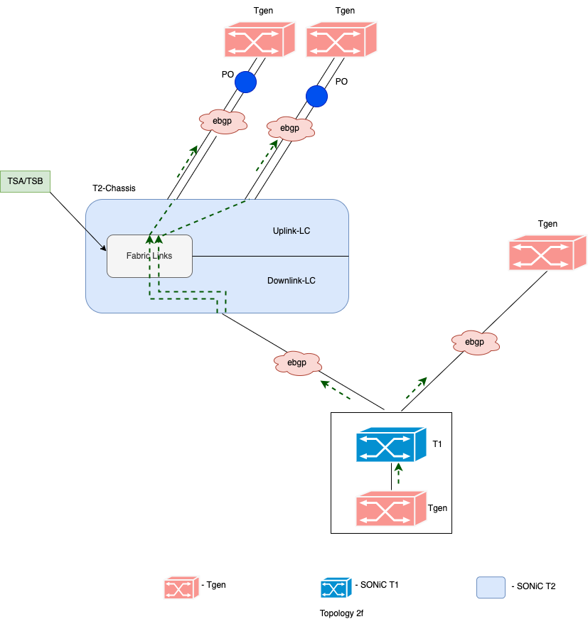
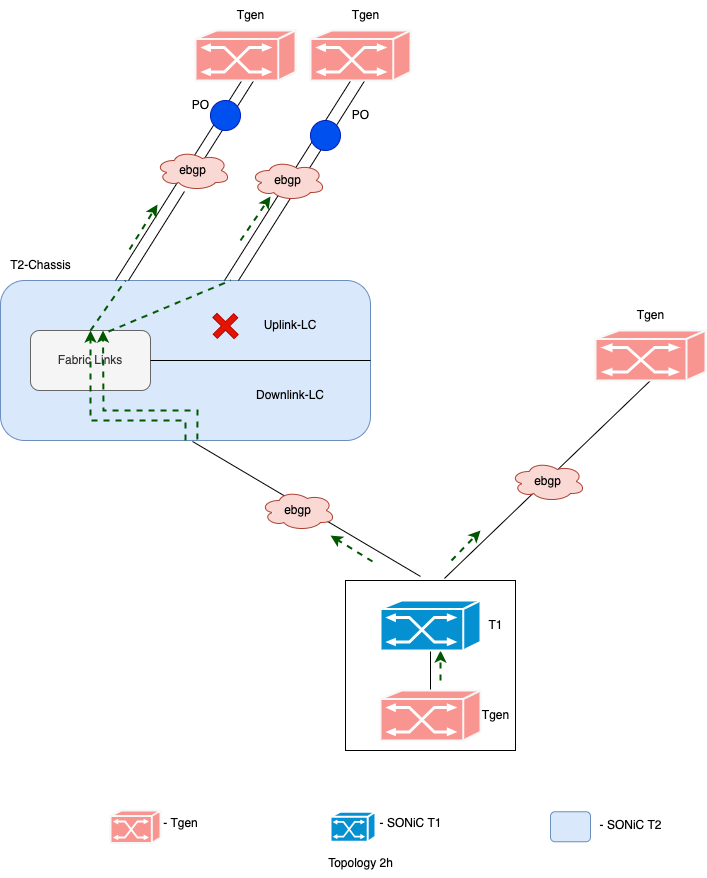
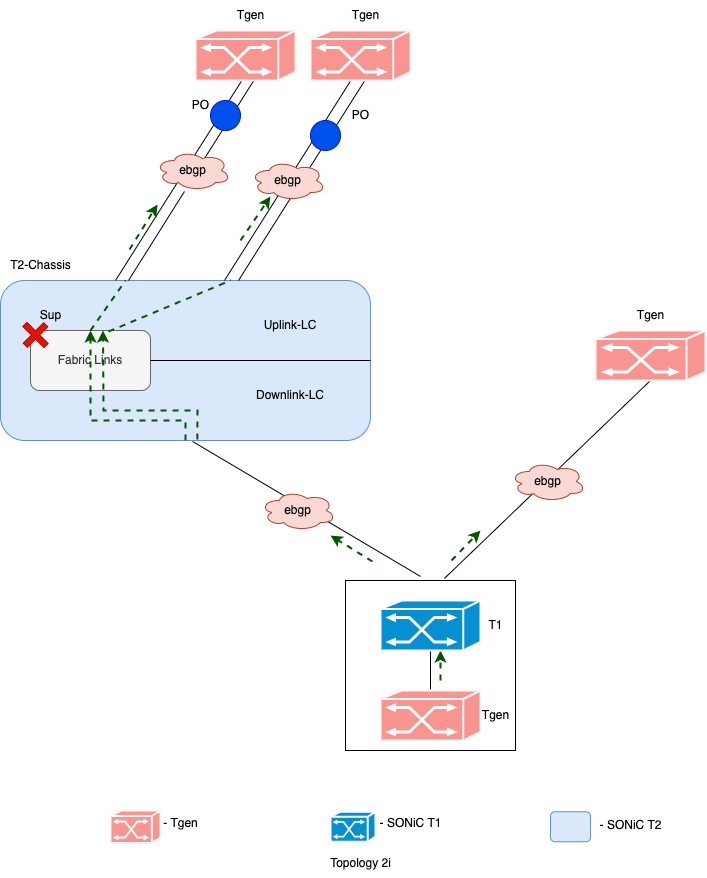
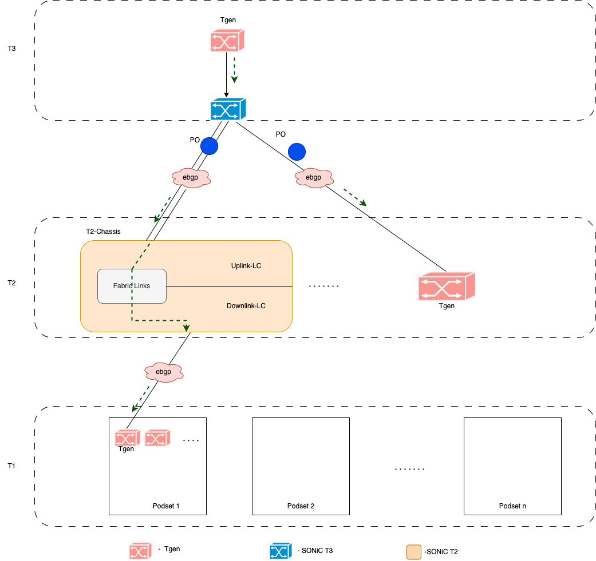

# Convergence measurement in data center networks
  - [Authors: Kamal Sahu, Keysight Techonologies & 
              Deepak Singhal, Microsoft Technologies]
  - [Objective](#objective)
    - [Scope](#scope)
    - [Overview](#overview)
  - [Unplanned Events](#unplanned-events)
    - [Link Failures (Uplink/Downlink):](#link-failures-uplinkdownlink)
    - [eBGP Session Flaps:](#ebgp-session-flaps)
    - [Process Crash:](#process-crash)
    - [Linecard Ungraceful Restarts:](#linecard-ungraceful-restarts)
    - [Supervisor Ungraceful Restart:](#supervisor-ungraceful-restart)
  - [Planned Events](#planned-events)
    - [TSA/TSB (Traffic Shift Away/Traffic Shift Back) of T2 Device:](#tsatsb-traffic-shift-awaytraffic-shift-back-of-t2-device)
  - [SONiC Architecture for T2 Data Centers:](#sonic-architecture-for-t2-data-centers)
  - [Testbed](#testbed)
      - [Route Performance Topology](#route-performance-topology)
      - [Setup Configuration](#setup-configuration)
      - [Test Methodology](#test-methodology)
      - [Test Setup](#test-setup)
        - [Test case # 1.1: Measure the convergence time it takes to install the routes in asics and to forward the traffic after advertising the prefixes/routes](#test-case--11)
        - [Test case # 1.2: Measure the convergence time it takes to delete the routes in asics after withdrawing the prefixes/routes](#test-case--12)
        - [Test case # 1.3: Measure the convergence time it takes to install the routes in asics from multiple sessions or hosts and to forward the traffic after advertising the prefixes/routes](#test-case--13)
        - [Test case # 1.4: Measure the convergence time it takes to delete the routes in asics from multiple sessions after withdrawing the prefixes/routes](#test-case--14)
      - [Outbound Traffic Topology](#outbound-traffic-topology)
      - [Setup Configuration](#setup-configuration-1)
      - [Test Methodology](#test-methodology-1)
      - [Test Setup](#test-setup-1)
        - [Test case # 2.1: Measure the convergence time it takes to redirect the traffic to remaining T2 devices when the link between T1 and T2 goes down](#test-case--21)
        - [Test case # 2.2: Measure the convergence time it takes to load balance the traffic once the link between T1 and T2 comes back up](#test-case--22)
        - [Test case # 2.3: Measure the convergence time when one of the active member of portchannel goes down](#test-case--23)
        - [Test case # 2.4: Measure the convergence time when the portchannel goes down](#test-case--24)
        - [Test case # 2.5: Measure the convergence time when the portchannel comes back up](#test-case--25)
        - [Test case # 2.6: Measure the convergence time when the uplink LC goes down](#test-case--26)
        - [Test case # 2.7: Measure the convergence time when the downlink LC goes down](#test-case--27)
        - [Test case # 2.8: Measure the convergence time when TSA/TSB(Traffic shit A/Traffic shift B) is performed on T2 chassis](#test-case--28)
        - [Test case # 2.9: Measure the convergence time during ungraceful restart of downlink linecard](#test-case--29)
        - [Test case # 2.10: Measure the convergence time during ungraceful restart of uplink linecard](#test-case--210)
        - [Test case # 2.11: Measure the convergence time during ungraceful restart of supervisor on T2 chassis](#test-case--211)
      - [Inbound Traffic Topology](#inbound-traffic-topology)
      - [Hardware](#hardware)

## Objective
In a data center environment using SONiC (Software for Open Networking in the Cloud), convergence refers to the process by which the network adapts to changes in topology, link states, trigger events or routing information. Achieving fast convergence is critical to ensure that the network can quickly recover from failures or topology changes without impacting services.

### Scope
These tests are targeted on fully functioning SONiC data center networks. Will cover route performance measurements for both IPv4 and IPv6 prefixes and also measure convergence for various triggers generated in data center networks.

### Overview
In a Tier 2 (T2) data center network environment, route performance and convergence are critical factors that directly impact network availability, resiliency, and overall service delivery. Both unplanned and planned events can trigger changes in the network topology or routing information, necessitating rapid convergence to minimize service disruptions. Let's examine how route performance and convergence play a key role in handling various triggers:

### Unplanned Events:
- #### Link Failures (Uplink/Downlink):
  - Route convergence is crucial to reroute traffic away from failed links promptly.
  - Fast detection and reconfiguration of affected routes ensure minimal impact on network performance and availability.
- #### eBGP Session Flaps:
  - Flapping BGP sessions can lead to instability in routing tables.
  - Efficient route convergence mechanisms help stabilize BGP routing tables quickly to maintain consistent routing paths.
- #### Process Crash:
  - When critical routing processes crash, it can disrupt route calculation and distribution.
  - Rapid process recovery and route re-computation are essential to restore network stability and maintain service continuity.
- #### Linecard Ungraceful Restarts:
  - Ungraceful restarts of line cards can result in temporary loss of routing information.
  - Fast convergence ensures that alternative routes are quickly activated to restore connectivity and minimize downtime.
- #### Supervisor Ungraceful Restart:
  - Ungraceful restarts of network supervisors can lead to temporary loss of control plane functionality.
  - Efficient convergence mechanisms ensure rapid recovery of control plane operations and restoration of routing services.

### Planned Events:
- #### TSA/TSB (Traffic Shift Away/Traffic Shift Back) of T2 Device:
  - Isolating a T2 device for maintenance requires careful planning to prevent service disruptions.
  - Updating route-maps to reroute traffic away from the isolated device enables maintenance activities without impacting service availability.
  - Route convergence mechanisms help redistribute traffic flows seamlessly during the maintenance window.

In summary, efficient route performance and convergence mechanisms are essential for mitigating the impact of both unplanned and planned events in a Tier 2 data center network. By promptly detecting and responding to changes in the network topology or routing state, organizations can ensure high availability, resiliency, and consistent service delivery to their users.

### SONiC Architecture for T2 Data Centers:

Follows a disaggregated model with no centralized control plane.
Each linecard operates its own SONiC instance.
Multiasic linecards have multiple SONiC instances managing ASICs routes.
Routes learned by each linecard are shared with every other linecard via iBGP sessions using inBand ports (Each ASIC has a designated port for this communication).
Consequently, there are multiple snapshots of routes, each residing on a separate ASIC or linecard.

Considering this design, triggers within a chassis could lead to route churn across linecards, potentially impacting route consistency.

### Testbed

### Route Performance Topology

  
  

### Setup Configuration

T2 chassis with multiple LCs(Linecards). Each LC is having 2 asics.  
Tgen ports can be connected to any LC and any asic.  
EBGP session/sessions will be configured between Tgen port and one of the DUT port.   
Routes will be advertised/withdrawn from that eBGP session to the DUT.  
Traffic will be sent from remaining tgen ports to the routes which are being advertised.   

### Test Methodology

Intially routes will not be advertised and while sending traffic, no packets will be received.   
Advertise the routes and measure the time it takes to install the routes in its asic table and to forward the traffic.   
Convergence time should be measured from the instance routes are advertised and when the traffic is receiving at full transmitting rate.  
Similarly, withdraw the routes and measure the time it takes to delete the routes from DUT asics.   
In order to measure the time it takes to delete the routes from asics after routes withdraw, we have to consider the time when it starts withdrawing the routes and when the traffic receiving rate goes to 0%.  
Differnet v4 and v6 prefix combinations will be tried for Route advertise/withdraw convergence numbers. (Ports can be connected to single asic same LC, different asic same LC, different asic different LCs.)  
Same test can be expanded to multiple sessions on single port or if multiple tgen ports are available, we can have single session on each tgen port. 
For Keysight automated cases, we will be using readily available CP/DP convergence time stat to measure Convergence.

### Test Setup
  - T2 chassis with 2 LCs(Linecards). Each LC is having 2 asics.                            
  - Tgen ports will be connected to all 4 asics. User will have the option to select LC and asic. 
  - EBGP session will be configured between desired tgen port and DUT with required number of prefixes.

### Test Case # 1.1

|    ****Test Name****  &nbsp;| **Measure the convergence time it takes to install the routes in asics and to forward the traffic after advertising the prefixes/routes.**|
|    -------------------      | :--------------------------------------- |
|     **Type**                | **Route Performance**                    |
|     **Topology**             | **Topology 1a**                           |
| **Test Steps**           | 1. Send traffic from tgen ports to the port where BGP prefixes are configured. 2. Intially traffic won't be flowing as routes/prefixes are not yet advertised. 3. Advertise the routes and measure the time it takes from advertising the routes till the time traffic is received without any packet loss. 4. Repeat the same test for incremental route advertisement for both IPv4 and IPv6 prefixes. 5. With this method, we can gauge the DUT's maximum capacity to install prefixes in its table and forward traffic without experiencing any loss.   |

### Test Case # 1.2

| **Test Name** &nbsp;      | **Measure the convergence time it takes to delete the routes in asics after withdrawing the prefixes/routes.**                          |
| ------------------- | :--------------------------------------- |
| **Type**            | **Route Performance**                    |    
| **Topology**        | **Topology 1a**                           |                     
| **Test Steps**      | 1. Send traffic from tgen ports to the port where BGP prefixes are configured by advertising the routes. 2. Traffic will be forwarded/received at transmitted rate without any loss. 3. Withdraw the routes and measure the time it takes from withdrawing the routes till the time no traffic is received. 4. Repeat the same test for incremental route advertisement for both IPv4 and IPv6 prefixes. |

### Test Case # 1.3

| **Test Name**    &nbsp;   | **Measure the convergence time it takes to install the routes in asics from multiple sessions or hosts and to forward the traffic after advertising the prefixes/routes.**        |                              
| ------------------- | :--------------------------------------- |
| **Type**            | **Route Performance**                    |
| **Topology**        | **Topology 1b**                           |
| **Test Steps**      | 1. Send traffic from tgen ports to the port where BGP prefixes are configured. 2. Intially traffic won't be flowing as routes/prefixes are not yet advertised. 3. Advertise the routes and measure the time it takes from advertising the routes till the time traffic is received without any packet loss. 4. Repeat the same test for incremental route advertisement for both IPv4 and IPv6 prefixes. 5. With this method, we can gauge the DUT's maximum capacity to install prefixes in its table and forward traffic without experiencing any loss.   |

### Test Case # 1.4

| **Test Name** &nbsp;      | **Measure the convergence time it takes to delete the routes in asics from multiple sessions after withdrawing the prefixes/routes.**                    |
| ------------------- | :--------------------------------------- |
| **Type**            | **Route Performance**                    |   
| **Topology**        | **Topology 1b**                           |                               
| **Test Steps**      | 1. Send traffic from tgen ports to the port/ports where BGP prefixes are configured by advertising the routes. 2. Traffic will be forwarded/received at transmitted rate without any loss. 3. Withdraw the routes and measure the time it takes from withdrawing the routes till the time no traffic is received. 4. Repeat the same test for incremental route advertisement for both IPv4 and IPv6 prefixes. |

### Outbound Traffic Topology

  

### Setup Configuration

T2 device with 2 Linecards(one for uplink and one for downlink). 
One neighboring device to simulate T1 neighbor. 
Four tgen ports. 
- 2 tgen ports to simulate T3 neighbors. 
- 1 tgen port to generate host traffic.  
- 1 tgen port to simulate additonal T2 device. 

EBGP sessions configured between T3 neighbors and T2 device and routes are learned on T2. 
EBGP sessions between T2 and T1 neighbor is formed. 
Another EBGP session between T1 and simulated T2 device is formed. 
Same routes will be advertised from the simulated T3 and T2 tgen ports.  
Effectively, on T1 routes are learned from 2 peers and forms ECMP.

### Test Methodology

Fixed duration server traffic is generated for a bunch of destination prefixes, which will load balance by T1 towards its peers. 
During normal conditions, all the traffic should be received by tgen ports without experiencing any loss. 
Different triggers(planned/unplanned) mentioned above are performed at different layers (T1/T2/T3) and total packets lost are measured.  
For Keysight automated cases, we will be measuring convergence using "Packet Loss Duration (PLD)" stat, which will be default convergence measurement. To measure the flow which is having high convergence value, flow tracking will be used. Note, this will be limited by the tracking limit depending on hardware which is being used.

### Test Setup
1. T2 chassis with 2 LCs(Linecards). Each LC is having 2 asics.                            
2. Tgen ports will be connected to the uplink LC on a port channel with two members and eBGP configuration will be established between them. 
3. eBGP session will be configured between T1 and downlink T2 device. Also, eBGP session will be established between T1 and simulated T2 tgen port.
4. Same prefixes will be advertised from all the tgen ports connected to T1 and T2 devices.
5. T1 device will learn the routes from all eBGP neighbors and uses ECMP to forward traffic. 

### Test Case # 2.1

  

| **Test Name** &nbsp;      | **Measure the convergence time it takes to redirect the traffic to remaining T2 devices when the link between T1 and T2 goes down.**                         |
| ------------------- | :--------------------------------------- |
| **Topology**        | **Topology 2a**                          |   
| **Type**            | **Scalability and Performance**          |
| **Traffic**         | **Outbound**                             |
| **Test Steps**      | 1. Send traffic from server port(tgen) connected to T1 to the eBGP prefixes . 2. Traffic will be equally distributed between the available paths. 3. Cut down the link between T1 and T2 device and see that T1 quickly detects it and forwards the traffic to other available path. 4. Measure the time it takes to converge the traffic to other available path without any loss. |

### Test Case # 2.2

| **Test Name** &nbsp;      | **Measure the convergence time it takes to load balance the traffic once the link between T1 and T2 comes back up.**                         |
| ------------------- | :--------------------------------------- |
| **Topology**        | **Topology 2a**                          |   
| **Type**            | **Scalability and Performance**          |
| **Traffic**         | **Outbound**                             |
| **Test Steps**      | 1. Send traffic from server port(tgen) connected to T1 to the eBGP prefixes. 2. Traffic will be equally distributed between the available paths. 3. Cut down the link between T1 and T2 device and see that T1 quickly detects it and forwards the traffic to other available path. 4. Measure the time it takes to converge the traffic to other available path without any loss. 5. Generally there shouldn't be any impact on traffic as it is using other avialable paths to forward traffic. Once the new path is available, it will use that path also to forward the traffic. |

### Test Case # 2.3

  

| **Test Name** &nbsp;      | **Measure the convergence time when one of the active member of portchannel goes down.**                         |
| ------------------- | :--------------------------------------- |
| **Topology**        | **Topology 2b**                          | 
| **Type**            | **Scalability and Performance**          |
| **Traffic**         | **Outbound**                             |
| **Test Steps**      | 1. Send traffic from server port(tgen) connected to T1 to the eBGP prefixes. 2. Traffic will be equally distributed between the available paths. 3. Cut down one of the active member(tgen port) of portchannel. 4. Uplink linecard will update its PO active members. 5. Downlink linecards will update the information as well (since egress resolution in VOQ chassis happens on LC receiving traffic). 6. Minimal traffic impact might happen till step 5 is completed(Downlink linecards might keep hashing outbound traffic towards inactive PO member). 7. Measure the time it takes to converge the traffic to other available path without any loss. |

### Test Case # 2.4

  

| **Test Name** &nbsp;      | **Measure the convergence time when the portchannel goes down.**                         |
| ------------------- | :--------------------------------------- |
| **Topology**        | **Topology 2c**                          | 
| **Type**            | **Scalability and Performance**          |
| **Traffic**         | **Outbound**                             |
| **Test Steps**      | 1. Send traffic from server port(tgen) connected to T1 to the eBGP prefixes. 2. Traffic will be equally distributed between the available paths. 3. Bring down the portchannel. 4. Uplink linecard will update its ECMP path immediately(Link down event processing). 5. Remote linecards will also update its ECMP path upon receiving SYSTEM_PORT down notification. 6. Measure the time it takes to converge the traffic to otheravailable path without any loss. |

### Test Case # 2.5

| **Test Name**  &nbsp;     | **Measure the convergence time when the portchannel comes back up.**                         |
| ------------------- | :--------------------------------------- |
| **Topology**        | **Topology 2c**                          | 
| **Type**            | **Scalability and Performance**          |
| **Traffic**         | **Outbound**                             |
| **Test Steps**      | 1. Send traffic from server port(tgen) connected to T1 to the eBGP prefixes. 2. Traffic will be equally distributed between the available paths. 3. Bring the portchannel back up. 4. Uplink linecard will from ebgp session and routes will be learned and ECMP paths will be updated. 5. Above information will be propagated to downlink linecards as well. 6. Measure the time it takes to converge the traffic to other available path without any loss. 7. Generally there should not be any traffic impact as the downlink linecards keep forwarding traffic via the available ECMP paths. Once the new path is updated, it will use that path also to forward the traffic.|

### Test Case # 2.6

  

| **Test Name** &nbsp;      | **Measure the convergence time when processes of uplink LC goes down.**                         |
| ------------------- | :--------------------------------------- |
| **Topology**        | **Topology 2d**                          | 
| **Type**            | **Scalability and Performance**          |
| **Traffic**         | **Outbound**                             |
| **Test Steps**      | 1. Send traffic from server port(tgen) connected to T1 to the eBGP prefixes. 2. Traffic will be equally distributed between the available paths. 3. Bring the processes of uplink linecard down(syncd, swss and bgpd) one after another and measure convergence. 4. iBGP holddown timer between uplink and downlink linecards will expire. 5. Downlink linecard will delete/update the routes coming from the uplink LC. 6. Downlink linecards will update it ASIC table and withdraw routes which are learned from uplink LC. 7. T1 will redirect the traffic to other T2 devices. 8. Measure the time it takes to converge the traffic to other available path without any loss. |

### Test Case # 2.7

  

| **Test Name** &nbsp;      | **Measure the convergence time when processes of downlink LC goes down.**                         |
| ------------------- | :--------------------------------------- |
| **Topology**        | **Topology 2e**                          | 
| **Type**            | **Scalability and Performance**          |
| **Traffic**         | **Outbound**                             |
| **Test Steps**      | 1. Send traffic from server port(tgen) connected to T1 to the eBGP prefixes. 2. Traffic will be equally distributed between the available paths. 3. Bring the processes of downlink linecard down(syncd, swss and bgpd). 4. T1 will detect that and redirect the traffic to other T2 devices. 5. Measure the time it takes to converge the traffic to other available path without any loss. |

### Test Case # 2.8

  

| **Test Name** &nbsp;      | **Maeasure the convergence time when TSA/TSB(Traffic shit Away/Traffic shift Back) is performed on T2 chassis.**                         |
| ------------------- | :--------------------------------------- |
| **Topology**        | **Topology 2f**                          | 
| **Type**            | **Scalability and Performance**          |
| **Traffic**         | **Outbound**                             |
| **Test Steps**      | 1. Send traffic from server port(tgen) connected to T1 to the eBGP prefixes. 2. Traffic will be equally distributed between the available paths. 3. Perform TSA/TSB by updating the routemaps on chassis. 4. T1 will detect that and redirect the traffic to other T2 devices. 5. Measure the time it takes to converge the traffic to other available path without any loss. 6. Repeat step 3 by performing TSA/TSB on individual LCs and measure convergence. |

### Test Case # 2.9

  

| **Test Name**  &nbsp;     | **Measure the convergence time during ungraceful restart of downlink linecard.**                         |
| ------------------- | :--------------------------------------- |
| **Topology**        | **Topology 2g**                          | 
| **Type**            | **Scalability and Performance**          |
| **Traffic**         | **Outbound**                             |
| **Test Steps**      | 1. Send traffic from server port(tgen) connected to T1 to the eBGP prefixes. 2. Traffic will be equally distributed between the available paths. 3. Use command (nohup bash -c "sleep 5 && echo c > /proc/sysrq-trigger" &) to create panic on the downlink line card. 4. Without TSA/TSB service, there might be traffic loss when the LC is coming up. It may advertise routes befor installing it in the ASIC. 5. With TSA/TSB service, it should not see any loss. 6. Measure the time it takes to converge the traffic to other available path without any loss.

### Test Case # 2.10
            

  

| **Test Name** &nbsp;      | **Measure the convergence time during ungraceful restart of uplink linecard.**                         |
| ------------------- | :--------------------------------------- |
| **Topology**        | **Topology 2h**                          | 
| **Type**            | **Scalability and Performance**          |
| **Traffic**         | **Outbound**                             |
| **Test Steps**      | 1. Send traffic from server port(tgen) connected to T1 to the eBGP prefixes. 2. Traffic will be equally distributed between the available paths. 3. Use command (nohup bash -c "sleep 5 && echo c > /proc/sysrq-trigger" &) to create panic on the uplink line card. 4. Without TSA/TSB service, there might be traffic loss when the LC is going down till iBGP timer expiry and when the LC is coming up(It may advertise routes befor installing it in the ASIC). 5. With TSA/TSB service, there might be traffic loss when the LC is going down till iBGP timer expiry and when LC is coming up, it should not see any loss. 6. Measure the time it takes to converge the traffic to other available path without any loss.

### Test Case # 2.11

  

| **Test Name** &nbsp;      | **Measure the convergence time during ungraceful restart of supervisor on T2 chassis.**                         |
| ------------------- | :--------------------------------------- |
| **Topology**        | **Topology 2i**                          |
| **Type**            | **Scalability and Performance**                    |
| **Traffic**         | **Outbound**                             |
| **Test Steps**      | 1. Send traffic from server port(tgen) connected to T1 to the eBGP prefixes. 2. Traffic will be equally distributed between the available paths. 3. Ungracefully restart the supervisor. 4. Without TSA/TSB service, LCs go down gracefully(external links shutdown) on LCs before fabric links reset on Sup. So, no traffic loss while going down but might see loss during LCs coming up. 5. With TSA/TSB service, there might be traffic loss when the LC is going down till iBGP timer expiry and when LC is coming up, it should not see any loss. 6. Measure the time it takes to converge the traffic to other available path without any loss.

### Inbound Traffic Topology

  

Tests from 2.1 - 2.11 can be repeated for Inbound traffic as well. 

### Hardware

All the above tests can be run on any Keysight hardware which supports CP/DP (Control plane/Data plane) convergence measurement.

