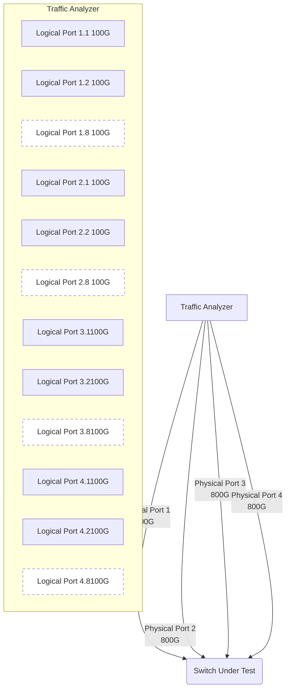
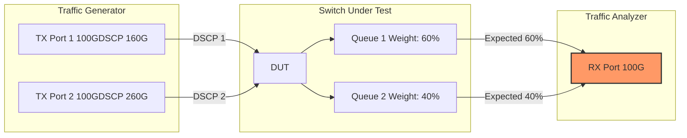
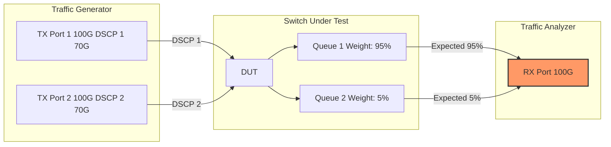
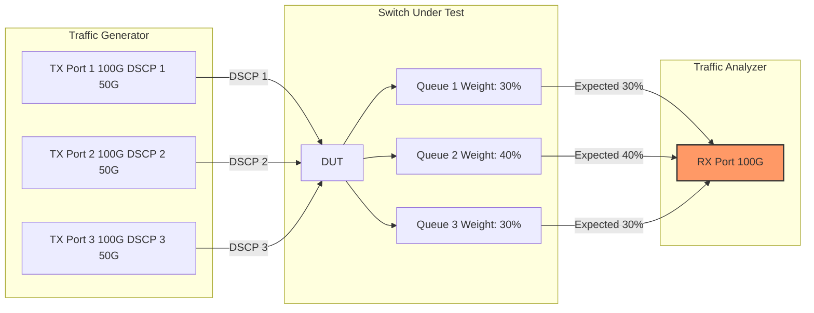
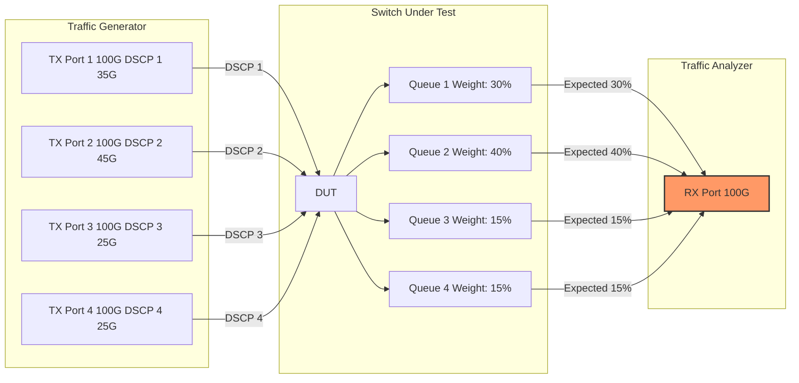
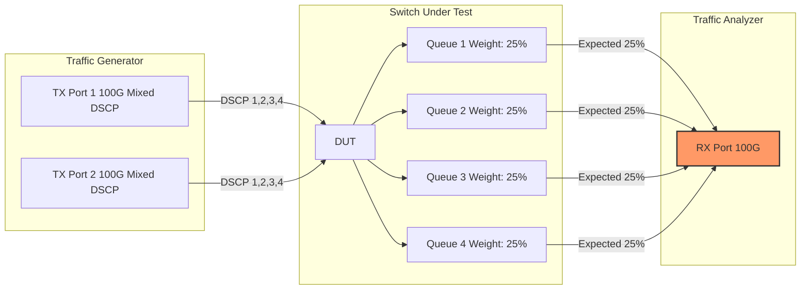
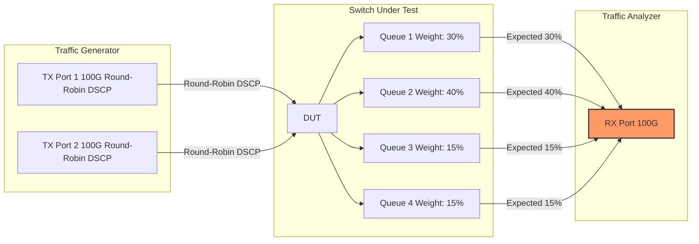
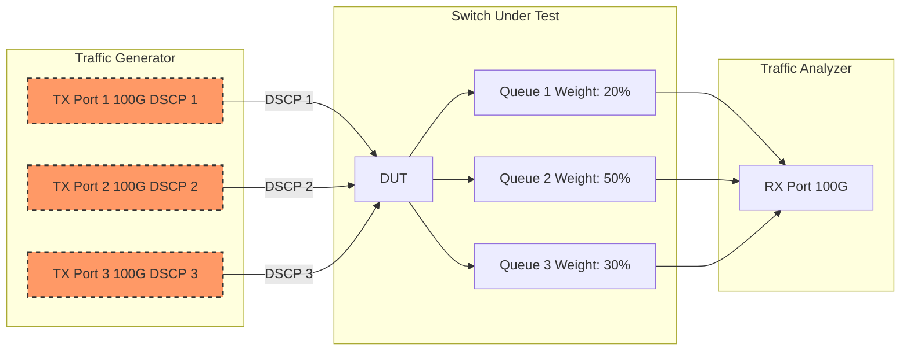
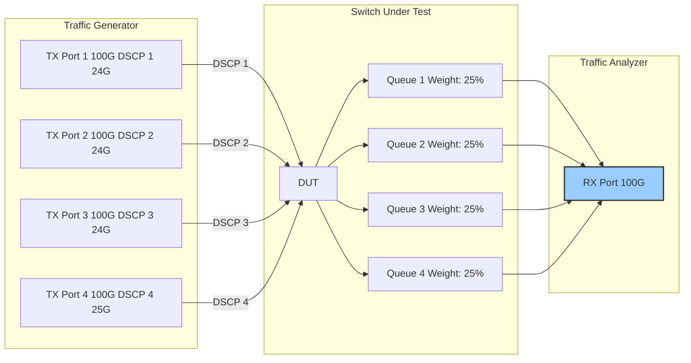

# DWRR Test Plan for Network Switches

## 1. Introduction

### 1.1 Purpose

This test plan aims to validate the Deficit Weighted Round Robin (DWRR) scheduling functionality on network switches. DWRR is a scheduling algorithm that ensures fair allocation of bandwidth among different queues during periods of congestion, based on assigned weights to each queue.

### 1.2 Test Environment Overview

*For all intents and purposes, the `Traffic Analyzer` (in the diagrams) is the ingress traffic generator port.*

### 1.3 Equipment Requirements

- **Device Under Test (DUT)**: 
  - Network switch with DWRR scheduling capabilities
- **Traffic Generator**: 
  - Test equipment with snappi API support (Ixia, Keysight, etc.)
  - 4 physical ports (800G each) with 8 logical ports (100G each) per physical port

### 1.4 Pre-Test Requirements

1. The switch must be configured with DWRR scheduling policies
2. DSCP to queue mappings must be appropriately configured
3. Traffic generator must be properly connected to the switch
4. All interfaces must be in the "up" state

### 1.5 General Test Methodology

For each test scenario:

1. Query the switch for existing DSCP-to-queue mappings and scheduler configurations
2. Configure traffic flows with appropriate DSCP values based on switch configuration
3. Generate traffic that causes congestion at the egress port
4. Capture traffic at the egress port
5. Analyze the distribution of traffic based on DSCP values
6. Validate that the observed distribution matches the expected distribution based on DWRR weights (within 2% tolerance)

## 2. Test Scenarios

### 2.1 Scenario 1: Basic DWRR Validation with 2 Queues

#### 2.1.1 Test Objective
Validate DWRR functionality with 2 queues using standard weight ratios (60:40).

#### 2.1.2 Topology

#### 2.1.3 Test Configuration
- **Ingress Ports**: 2 logical ports (100G each)
- **Egress Port**: 1 logical port (100G)
- **Traffic Pattern**:
  - Port 1: 60G of traffic with DSCP value 1 (mapped to Queue 1)
  - Port 2: 60G of traffic with DSCP value 2 (mapped to Queue 2)
  - Total ingress traffic: 120G (creates 20% congestion on 100G egress port)
- **Traffic Flow Duration**: 60 seconds
- **Packet Size**: 1500 bytes

#### 2.1.4 Test Procedure
1. Identify DSCP-to-queue mapping on the switch for DSCP values 1 and 2
2. Verify DWRR scheduling is configured with 60:40 weight ratio for the two queues
3. Configure traffic flows on the traffic generator:
   - Flow 1: 60 Gbps with DSCP 1
   - Flow 2: 60 Gbps with DSCP 2
4. Start traffic and capture on the egress port
5. After 60 seconds, stop traffic and capture
6. Analyze captured traffic by filtering based on DSCP values

#### 2.1.5 Expected Results
- Queue 1 (DSCP 1) traffic should account for 60% of the egress traffic: 60 Gbps
- Queue 2 (DSCP 2) traffic should account for 40% of the egress traffic: 40 Gbps

#### 2.1.6 Success Criteria
- The proportion of traffic from each queue must match the configured weights within a 2% tolerance
  - Queue 1: 58-62% (58-62 Gbps)
  - Queue 2: 38-42% (38-42 Gbps)

### 2.2 Scenario 2: DWRR with Extreme Weight Ratios

#### 2.2.1 Test Objective
Validate DWRR functionality with 2 queues using extreme weight ratios (95:5).

#### 2.2.2 Topology

#### 2.2.3 Test Configuration
- **Ingress Ports**: 2 logical ports (100G each)
- **Egress Port**: 1 logical port (100G)
- **Traffic Pattern**:
  - Port 1: 70G of traffic with DSCP value 1 (mapped to Queue 1)
  - Port 2: 70G of traffic with DSCP value 2 (mapped to Queue 2)
  - Total ingress traffic: 140G (creates 40% congestion on 100G egress port)
- **Traffic Flow Duration**: 60 seconds
- **Packet Size**: 1500 bytes

#### 2.2.4 Test Procedure
1. Identify DSCP-to-queue mapping on the switch for DSCP values 1 and 2
2. Configure DWRR scheduling with 95:5 weight ratio for the two queues
3. Configure traffic flows on the traffic generator:
   - Flow 1: 70 Gbps with DSCP 1
   - Flow 2: 70 Gbps with DSCP 2
4. Start traffic and capture on the egress port
5. After 60 seconds, stop traffic and capture
6. Analyze captured traffic by filtering based on DSCP values

#### 2.2.5 Expected Results
- Queue 1 (DSCP 1) traffic should account for 95% of the egress traffic: 95 Gbps
- Queue 2 (DSCP 2) traffic should account for 5% of the egress traffic: 5 Gbps

#### 2.2.6 Success Criteria
- The proportion of traffic from each queue must match the configured weights within a 2% tolerance
  - Queue 1: 93-97% (93-97 Gbps)
  - Queue 2: 3-7% (3-7 Gbps)

### 2.3 Scenario 3: DWRR Validation with 3 Queues

#### 2.3.1 Test Objective
Validate DWRR functionality with 3 queues using 30:40:30 weight distribution.

#### 2.3.2 Topology

#### 2.3.3 Test Configuration
- **Ingress Ports**: 3 logical ports (100G each)
- **Egress Port**: 1 logical port (100G)
- **Traffic Pattern**:
  - Port 1: 50G of traffic with DSCP value 1 (mapped to Queue 1)
  - Port 2: 50G of traffic with DSCP value 2 (mapped to Queue 2)
  - Port 3: 50G of traffic with DSCP value 3 (mapped to Queue 3)
  - Total ingress traffic: 150G (creates 50% congestion on 100G egress port)
- **Traffic Flow Duration**: 60 seconds
- **Packet Size**: 1500 bytes

#### 2.3.4 Test Procedure
1. Identify DSCP-to-queue mapping on the switch for DSCP values 1, 2, and 3
2. Configure DWRR scheduling with 30:40:30 weight ratio for the three queues
3. Configure traffic flows on the traffic generator:
   - Flow 1: 50 Gbps with DSCP 1
   - Flow 2: 50 Gbps with DSCP 2
   - Flow 3: 50 Gbps with DSCP 3
4. Start traffic and capture on the egress port
5. After 60 seconds, stop traffic and capture
6. Analyze captured traffic by filtering based on DSCP values

#### 2.3.5 Expected Results
- Queue 1 (DSCP 1) traffic should account for 30% of the egress traffic: 30 Gbps
- Queue 2 (DSCP 2) traffic should account for 40% of the egress traffic: 40 Gbps
- Queue 3 (DSCP 3) traffic should account for 30% of the egress traffic: 30 Gbps

#### 2.3.6 Success Criteria
- The proportion of traffic from each queue must match the configured weights within a 2% tolerance
  - Queue 1: 28-32% (28-32 Gbps)
  - Queue 2: 38-42% (38-42 Gbps)
  - Queue 3: 28-32% (28-32 Gbps)

### 2.4 Scenario 4: DWRR Validation with 4 Queues and Different Traffic Patterns

#### 2.4.1 Test Objective
Validate DWRR functionality with 4 queues using standard weight distribution (30:40:15:15) and different traffic distribution across ingress ports.

#### 2.4.2 Topology

#### 2.4.3 Test Configuration
- **Ingress Ports**: 4 logical ports (100G each)
- **Egress Port**: 1 logical port (100G)
- **Traffic Pattern**:
  - Port 1: 35G of traffic with DSCP value 1 (mapped to Queue 1)
  - Port 2: 45G of traffic with DSCP value 2 (mapped to Queue 2)
  - Port 3: 25G of traffic with DSCP value 3 (mapped to Queue 3)
  - Port 4: 25G of traffic with DSCP value 4 (mapped to Queue 4)
  - Total ingress traffic: 130G (creates 30% congestion on 100G egress port)
- **Traffic Flow Duration**: 60 seconds
- **Packet Size**: 1500 bytes

#### 2.4.4 Test Procedure
1. Identify DSCP-to-queue mapping on the switch for DSCP values 1, 2, 3, and 4
2. Configure DWRR scheduling with 30:40:15:15 weight ratio for the four queues
3. Configure traffic flows on the traffic generator:
   - Flow 1: 35 Gbps with DSCP 1
   - Flow 2: 45 Gbps with DSCP 2
   - Flow 3: 25 Gbps with DSCP 3
   - Flow 4: 25 Gbps with DSCP 4
4. Start traffic and capture on the egress port
5. After 60 seconds, stop traffic and capture
6. Analyze captured traffic by filtering based on DSCP values

#### 2.4.5 Expected Results
- Queue 1 (DSCP 1) traffic should account for 30% of the egress traffic: 30 Gbps
- Queue 2 (DSCP 2) traffic should account for 40% of the egress traffic: 40 Gbps
- Queue 3 (DSCP 3) traffic should account for 15% of the egress traffic: 15 Gbps
- Queue 4 (DSCP 4) traffic should account for 15% of the egress traffic: 15 Gbps

#### 2.4.6 Success Criteria
- The proportion of traffic from each queue must match the configured weights within a 2% tolerance
  - Queue 1: 28-32% (28-32 Gbps)
  - Queue 2: 38-42% (38-42 Gbps)
  - Queue 3: 13-17% (13-17 Gbps)
  - Queue 4: 13-17% (13-17 Gbps)

### 2.5 Scenario 5: DWRR Validation with Different DSCP Distributions on Each Port

#### 2.5.1 Test Objective
Validate DWRR functionality with mixed DSCP traffic from various ingress ports to validate proper queuing regardless of traffic source.

#### 2.5.2 Topology

#### 2.5.3 Test Configuration
- **Ingress Ports**: 2 logical ports (100G each)
- **Egress Port**: 1 logical port (100G)
- **Traffic Pattern**:
  - Port 1: Mixed traffic with the following distribution:
    * 20G with DSCP 1 (mapped to Queue 1)
    * 25G with DSCP 2 (mapped to Queue 2)
    * 15G with DSCP 3 (mapped to Queue 3)
    * 20G with DSCP 4 (mapped to Queue 4)
  - Port 2: Mixed traffic with the following distribution:
    * 20G with DSCP 1 (mapped to Queue 1)
    * 15G with DSCP 2 (mapped to Queue 2)
    * 25G with DSCP 3 (mapped to Queue 3)
    * 20G with DSCP 4 (mapped to Queue 4)
  - Total ingress traffic: 160G (creates 60% congestion on 100G egress port)
- **Traffic Flow Duration**: 60 seconds
- **Packet Size**: Mixed packet sizes (64, 512, 1024, 1500 bytes)

#### 2.5.4 Test Procedure
1. Identify DSCP-to-queue mapping on the switch for DSCP values 1, 2, 3, and 4
2. Configure DWRR scheduling with 25:25:25:25 weight ratio for the four queues
3. Configure traffic flows on the traffic generator according to the specified distribution
4. Start traffic and capture on the egress port
5. After 60 seconds, stop traffic and capture
6. Analyze captured traffic by filtering based on DSCP values

#### 2.5.5 Expected Results
- Queue 1 (DSCP 1) traffic should account for 25% of the egress traffic: 25 Gbps
- Queue 2 (DSCP 2) traffic should account for 25% of the egress traffic: 25 Gbps
- Queue 3 (DSCP 3) traffic should account for 25% of the egress traffic: 25 Gbps
- Queue 4 (DSCP 4) traffic should account for 25% of the egress traffic: 25 Gbps

#### 2.5.6 Success Criteria
- The proportion of traffic from each queue must match the configured weights within a 2% tolerance
  - Queue 1: 23-27% (23-27 Gbps)
  - Queue 2: 23-27% (23-27 Gbps)
  - Queue 3: 23-27% (23-27 Gbps)
  - Queue 4: 23-27% (23-27 Gbps)

### 2.6 Scenario 6: Round-Robin DSCP Pattern Testing

#### 2.6.1 Test Objective
Validate DWRR functionality with a round-robin traffic pattern where packets alternate between different DSCP values in a sequential pattern.

#### 2.6.2 Topology

#### 2.6.3 Test Configuration
- **Ingress Ports**: 2 logical ports (100G each)
- **Egress Port**: 1 logical port (100G)
- **Traffic Pattern**:
  - Both Port 1 and Port 2: Traffic with a round-robin DSCP pattern
    * Packets are sent in sequence: DSCP 1, DSCP 2, DSCP 3, DSCP 4, DSCP 1, DSCP 2...
    * Each port sends at 70G, for a total of 140G (creating 40% congestion)
  - With this pattern, approximately 25% of packets have each DSCP value (even distribution)
- **Traffic Flow Duration**: 60 seconds
- **Packet Size**: 1500 bytes

#### 2.6.4 Test Procedure
1. Identify DSCP-to-queue mapping on the switch for DSCP values 1, 2, 3, and 4
2. Configure DWRR scheduling with 30:40:15:15 weight ratio for the four queues
3. Configure traffic generator to send packets in a round-robin sequence (DSCP 1, 2, 3, 4, 1, 2...)
4. Start traffic and capture on the egress port
5. After 60 seconds, stop traffic and capture
6. Analyze captured traffic by filtering based on DSCP values

#### 2.6.5 Expected Results
Despite the even distribution of DSCP values in the input traffic (25% each), the output traffic should reflect the DWRR weights:
- Queue 1 (DSCP 1) traffic should account for 30% of the egress traffic: 30 Gbps
- Queue 2 (DSCP 2) traffic should account for 40% of the egress traffic: 40 Gbps
- Queue 3 (DSCP 3) traffic should account for 15% of the egress traffic: 15 Gbps
- Queue 4 (DSCP 4) traffic should account for 15% of the egress traffic: 15 Gbps

#### 2.6.6 Success Criteria
- The proportion of traffic from each queue must match the configured weights within a 2% tolerance
  - Queue 1: 28-32% (28-32 Gbps)
  - Queue 2: 38-42% (38-42 Gbps)
  - Queue 3: 13-17% (13-17 Gbps)
  - Queue 4: 13-17% (13-17 Gbps)

### 2.7 Scenario 7: DWRR Under Varying Congestion Conditions

#### 2.7.1 Test Objective
Validate that DWRR maintains proper weight distribution under varying levels of congestion, from light to severe.

#### 2.7.2 Topology

#### 2.7.3 Test Configuration
- **Ingress Ports**: 3 logical ports (100G each)
- **Egress Port**: 1 logical port (100G)
- **Traffic Pattern**:
  - Test will run in 4 phases with increasing levels of congestion
  - **Phase 1 (Light Congestion - 10%):**
    * Port 1: 30G with DSCP 1 (mapped to Queue 1)
    * Port 2: 40G with DSCP 2 (mapped to Queue 2)
    * Port 3: 40G with DSCP 3 (mapped to Queue 3)
    * Total: 110G (10% congestion)
  - **Phase 2 (Moderate Congestion - 30%):**
    * Port 1: 40G with DSCP 1 (mapped to Queue 1)
    * Port 2: 50G with DSCP 2 (mapped to Queue 2)
    * Port 3: 40G with DSCP 3 (mapped to Queue 3)
    * Total: 130G (30% congestion)
  - **Phase 3 (Heavy Congestion - 50%):**
    * Port 1: 50G with DSCP 1 (mapped to Queue 1)
    * Port 2: 50G with DSCP 2 (mapped to Queue 2)
    * Port 3: 50G with DSCP 3 (mapped to Queue 3)
    * Total: 150G (50% congestion)
  - **Phase 4 (Severe Congestion - 100%):**
    * Port 1: 70G with DSCP 1 (mapped to Queue 1)
    * Port 2: 70G with DSCP 2 (mapped to Queue 2)
    * Port 3: 60G with DSCP 3 (mapped to Queue 3)
    * Total: 200G (100% congestion)
- **Traffic Flow Duration**: 60 seconds per phase (total 240 seconds)
- **Packet Size**: 1500 bytes

#### 2.7.4 Test Procedure
1. Identify DSCP-to-queue mapping on the switch for DSCP values 1, 2, and 3
2. Configure DWRR scheduling with 20:50:30 weight ratio for the three queues
3. Configure traffic flows on the traffic generator for Phase 1
4. Start traffic and capture on the egress port
5. After 60 seconds, transition to Phase 2 by increasing traffic rates
6. Continue through all phases, capturing traffic continuously
7. Analyze captured traffic by filtering based on DSCP values and timestamp to separate each phase

#### 2.7.5 Expected Results
For all congestion levels, the DWRR scheduler should maintain the configured weight ratios:
- Queue 1 (DSCP 1) traffic should account for 20% of the egress traffic
- Queue 2 (DSCP 2) traffic should account for 50% of the egress traffic
- Queue 3 (DSCP 3) traffic should account for 30% of the egress traffic

#### 2.7.6 Success Criteria
- The proportion of traffic from each queue must match the configured weights within a 2% tolerance at all congestion levels:
  - Queue 1: 18-22% of egress bandwidth
  - Queue 2: 48-52% of egress bandwidth
  - Queue 3: 28-32% of egress bandwidth
- The consistency must be maintained across all congestion phases

### 2.8 Scenario 8: Zero-Loss Verification with DWRR Enabled

#### 2.8.1 Test Objective
Verify that DWRR scheduling doesn't introduce packet loss or reordering when operating at high utilization but without congestion (98-99% of port capacity). This serves as a sanity test to confirm that DWRR operates correctly under normal, non-congested conditions.

#### 2.8.2 Topology

#### 2.8.3 Test Configuration
- **Ingress Ports**: 4 logical ports (100G each)
- **Egress Port**: 1 logical port (100G)
- **Traffic Pattern**:
  - Port 1: 24G of traffic with DSCP value 1 (mapped to Queue 1)
  - Port 2: 24G of traffic with DSCP value 2 (mapped to Queue 2)
  - Port 3: 24G of traffic with DSCP value 3 (mapped to Queue 3)
  - Port 4: 25G of traffic with DSCP value 4 (mapped to Queue 4)
  - Total ingress traffic: 97G (97% utilization of 100G egress port, no congestion)
- **Traffic Flow Duration**: 180 seconds (longer duration to ensure statistical significance)
- **Packet Size**: Mixed packet sizes (64, 512, 1024, 1500 bytes) with sequence numbers
- **Frame Identification**: All packets contain sequence numbers to detect reordering

#### 2.8.4 Test Procedure
1. Identify DSCP-to-queue mapping on the switch for DSCP values 1, 2, 3, and 4
2. Configure DWRR scheduling with equal 25:25:25:25 weight ratio for the four queues
3. Configure traffic flows on the traffic generator:
   - Flow 1: 24 Gbps with DSCP 1 and sequence numbers
   - Flow 2: 24 Gbps with DSCP 2 and sequence numbers
   - Flow 3: 24 Gbps with DSCP 3 and sequence numbers
   - Flow 4: 25 Gbps with DSCP 4 and sequence numbers
4. Start traffic and capture on the egress port
5. Monitor traffic statistics (throughput, packet loss) in real-time during the test
6. Gather queue statistics from the switch at 60-second intervals
7. After 180 seconds, stop traffic and capture
8. Analyze captured traffic to verify sequence integrity and packet counts

#### 2.8.5 Expected Results
- All packets should be forwarded without any loss (zero packet loss)
- Sequence numbers should be preserved for each flow (no reordering)
- Traffic rate at the egress port should match the ingress traffic rate (97G)
- Queue statistics should accurately reflect the traffic through each queue
- Each queue should receive and transmit its corresponding DSCP traffic:
  - Queue 1: ~24 Gbps of DSCP 1 traffic
  - Queue 2: ~24 Gbps of DSCP 2 traffic
  - Queue 3: ~24 Gbps of DSCP 3 traffic
  - Queue 4: ~25 Gbps of DSCP 4 traffic

#### 2.8.6 Success Criteria
- **Zero Packet Loss**: 100% of transmitted packets must be received (packet count matching between transmit and receive sides)
- **No Packet Reordering**: All packets must be received in the same sequence they were sent (verified via sequence numbers)
- **Traffic Rate Accuracy**: The measured egress rate must be within 0.5% of the configured rate (96.5-97.5 Gbps)
- **Queue Distribution Accuracy**: The measured traffic through each queue must match the configured traffic pattern within 1% tolerance:
  - Queue 1: 23.5-24.5 Gbps
  - Queue 2: 23.5-24.5 Gbps
  - Queue 3: 23.5-24.5 Gbps
  - Queue 4: 24.5-25.5 Gbps
- **Switch Statistics Accuracy**: Queue counters on the switch must match the actual traffic within 1% tolerance

## 3. Implementation Details

### 3.1 Snappi Test Framework Implementation

The test scenarios will be implemented using the snappi API. Implementation details will be crafted to generate traffic with appropriate DSCP values and analyze the captured traffic.

### 3.2 Packet Capture Analysis

The captured packets will be analyzed to validate DWRR functionality. The analysis will:

1. Filter packets based on DSCP values
2. Count the number of packets (or bytes) for each DSCP value
3. Calculate the percentage distribution
4. Compare with expected distribution based on configured weights
5. Determine pass/fail status based on the 2% tolerance criteria

## 4. Test Execution Plan

### 4.1 Test Execution Sequence

Tests should be executed in the following order:

1. Scenario 1: Basic DWRR Validation with 2 Queues
2. Scenario 2: DWRR with Extreme Weight Ratios
3. Scenario 3: DWRR Validation with 3 Queues
4. Scenario 4: DWRR Validation with 4 Queues and Different Traffic Patterns
5. Scenario 5: DWRR Validation with Different DSCP Distributions on Each Port
6. Scenario 6: Round-Robin DSCP Pattern Testing
7. Scenario 7: DWRR Under Varying Congestion Conditions
8. Scenario 8: Zero-Loss Verification with DWRR Enabled

### 4.2 Test Duration

- Most test scenarios run for 60 seconds of traffic flow
- Scenario 7 runs for 240 seconds (60 seconds per phase)
- Including setup and analysis time, each test scenario will take approximately 8-12 minutes
- Total estimated time for all test scenarios: 60-85 minutes

### 4.3 Test Artifacts

For each test scenario, the following artifacts should be collected:

1. Configuration snapshot from the switch
2. Traffic flow configuration
3. Packet capture files
4. Analysis results showing:
   - Distribution of traffic per DSCP/queue
   - Comparison with expected distribution based on weights
   - Pass/fail status

## 5. Troubleshooting

### 5.1 Common Issues

1. **Incorrect DSCP-to-Queue Mapping**:
   - Verify the DSCP-to-queue mapping on the switch
   - Use appropriate CLI commands to check the configuration

2. **Incorrect Weight Configuration**:
   - Verify the scheduler configuration on the switch
   - Use appropriate CLI commands to check the configuration

3. **Insufficient Congestion**:
   - Ensure total ingress traffic exceeds egress port capacity
   - Increase ingress traffic rates if needed

4. **Buffer Overruns**:
   - Check for packet drops on the switch
   - Use interface counters to monitor errors

5. **Non-Deterministic Behavior**:
   - Ensure test duration is long enough to achieve statistical significance
   - Increase test duration if needed

### 5.2 Data Collection for Debugging

If a test fails, collect the following additional data:

1. Interface statistics from the switch
2. Queue statistics from the switch
3. Extended packet captures

## 6. Reporting

### 6.1 Test Report Format

The test report should include:

1. Test summary with pass/fail status for each scenario
2. Detailed results for each scenario, including:
   - Actual vs. expected traffic distribution
   - Deviation percentage
   - Pass/fail status
3. Any anomalies or unexpected behaviors observed

> Information can be in a log file.

### 6.2 Performance Metrics

Collecting data in 6.1 can help us create reports that include the following performance metrics:

1. Average deviation from expected weight ratios
2. Maximum deviation from expected weight ratios
3. Consistency of weight distribution over time
4. Any observed packet drops or errors