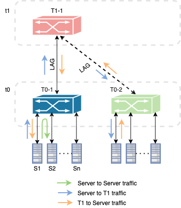
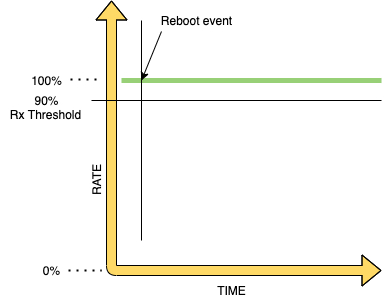

# Downtime convergence for various reboot scenarios

- [Downtime convergence for various reboot scenarios](#downtime-convergence-for-various-reboot-scenarios)
  - [Overview](#overview)
    - [Scope](#scope)
    - [Keysight Testbed](#keysight-testbed)
  - [Topology](#topology)
    - [SONiC switch as ToR](#sonic-switch-as-tor)
  - [Setup configuration](#setup-configuration)
  - [Test Methodology](#test-methodology)
  - [Test cases](#test-cases)
    - [Test case # 1 - Downtime convergence measurement for warm-reboot while sending traffic](#test-case-1-downtime-convergence-measurement-for-warm-reboot-while-sending-traffic)
      - [Test objective](#test-objective)
      - [Test steps](#test-steps)
      - [Test results](#test-results)
    - [Test case # 2 – Downtime Convergence measurement for fast-reboot while sending traffic.](#test-case-2-downtime-convergence-measurement-for-fast-reboot-while-sending-traffic)
      - [Test objective](#test-objective-1)
      - [Test steps](#test-steps-1)
      - [Test results](#test-results-1)
    - [Test case # 3 – Downtime Convergence measurement for cold-reboot while sending traffic.](#test-case-3-downtime-convergence-measurement-for-cold-reboot-while-sending-traffic)
      - [Test objective](#test-objective-2)
      - [Test steps](#test-steps-2)
      - [Test results](#test-results-2)
    - [Test case # 4 – Downtime Convergence measurement for soft-reboot while sending traffic.](#test-case-4-downtime-convergence-measurement-for-soft-reboot-while-sending-traffic)
      - [Test objective](#test-objective-3)
      - [Test steps](#test-steps-3)
      - [Test results](#test-results-3)
    - [Call for action](#call-for-action)

## Overview
The purpose of these tests is to measure the downtime convergence of the system or the service by evaluating various reboot scenarios in the SONiC system, closely resembling production environment.

### Scope
These tests are targeted on fully functioning SONiC system. We will be measuring the downtime convergence of a particular system or a system as a whole while evaluating reboot scenarios such as warm-reboot, fast-reboot, cold-reboot and soft-reboot.

### Keysight Testbed
The tests will run on following testbeds:
* t0

## Topology
### SONiC switch as ToR

## Setup configuration
IPv4 and IPv6 EBGP neighborship will be established on a LAG between SONiC DUT and directly connected test ports. Test ports inturn will simulate the ToR's and Leafs by advertising IPv4/IPv6, dual-stack routes.

## Test Methodology
Following test methodology will be used for measuring downtime convergence. 
* Traffic generator will be used to configure ebgp peering between chassis ports and SONiC DUT on top of LAG by advertising IPv4/IPv6, dual-stack routes. 
* Data traffic will be sent from  server to server, server to T1 and T1 to server. 
* Depending on the test case, the reboots will be generated and downtime convergence will be measured.
* Downtime convergence will be measured by noting down the precise time of the data plane below threshold timestamp and the data plane above threshold timestamp. Traffic generator will create those timestmaps and provide us with the data plane downtime convergence statistics.
* In order to measure the control plane downtime convergence, we will be pinging the DUT loopback interface to measure how long it takes to respond back to the ping once it comes back online.
* Similarly for measuring protocol downtime convergence can be neasured for concerned protocol, in this case it is BGP by polling the state of the protocol. 
  
## Test cases
### Test case # 1 - Downtime convergence measurement for warm-reboot while sending traffic
#### Test objective
Measure the downtime convergence time when warm-reboot is issued while traffic is running.

  
   

#### Test steps
* Configure IPv4 and IPv6 EBGP sessions between test port and the SONiC switch on top of a LAG.
* Advertise 4000 IPv4 and 3000 IPv6 routes through BGP.
* Configure 2000 vlan hosts per server.
* Start all protocols and verify that IPv4 BGP neighborship is established.
* Create server-server, server-T1 and T1-server data traffics and enable tracking by "Destination Endpoint" and by "Destination session description".
* Set the desired threshold value for receiving traffic. By default it will be set to 90% of expected receiving rate.
* Apply and start the data traffic.
* Verify that traffic is flowing without any loss.
* Enable csv logging or check the state of bgp protocol through API.
* Control plane convergence time is measured by pinging the loopback interface of switch. 
* Now do warm-reboot by issuing the command "sudo warm-reboot".
* Verify that there is no traffic loss after the switch is back up. 
* Drill down by "Destination Endpoint" under traffic statistics to get the data plance convergence time.
* In general the convergence value will fall in certain range. In order to achieve proper results, run the test multiple times and average out the test results. 
* Set it back to default configuration.
#### Test results
| Reboot Type         | Event | Convergence (s) |
| :---         |     :---:      | :---: |
|   | Server-Server Traffic - IPv4  | 0  |
|   | Server-Server Traffic - IPv6  | 0  |
|   | Server-T1 Traffic - IPv4  | 0  |
|   | Server-T1 Traffic - IPv6  | 0  |
| Warm-reboot  | T1-Server Traffic - IPv4  | 0  |
|   | T1-Server Traffic - IPv6  | 0  |
|   | BGP Control plane  | 135  |
|   | BGP+ Control plane  | 135  |
|   | Control plane (Loopback ping)  | 28  |

For above test case, below are the test results when T1 is replaced with a original switch.

| Reboot Type         | Event | Convergence (s) |
| :---         |     :---:      | :---: |
|   | Server-Server Traffic - IPv4  | 0  |
|   | Server-Server Traffic - IPv6  | 0  |
|   | Server-T1 Traffic - IPv4  | 0  |
|   | Server-T1 Traffic - IPv6  | 0  |
| Warm-reboot  | T1-Server Traffic - IPv4  | 0  |
|   | T1-Server Traffic - IPv6  | 0  |
|   | BGP Control plane  | 137  |
|   | BGP+ Control plane  | 137  |
|   | Control plane (Loopback ping)  | 29  |

### Test case # 2 – Downtime Convergence measurement for fast-reboot while sending traffic
#### Test objective
Measure the downtime convergence time when fast-reboot is issued while traffic is running.

  
   

#### Test steps
* Configure IPv4 and IPv6 EBGP sessions between test port and the SONiC switch on top of a LAG.
* Advertise 4000 IPv4 and 3000 IPv6 routes through BGP.
* Configure 2000 vlan hosts per server.
* Start all protocols and verify that IPv4 BGP neighborship is established.
* Create server-server, server-T1 and T1-server data traffics and enable tracking by "Destination Endpoint" and by "Destination session description".
* Set the desired threshold value for receiving traffic. By default it will be set to 90% of expected receiving rate.
* Apply and start the data traffic.
* Verify that traffic is flowing without any loss.
* Enable csv logging or check the state of bgp protocol through API.
* Control plane convergence time is measured by pinging the loopback interface of switch. 
* Now do warm-reboot by issuing the command "sudo fast-reboot".
* Verify that there is no traffic loss after the switch is back up. 
* Drill down by "Destination Endpoint" under traffic statistics to get the data plance convergence time.
* In general the convergence value will fall in certain range. In order to achieve proper results, run the test multiple times and average out the test results. 
* Set it back to default configuration.
#### Test results
| Reboot Type         | Event | Convergence (s) |
| :---         |     :---:      | :---: |
|   | Server-Server Traffic - IPv4  | 7  |
|   | Server-Server Traffic - IPv6  | 7  |
|   | Server-T1 Traffic - IPv4  | 16  |
|   | Server-T1 Traffic - IPv6  | 17  |
| Fast-reboot  | T1-Server Traffic - IPv4  | 13  |
|   | T1-Server Traffic - IPv6  | 13  |
|   | BGP Control plane  | 84  |
|   | BGP+ Control plane  | 84  |
|   | Control plane (Loopback ping)  | 31  |

For above test case, below are the test results when T1 is replaced with oriignal switch.

| Reboot Type         | Event | Convergence (s) |
| :---         |     :---:      | :---: |
|   | Server-Server Traffic - IPv4  | 8  |
|   | Server-Server Traffic - IPv6  | 8  |
|   | Server-T1 Traffic - IPv4  | 19  |
|   | Server-T1 Traffic - IPv6  | 20  |
| Fast-reboot  | T1-Server Traffic - IPv4  | 15  |
|   | T1-Server Traffic - IPv6  | 15  |
|   | BGP Control plane  | 84  |
|   | BGP+ Control plane  | 84  |
|   | Control plane (Loopback ping)  | 30  |

### Test case # 3 – Downtime Convergence measurement for cold-reboot while sending traffic
#### Test objective
Measure the downtime convergence time when cold-reboot is issued while traffic is running.

  
   

#### Test steps
* Configure IPv4 and IPv6 EBGP sessions between test port and the SONiC switch on top of a LAG.
* Advertise 4000 IPv4 and 3000 IPv6 routes through BGP.
* Configure 2000 vlan hosts per server.
* Start all protocols and verify that IPv4 BGP neighborship is established.
* Create server-server, server-T1 and T1-server data traffics and enable tracking by "Destination Endpoint" and by "Destination session description".
* Set the desired threshold value for receiving traffic. By default it will be set to 90% of expected receiving rate.
* Apply and start the data traffic.
* Verify that traffic is flowing without any loss.
* Enable csv logging or check the state of bgp protocol through API.
* Control plane convergence time is measured by pinging the loopback interface of switch. 
* Now do warm-reboot by issuing the command "sudo coldreboot".
* Verify that there is no traffic loss after the switch is back up. 
* Drill down by "Destination Endpoint" under traffic statistics to get the data plance convergence time.
* In general the convergence value will fall in certain range. In order to achieve proper results, run the test multiple times and average out the test results. 
* Set it back to default configuration.
#### Test results
| Reboot Type         | Event | Convergence (s) |
| :---         |     :---:      | :---: |
|   | Server-Server Traffic - IPv4  | 73  |
|   | Server-Server Traffic - IPv6  | 73  |
|   | Server-T1 Traffic - IPv4  | 116  |
|   | Server-T1 Traffic - IPv6  | 120  |
| Cold-reboot  | T1-Server Traffic - IPv4  | 102  |
|   | T1-Server Traffic - IPv6  | 102  |
|   | BGP Control plane  | 102  |
|   | BGP+ Control plane  | 102  |
|   | Control plane (Loopback ping)  | 40  |

For above test case, below are the test results when T1 is replaced with oriignal switch.

| Reboot Type         | Event | Convergence (s) |
| :---         |     :---:      | :---: |
|   | Server-Server Traffic - IPv4  | 69  |
|   | Server-Server Traffic - IPv6  | 69  |
|   | Server-T1 Traffic - IPv4  | 110  |
|   | Server-T1 Traffic - IPv6  | 113  |
| Cold-reboot  | T1-Server Traffic - IPv4  | 96  |
|   | T1-Server Traffic - IPv6  | 96  |
|   | BGP Control plane  | 96  |
|   | BGP+ Control plane  | 96  |
|   | Control plane (Loopback ping)  | 41  |

### Test case # 4 – Downtime Convergence measurement for soft-reboot while sending traffic
#### Test objective
Measure the downtime convergence time when cold-reboot is issued while traffic is running.

  
   

#### Test steps
* Configure IPv4 and IPv6 EBGP sessions between test port and the SONiC switch on top of a LAG.
* Advertise 4000 IPv4 and 3000 IPv6 routes through BGP.
* Configure 2000 vlan hosts per server.
* Start all protocols and verify that IPv4 BGP neighborship is established.
* Create server-server, server-T1 and T1-server data traffics and enable tracking by "Destination Endpoint" and by "Destination session description".
* Set the desired threshold value for receiving traffic. By default it will be set to 90% of expected receiving rate.
* Apply and start the data traffic.
* Verify that traffic is flowing without any loss.
* Enable csv logging or check the state of bgp protocol through API.
* Control plane convergence time is measured by pinging the loopback interface of switch. 
* Now do warm-reboot by issuing the command "sudo soft-reboot".
* Verify that there is no traffic loss after the switch is back up. 
* Drill down by "Destination Endpoint" under traffic statistics to get the data plance convergence time.
* In general the convergence value will fall in certain range. In order to achieve proper results, run the test multiple times and average out the test results. 
* Set it back to default configuration.
#### Test results

### Call for action
* Soft-reboot command is not available in cli. Once it is available will upstream the script.
